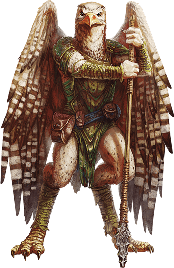

## Aarakocra
Aarakocra range the Howling Gyre, an endless storm of mighty winds and lashing rains that surrounds the tranquil realm of Aaqa in the Elemental Plane of Air. Making aerial patrols, these birdlike humanoids guard the windy borders of their home against invaders from the Elemental Plane of Earth, such as gargoyles, their sworn enemies.

***Enemies of Elemental Evil.*** In service to the Wind Dukes of Aaqa, aarakocra scout the planes in search of temples of Elemental Evil. They spy on malign elemental creatures and then either take the fight to those creatures or report back to the Wind Dukes.

On the Material Plane, aarakocra create aeries atop the highest mountains, especially peaks near portals to the Elemental Plane of Air. From such heights, aarakocra watch for signs of elemental incursions, as well as for nascent threats to their home plane. Aarakocra prefer to live their lives like the wind "unburdened and ever moving" yet they watch over a region for years if that's what it takes to guard against the incursions of Elemental Evil.

Aarakocra have no concept of political borders or property ownership, and the value of gems, gold, and other precious materials means little to aarakocra. In their eyes, a creature should use what is necessary and then cast what is left on the wind for others to use.

***Search for the Seven Shards.*** The Wind Dukes of Aaqa come from a race of elemental beings called the vaati, which once ruled many worlds. A creature known as the Queen of Chaos arose and initiated an interplanar war against vaati rule. To combat the threat, seven vaati heroes combined their powers to create the mighty Rod of Law. In a battle against the queen's greatest general, Miska the Wolf Spider, a vaati killed Miska by thrusting the rod into him like a spear. The rod shattered into seven shards that scattered across the multiverse. Aarakocra seek signs of the pieces' locations in order to rebuild what is now known as the Rod of Seven Parts.

### Environment
Mountain, Extraplanar

### Token

>### Aarakocra
>*Medium humanoid, neutral good*
>___
>- **Armor Class** 12
>- **Hit Points** 13 (3d8)
>- **Speed** 20 ft., fly 50 ft.
>___
>|**STR**|**DEX**|**CON**|**INT**|**WIS**|**CHA**|
>|:---:|:---:|:---:|:---:|:---:|:---:|
>|10 (+0)|14 (+2)|10 (+0)|11 (+0)|12 (+1)|11 (+0)|
>
>___
>- **Proficiency Bonus** +2
>- **Saving Throws** 
>- **Damage Vulnerabilities** 
>- **Damage Resistances** 
>- **Damage Immunities** 
>- **Condition Immunities** 
>- **Skills** Perception +5
>- **Senses** passive Perception 15
>- **Languages** Auran,Aarakocra
>- **Challenge** 1/4
>___
>***Dive Attack.*** If the aarakocra is flying and dives at least 30 feet straight toward a target and then hits it with a melee weapon attack, the attack deals an extra 3 (1d6) damage to the target.
>
>#### Actions
>***Talon.*** Melee Weapon Attack: +4 to hit, reach 5 ft., one target. Hit: 4 (1d4 + 2) slashing damage.
>
>***Javelin.*** Melee or Ranged Weapon Attack: +4 to hit, reach 5 ft. or range 30/120 ft., one target. Hit: 5 (1d6 + 2) piercing damage.
>
>***Summoning Air Elementals.*** Five aarakocra within 30 feet of each other can magically summon an [air elemental](Elemental.md#air). Each of the five must use its action and movement on three consecutive turns to perform an aerial dance and must maintain concentration while doing so (as if concentrating on a spell). When all five have finished their third turn of the dance, the elemental appears in an unoccupied space within 60 feet of them. It is friendly toward them and obeys their spoken commands. It remains for 1 hour, until it or all its summoners die, or until any of its summoners dismisses it as a bonus action. A summoner can't perform the dance again until it finishes a short rest. When the elemental returns to the Elemental Plane of Air, any aarakocra within 5 feet of it can return with it.
>
