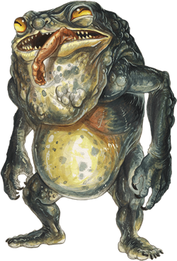

## Banderhobb
A banderhobb is a hybrid of shadow and flesh. Through vile magic, these components take on an enormous and horrific upright shape resembling a bipedal toad. In this form, a banderhobb temporarily serves its creator as a thug, a thief, and a kidnapper that swallows the unwary.

Hags have devised a ritual for creating banderhobbs--a hag who knows the ritual might be willing to teach it for the right price. Some other wicked Fey and powerful Fiends also know of the process, as do a few mortal mages.

During its brief existence, a banderhobb attempts to carry out its creator's bidding. It accomplishes its mission with no concern for the harm it suffers or causes. Its only desire is to serve and succeed. A banderhobb that is assigned to track down a target is particularly dangerous when it is provided with a lock of hair, a personal belonging, or another object connected to the target. Possession of such an item allows it to sense the creature's location from as far as a mile away.

A banderhobb fulfills its duties until its existence ends. When it expires, usually several days after its birth, it leaves behind only tarry goo and wisps of shadow. Legends tell of an ominous tower in the Shadowfell where the shadows sometimes reform and banderhobbs roam.

>### Banderhobb
>*Large monstrosity, Typically Neutral Evil*
>___
>- **Armor Class** 15 (natural armor)
>- **Hit Points** 84 (8d10 + 40)
>- **Speed** 30 ft.
>___
>|**STR**|**DEX**|**CON**|**INT**|**WIS**|**CHA**|
>|:---:|:---:|:---:|:---:|:---:|:---:|
>|20 (+5)|12 (+1)|20 (+5)|11 (+0)|14 (+2)|8 (-1)|
>
>___
>- **Proficiency Bonus** +3
>- **Saving Throws** 
>- **Damage Vulnerabilities** 
>- **Damage Resistances** 
>- **Damage Immunities** 
>- **Condition Immunities** charmed,frightened
>- **Skills** Athletics +8,Stealth +7
>- **Senses** darkvision 120 ft.,passive Perception 12
>- **Languages** understands Common and the languages of its creator but can't speak
>- **Challenge** 5
>___
>***Resonant Connection.*** If the banderhobb has even a tiny piece of a creature or an object in its possession, such as a lock of hair or a splinter of wood, it knows the most direct route to that creature or object if it is within 1 mile of the banderhobb.
>
>#### Actions
>***Multiattack.*** The banderhobb makes one Bite attack and one Tongue attack. It can replace one attack with a use of Shadow Step.
>
>***Bite.*** Melee Weapon Attack: +8 to hit, reach 5 ft., one target. Hit: 15 (3d6 + 5) piercing damage, and the target is grappled (escape DC 16) if it is a Large or smaller creature. Until this grapple ends, the target is restrained, and the banderhobb can't use its Bite attack or Tongue attack on another target.
>
>***Tongue.*** Melee Weapon Attack: +8 to hit, reach 15 ft., one creature. Hit: 10 (3d6) necrotic damage, and the target must make a DC 16 Strength saving throw. On a failed save, the target is pulled to a space within 5 feet of the banderhobb.
>
>***Shadow Step.*** The banderhobb teleports up to 30 feet to an unoccupied space of dim light or darkness that it can see.
>
>***Swallow.*** Melee Weapon Attack: +8 to hit, reach 5 ft., one Medium or smaller creature grappled by the banderhobb. Hit: 15 (3d6 + 5) piercing damage. The creature is also swallowed, and the grapple ends. The swallowed creature is blinded and restrained, it has total cover against attacks and other effects outside the banderhobb, and it takes 10 (3d6) necrotic damage at the start of each of the banderhobb's turns. A creature reduced to 0 hit points in this way stops taking the necrotic damage and becomes stable.
>
>The banderhobb can have only one creature swallowed at a time. While the banderhobb isn't incapacitated, it can regurgitate the creature at any time (no action required) in a space within 5 feet of it. The creature exits prone. If the banderhobb dies, it likewise regurgitates a swallowed creature.
>
>#### Bonus Actions
>***Shadow Stealth.*** While in dim light or darkness, the banderhobb takes the Hide action.
>
