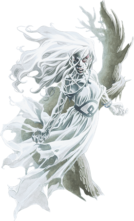

## Banshee
When night falls, unlucky travelers hear the faint cries of the forlorn dead. This woeful spirit is a banshee, a spiteful creature formed from the spirit of a female elf.

Banshees appear as luminous, wispy forms that vaguely recall their mortal features. A banshee's face is wreathed in a wild tangle of hair, its body clad in wispy rags that flutter and stream around it.

***Divine Wrath.*** Banshees (originally) were the undead remnants of elves who, blessed with great beauty, failed to use their gift to bring joy to the world. Instead, they used their beauty to corrupt and control others. Elves afflicted by the banshee's curse experience no gladness, feeling only distress in the presence of the living. As the curse takes its toll, their minds and bodies decay, until death completes their transformation into undead monsters.

As time progressed, however, it became clear the curse was not limited just to the elves; in the milennia since its first appearance, the divine wrath that is the curse of the banshee has been visited upon human, dwarven, dragonborn, even orcish and hobgoblin banshees have been reported. Similarly, where it was once thought the curse affected only females, male banshees have been seen as well.

***Sorrow Bound.*** A banshee becomes forever bound to the place of its demise, unable to venture more than five miles from there. It is forced to relive every moment of its life with perfect recall, yet always refuses to accept responsibility for its doom.

***Beauty Hoarders.*** The vanity that inspired the banshee's cursed creation persists in undeath. These creatures covet beautiful objects: fine jewelry, paintings, statues, and other objects of art. At the same time, a banshee abhors any mirrored surface, for it can't bear to see the horror of its own existence. A single glimpse of itself is enough to send a banshee into a rage.

***Undead Nature.*** A banshee doesn't require air, food, drink, or sleep.

>### Banshee
>*Medium undead, chaotic evil*
>___
>- **Armor Class** 12
>- **Hit Points** 58 (13d8)
>- **Speed** 0 ft., fly 40 ft. (hover)
>___
>|**STR**|**DEX**|**CON**|**INT**|**WIS**|**CHA**|
>|:---:|:---:|:---:|:---:|:---:|:---:|
>|1 (-5)|14 (+2)|10 (+0)|12 (+1)|11 (+0)|17 (+3)|
>
>___
>- **Proficiency Bonus** +2
>- **Saving Throws** Wis +2,Cha +5
>- **Damage Vulnerabilities** 
>- **Damage Resistances** acid,fire,lightning,thunder; bludgeoning,piercing,and slashing from nonmagical attacks
>- **Damage Immunities** cold,necrotic,poison
>- **Condition Immunities** charmed,exhaustion,frightened,grappled,paralyzed,petrified,poisoned,prone,restrained
>- **Skills** 
>- **Senses** darkvision 60 ft.,passive Perception 10
>- **Languages** Common,Elvish
>- **Challenge** 4
>___
>***Detect Life.*** The banshee can magically sense the presence of creatures up to 5 miles away that aren't undead or constructs. She knows the general direction they're in but not their exact locations.
>
>***Incorporeal Movement.*** The banshee can move through other creatures and objects as if they were difficult terrain. She takes 5 (1d10) force damage if she ends her turn inside an object.
>
>#### Actions
>***Corrupting Touch.*** Melee Spell Attack: +4 to hit, reach 5 ft., one target. Hit: 12 (3d6 + 2) necrotic damage.
>
>***Horrifying Visage.*** Each non-undead creature within 60 feet of the banshee that can see her must succeed on a DC 13 Wisdom saving throw or be frightened for 1 minute. A frightened target can repeat the saving throw at the end of each of its turns, with disadvantage if the banshee is within line of sight, ending the effect on itself on a success. If a target's saving throw is successful or the effect ends for it, the target is immune to the banshee's Horrifying Visage for the next 24 hours.
>
>***Wail (1/Day).*** The banshee releases a mournful wail, provided that she isn't in sunlight. This wail has no effect on constructs and undead. All other creatures within 30 feet of her that can hear her must make a DC 13 Constitution saving throw. On a failure, a creature drops to 0 hit points. On a success, a creature takes 10 (3d6) psychic damage.
>
