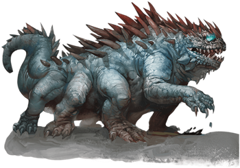

## Basilisk
Travelers sometimes find objects that look like pieces of remarkably lifelike stone carvings of wildlife. Missing parts appear to have been bitten off. Seasoned explorers regard such relics as warnings, knowing that the basilisk that created them is likely to be nearby.

***Adaptable Predators.*** Basilisks thrive in arid, temperate, or tropical climates. They lair in caves or other sheltered sites. Most often, basilisks are encountered underground.

A basilisk born and raised in captivity can be domesticated and trained. Such a trained basilisk knows how to avoid meeting the eyes of those its master wishes to protect from its gaze, but it makes a daunting guardian beast. Because of this use, basilisk eggs are highly prized.

***Gaze of Stone.*** Basilisks are ponderous for hunting creatures, but they needn't chase prey. Meeting a basilisk's supernatural gaze can be enough to affect a rapid transformation, transforming a victim into porous stone. Basilisks, with their strong jaws, are able to consume the stone. The stone returns to organic form in the basilisk's gullet.

Some alchemists are said to know how to process the basilisk's gullet and the fluids contained within. Properly handled, the gullet produces an oil that can return petrified creatures to flesh and life. Unfortunately for such a victim, any parts lost in stone form remain absent if the creature revives. Revivification using the oil is impossible if a vital part of the petrified creature, such as its head, is detached.

>### Basilisk
>*Medium monstrosity, unaligned*
>___
>- **Armor Class** 15 (natural armor)
>- **Hit Points** 52 (8d8 + 16)
>- **Speed** 20 ft.
>___
>|**STR**|**DEX**|**CON**|**INT**|**WIS**|**CHA**|
>|:---:|:---:|:---:|:---:|:---:|:---:|
>|16 (+3)|8 (-1)|15 (+2)|2 (-4)|8 (-1)|7 (-2)|
>
>___
>- **Proficiency Bonus** +2
>- **Saving Throws** 
>- **Damage Vulnerabilities** 
>- **Damage Resistances** 
>- **Damage Immunities** 
>- **Condition Immunities** 
>- **Skills** 
>- **Senses** darkvision 60 ft.,passive Perception 9
>- **Languages** —
>- **Challenge** 3
>___
>***Petrifying Gaze.*** If a creature starts its turn within 30 feet of the basilisk and the two of them can see each other, the basilisk can force the creature to make a DC 12 Constitution saving throw if the basilisk isn't incapacitated. On a failed save, the creature magically begins to turn to stone and is restrained. It must repeat the saving throw at the end of its next turn. On a success, the effect ends. On a failure, the creature is petrified until freed by the greater restoration spell or other magic.
>
>A creature that isn't surprised can avert its eyes to avoid the saving throw at the start of its turn. If it does so, it can't see the basilisk until the start of its next turn, when it can avert its eyes again. If it looks at the basilisk in the meantime, it must immediately make the save.
>
>If the basilisk sees its reflection within 30 feet of it in bright light, it mistakes itself for a rival and targets itself with its gaze.
>
>#### Actions
>***Bite.*** Melee Weapon Attack: +5 to hit, reach 5 ft., one target. Hit: 10 (2d6 + 3) piercing damage plus 7 (2d6) poison damage.
>
