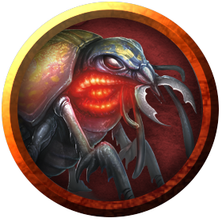

# Beetles
The humble beetle exists all over Azgaarnoth.

> Jump to: [Giant Fire Beetle](Beetle.md#giant-fire-beetle) | [Swarm of Beetles](Beetle.md#swarm-of-beetles)

---

## Giant Fire Beetle
A giant fire beetle is a nocturnal creature that takes its name from a pair of glowing glands that give off light. Miners and adventurers prize these creatures, for a giant fire beetle's glands continue to shed light for 1d6 days after the beetle dies. Giant fire beetles are most commonly found underground and in dark forests.

### Environment
Underdark

### Token

>### Giant Fire Beetle
>*Small beast, unaligned*
>___
>- **Armor Class** 13 (natural armor)
>- **Hit Points** 4 (1d6 + 1)
>- **Speed** 30 ft.
>___
>|**STR**|**DEX**|**CON**|**INT**|**WIS**|**CHA**|
>|:---:|:---:|:---:|:---:|:---:|:---:|
>|8 (-1)|10 (+0)|12 (+1)|1 (-5)|7 (-2)|3 (-4)|
>
>___
>- **Proficiency Bonus** +2
>- **Saving Throws** 
>- **Damage Vulnerabilities** 
>- **Damage Resistances** 
>- **Damage Immunities** 
>- **Condition Immunities** 
>- **Skills** 
>- **Senses** blindsight 30 ft.,passive Perception 8
>- **Languages** —
>- **Challenge** 0
>___
>***Illumination.*** The beetle sheds bright light in a 10-foot radius and dim light for an additional 10 feet.
>
>#### Actions
>***Bite.*** Melee Weapon Attack: +1 to hit, reach 5 ft., one target. Hit: 2 (1d6 − 1) slashing damage.
>

---

## Swarm of Beetles
The swarms presented here aren't ordinary or benign assemblies of little creatures. They form as a result of some sinister or unwholesome influence. Even druids can't charm these swarms, and their aggressiveness is borderline unnatural.

### Environment
Conjured/Summoned

### Token

>### Swarm of Beetles
>*Medium swarm, unaligned*
>___
>- **Armor Class** 12 (natural armor)
>- **Hit Points** 22 (5d8)
>- **Speed** 20 ft., climb 20 ft., burrow 5 ft.
>___
>|**STR**|**DEX**|**CON**|**INT**|**WIS**|**CHA**|
>|:---:|:---:|:---:|:---:|:---:|:---:|
>|3 (-4)|13 (+1)|10 (+0)|1 (-5)|7 (-2)|1 (-5)|
>
>___
>- **Proficiency Bonus** +2
>- **Saving Throws** 
>- **Damage Vulnerabilities** 
>- **Damage Resistances** bludgeoning,piercing,slashing
>- **Damage Immunities** 
>- **Condition Immunities** charmed,frightened,grappled,paralyzed,petrified,prone,restrained,stunned
>- **Skills** 
>- **Senses** blindsight 10 ft.,passive Perception 8
>- **Languages** —
>- **Challenge** 1/2
>___
>***Swarm.*** The swarm can occupy another creature's space and vice versa, and the swarm can move through any opening large enough for a Tiny insect. The swarm can't regain hit points or gain temporary hit points.
>
>#### Actions
>***Bites.*** Melee Weapon Attack: +3 to hit, reach 0 ft., one target in the swarm's space. Hit: 10 (4d4) piercing damage, or 5 (2d4) piercing damage if the swarm has half of its hit points or fewer.
>

