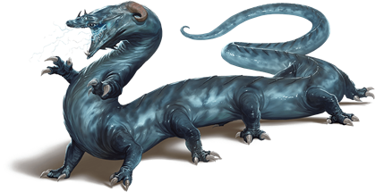
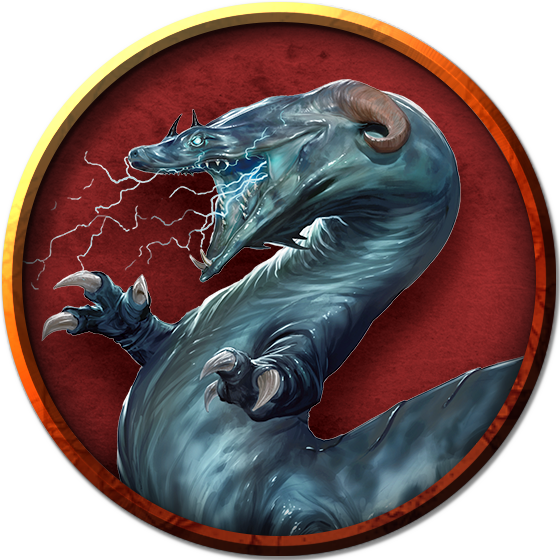

## Behir
The serpentine behir crawls along floors and clambers up walls to reach its prey. Its lightning breath can incinerate most creatures, even as more powerful foes are constricted in its coils and eaten alive.

A behir's monstrous form resembles a combination of centipede and crocodile. Its scaled hide ranges from ultramarine to deep blue in color, fading to pale blue on its underside.

***Cavern Predators.*** Behirs lair in places inaccessible to other creatures, favoring locations where would-be intruders must make a harrowing climb to reach them. Deep pits, high caves in cliff walls, and caverns reached only by narrow, twisting tunnels are prime sites for a behir ambush. A behir's dozen legs allow it to scramble through its lair site with ease. When not climbing, it moves even faster by folding its legs beside its body and slithering like a snake.

Behirs swallow their prey whole, after which they enter a period of dormancy while they digest. While dormant, a behir chooses a hiding place where intruders in its lair might overlook it.

***Foes of the Dragons.*** In the earliest days of the war with the Eldar, the Hordes found themselves at a huge disadvantage against the Eldar's draconic allies. Seeking a way to level the field, Hordish magicians created the first behirs as weapons against the dragons, and behirs retain a natural hatred for dragonkind.

A behir never makes its lair in an area it knows to be inhabited by a dragon. If a dragon attempts to establish a lair within a few dozen miles of a behir's lair, the behir is compelled to kill the dragon or drive it off. Only if the dragon proves too powerful to fight does a behir back down, seeking out a new lair site a great distance away.

### Environment
Underdark

### Token

>### Behir
>*Huge monstrosity, neutral evil*
>___
>- **Armor Class** 17 (natural armor)
>- **Hit Points** 168 (16d12 + 64)
>- **Speed** 50 ft., climb 40 ft.
>___
>|**STR**|**DEX**|**CON**|**INT**|**WIS**|**CHA**|
>|:---:|:---:|:---:|:---:|:---:|:---:|
>|23 (+6)|16 (+3)|18 (+4)|7 (-2)|14 (+2)|12 (+1)|
>
>___
>- **Proficiency Bonus** +4
>- **Saving Throws** 
>- **Damage Vulnerabilities** 
>- **Damage Resistances** 
>- **Damage Immunities** lightning
>- **Condition Immunities** 
>- **Skills** Perception +6,Stealth +7
>- **Senses** darkvision 90 ft.,passive Perception 16
>- **Languages** Draconic
>- **Challenge** 11
>___
>#### Actions
>***Multiattack.*** The behir makes two attacks: one with its bite and one to constrict.
>
>***Bite.*** Melee Weapon Attack: +10 to hit, reach 10 ft., one target. Hit: 22 (3d10 + 6) piercing damage.
>
>***Constrict.*** Melee Weapon Attack: +10 to hit, reach 5 ft., one Large or smaller creature. Hit: 17 (2d10 + 6) bludgeoning damage plus 17 (2d10 + 6) slashing damage. The target is grappled (escape DC 16) if the behir isn't already constricting a creature, and the target is restrained until this grapple ends.
>
>***Lightning Breath (Recharge 5–6).*** The behir exhales a line of lightning that is 20 feet long and 5 feet wide. Each creature in that line must make a DC 16 Dexterity saving throw, taking 66 (12d10) lightning damage on a failed save, or half as much damage on a successful one.
>
>***Swallow.*** The behir makes one bite attack against a Medium or smaller target it is grappling. If the attack hits, the target is also swallowed, and the grapple ends. While swallowed, the target is blinded and restrained, it has total cover against attacks and other effects outside the behir, and it takes 21 (6d6) acid damage at the start of each of the behir's turns. A behir can have only one creature swallowed at a time.
>
>If the behir takes 30 damage or more on a single turn from the swallowed creature, the behir must succeed on a DC 14 Constitution saving throw at the end of that turn or regurgitate the creature, which falls prone in a space within 10 feet of the behir. If the behir dies, a swallowed creature is no longer restrained by it and can escape from the corpse by using 15 feet of movement, exiting prone.
>
