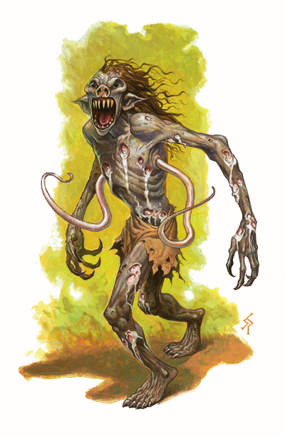

# Bonedrinkers
This gaunt creature is humanoid in shape, except for two long, writhing, pale tentacles that sprout from beneath its arms. Although its features are somewhat goblinoid in appearance, wicked talons cap its long, spindly fingers, and its wide maw opens to reveal many sharp teeth, including six 6-inch-long fangs. Its hairless, gray-skinned body is covered in oozing sores that weep a pale white fluid.

> Jump to: [Bonedrinker](#bonedrinker) | [Lesser](#lesser-bonedrinker) | [Greater](#greater-bonedrinker)

A truly repulsive creature, the bonedrinker hunts to feed on the bones of its victims. Terrible undead created in a horrid ritual reminiscent of mummy creation, bonedrinkers wander the dark places of the world, seeking new creatures to feed upon. Hobgoblin wizards originally developed the ritual to create these monstrosities, using the fallen corpses of goblin and bugbear warriors to create the first lesser bonedrinkers and bonedrinkers. The tradition of using bugbears and goblins became habit, and nearly all bonedrinkers previously lived as one of these two goblinoid races. In theory, other humanoid creatures could be converted into bonedrinkers, but this would require twisting and adapting the original ritual.

Originally developed by hobgoblin wizards using the corpses of goblin and bugbear warriors, the choice of bodies has become something of a tradition and while other humanoid creatures could be transformed into bonedrinkers the vast majority created are from these two origins. Later, bugbear and goblin wizards learned how to adapt the process for hobgoblin corpses, and the three races used the process liberally to flesh out their ranks (as well as provide subtle reminders to the other two races).

Bonedrinkers resemble ghasts in many ways, leading those who catch only fleeting glimpses of the creatures to erroneously pass on exactly that description. If it weren't for the two tentacles that grow beneath their arms and the six horribly long fangs in their mouths, the description might even fit.

A bonedrinker's body is covered in weeping sores, the result of its constant need to feed. The longer one goes without liquefying and draining a creature's bones, the more sores appear. This has no effect on the creature's abilities, but a bonedrinker certainly grows more reckless and desperate the hungrier it becomes.

Bonedrinkers prey on any creature with a skeletal structure. They care nothing for vermin, elementals, constructs, or any other creature lacking their favorite food. Many other carnivores similarly eat bones, but not in the same way that a bonedrinker does. Bonedrinkers secrete a strange chemical in their saliva that breaks down bones into a viscous liquid. As the bones liquefy, the bonedrinker slurps them up through wounds it inflicts with its bite. In essence, a bonedrinker is to bones what a vampire is to blood.

Bonedrinkers speak the languages they knew in life, typically Goblin, and that of their creators, typically Goblin and Common.

***Creating A Bonedrinker.*** The ritual that turns a goblinoid corpse into a bonedrinker requires the [create undead](../Magic/Spells/create-undead.md) spell cast by a caster of 15th level who must also pass a Knowledge/DC 20 check at the time of the casting. (Failure wastes the spell and the corpse.) Goblins transform into lesser bonedrinkers; hobgoblins into bonedrinkers; and bugbears into greater bonedrinkers. These rituals are typically known only to hobgoblin wizards and clerics, though the secret has undoubtedly spread to other races over the years.

***Unholy Toughness.*** A lesser bonedrinker gains a bonus to its hit points equal to its Charisma modifier multiplied by its Hit Dice.

---

## Bonedrinker
A bonedrinker stands about 6 feet tall and weighs roughly 200 pounds. Created from a hobgoblin, it superficially resembles the goblinoid from which it was created.

>### Bonedrinker
>*medium undead (goblinoid), chaotic evil*
>___
>- **Armor Class** 15 (natural armor)
>- **Hit Points** 58 (7d10 + 14)
>- **Speed** 30 ft
>___
>|**STR**|**DEX**|**CON**|**INT**|**WIS**|**CHA**|
>|:---:|:---:|:---:|:---:|:---:|:---:|
>|15 (+2)|18 (+4)|10 (+0)|8 (-1)|12 (+1)|15 (+2)|
>
>___
>- **Proficiency Bonus** +2
>- **Saving Throws** 
>- **Damage Vulnerabilities** 
>- **Damage Resistances** cold,fire and thunder
>- **Damage Immunities** poison
>- **Condition Immunities** charmed,exhaustion,poisoned
>- **Skills** Stealth +10
>- **Senses** darkvision 60ft,passive Perception 11
>- **Languages** Common,Goblin
>- **Challenge** 3
>___
>***Keen Smell.*** The bonedrinker has advantage on Wisdom (Perception) checks that rely on smell.
>
>***Pounce.*** If the bonedrinker moves at least 15 feet straight toward a creature and then hits it with a claw attack on the same turn, that target must succeed on a DC 12 Strength saving throw or be knocked prone. If the target is prone, the bonedrinker can make either a tentacle or claw attack against it as a bonus action.
>
>#### Actions
>***Multiattack.*** A lesser bonedrinker makes two attacks each round; one with its Tentacles and one with its Claws.
>
>***Claw.*** Melee Weapon Attack: +5 to hit, reach 5 ft., one target. Hit: 9 (1d8 + 5) slashing damage.
>
>***Tentacle.*** Melee Weapon Attack: +5 to hit, reach 10 ft., one target hit: 11 (2d8+2) necrotic damage, plus the target must succeed on a DC 13 Constitution saving throw or its hit point maximum is reduced by the damage taken (target is considered Grappled). This reduction lasts until the target finishes a long rest. Target dies if reduced to 0 hit points.
>

---

## Greater Bonedrinker
A greater bonedrinker stands about 7 feet tall and weighs roughly 225 pounds. Created from a bugbear, it superficially resembles the goblinoid from which it was created.

>### Greater Bonedrinker
>*medium undead (goblinoid), chaotic evil*
>___
>- **Armor Class** 17 (natural armor)
>- **Hit Points** 84 (9d10 + 18)
>- **Speed** 30 ft
>___
>|**STR**|**DEX**|**CON**|**INT**|**WIS**|**CHA**|
>|:---:|:---:|:---:|:---:|:---:|:---:|
>|15 (+2)|18 (+4)|10 (+0)|8 (-1)|12 (+1)|15 (+2)|
>
>___
>- **Proficiency Bonus** +2
>- **Saving Throws** 
>- **Damage Vulnerabilities** 
>- **Damage Resistances** cold,fire and thunder
>- **Damage Immunities** poison
>- **Condition Immunities** charmed,exhaustion,poisoned
>- **Skills** Stealth +10
>- **Senses** darkvision 60ft,passive Perception 11
>- **Languages** Common,Goblin
>- **Challenge** 3
>___
>***Pounce.*** If the bonedrinker moves at least 15 feet straight toward a creature and then hits it with a claw attack on the same turn, that target must succeed on a DC 12 Strength saving throw or be knocked prone. If the target is prone, the bonedrinker can make either a tentacle or claw attack against it as a bonus action.
>
>#### Actions
>***Multiattack.*** A lesser bonedrinker makes two attacks each round with tentacle or claws.
>
>***Claw.*** Melee Weapon Attack: +5 to hit, reach 5 ft., one target. Hit: 9 (1d8 + 5) slashing damage.
>
>***Tentacle.*** Melee Weapon Attack: +5 to hit, reach 10 ft., one target hit: 11 (2d8+2) necrotic damage, plus the target must succeed on a DC 13 Constitution saving throw or its hit point maximum is reduced by the damage taken (target is considered Grappled). This reduction lasts until the target finishes a long rest. Target dies if reduced to 0 hit points.
>

---

## Lesser Bonedrinker
A lesser bonedrinker stands about 4 1/2 feet tall and weighs roughly 125 pounds. Created from a goblin, it superficially resembles the goblinoid from which it was created.

>### Lesser Bonedrinker
>*small undead (goblinoid), chaotic evil*
>___
>- **Armor Class** 14 (natural armor)
>- **Hit Points** 56 (6d8 + 12)
>- **Speed** 30 ft
>___
>|**STR**|**DEX**|**CON**|**INT**|**WIS**|**CHA**|
>|:---:|:---:|:---:|:---:|:---:|:---:|
>|15 (+2)|18 (+4)|10 (+0)|8 (-1)|12 (+1)|15 (+2)|
>
>___
>- **Proficiency Bonus** +2
>- **Saving Throws** 
>- **Damage Vulnerabilities** 
>- **Damage Resistances** cold,fire and thunder
>- **Damage Immunities** poison
>- **Condition Immunities** charmed,exhaustion,poisoned
>- **Skills** Stealth +10
>- **Senses** darkvision 60ft,passive Perception 11
>- **Languages** Common,Goblin
>- **Challenge** 3
>___
>***Pounce.*** If the bonedrinker moves at least 15 feet straight toward a creature and then hits it with a claw attack on the same turn, that target must succeed on a DC 12 Strength saving throw or be knocked prone. If the target is prone, the bonedrinker can make either a tentacle or claw attack against it as a bonus action.
>
>#### Actions
>***Multiattack.*** A lesser bonedrinker makes two attacks each round; one with its Tentacles and one with its Claws.
>
>***Claw.*** Melee Weapon Attack: +5 to hit, reach 5 ft., one target. Hit: 9 (1d8 + 5) slashing damage.
>
>***Tentacle.*** Melee Weapon Attack: +5 to hit, reach 10 ft., one target hit: 11 (2d8+2) necrotic damage, plus the target must succeed on a DC 13 Constitution saving throw or its hit point maximum is reduced by the damage taken (target is considered Grappled). This reduction lasts until the target finishes a long rest. Target dies if reduced to 0 hit points.
>
