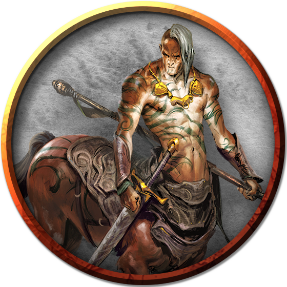

## Centaur
Reclusive wanderers and omen-readers of the wild, centaurs avoid conflict but fight fiercely when pressed. They roam the vast wilderness, keeping far from borders, laws, and the company of other creatures. Centaurs love open spaces and the freedom to travel. As much as they can, centaurs run. They race the wind, hooves thundering and tails streaming behind them.

Centaurs have humanoid upper bodies, displaying all the human variety of skin tones and features. In size, they are comparable to a human rider mounted on a horse, and they fill similar roles—as cavalry, messengers, outriders, and scouts.

Centaurs’ ears are slightly pointed, but their faces are more wide and square than those of elves. Below the waist, they have the bodies of horses, with coats tending toward brown shades (chestnut or bay) and darker tails. 

Centaurs have a strong sense of the interconnectedness of the natural world, and they celebrate family and community as microcosms of that greater connection. The birth of a foal is always cause for festivities. At the same time, centaurs revere the traditions of the past, preserving old ways and keeping alive the legends of ancestral heroes. They feel a close kinship with wild animals, perhaps because of their own hybrid nature, and delight in the feeling of running alongside herds and packs of beasts.

Centaurs’ given names are passed down through family lines. The name given to a new foal is typically the name of the most recently deceased family member of the same gender, keeping alive the memory--and, the centaurs believe, some shard of the spirit--of the departed. Centaurs rarely use family names, but wear symbols that represent their family membership. These symbols might include graphical representations of plants or animals, printed mottos, braids and beads worn in the hair and tail, or even specific patterns of woven fabric.

***Wilderness Nomads.*** Centaur tribes range across lands with mild to hot climates, where a centaur requires only light furs or oiled skins to deal with inclement weather. They are hunter-gatherers and rarely build shelters or even use tents.

Centaur migrations span continents and take decades to repeat, so that a centaur tribe might not retread the same path for generations. These long-ranging patterns can lead to conflict when centaurs encounter settlements of other creatures built along their traditional routes.

Centaurs can be found often within the [Ravenlands](../Geography/Ravenlands.md) and [North Bedia](../Nations/Bedia.md). They usually move around in "herds", which are more properly tribes, led by a powerful centaur of some experience. They are nomads, for the most part, but extremely skilled, and are quite capable of artisanry when they choose to put their minds and hands to it.

***Reluctant Settlers.*** A centaur that can't keep pace with the rest of its tribe is left behind. Some such centaurs vanish into the wilderness and are never seen again. Those that can bear the loss of their tribe might take up residence among other races. Frontier settlements value the nature knowledge of their centaur residents. Many such communities owe their survival to the insight and acumen of a centaur.

Despite their reclusive nature, centaurs trade with elves and with the caravans of other benevolent humanoids they meet during their wanderings. A trader might save the life of a wounded or an elderly centaur unfit for long travel, escorting it to a settlement where it can peacefully live out the rest of its days.

***Playable Race: Extraordinary Cavalry.*** Centaurs often [strike out](../../Races/Centaurs.md) as individuals, following dreams or a perception of destiny. They make excellent fighters, barbarians, and rangers, excel as clerics, shamans, and druids, and many have sworn oaths to become paladins. Their size makes traditional roguery tricky, however, and many find the hours of study in a tower required for wizardry to be awkward for one with the body of a horse.

### Environment
Desert, Grassland, Hill, Urban

### Token

>### Centaur
>*Large monstrosity, neutral good*
>___
>- **Armor Class** 12
>- **Hit Points** 45 (6d10 + 12)
>- **Speed** 50 ft.
>___
>|**STR**|**DEX**|**CON**|**INT**|**WIS**|**CHA**|
>|:---:|:---:|:---:|:---:|:---:|:---:|
>|18 (+4)|14 (+2)|14 (+2)|9 (-1)|13 (+1)|11 (+0)|
>
>___
>- **Proficiency Bonus** +2
>- **Saving Throws** 
>- **Damage Vulnerabilities** 
>- **Damage Resistances** 
>- **Damage Immunities** 
>- **Condition Immunities** 
>- **Skills** Athletics +6,Perception +3,Survival +3
>- **Senses** passive Perception 13
>- **Languages** Elvish,Sylvan
>- **Challenge** 2
>___
>***Charge.*** If the centaur moves at least 30 feet straight toward a target and then hits it with a pike attack on the same turn, the target takes an extra 10 (3d6) piercing damage.
>
>#### Actions
>***Multiattack.*** The centaur makes two attacks: one with its pike and one with its hooves or two with its longbow.
>
>***Pike.*** Melee Weapon Attack: +6 to hit, reach 10 ft., one target. Hit: 9 (1d10 + 4) piercing damage.
>
>***Hooves.*** Melee Weapon Attack: +6 to hit, reach 5 ft., one target. Hit: 11 (2d6 + 4) bludgeoning damage.
>
>***Longbow.*** Ranged Weapon Attack: +4 to hit, range 150/600 ft., one target. Hit: 6 (1d8 + 2) piercing damage.
>
