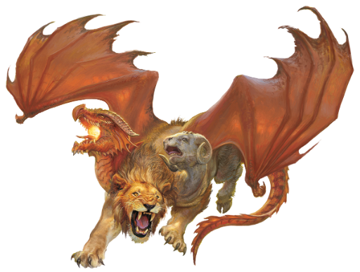

## Chimera
Chimeras were created after mortals began their worship of Tiamat, who sought to give her followers a taste of both her power and her capacity for horror. She took creatures that surrounded mortals and combined them into horrific, multi-headed monstrosities. This act gave rise to the first chimeras.

Gifted with demonic cruelty, a chimera serves as a grim reminder of what happens when demon princes find their way to the Material Plane. A typical specimen has the hindquarters of a large goat, the forequarters of a lion, and the leathery wings of a dragon, along with the heads of all three of those creatures. The monster likes to surprise its victims, swooping down from the sky and engulfing prey with its breath before landing.

***Conflicted Creature.*** A chimera combines the worst aspects of its three parts. Its dragon head drives it to raid, plunder, and accumulate a great hoard. Its leonine nature compels it to hunt and kill powerful creatures that threaten its territory. Its goat head grants it a vicious, stubborn streak that compels it to fight to the death.

These three aspects drive a chimera to stake out a territory that is as large as 10 miles wide. It preys on wild game, viewing more powerful creatures as rivals to be humiliated and defeated. Its greatest rivals are dragons, griffons, manticores, perytons, and wyverns.

When it hunts, the chimera looks for easy ways to amuse itself. It enjoys the fear and suffering of weaker creatures. The monster often toys with its prey, breaking off an attack prematurely and leaving a creature wounded and terrified before returning to finish it off.

***Servant of Evil.*** Though chimeras are far from cunning, their draconic ego makes them susceptible to flattery and gifts. If offered food and treasure, a chimera might spare a traveler. A villain can lure a chimera into service by keeping it well fed and its treasure hoard well stocked.

### Environment
Grassland, Hill, Mountain, Underdark

>### Chimera
>*Large monstrosity, chaotic evil*
>___
>- **Armor Class** 14 (Natural Armor)
>- **Hit Points** 114 (12d10 + 48)
>- **Speed** 30 ft., fly 60 ft.
>___
>|**STR**|**DEX**|**CON**|**INT**|**WIS**|**CHA**|
>|:---:|:---:|:---:|:---:|:---:|:---:|
>|19 (+4)|11 (+0)|19 (+4)|3 (-4)|14 (+2)|10 (+0)|
>
>___
>- **Proficiency Bonus** +3
>- **Saving Throws** 
>- **Damage Vulnerabilities** 
>- **Damage Resistances** 
>- **Damage Immunities** see below
>- **Condition Immunities** 
>- **Skills** Perception +8
>- **Senses** Darkvision 60 ft.,Passive Perception 18
>- **Languages** Understands Draconic but can't speak it
>- **Challenge** 6
>___
>***Flyby.*** While flying, the Chimera can move up to half its movement, make a melee attack against a creature, and move the remainder of its movement without provoking opportunity attacks from that creature for the rest of the turn, whether they hit or not.
>
>***Breath Weapon Immunity.*** The chimera is immune to the same kind of damage as it deals with its breath weapon.
>
>#### Actions
>***Multiattack.*** The chimera makes three attacks: one with its Bite, one with its Horns, and one with its Claws. When its breath weapon is available, it can use the breath in place of its bite or horns.
>
>***Bite.*** Melee Weapon Attack: +7 to hit, reach 5 ft., one target. Hit: 11 (2d6 + 4) piercing damage.
>
>***Horns.*** Melee Weapon Attack: +7 to hit, reach 5 ft., one target. Hit: 10 (1d12 + 4) bludgeoning damage.
>
>***Claws.*** Melee Weapon Attack: +7 to hit, reach 5 ft., one target. Hit: 11 (2d6 + 4) slashing damage.
>
>***Breath Weapon (Recharge 5–6).*** The dragon head exhales a breath weapon that mirrors its chromatic color:
>
>* **Black:** Acid, in a 15-foot line. Each creature in that area must make a DC 15 Dexterity saving throw, taking 31 (7d8) acid damage on a failed save, or half on a successful one.
>* **Blue:** Lightning, in a 15-foot line. Each creature in that area must make a DC 15 Dexterity saving throw, taking 31 (7d8) lightning damage on a failed save, or half on a successful one.
>* **Green:** Poison gas, in a cloud 20' square in front of the head. Each creature in that area must make a DC 15 Constitution saving throw, taking 31 (7d8) poison damage on a failed save, or half on a successful one.
>* **Red:** Fire, in a 15-foot cone. Each creature in that area must make a DC 15 Dexterity saving throw, taking 31 (7d8) fire damage on a failed save, or half on a successful one.
>* **White:** Frost, in a 15-­foot cone. Each creature in that area must make a DC 15 Dexterity saving throw, taking 31 (7d8) frost damage on a failed save, or half as much damage on a successful one.
>