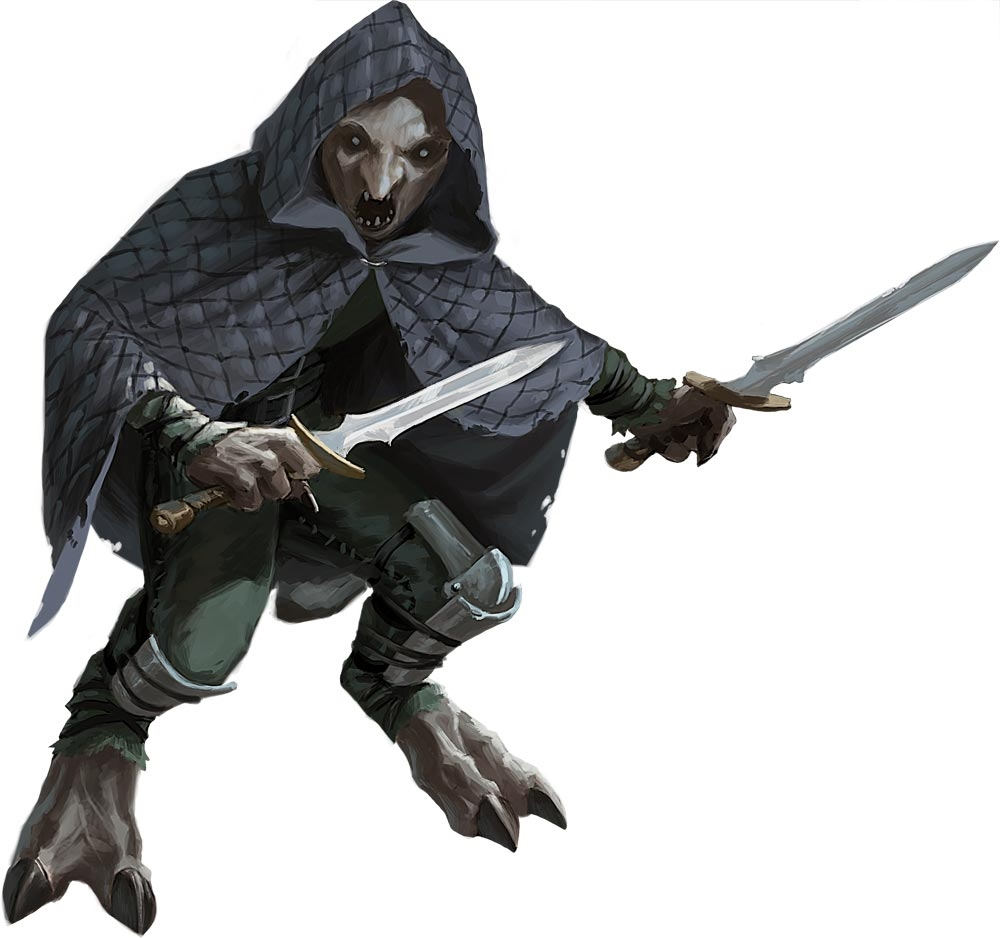
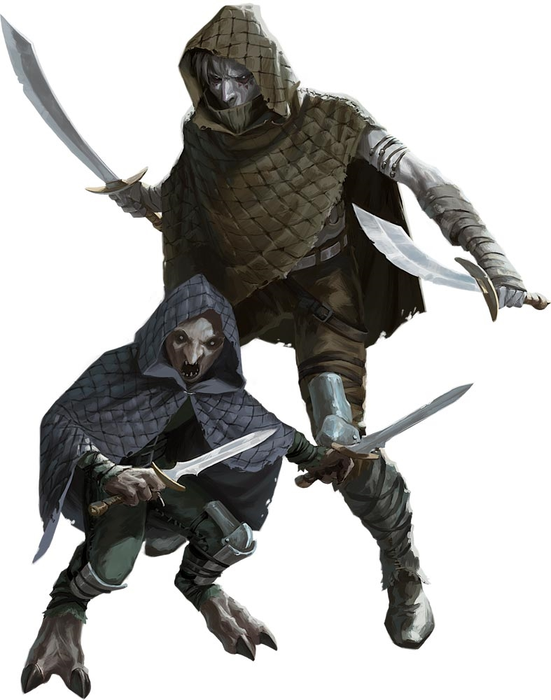

# Darklings
Ancient legends speak of a seelie fey who betrayed the Summer Queen. In the Summer Queens' wrath, she cursed every member of his house. The seelie fey's true name has been stricken from history, but the stories call him Dubh Catha ("Dark Crow" in Common), and other Fey refer to the house's descendants as dubh sith--"darklings." Darklings dwell in secluded caverns and chambers beneath the towns of other species. From such enclaves, they quietly ply their trade as thieves and assassins.

> Jump to: [Darkling](Darklings.md#darkling) | [Darkling Elder](Darklings.md#darkling-elder)

Darkling commonly operated in and around the tribes of the Hordes, and over time, many migrated out into the rest of Azgaarnoth; they are not common, but most Azgaarnoth cities have at least a small contingent of darkling somewhere within the city limits.

---

## Darkling
The Summer Queen's curse causes a darkling's body to absorb light, which wizens the creature, much like the effect of rapid aging. For this reason, darklings cover their entire bodies with clothing when exposure to light is a risk. The light darklings absorb over the course of their lives explodes outward when they die, incinerating the creatures and much of their possessions.

### Environment
Forest, Swamp, Underdark, Urban

### Token

>### Darkling
>*Small fey, Typically Chaotic Neutral*
>___
>- **Armor Class** 14 (leather armor)
>- **Hit Points** 13 (3d6 + 3)
>- **Speed** 30 ft.
>___
>|**STR**|**DEX**|**CON**|**INT**|**WIS**|**CHA**|
>|:---:|:---:|:---:|:---:|:---:|:---:|
>|9 (-1)|16 (+3)|12 (+1)|10 (+0)|12 (+1)|10 (+0)|
>
>___
>- **Proficiency Bonus** +2
>- **Saving Throws** 
>- **Damage Vulnerabilities** 
>- **Damage Resistances** 
>- **Damage Immunities** 
>- **Condition Immunities** 
>- **Skills** Acrobatics +5,Deception +2,Perception +5,Stealth +7
>- **Senses** blindsight 30 ft.,darkvision 120 ft.,passive Perception 15
>- **Languages** Elvish,Sylvan
>- **Challenge** 1/2
>___
>***Death Flash.*** When the darkling dies, nonmagical light flashes out from it in a 10-foot radius as its body and possessions, other than metal or magic objects, burn to ash. Any creature in that area must succeed on a DC 10 Constitution saving throw or be blinded until the end of its next turn.
>
>***Light Sensitivity.*** While in bright light, the darkling has disadvantage on attack rolls, as well as on Wisdom (Perception) checks that rely on sight.
>
>#### Actions
>***Dagger.*** Melee or Ranged Weapon Attack: +5 to hit, reach 5 ft. or range 20/60 ft., one target. Hit: 5 (1d4 + 3) piercing damage plus 7 (2d6) necrotic damage.
>

---

## Darkling Elder
A wise and respected darkling can undergo a ritual to become an elder. Other elders mark the supplicant with glowing tattoos, channeling away some of the darkling's absorbed light. If the ritual succeeds, the darkling grows into a taller, elf-like form. The darkling perishes if the ritual fails.

### Environment
Forest, Swamp, Underdark, Urban

### Token

>### Darkling Elder
>*Medium fey, Typically Chaotic Neutral*
>___
>- **Armor Class** 15 (studded leather armor)
>- **Hit Points** 27 (5d8 + 5)
>- **Speed** 30 ft.
>___
>|**STR**|**DEX**|**CON**|**INT**|**WIS**|**CHA**|
>|:---:|:---:|:---:|:---:|:---:|:---:|
>|13 (+1)|17 (+3)|12 (+1)|10 (+0)|14 (+2)|13 (+1)|
>
>___
>- **Proficiency Bonus** +2
>- **Saving Throws** 
>- **Damage Vulnerabilities** 
>- **Damage Resistances** 
>- **Damage Immunities** 
>- **Condition Immunities** 
>- **Skills** Acrobatics +5,Deception +3,Perception +6,Stealth +7
>- **Senses** blindsight 30 ft.,darkvision 120 ft.,passive Perception 16
>- **Languages** Elvish,Sylvan
>- **Challenge** 2
>___
>***Death Burn.*** When the darkling elder dies, magical light flashes out from it in a 10-foot radius as its body and possessions, other than metal or magic objects, burn to ash. Any creature in that area must make a DC 11 Constitution saving throw. On a failed save, the creature takes 7 (2d6) radiant damage and is blinded until the end of its next turn. On a successful save, the creature takes half as much damage and isn't blinded.
>
>#### Actions
>***Multiattack.*** The darkling elder makes two Scimitar attacks.
>
>***Scimitar.*** Melee Weapon Attack: +5 to hit, reach 5 ft., one target. Hit: 6 (1d6 + 3) slashing damage plus 7 (2d6) necrotic damage.
>
>***Darkness (Recharges after a Short or Long Rest).*** The darkling elder casts darkness, requiring no spell components and using Wisdom as the spellcasting ability.
>

