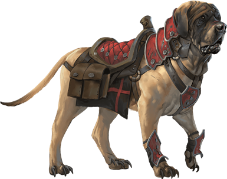
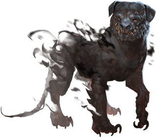
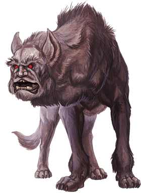

# Dogs
From "bark bark" to "Oh shit we need to get out of here NOW" canines.

> Jump to: [Blink Dog](Dogs.md#blink-dog) | [Death Dog](Dogs.md#death-dog) | [Dog](Dogs.md#dog) | [Giant Hyena](Dogs.md#giant-hyena) | [Hell Hound](Dogs.md#hell-hound) | [Hyena](Dogs.md#hyena) | [Jackal](Dogs.md#jackal) | [Mastiff](Dogs.md#mastiff) | [Withered Hound](Dogs.md#withered-hound) | [Shadow Mastiff](Dogs.md#shadow-mastiff) | [Yeth Hound](Dogs.md#yeth-hound)

---

## Blink Dog

A blink dog takes its name from its ability to blink in and out of existence, a talent it uses to aid its attacks and to avoid harm. Blink dogs harbor a long-standing hatred for displacer beasts and attack them on sight.

### Environment
Forest

### Token

>### Blink Dog
>*Medium fey, lawful good*
>___
>- **Armor Class** 13
>- **Hit Points** 22 (4d8 + 4)
>- **Speed** 40 ft.
>___
>|**STR**|**DEX**|**CON**|**INT**|**WIS**|**CHA**|
>|:---:|:---:|:---:|:---:|:---:|:---:|
>|12 (+1)|17 (+3)|12 (+1)|10 (+0)|13 (+1)|11 (+0)|
>
>___
>- **Proficiency Bonus** +2
>- **Saving Throws** 
>- **Damage Vulnerabilities** 
>- **Damage Resistances** 
>- **Damage Immunities** 
>- **Condition Immunities** 
>- **Skills** Perception +3,Stealth +5
>- **Senses** passive Perception 13
>- **Languages** Blink Dog,understands Sylvan but can't speak it
>- **Challenge** 1/4
>___
>***Keen Hearing and Smell.*** The dog has advantage on Wisdom (Perception) checks that rely on hearing or smell.
>
>***Pack Tactics.*** The blink dog has advantage on an attack roll against a creature if at least one of the blink dog's allies is within 5 feet of the creature and the ally isn't incapacitated.
>
>#### Actions
>***Bite.*** Melee Weapon Attack: +3 to hit, reach 5 ft., one target. Hit: 4 (1d6 + 1) piercing damage.
>
>***Teleport (Recharge 4–6).*** The dog magically teleports, along with any equipment it is wearing or carrying, up to 40 feet to an unoccupied space it can see. Before or after teleporting, the dog can make one bite attack.
>

---

## Death Dog

A death dog is an ugly two-headed hound that roams plains, deserts, and the Underdark. Hate burns in a death dog's heart, and a taste for humanoid flesh drives it to attack travelers and explorers. Death dog saliva carries a foul disease that causes a victim's flesh to slowly rot off the bone.

### Environment
Desert, Grassland, Underdark

### Token

>### Death Dog
>*Medium monstrosity, neutral evil*
>___
>- **Armor Class** 12
>- **Hit Points** 39 (6d8 + 12)
>- **Speed** 40 ft.
>___
>|**STR**|**DEX**|**CON**|**INT**|**WIS**|**CHA**|
>|:---:|:---:|:---:|:---:|:---:|:---:|
>|15 (+2)|14 (+2)|14 (+2)|3 (-4)|13 (+1)|6 (-2)|
>
>___
>- **Proficiency Bonus** +2
>- **Saving Throws** 
>- **Damage Vulnerabilities** 
>- **Damage Resistances** 
>- **Damage Immunities** 
>- **Condition Immunities** 
>- **Skills** Perception +5,Stealth +4
>- **Senses** darkvision 120 ft.,passive Perception 15
>- **Languages** —
>- **Challenge** 1
>___
>***Two-Headed.*** The dog has advantage on Wisdom (Perception) checks and on saving throws against being blinded, charmed, deafened, frightened, stunned, or knocked unconscious.
>
>#### Actions
>***Multiattack.*** The dog makes two bite attacks.
>
>***Bite.*** Melee Weapon Attack: +4 to hit, reach 5 ft., one target. Hit: 5 (1d6 + 2) piercing damage. If the target is a creature, it must succeed on a DC 12 Constitution saving throw against disease or become poisoned until the disease is cured. Every 24 hours that elapse, the creature must repeat the saving throw, reducing its hit point maximum by 5 (1d10) on a failure. This reduction lasts until the disease is cured. The creature dies if the disease reduces its hit point maximum to 0.
>

---

## Dog
Humanoid's best friend.

### Environment
Coastal, Desert, Grassland, Hill, Ruins, Urban

### Token

>### Dog
>*Small beast, unaligned*
>___
>- **Armor Class** 12
>- **Hit Points** 4 (1d6)
>- **Speed** 40 ft., climb 30 ft.
>___
>|**STR**|**DEX**|**CON**|**INT**|**WIS**|**CHA**|
>|:---:|:---:|:---:|:---:|:---:|:---:|
>|3 (-4)|15 (+2)|10 (+0)|3 (-4)|12 (+1)|7 (-2)|
>
>___
>- **Proficiency Bonus** +2
>- **Saving Throws** 
>- **Damage Vulnerabilities** 
>- **Damage Resistances** 
>- **Damage Immunities** 
>- **Condition Immunities** 
>- **Skills** Perception +3
>- **Senses** passive Perception 13
>- **Languages** —
>- **Challenge** 0
>___
>***Keen Smell.*** The dog has advantage on Wisdom (Perception) checks that rely on smell.
>
>***Pack Tactics.*** The dog has advantage on an attack roll against a creature if at least one of the dog's allies is within 5 feet of the creature and the ally isn't incapacitated.
>
>#### Actions
>***Bite.*** Melee Weapon Attack: +0 to hit, reach 5 ft., one target. Hit: 2 (1d4) piercing damage.
>

---

## Giant Hyena
The giant hyena is often the leader of a pack of normal-sized hyenas, though periodically a pride of giant hyenas have been spotted in the wild. They are fearsome hunters and fiendish packs, and their hooting calls are often heard as laughter that sets their victims' fears ablaze.

### Environment
Desert, Forest, Grassland

### Token

>### Giant Hyena
>*Large beast, unaligned*
>___
>- **Armor Class** 12
>- **Hit Points** 45 (6d10 + 12)
>- **Speed** 50 ft.
>___
>|**STR**|**DEX**|**CON**|**INT**|**WIS**|**CHA**|
>|:---:|:---:|:---:|:---:|:---:|:---:|
>|16 (+3)|14 (+2)|14 (+2)|2 (-4)|12 (+1)|7 (-2)|
>
>___
>- **Proficiency Bonus** +2
>- **Saving Throws** 
>- **Damage Vulnerabilities** 
>- **Damage Resistances** 
>- **Damage Immunities** 
>- **Condition Immunities** 
>- **Skills** Perception +3
>- **Senses** passive Perception 13
>- **Languages** —
>- **Challenge** 1
>___
>***Rampage.*** When the hyena reduces a creature to 0 hit points with a melee attack on its turn, the hyena can take a bonus action to move up to half its speed and make a bite attack.
>
>***Pack Tactics.*** The dog has advantage on an attack roll against a creature if at least one of the dog's allies is within 5 feet of the creature and the ally isn't incapacitated.
>
>***Hideous Laughter (Recharge 5-6).*** If three or more giant hyenas are all gathered, their calls to one another acts as a casting of the [vicious mockery](../Magic/Spells/vicious-mockery.md) spell; the spell's level is equal to the number of giant hyenas in the pack, and targets any who are within 60 feet of the center of the pack.
>
>#### Actions
>***Bite.*** Melee Weapon Attack: +5 to hit, reach 5 ft., one target. Hit: 10 (2d6 + 3) piercing damage.
>

---

## Hell Hound
Monstrous, fire-breathing fiends that take the form of powerful dogs, hell hounds are found on the battlefields of Acheron and throughout the Lower Planes. On the Material Plane, hell hounds are most commonly seen in service to devils, fire giants, and other evil creatures that use them as guard animals and companions.

***Burning Hunger.*** Hell hounds hunt in packs, feeding on any creature that appears edible. They avoid potentially dangerous foes in favor of targeting the weakest prey with their savage bite and fiery breath, demonstrating a relentless determination as they pursue that prey to the bitter end.

When hell hounds feed, the flesh they consume stokes the infernal fires that burn within them. When a hell hound dies, that fire consumes the creature's remains in a billowing eruption of smoke and blazing embers, leaving nothing behind but scorched tufts of black fur.

***Evil to the Core.*** Hell hounds are smarter than mundane beasts, and their lawful nature makes them good at following orders. However, a hell hound's evil disposition means that the creature can't be trained to be anything other than a ruthless killer. If a hell hound isn't allowed to indulge its malevolent hunger, it quickly abandons or turns against its master.

### Environment
Extraplanar, Conjured/Summoned

### Token

>### Hell Hound
>*Medium fiend, lawful evil*
>___
>- **Armor Class** 15 (natural armor)
>- **Hit Points** 45 (7d8 + 14)
>- **Speed** 50 ft.
>___
>|**STR**|**DEX**|**CON**|**INT**|**WIS**|**CHA**|
>|:---:|:---:|:---:|:---:|:---:|:---:|
>|17 (+3)|12 (+1)|14 (+2)|6 (-2)|13 (+1)|6 (-2)|
>
>___
>- **Proficiency Bonus** +2
>- **Saving Throws** 
>- **Damage Vulnerabilities** 
>- **Damage Resistances** 
>- **Damage Immunities** fire
>- **Condition Immunities** 
>- **Skills** Perception +5
>- **Senses** darkvision 60 ft.,passive Perception 15
>- **Languages** understands Infernal but can't speak it
>- **Challenge** 3
>___
>***Keen Hearing and Smell.*** The hound has advantage on Wisdom (Perception) checks that rely on hearing or smell.
>
>***Pack Tactics.*** The hound has advantage on an attack roll against a creature if at least one of the hound's allies is within 5 feet of the creature and the ally isn't incapacitated.
>
>#### Actions
>***Bite.*** Melee Weapon Attack: +5 to hit, reach 5 ft., one target. Hit: 7 (1d8 + 3) piercing damage plus 7 (2d6) fire damage.
>
>***Fire Breath (Recharge 5–6).*** The hound exhales fire in a 15-foot cone. Each creature in that area must make a DC 12 Dexterity saving throw, taking 21 (6d6) fire damage on a failed save, or half as much damage on a successful one.
>

---

## Hyena
Hyenas, a distant canine cousin of the domesticated dog or the wild pack-forming wolf, roam the grasslands of the [Al'Uma](../Geography/AlUma.md) and [Yithia](../Geography/Yithia.md) freely, and only slightly less often than they do the more remote areas of [Liria](../Geography/Liria.md) and [Tragekia](../Geography/Tragekia.md). Individually, they often aren't much trouble, and will not seek to attack a well-armed or numerous adversary, but when hyenas are in a pack, and they spot a lone individual away from the others, they can fiercely swarm and devour in seconds.

### Environment
Desert, Grassland, Hill

### Token

>### Hyena
>*Medium beast, unaligned*
>___
>- **Armor Class** 11
>- **Hit Points** 5 (1d8 + 1)
>- **Speed** 50 ft.
>___
>|**STR**|**DEX**|**CON**|**INT**|**WIS**|**CHA**|
>|:---:|:---:|:---:|:---:|:---:|:---:|
>|11 (+0)|13 (+1)|12 (+1)|2 (-4)|12 (+1)|5 (-3)|
>
>___
>- **Proficiency Bonus** +2
>- **Saving Throws** 
>- **Damage Vulnerabilities** 
>- **Damage Resistances** 
>- **Damage Immunities** 
>- **Condition Immunities** 
>- **Skills** Perception +3
>- **Senses** passive Perception 13
>- **Languages** —
>- **Challenge** 0
>___
>***Pack Tactics.*** The hyena has advantage on an attack roll against a creature if at least one of the hyena's allies is within 5 feet of the creature and the ally isn't incapacitated.
>
>#### Actions
>***Bite.*** Melee Weapon Attack: +2 to hit, reach 5 ft., one target. Hit: 3 (1d6) piercing damage.
>

---

## Jackal
Another distant canine relative, jackals are carrion-feeders, and will generally wait until a predator is done with their kill before swarming over the carcass. If attacked, they will generally flee, unless young are present, at which time they will fight to the death to protect the young.

### Environment
Desert, Grassland, Hill

### Token

>### Jackal
>*Small beast, unaligned*
>___
>- **Armor Class** 12
>- **Hit Points** 3 (1d6)
>- **Speed** 40 ft.
>___
>|**STR**|**DEX**|**CON**|**INT**|**WIS**|**CHA**|
>|:---:|:---:|:---:|:---:|:---:|:---:|
>|8 (-1)|15 (+2)|11 (+0)|3 (-4)|12 (+1)|6 (-2)|
>
>___
>- **Proficiency Bonus** +2
>- **Saving Throws** 
>- **Damage Vulnerabilities** 
>- **Damage Resistances** 
>- **Damage Immunities** 
>- **Condition Immunities** 
>- **Skills** Perception +3
>- **Senses** passive Perception 13
>- **Languages** —
>- **Challenge** 0
>___
>***Keen Hearing and Smell.*** The jackal has advantage on Wisdom (Perception) checks that rely on hearing or smell.
>
>***Pack Tactics.*** The jackal has advantage on an attack roll against a creature if at least one of the jackal's allies is within 5 feet of the creature and the ally isn't incapacitated.
>
>#### Actions
>***Bite.*** Melee Weapon Attack: +1 to hit, reach 5 ft., one target. Hit: 1 (1d4 – 1) piercing damage.
>

---

## Mastiff
Mastiffs are impressive hounds prized by humanoids for their loyalty and keen senses. Mastiffs can be trained as guard dogs, hunting dogs, and war dogs. Halflings and other Small humanoids ride them as mounts.

### Environment
Forest, Urban

### Token

>### Mastiff
>*Medium beast, unaligned*
>___
>- **Armor Class** 12
>- **Hit Points** 45 (6d8 + 6)
>- **Speed** 40 ft.
>___
>|**STR**|**DEX**|**CON**|**INT**|**WIS**|**CHA**|
>|:---:|:---:|:---:|:---:|:---:|:---:|
>|13 (+1)|14 (+2)|12 (+1)|6 (-2)|12 (+1)|7 (-2)|
>
>___
>- **Proficiency Bonus** +2
>- **Saving Throws** 
>- **Damage Vulnerabilities** 
>- **Damage Resistances** 
>- **Damage Immunities** 
>- **Condition Immunities** 
>- **Skills** Perception +3
>- **Senses** passive Perception 13
>- **Languages** —
>- **Challenge** 1/8
>___
>***Keen Hearing and Smell.*** The mastiff has advantage on Wisdom (Perception) checks that rely on hearing or smell.
>
>***Pack Tactics.*** The mastiff has advantage on an attack roll against a creature if at least one of the mastiff's allies is within 5 feet of the creature and the ally isn't incapacitated.
>
>#### Actions
>***Bite.*** Melee Weapon Attack: +3 to hit, reach 5 ft., one target. Hit: 4 (1d6 + 1) piercing damage. If the target is a creature, it must succeed on a DC 11 Strength saving throw or be knocked prone.
>

---

## Withered Hound
The Withered Hound is an undead creation, taken when a necromancer or pale master [withers](Templates/Withered.md) a [Mastiff](#mastiff) or similar-sized hound. Like the creature it was spawned from, the Withered Hound has deep loyalty to its master, whether that be the necromancer that raised it or the master that cares for it now.

### Environment
Conjured/Summoned

### Token

>### Withered Hound
>*Medium beast, unaligned*
>___
>- **Armor Class** 13
>- **Hit Points** 45 (6d8 + 6)
>- **Speed** 40 ft.
>___
>|**STR**|**DEX**|**CON**|**INT**|**WIS**|**CHA**|
>|:---:|:---:|:---:|:---:|:---:|:---:|
>|17 (+3)|16 (+3)|16 (+3)|6 (-2)|11 (+0)|6 (-2)|
>
>___
>- **Proficiency Bonus** +2
>- **Saving Throws** 
>- **Damage Vulnerabilities** 
>- **Damage Resistances** bludgeoning, piercing, and slashing from nonmagical attacks that aren't silvered
>- **Damage Immunities** necrotic, poison
>- **Condition Immunities** charmed,frightened,paralyzed,poisoned,stunned
>- **Skills** Perception +2
>- **Senses** darkvision 60 ft.,passive Perception 12
>- **Languages** --
>- **Challenge** 1/8
>___
>***Shadowmeld.*** If the creature is in dim light or darkness, it can take the Hide action as a bonus action. Additionally, If an attack misses the creature, the creature can use its reaction to move up to half of its movement speed without provoking attacks of opportunity.
>
>***Turning Defiance.*** The hound has advantage on saving throws against effects that turn undead.
>
>***Keen Hearing and Smell.*** The withered hound has advantage on Wisdom (Perception) checks that rely on hearing or smell.
>
>***Pack Tactics.*** The withered hound has advantage on an attack roll against a creature if at least one of the mastiff's allies is within 5 feet of the creature and the ally isn't incapacitated.
>
>#### Actions
>***Bite.*** Melee Weapon Attack: +3 to hit, reach 5 ft., one target. Hit: 4 (1d6 + 1) piercing damage. If the target is a creature, it must succeed on a DC 11 Strength saving throw or be knocked prone. If the target is a creature, it must succeed on a DC 13 Constitution saving throw or contract a disease. Until the disease is cured, the target can't regain hit points except by magical means.
>
>***Rotten Stench (1/Day).*** A cloud of noxious gas escapes from the rat's pores. Each creature within 10 feet of the rat must succeed on a DC 13 Constitution saving throw or be poisoned until the end of the creature's next turn.
>

---

## Shadow Mastiff
These black hounds of the Shadowfell move invisibly through the shadows, always on the hunt. In gloomy places where the veil between the Shadowfell and the Material Plane is thinnest, they can cross over into the dark realms of the world.

***Ravenous Lurkers.*** Shadow mastiffs hunt in packs on the Shadowfell, so when one of them enters a rift between the planes, several more are sure to follow. Each pack is led by an alpha (male or female) that is the smartest and toughest one of the group. The alpha must remain sharp to keep the rest of the pack in line, lest it be killed and replaced.

When a shadow mastiff pack is hungry and senses prey nearby, the alpha lets loose a howl that strikes fear into the hearts of nearby beasts and humanoids. Its howl is also a signal to the rest of the pack to move in for the kill. Gloom provides a shadow mastiff with supernatural protection, granting it resistance to nonmagical weapons while in dim light or darkness. Shadow mastiffs can tolerate bright light, but they shun sunlight.

***Summoned for Service.*** Some faiths devoted to deities of gloom and night, such as Shar in the Forgotten Realms, perform unholy rites to summon shadow mastiffs from the Shadowfell and then put them to work as temple sentinels, bodyguards, and punishers of nonbelievers, heretics, and apostates. The method for bringing shadow mastiffs into the world is also known by other strong-willed and evil-minded individuals, who find use for the hounds as guards in their strongholds.

***Ethereal Sight.*** In addition to its other capabilities, a shadow mastiff can see creatures and objects on the Ethereal Plane. This extraplanar perception makes a mastiff an especially skilled guardian, especially in situations when magical or spiritual incursion is likely.

A shadow mastiff [alpha](../Templates/Alpha.md) also has the Terrifying Howl action: 

>***Terrifying Howl.*** The shadow mastiff howls. Any beast or humanoid within 300 feet of the mastiff and able to hear its howl must succeed on a DC 11 Wisdom saving throw or be frightened for 1 minute. A frightened target can repeat the saving throw at the end of each of its turns, ending the effect on itself on a success. If a target's saving throw is successful or the effect ends for it, the target is immune to any shadow mastiff's Terrifying Howl for the next 24 hours.
>

### Environment
Extraplanar, Conjured/Summoned

### Token

>### Shadow Mastiff
>*Medium monstrosity, Typically Neutral Evil*
>___
>- **Armor Class** 12
>- **Hit Points** 33 (6d8 + 6)
>- **Speed** 40 ft.
>___
>|**STR**|**DEX**|**CON**|**INT**|**WIS**|**CHA**|
>|:---:|:---:|:---:|:---:|:---:|:---:|
>|16 (+3)|14 (+2)|13 (+1)|5 (-3)|12 (+1)|5 (-3)|
>
>___
>- **Proficiency Bonus** +2
>- **Saving Throws** 
>- **Damage Vulnerabilities** 
>- **Damage Resistances** bludgeoning,piercing,and slashing from nonmagical attacks while in dim light or darkness
>- **Damage Immunities** 
>- **Condition Immunities** 
>- **Skills** Perception +5,Stealth +6
>- **Senses** darkvision 60 ft.,passive Perception 15
>- **Languages** --
>- **Challenge** 2
>___
>***Ethereal Awareness.*** The shadow mastiff can see ethereal creatures and objects.
>
>***Sunlight Weakness.*** While in bright light created by sunlight, the shadow mastiff has disadvantage on attack rolls, ability checks, and saving throws.
>
>#### Actions
>***Bite.*** Melee Weapon Attack: +5 to hit, reach 5 ft., one target. Hit: 10 (2d6 + 3) piercing damage. If the target is a creature, it must succeed on a DC 13 Strength saving throw or be knocked prone.
>
>#### Bonus Actions
>***Shadow Blend.*** While in dim light or darkness, the shadow mastiff becomes invisible, along with anything it is wearing or carrying. The invisibility lasts until the shadow mastiff uses a bonus action to end it or until the shadow mastiff attacks, is in bright light, or is incapacitated.
>

---

## Yeth Hound
Granted by powerful fey to individuals who please them, yeth hounds serve evil masters like hunting dogs. Yeth hounds fly in pursuit of their prey, often waiting until it is too exhausted to fight back. Only the threat of dawn drives the pack back into hiding.

***Minions of a Dark Master.*** A pack of yeth hounds can be created by powerful fey such as the Queen of Air and Darkness. Once it is brought into existence, a pack must have a master, who is often someone the creator wishes to reward. The master can telepathically communicate with its yeth hounds to give them commands from afar. If the master of a pack is killed, the hounds seek and choose a new master, typically an individual of great evil such as a vampire, a necromancer, or a hag.

A yeth hound stands about 5 feet tall at the shoulder and weighs around 400 pounds. Often all that can be seen of one in the darkness is the red glow of its eyes against its night-black fur. The head of a yeth hound has a human-like face, held up by a neck more flexible than a dog's. The creature gives off an odor like smoke.

***Sound of Looming Death.*** Yeth hounds make a ghastly baying sound that can be heard all around. Creatures that can see a hound when it bays are filled with supernatural fear and usually flee in terror. When a victim tries to run away, a hound delights in chasing after it and tormenting it before bringing the hunt to a close.

Those that stand their ground and fight back discover that mundane weapons partially pass through the hound as if it was made of fog, but magic weapons and silvered weapons can strike true.

***Foiled by Sunlight.*** Yeth hounds can't stand sunlight. A pack never willingly prolongs a hunt beyond the night hours and always seeks to return to its dark den before the first rays of dawn. No amount of coercion by a pack's master can deter this behavior. If a yeth hound is exposed to natural sunlight, it fades away, vanishing into the Ethereal Plane, from where its master can retrieve it only after the sun has set.

### Environment
Conjured/Summoned

### Token

>### Yeth Hound
>*Large fey, neutral evil*
>___
>- **Armor Class** 14 (natural armor)
>- **Hit Points** 51 (6d10 + 18)
>- **Speed** 40 ft., fly 40 ft. (hover)
>___
>|**STR**|**DEX**|**CON**|**INT**|**WIS**|**CHA**|
>|:---:|:---:|:---:|:---:|:---:|:---:|
>|18 (+4)|17 (+3)|16 (+3)|5 (-3)|12 (+1)|7 (-2)|
>
>___
>- **Proficiency Bonus** +2
>- **Saving Throws** 
>- **Damage Vulnerabilities** 
>- **Damage Resistances** 
>- **Damage Immunities** bludgeoning,piercing,and slashing from nonmagical attacks not made with silvered weapons
>- **Condition Immunities** charmed,exhaustion,frightened
>- **Skills** 
>- **Senses** darkvision 60 ft.,passive Perception 11
>- **Languages** understands Common,Elvish,and Sylvan but can't speak
>- **Challenge** 4
>___
>***Keen Hearing and Smell.*** The yeth hound has advantage on Wisdom (Perception) checks that rely on hearing or smell.
>
>***Sunlight Banishment.*** If the yeth hound starts its turn in sunlight, it is transported to the Ethereal Plane. While sunlight shines on the spot from which it vanished, the hound must remain in the Deep Ethereal. After sunset, it returns to the Border Ethereal at the same spot, whereupon it typically sets out to find its pack or its master. The hound is visible on the Material Plane while it is in the Border Ethereal, and vice versa, but it can't affect or be affected by anything on the other plane. Once it is adjacent to its master or a pack mate that is on the Material Plane, a yeth hound in the Border Ethereal can return to the Material Plane as an action.
>
>***Telepathic Bond.*** While the yeth hound is on the same plane of existence as its master, it can magically convey what it senses to its master, and the two can communicate telepathically with each other.
>
>#### Actions
>***Bite.*** Melee Weapon Attack: +6 to hit, reach 5 ft., one target. Hit: 11 (2d6 + 4) piercing damage, plus 14 (4d6) psychic damage if the target is frightened.
>
>***Baleful Baying.*** The yeth hound bays magically. Every enemy within 300 feet of the hound that can hear it must succeed on a DC 13 Wisdom saving throw or be frightened until the end of the hound's next turn or until the hound is incapacitated. A frightened target that starts its turn within 30 feet of the hound must use all its movement on that turn to get as far from the hound as possible, must finish the move before taking an action, and must take the most direct route, even if hazards lie that way. A target that successfully saves is immune to the baying of all yeth hounds for the next 24 hours.
>
