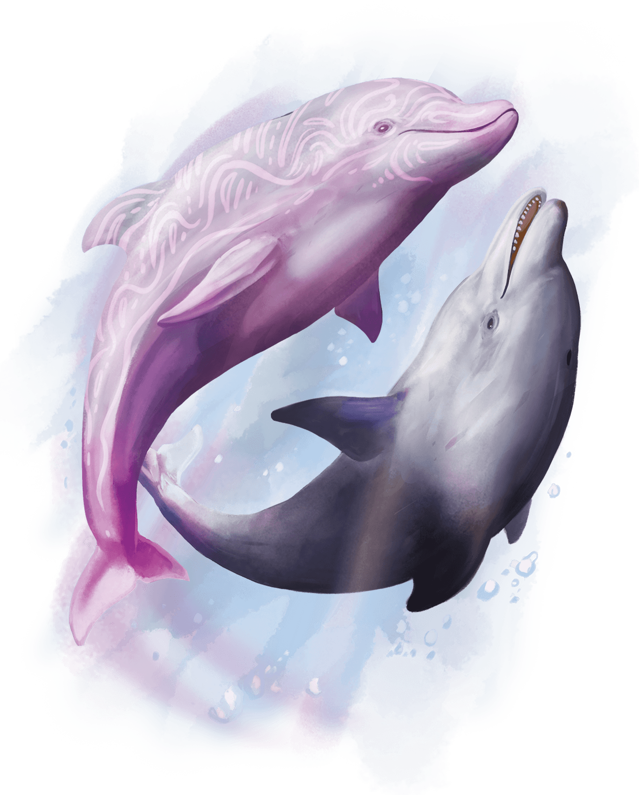

# Dolphins
Dolphins are clever, social marine mammals that feed on small fish and squid. An adult specimen is between 5 and 6 feet long.

> Jump to: [Dolphin](Dolphins.md#dolphin) | [Dolphin Delighter](Dolphins.md#dolphin-delighter)

---

## Dolphin
Dolphins are symbols of wisdom and playfulness among the sea folk of many worlds. Found in oceans and in the Elemental Plane of Water, dolphins are befriended by druids and rangers, and many tales speak of dolphins that appeared out of nowhere to protect swimmers from sharks and other aquatic predators.

### Environment
Underwater

### Token

>### Dolphin
>*Medium beast, Unaligned*
>___
>- **Armor Class** 12 (natural armor)
>- **Hit Points** 11 (2d8 + 2)
>- **Speed** 0 ft., swim 60 ft.
>___
>|**STR**|**DEX**|**CON**|**INT**|**WIS**|**CHA**|
>|:---:|:---:|:---:|:---:|:---:|:---:|
>|14 (+2)|13 (+1)|13 (+1)|6 (-2)|12 (+1)|7 (-2)|
>
>___
>- **Proficiency Bonus** +2
>- **Saving Throws** 
>- **Damage Vulnerabilities** 
>- **Damage Resistances** 
>- **Damage Immunities** 
>- **Condition Immunities** 
>- **Skills** Perception +3
>- **Senses** blindsight 60 ft.,passive Perception 13
>- **Languages** --
>- **Challenge** 1/8
>___
>***Hold Breath.*** The dolphin can hold its breath for 20 minutes.
>
>#### Actions
>***Slam.*** Melee Weapon Attack: +4 to hit, reach 5 ft., one target. Hit: 5 (1d6 + 2) bludgeoning damage. If the dolphin moved at least 30 feet straight toward the target immediately before the hit, the target takes an extra 3 (1d6) bludgeoning damage.
>

---

## Dolphin Delighter
In the Feywild, dolphin delighters brighten the moods of those who travel the seas of the Domains of Delight. Telepathically singing sea chanteys, these dolphins leap and teleport through the luminous waters of Faerie and the Material Plane, and they are faithful allies to any who battle the forces of gloom and brutality under the waves.

Dolphin delighters often accompany groups of sea elves, tritons, and tortles as guardians and friends.

### Environment
Underwater

### Token

>### Dolphin Delighter
>*Medium fey, Typically Chaotic Good*
>___
>- **Armor Class** 14 (natural armor)
>- **Hit Points** 27 (5d8 + 5)
>- **Speed** 0 ft., swim 60 ft.
>___
>|**STR**|**DEX**|**CON**|**INT**|**WIS**|**CHA**|
>|:---:|:---:|:---:|:---:|:---:|:---:|
>|14 (+2)|13 (+1)|13 (+1)|11 (+0)|12 (+1)|16 (+3)|
>
>___
>- **Proficiency Bonus** +2
>- **Saving Throws** Wis +3,Cha +5
>- **Damage Vulnerabilities** 
>- **Damage Resistances** 
>- **Damage Immunities** 
>- **Condition Immunities** 
>- **Skills** Perception +3,Performance +5
>- **Senses** blindsight 60 ft.,passive Perception 13
>- **Languages** Aquan,telepathy 120 ft.
>- **Challenge** 3
>___
>***Hold Breath.*** The dolphin can hold its breath for 20 minutes.
>
>#### Actions
>***Multiattack.*** The dolphin makes two Dazzling Slam attacks.
>
>***Dazzling Slam.*** Melee Weapon Attack: +4 to hit, reach 5 ft., one target. Hit: 5 (1d6 + 2) bludgeoning damage plus 7 (2d6) psychic damage, and the target is blinded until the start of the dolphin's next turn.
>
>#### Bonus Actions
>***Delightful Light (Recharge 5�6).*** The dolphin magically emanates light in a 10-foot radius for a moment. The dolphin and each creature of its choice in that light gain 11 (2d10) temporary hit points.
>
>***Fey Leap.*** The dolphin teleports up to 30 feet to an unoccupied space it can see. Immediately before teleporting, the dolphin can choose one creature within 5 feet of it. That creature can teleport with the dolphin, appearing in an unoccupied space within 5 feet of the dolphin's destination space.
>

