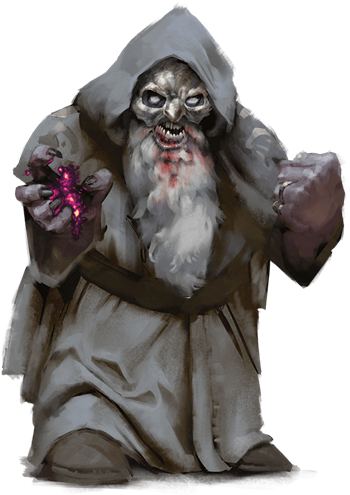
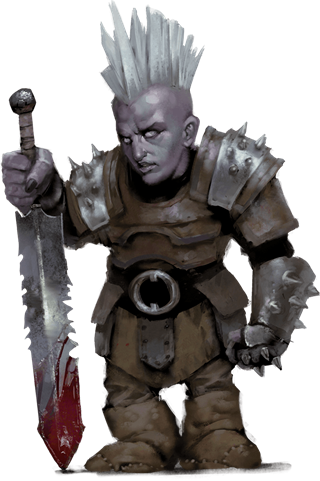

# Duergar
Duergar are dwarves of the deep reaches of the Underdark and other sunless realms. Their personalities and abilities have been deeply impacted by their ancestors' captivity and torment by mind flayers; they were infused with powerful psionic abilities but also a profound gloom. In some, this strain of sorrow inspires works of grand but melancholic beauty, while in others, it manifests as rage. Most duergar (including females) are bald and have ashen gray skin. They wear drab clothing designed to blend in with stone, along with simple jewelry that reflects their severe and utilitarian demeanor.

> Jump to: [Duergar](Duergar.md#duergar-1) | [Duergar Despot](#duergar-despot) | [Duergar Kavalrachni](#duergar-kavalrachni) | [Duergar Mind Master](#duergar-mind-master) | [Duergar Soulblade](#duergar-soulblade) | [Duergar Stone Guard](#duergar-stone-guard) | [Duergar Warlord](#duergar-warlord) | [Duergar Xarrorn](#duergar-xarrorn)

Like many who dwell in the Underdark, duergar must constantly be on guard against the raids and plots of their neighbors. To this end, duergar warriors fulfill a variety of combat roles, often marrying their fury in battle with their psionic abilities or training dangerous Underdark creatures as mounts.

Denigrated by some as joyless, duergar are in fact deeply passionate in all that they do--even if that passion rarely manifests as mirth. They bring an emotional intensity to their lives, whether they're exploring neighboring tunnels, defending their homes, engaging with their families, or crafting bold new works. The bonds of friendship and kinship are strong, though navigating the inevitable outbursts of frustration and despair is not always easy. Similarly, duergar tend to be very community-minded--in the Underdark, all must cooperate to survive.

Among the duergar, creation is a fiercely passionate process. They tend to favor works that are sturdy and grand, but in a bare, stripped-down fashion that favors geometric forms. The strongholds they design are blocky and stark, and the weapons they forge are blatantly tools of violence. While others may decry their creations as cold and bare of ornamentation to the point of austerity, duergar see them as honoring the materials used and honest about their purpose.

***Tough as Stone.*** Like dwarves, duergar have strong constitutions. Adding to their physical stamina is an incredible mental fortitude resulting from their time as captives of the illithids. A duergar's mind is a fortress, able to shrug off charms, illusions, and other spells.

***Born of Darkness.*** The Underdark is saturated with strange magical power, which the duergar absorbed over generations of imprisonment. A duergar can increase its size and strength for a short time, becoming a powerful ogre-sized warrior. If it faces a foe it can't fight, or when spying on creatures approaching its territory, it can just as easily become invisible to slip away into the darkness.

Eons spent in the Underdark also sharpened their darkvision, allowing them to see twice as far as other dwarves. This keen eyesight comes at a cost, however, as a duergar's vision is compromised by sunlight.

***Infernal Master.*** Asmodeus, Lord of the Nine Hells, has been known to impersonate duergar gods in order to cultivate the evil brimming in the hearts of the gray dwarves. He offers them divine guidance and vengeance against their enemies while urging them on toward greater acts of tyranny, all the while concealing his true identity.

***Playable Race: Masters of Stealth.*** The [dark dwarves](../Races/Dwarves/Dark.md) are not all evil, and some clans have come to embrace that Asmodeus' interests are not their own. They embrace careers that allow them to stay close to the shadows, such as rogues, or deepen their ties to magic, such as shamans, sorcerers and wizards; some few embrace their dark side even as they seek the better path, and become pale masters.

---

## Duergar 
(No description given)

### Environment
Underdark

### Token

>### Duergar
>*Medium humanoid (dwarf), lawful evil*
>___
>- **Armor Class** 16 (scale mail, shield)
>- **Hit Points** 26 (4d8 + 8)
>- **Speed** 25 ft.
>___
>|**STR**|**DEX**|**CON**|**INT**|**WIS**|**CHA**|
>|:---:|:---:|:---:|:---:|:---:|:---:|
>|14 (+2)|11 (+0)|14 (+2)|11 (+0)|10 (+0)|9 (-1)|
>
>___
>- **Proficiency Bonus** +2
>- **Saving Throws** 
>- **Damage Vulnerabilities** 
>- **Damage Resistances** poison
>- **Damage Immunities** 
>- **Condition Immunities** 
>- **Skills** 
>- **Senses** darkvision 120 ft.,passive Perception 10
>- **Languages** Dwarvish,Undercommon
>- **Challenge** 1
>___
>***Duergar Resilience.*** The duergar has advantage on saving throws against poison, spells, and illusions, as well as to resist being charmed or paralyzed.
>
>***Sunlight Sensitivity.*** While in sunlight, the duergar has disadvantage on attack rolls, as well as on Wisdom (Perception) checks that rely on sight.
>
>#### Actions
>***Enlarge (1/Short Rest).*** For 1 minute, the duergar magically increases in size, along with anything it is wearing or carrying. While enlarged, the duergar is Large, doubles its damage dice on Strength-based weapon attacks (included in the attacks), and makes Strength checks and Strength saving throws with advantage. If the duergar lacks the room to become Large, it attains the maximum size possible in the space available.
>
>***Invisibility (1/Short Rest).*** The duergar magically turns invisible until it attacks, casts a spell, or uses its Enlarge, or until its concentration is broken, up to 1 hour (as if concentrating on a spell). Any equipment the duergar wears or carries is invisible with it.
>
>***War Pick.*** Melee Weapon Attack: +4 to hit, reach 5 ft., one target. Hit: 6 (1d8 + 2) piercing damage, or 11 (2d8 + 2) piercing damage while enlarged.
>
>***Javelin.*** Melee or Ranged Weapon Attack: +4 to hit, reach 5 ft. or range 30/120 ft., one target. Hit: 5 (1d6 + 2) piercing damage, or 9 (2d6 + 2) piercing damage while enlarged.
>

---

## Duergar Despot
Duergar despots replace parts of their bodies with mechanical devices that they control through their psionic abilities.

### Environment
Underdark

### Token

>### Duergar Despot
>*Medium humanoid  (Dwarf), Any Alignment*
>___
>- **Armor Class** 21 (natural armor)
>- **Hit Points** 119 (14d8 + 56)
>- **Speed** 25 ft.
>___
>|**STR**|**DEX**|**CON**|**INT**|**WIS**|**CHA**|
>|:---:|:---:|:---:|:---:|:---:|:---:|
>|20 (+5)|5 (-3)|19 (+4)|15 (+2)|14 (+2)|13 (+1)|
>___
>- **Proficiency Bonus** +4
>- **Saving Throws** Con +8,Wis +6
>- **Damage Vulnerabilities**
>- **Damage Resistances**
>- **Damage Immunities** poison
>- **Condition Immunities** charmed,exhaustion,frightened,paralyzed,poisoned
>- **Skills**
>- **Senses** darkvision 120 ft.,passive Perception 12
>
>- **Languages** Dwarvish,Undercommon
>
>- **Challenge** 12
>
>___
>***Magic Resistance.*** The duergar has advantage on saving throws against spells and other magical effects.
>
>***Psychic Engine.*** When the duergar suffers a critical hit or is reduced to 0 hit points, psychic energy erupts from its frame to deal 14 (4d6) psychic damage to each creature within 5 feet of it.
>
>***Sunlight Sensitivity.*** While in sunlight, the duergar has disadvantage on attack rolls, as well as on Wisdom (Perception) checks that rely on sight.
>
>#### Actions
>***Multiattack.*** The duergar makes two Iron Fist attacks and two Stomping Foot attacks. After one of the attacks, the duergar can move up to its speed without provoking opportunity attacks. It can replace one of the attacks with a use of Flame Jet.
>
>***Iron Fist.*** Melee Weapon Attack: +9 to hit, reach 5 ft., one target. Hit: 23 (4d8 + 5) bludgeoning damage. If the target is a Large or smaller creature, it must succeed on a DC 17 Strength saving throw or be pushed up to 30 feet away in a straight line and be knocked prone.
>
>***Stomping Foot.*** Melee Weapon Attack: +9 to hit, reach 5 ft., one target. Hit: 10 (1d10 + 5) bludgeoning damage, or 21 (3d10 + 5) to a prone target.
>
>***Flame Jet.*** The duergar spews flames in a line 100 feet long and 5 feet wide. Each creature in the line must make a DC 16 Dexterity saving throw, taking 18 (4d8) fire damage on a failed save, or half as much damage on a successful one.
>
>***Spellcasting (Psionics).*** The duergar casts one of the following spells, requiring no spell components and using Intelligence as the spellcasting ability (spell save DC 12):
>
>* *At will:* mage hand, minor illusion
>* *1/day:* stinking cloud
>

---

## Duergar Kavalrachni
Kavalrachni are duergar cavalry trained to fight while riding female steeders (in this book) or other Underdark creatures as mounts.

### Environment
Underdark

### Token

>### Duergar Kavalrachni
>*Medium humanoid  (Dwarf), Any Alignment*
>___
>- **Armor Class** 16 (scale mail, shield)
>- **Hit Points** 26 (4d8 + 8)
>- **Speed** 25 ft.
>___
>|**STR**|**DEX**|**CON**|**INT**|**WIS**|**CHA**|
>|:---:|:---:|:---:|:---:|:---:|:---:|
>|14 (+2)|11 (+0)|14 (+2)|11 (+0)|10 (+0)|9 (-1)|
>___
>- **Proficiency Bonus** +2
>- **Saving Throws**
>- **Damage Vulnerabilities**
>- **Damage Resistances** poison
>- **Damage Immunities**
>- **Condition Immunities**
>- **Skills**
>- **Senses** darkvision 120 ft.,passive Perception 10
>- **Languages** Dwarvish,Undercommon
>- **Challenge** 2
>___
>***Cavalry Training.*** When the duergar hits a target with a melee attack while mounted, the mount can use its reaction to make one melee attack against the same target.
>
>***Duergar Resilience.*** The duergar has advantage on saving throws against spells and the charmed, paralyzed, and poisoned conditions.
>
>***Sunlight Sensitivity.*** While in sunlight, the duergar has disadvantage on attack rolls, as well as on Wisdom (Perception) checks that rely on sight.
>
>#### Actions
>***Multiattack.*** The duergar makes two War Pick attacks.
>
>***War Pick.*** Melee Weapon Attack: +4 to hit, reach 5 ft., one target. Hit: 6 (1d8 + 2) piercing damage plus 5 (2d4) poison damage.
>
>***Heavy Crossbow.*** Ranged Weapon Attack: +2 to hit, range 100/400 ft., one target. Hit: 5 (1d10) piercing damage.
>
>***Shared Invisibility (Recharges after a Short or Long Rest).*** The duergar magically turns invisible for up to 1 hour or until it attacks, it forces a creature to make a saving throw, or its concentration is broken (as if concentrating on a spell). Any equipment the duergar wears or carries is invisible with it. While the invisible duergar is mounted, the mount is invisible as well. The invisibility ends early on the mount immediately after it attacks.
>

---

## Duergar Mind Master
Wearing fearsome masks, duergar mind masters usually operate as spies, both inside and beyond a duergar stronghold. Their psionically augmented abilities enable them to see through illusions with ease and shrink down to miniature size to spy on their targets.

### Environment
Underdark

### Token

>### Duergar Mind Master
>*Medium humanoid  (Dwarf), Any Alignment*
>___
>- **Armor Class** 14 (leather armor)
>- **Hit Points** 39 (6d8 + 12)
>- **Speed** 25 ft.
>___
>|**STR**|**DEX**|**CON**|**INT**|**WIS**|**CHA**|
>|:---:|:---:|:---:|:---:|:---:|:---:|
>|11 (+0)|17 (+3)|14 (+2)|15 (+2)|10 (+0)|12 (+1)|
>___
>- **Proficiency Bonus** +2
>- **Saving Throws** Wis +2
>- **Damage Vulnerabilities**
>- **Damage Resistances** poison
>- **Damage Immunities**
>- **Condition Immunities**
>- **Skills** Perception +2,Stealth +5
>- **Senses** darkvision 120 ft.,truesight 30 ft.,passive Perception 12
>- **Languages** Dwarvish,Undercommon
>- **Challenge** 2
>___
>***Duergar Resilience.*** The duergar has advantage on saving throws against spells and the charmed, paralyzed, and poisoned conditions.
>
>***Sunlight Sensitivity.*** While in sunlight, the duergar has disadvantage on attack rolls, as well as on Wisdom (Perception) checks that rely on sight.
>
>#### Actions
>***Multiattack.*** The duergar makes two Mind-Poison Dagger attacks. It can replace one attack with a use of Mind Mastery.
>
>***Mind-Poison Dagger.*** Melee Weapon Attack: +5 to hit, reach 5 ft., one target. Hit: 5 (1d4 + 3) piercing damage plus 10 (3d6) psychic damage, or 1 piercing damage plus 10 (3d6) psychic damage while under the effect of Reduce.
>
>***Invisibility (Recharge 4-6).*** The duergar magically turns invisible for up to 1 hour or until it attacks, it forces a creature to make a saving throw, or its concentration is broken (as if concentrating on a spell). Any equipment the duergar wears or carries is invisible with it.
>
>***Mind Mastery.*** The duergar targets one creature it can see within 60 feet of it. The target must succeed on a DC 12 Intelligence saving throw, or the duergar causes it to use its reaction, if available, either to make one weapon attack against another creature the duergar can see or to move up to 10 feet in a direction of the duergar's choice. Creatures that can't be charmed are immune to this effect.
>
>#### Bonus Actions
>***Reduce (Recharges after a Short or Long Rest).*** For 1 minute, the duergar magically decreases in size, along with anything it is wearing or carrying. While reduced, the duergar is Tiny, reduces its weapon damage to 1, and makes attack rolls, ability checks, and saving throws with disadvantage if they use Strength. It gains a +5 bonus to all Dexterity (Stealth) checks and a +5 bonus to its AC. It can also take a bonus action on each of its turns to take the Hide action.
>

---

## Duergar Soulblade
Soulblades are duergar combatants whose mastery of psionics allows them to manifest blades of psychic energy to slice apart their foes.

### Environment
Underdark

### Token

>### Duergar Soulblade
>*Medium humanoid  (Dwarf), Any Alignment*
>___
>- **Armor Class** 14 (leather armor)
>- **Hit Points** 27 (6d8)
>- **Speed** 25 ft.
>___
>|**STR**|**DEX**|**CON**|**INT**|**WIS**|**CHA**|
>|:---:|:---:|:---:|:---:|:---:|:---:|
>|16 (+3)|16 (+3)|10 (+0)|11 (+0)|10 (+0)|12 (+1)|
>___
>- **Proficiency Bonus** +2
>- **Saving Throws**
>- **Damage Vulnerabilities**
>- **Damage Resistances** poison
>- **Damage Immunities**
>- **Condition Immunities**
>- **Skills**
>- **Senses** darkvision 120 ft.,passive Perception 10
>- **Languages** Dwarvish,Undercommon
>- **Challenge** 1
>___
>***Duergar Resilience.*** The duergar has advantage on saving throws against spells and the charmed, paralyzed, and poisoned conditions.
>
>***Sunlight Sensitivity.*** While in sunlight, the duergar has disadvantage on attack rolls, as well as on Wisdom (Perception) checks that rely on sight.
>
>#### Actions
>***Soulblade.*** Melee Weapon Attack: +5 to hit, reach 5 ft., one target. Hit: 10 (2d6 + 3) force damage, or 17 (4d6 + 3) force damage while under the effect of Enlarge.
>
>***Invisibility (Recharges after a Short or Long Rest).*** The duergar magically turns invisible for up to 1 hour or until it attacks, it forces a creature to make a saving throw, or its concentration is broken (as if concentrating on a spell). Any equipment the duergar wears or carries is invisible with it.
>
>#### Bonus Actions
>***Enlarge (Recharges after a Short or Long Rest).*** For 1 minute, the duergar magically increases in size, along with anything it is wearing or carrying. While enlarged, the duergar is Large, doubles its damage dice on Strength-based weapon attacks (included in the attacks), and makes Strength checks and Strength saving throws with advantage. If the duergar lacks the room to become Large, it attains the maximum size possible in the space available.
>

---

## Duergar Stone Guard
Stone guards are elite troops deployed in small numbers to bolster war bands of regulars or organized into elite strike forces for specific missions.

### Environment
Underdark

### Token

>### Duergar Stone Guard
>*Medium humanoid  (Dwarf), Any Alignment*
>___
>- **Armor Class** 18 (chain mail, shield)
>- **Hit Points** 39 (6d8 + 12)
>- **Speed** 25 ft.
>___
>|**STR**|**DEX**|**CON**|**INT**|**WIS**|**CHA**|
>|:---:|:---:|:---:|:---:|:---:|:---:|
>|18 (+4)|11 (+0)|14 (+2)|11 (+0)|10 (+0)|9 (-1)|
>___
>- **Proficiency Bonus** +2
>- **Saving Throws**
>- **Damage Vulnerabilities**
>- **Damage Resistances** poison
>- **Damage Immunities**
>- **Condition Immunities**
>- **Skills**
>- **Senses** darkvision 120 ft.,passive Perception 10
>- **Languages** Dwarvish,Undercommon
>- **Challenge** 2
>___
>***Duergar Resilience.*** The duergar has advantage on saving throws against spells and the charmed, paralyzed, and poisoned conditions.
>
>***Phalanx Formation.*** The duergar has advantage on attack rolls and Dexterity saving throws while standing within 5 feet of an ally wielding a shield.
>
>***Sunlight Sensitivity.*** While in sunlight, the duergar has disadvantage on attack rolls, as well as on Wisdom (Perception) checks that rely on sight.
>
>#### Actions
>***Multiattack.*** The duergar makes two Shortsword or Javelin attacks.
>
>***Shortsword.*** Melee Weapon Attack: +6 to hit, reach 5 ft., one target. Hit: 7 (1d6 + 4) piercing damage, or 11 (2d6 + 4) piercing damage while under the effect of Enlarge.
>
>***Javelin.*** Melee or Ranged Weapon Attack: +6 to hit, reach 5 ft. or range 30/120 ft., one target. Hit: 7 (1d6 + 4) piercing damage, or 11 (2d6 + 4) piercing damage while under the effect of Enlarge.
>
>***Invisibility (Recharges after a Short or Long Rest).*** The duergar magically turns invisible for up to 1 hour or until it attacks, it forces a creature to make a saving throw, or its concentration is broken (as if concentrating on a spell). Any equipment the duergar wears or carries is invisible with it.
>
>#### Bonus Actions
>***Enlarge (Recharges after a Short or Long Rest).*** For 1 minute, the duergar magically increases in size, along with anything it is wearing or carrying. While enlarged, the duergar is Large, doubles its damage dice on Strength-based weapon attacks (included in the attacks), and makes Strength checks and Strength saving throws with advantage. If the duergar lacks the room to become Large, it attains the maximum size possible in the space available.
>

---

## Duergar Warlord
A warlord is cunning, inspiring, and merciless in equal parts. A skilled leader in battle, the warlord can use spikes of psionic energy to compel the warriors they command to fight harder.

### Environment
Underdark

### Token

>### Duergar Warlord
>*Medium humanoid  (Dwarf), Any Alignment*
>___
>- **Armor Class** 20 (plate mail, shield)
>- **Hit Points** 75 (10d8 + 30)
>- **Speed** 25 ft.
>___
>|**STR**|**DEX**|**CON**|**INT**|**WIS**|**CHA**|
>|:---:|:---:|:---:|:---:|:---:|:---:|
>|18 (+4)|11 (+0)|17 (+3)|12 (+1)|12 (+1)|14 (+2)|
>___
>- **Proficiency Bonus** +3
>- **Saving Throws**
>- **Damage Vulnerabilities**
>- **Damage Resistances** poison
>- **Damage Immunities**
>- **Condition Immunities**
>- **Skills**
>- **Senses** darkvision 120 ft.,passive Perception 11
>- **Languages** Dwarvish,Undercommon
>- **Challenge** 6
>___
>***Duergar Resilience.*** The duergar has advantage on saving throws against spells and the charmed, paralyzed, and poisoned conditions.
>
>***Sunlight Sensitivity.*** While in sunlight, the duergar has disadvantage on attack rolls, as well as on Wisdom (Perception) checks that rely on sight.
>
>#### Actions
>***Multiattack.*** The duergar makes three Psychic-Attuned Hammer or Javelin attacks and uses Call to Attack.
>
>***Psychic-Attuned Hammer.*** Melee Weapon Attack: +7 to hit, reach 5 ft., one target. Hit: 9 (1d10 + 4) bludgeoning damage, or 15 (2d10 + 4) bludgeoning damage while under the effect of Enlarge, plus 5 (1d10) psychic damage.
>
>***Javelin.*** Melee or Ranged Weapon Attack: +7 to hit, reach 5 ft. or range 30/120 ft., one target. Hit: 7 (1d6 + 4) piercing damage, or 11 (2d6 + 4) piercing damage while under the effect of Enlarge.
>
>***Call to Attack.*** Up to three allies within 120 feet of this duergar that can hear it can each use their reaction to make one weapon attack.
>
>***Invisibility (Recharge 4-6).*** The duergar magically turns invisible for up to 1 hour or until it attacks, it forces a creature to make a saving throw, or its concentration is broken (as if concentrating on a spell). Any equipment the duergar wears or carries is invisible with it.
>
>#### Bonus Actions
>***Enlarge (Recharges after a Short or Long Rest).*** For 1 minute, the duergar magically increases in size, along with anything it is wearing or carrying. While enlarged, the duergar is Large, doubles its damage dice on Strength-based weapon attacks (included in the attacks), and makes Strength checks and Strength saving throws with advantage. If the duergar lacks the room to become Large, it attains the maximum size possible in the space available.
>
>#### Reactions
>***Scouring Instruction.*** When an ally that the duergar can see makes a d20 roll, the duergar can roll a d6, and the ally can add the number rolled to the d20 by taking 3 (1d6) psychic damage.
>

---

## Duergar Xarrorn
Xarrorn are specialists who construct weapons using a mixture of alchemy and psionics.

### Environment
Underdark

### Token

>### Duergar Xarrorn
>*Medium humanoid  (Dwarf), Any Alignment*
>___
>- **Armor Class** 18 (plate mail)
>- **Hit Points** 26 (4d8 + 8)
>- **Speed** 25 ft.
>___
>|**STR**|**DEX**|**CON**|**INT**|**WIS**|**CHA**|
>|:---:|:---:|:---:|:---:|:---:|:---:|
>|16 (+3)|11 (+0)|14 (+2)|11 (+0)|10 (+0)|9 (-1)|
>___
>- **Proficiency Bonus** +2
>- **Saving Throws**
>- **Damage Vulnerabilities**
>- **Damage Resistances** poison
>- **Damage Immunities**
>- **Condition Immunities**
>- **Skills**
>- **Senses** darkvision 120 ft.,passive Perception 10
>- **Languages** Dwarvish,Undercommon
>- **Challenge** 2
>___
>***Duergar Resilience.*** The duergar has advantage on saving throws against spells and the charmed, paralyzed, and poisoned conditions.
>
>***Sunlight Sensitivity.*** While in sunlight, the duergar has disadvantage on attack rolls, as well as on Wisdom (Perception) checks that rely on sight.
>
>#### Actions
>***Fire Lance.*** Melee Weapon Attack: +5 to hit, reach 10 ft., one target. Hit: 9 (1d12 + 3) piercing damage, or 16 (2d12 + 3) piercing damage while under the effect of Enlarge, plus 3 (1d6) fire damage.
>
>***Fire Spray (Recharge 5-6).*** From its fire lance, the duergar shoots a 15-foot cone of fire or a line of fire 30 feet long and 5 feet wide. Each creature in that area must make a DC 12 Dexterity saving throw, taking 10 (3d6) fire damage on a failed save, or half as much damage on a successful one.
>
>***Invisibility (Recharges after a Short or Long Rest).*** The duergar magically turns invisible for up to 1 hour or until it attacks, it forces a creature to make a saving throw, or its concentration is broken (as if concentrating on a spell). Any equipment the duergar wears or carries is invisible with it.
>
>#### Bonus Actions
>***Enlarge (Recharges after a Short or Long Rest).*** For 1 minute, the duergar magically increases in size, along with anything it is wearing or carrying. While enlarged, the duergar is Large, doubles its damage dice on Strength-based weapon attacks (included in the attacks), and makes Strength checks and Strength saving throws with advantage. If the duergar lacks the room to become Large, it attains the maximum size possible in the space available.
>
