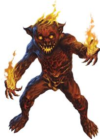
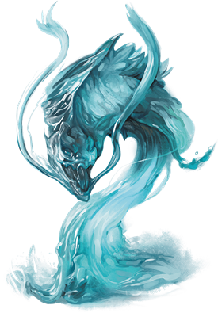

# Elemental Servants
Powerful magic can bind an elemental spirit into a material template that defines a specific use and function. Invisible stalkers are air elementals bound to a specific form, in the same way that water elementals can be shaped into water weirds. Some servants can be found in these forms already, such as the galeb durh, who often prefer these forms once they have come to be.

> Jump to: [Galeb Duhr](#galeb-duhr) | [Invisible Stalker](#invisible-stalker) | [Magmin](#magmin) | [Sand Assassin](#sand-assassin) | [Water Weird](#water-weird)

***Elemental Nature.*** An elemental servant doesn't require air, food, drink, or sleep.

---

## Galeb Duhr
The galeb duhr is a boulder-like creature with stumpy appendages that act as arms and legs. It has the ability to animate the rocks and boulders around it, and is thus usually encountered in rocky terrain.

Powerful magic allows a spellcaster to summon a galeb duhr from the Plane of Earth. Some galeb duhr also form naturally in places touched by that plane. The galeb duhr is imbued with greater intelligence than most elementals, allowing it to better assess threats and to communicate with creatures entering its guarded area.

***Stone Guardian.*** A galeb duhr doesn't age or require sustenance, making it an excellent sentinel. A powerful druid might charge a galeb duhr with protecting a stone circle or sacred hilltop. Another galeb duhr might be created to guard an underground tomb or a wizard's tower. When it chooses to, the galeb duhr can make itself look like an ordinary boulder, remaining perfectly still for years at a time.

A galeb duhr is permanently bound to the Material Plane, so that when it dies, it doesn't return to the Plane of Earth. It has an excellent memory and is more than happy to share information regarding its environment with creatures it doesn't regard as threats.

***Stone Connection.*** A galeb duhr can become one with the earth around it, allowing it to imbue nearby rocks and boulders with a semblance of life. The galeb duhr uses its animated boulders to frighten away interlopers and defend whatever it has been charged to protect. When it needs to move close to those intruders, it presses its limbs tight to its body and rolls forward at a furious pace.

>### Galeb Duhr
>*Medium elemental, neutral*
>___
>- **Armor Class** 16 (natural armor)
>- **Hit Points** 85 (9d8 + 45)
>- **Speed** 15 ft. (30 ft. when rolling, 60 ft. rolling downhill)
>___
>|**STR**|**DEX**|**CON**|**INT**|**WIS**|**CHA**|
>|:---:|:---:|:---:|:---:|:---:|:---:|
>|20 (+5)|14 (+2)|20 (+5)|11 (+0)|12 (+1)|11 (+0)|
>
>___
>- **Proficiency Bonus** +3
>- **Saving Throws** 
>- **Damage Vulnerabilities** 
>- **Damage Resistances** bludgeoning,piercing,and slashing from nonmagical attacks
>- **Damage Immunities** poison
>- **Condition Immunities** exhaustion,paralyzed,poisoned,petrified
>- **Skills** 
>- **Senses** darkvision 60 ft.,tremorsense 60 ft.,passive Perception 11
>- **Languages** Terran
>- **Challenge** 6
>___
>***False Appearance.*** While the galeb duhr remains motionless, it is indistinguishable from a normal boulder.
>
>***Rolling Charge.*** If the galeb duhr rolls at least 20 feet straight toward a target and then hits it with a slam attack on the same turn, the target takes an extra 7 (2d6) bludgeoning damage. If the target is a creature, it must succeed on a DC 16 Strength saving throw or be knocked prone.
>
>#### Actions
>***Slam.*** Melee Weapon Attack: +8 to hit, reach 5 ft., one target. Hit: 12 (2d6 + 5) bludgeoning damage.
>
>***Animate Boulders (1/Day).*** The galeb duhr magically animates up to two boulders it can see within 60 feet of it. A boulder has statistics like those of a galeb duhr, except it has Intelligence 1 and Charisma 1, it can't be charmed or frightened, and it lacks this action option. A boulder remains animated as long as the galeb duhr maintains concentration, up to 1 minute (as if concentrating on a spell).
>

---

## Invisible Stalker
An invisible stalker is an air elemental that has been summoned from its native plane and transformed by powerful magic. Its sole purpose is to hunt down creatures and retrieve objects for its summoner. When it is defeated or the magic that binds it expires, an invisible stalker vanishes in a gust of wind.

***Directed Hunter.*** When an invisible stalker is created, it stays at its summoner's side until it is given a task to perform. If an assignment doesn't involve hunting down and slaying a specific creature or recovering an object, the magic that created the invisible stalker ends and the elemental is released. Otherwise, it completes the task, then returns to its summoner for more commands, forced to serve until the magic that binds it expires. If its summoner dies in the interim, the invisible stalker vanishes after completing its task.

Most invisible stalkers are an unwilling servant at best, and resent any undertaking assigned. A mission that requires significant time might drive the invisible stalker to pervert the intent of a command unless it is worded carefully. Rumors persist of some invisible stalkers that enjoy the hunt, and choose to remain on the Prime Material Plane even after their task is finished, listening for additional calls (summoning spells) to answer. Such stalkers tend to develop an alignment other than neutral, depending on their feelings about the hunt.

***Unseen Threat.*** Invisible stalkers are composed of air and are naturally invisible. A creature might hear and feel an invisible stalker in passing, but the elemental remains invisible even when it attacks. A spell that allows someone to see the invisible reveals only the invisible stalker's vague outline.

>### Invisible Stalker
>*Medium elemental, neutral*
>___
>- **Armor Class** 14 (natural armor)
>- **Hit Points** 104 (16d8 + 32)
>- **Speed** 50 ft., fly 50 ft. (hover)
>___
>|**STR**|**DEX**|**CON**|**INT**|**WIS**|**CHA**|
>|:---:|:---:|:---:|:---:|:---:|:---:|
>|16 (+3) | 19 (+4) | 14 (+2) | 10 (+0) | 15 (+2) | 11 (+0)|
>
>___
>- **Proficiency Bonus** +3
>- **Saving Throws** 
>- **Damage Vulnerabilities** 
>- **Damage Resistances** bludgeoning, piercing, and slashing from nonmagical attacks
>- **Damage Immunities** poison
>- **Condition Immunities** exhaustion, grappled, paralyzed, petrified, poisoned, prone, restrained, unconscious
>- **Skills** Perception +8, Stealth +10
>- **Senses** darkvision 60 ft., passive Perception 18
>- **Languages** Auran, understands Common but doesn't speak it
>- **Challenge** 6
>___
>***Invisibility.*** The stalker is invisible.
>
>***Faultless Tracker.*** The stalker is given a quarry by its summoner. The stalker knows the direction and distance to its quarry as long as the two of them are on the same plane of existence. The stalker also knows the location of its summoner.
>
>### Actions
>***Multiattack.*** The stalker makes two Slam attacks.
>
>***Slam.*** Melee Weapon Attack: +6 to hit, reach 5 ft., one target. Hit: 10 (2d6 + 3) bludgeoning damage.

---

## Magmin
A grinning, mischievous magmin resembles a stumpy humanoid sculpted from a black shell of magma. Even when it isn't ablaze and radiating heat like a bonfire, small jets of flame erupt from its porous skin.

***Summoned Pyromaniacs.*** Magmins are fire elemental essence bound into physical form by magic, and they appear in the Material Plane only when summoned. It takes little time for them to develop personalities, and those personalities tend to be pyromaniacal. They view flammable objects as kindling for a grand conflagration, and only the magical control exerted by their summoners keeps them from setting everything they touch ablaze. Their propensity for fire and havoc makes them ideal for spreading chaos and destruction. A mob of magmins summoned inside a castle can reduce it to a burning shell within minutes.

***Fiery Destruction.*** Although its flame is potent, the magmin's hard magma shell prevents it from instantly igniting everything it comes into contact with. However, like the fires inside them, magmins are capricious and unpredictable. Moreover, as simple elemental creations, they are oblivious to the harm their native element causes creatures of the Material Plane.

If it has the opportunity while in service to its master, a magmin seeks out areas of great heat, such as forest fires or the bubbling magma of an active volcano. At other times, a magmin compulsively looses fire from its fingertips, delighting in setting objects ablaze.

>### Magmin
>*Small elemental, chaotic neutral*
>___
>- **Armor Class** 14 (natural armor)
>- **Hit Points** 9 (2d6 + 2)
>- **Speed** 30 ft.
>___
>|**STR**|**DEX**|**CON**|**INT**|**WIS**|**CHA**|
>|:---:|:---:|:---:|:---:|:---:|:---:|
>|7 (−2) | 15 (+2) | 12 (+1) | 8 (−1) | 11 (+0) | 10 (+0)|
>
>___
>- **Proficiency Bonus** +2
>- **Saving Throws** 
>- **Damage Vulnerabilities** 
>- **Damage Resistances** bludgeoning, piercing, and slashing from nonmagical attacks
>- **Damage Immunities** fire
>- **Senses** darkvision 60 ft., passive Perception 10
>- **Languages** Ignan
>- **Challenge** 1/2
>___
>***Feature.***   
>
>***Death Burst.*** When the magmin dies, it explodes in a burst of fire and magma. Each creature within 10 feet of it must make a DC 11 Dexterity saving throw, taking 7 (2d6) fire damage on a failed save, or half as much damage on a successful one. Flammable objects that aren't being worn or carried in that area are ignited.
>
>***Ignited Illumination.*** As a bonus action, the magmin can set itself ablaze or extinguish its flames. While ablaze, the magmin sheds bright light in a 10-foot radius and dim light for an additional 10 feet.
>
>### Actions
>***Touch.*** Melee Weapon Attack: +4 to hit, reach 5 ft., one target. Hit: 7 (2d6) fire damage. If the target is a creature or a flammable object, it ignites. Until a creature takes an action to douse the fire, the creature takes 3 (1d6) fire damage at the end of each of its turns.

---

## Sand Assassin
When a mage or other summoner binds air and earth elemental essence into a guardian and charges it to guard a particular place, often a sand assassin is what forms. Sand assassins then are bound to guard a stretch of land for eternity, hunting down and slaying all those who trespass upon their charge. These elementals sometimes come to decide that a particular place is worthy of protection for inscrutable reasons of their own, but usually they are bound by the one who summoned them, often someone long-dead such as a long-forgotten resident of ancient ruins buried in a canyon or stretch of desert that the elemental still guards.

A sand assassin resembles an athletic human made entirely of sand usually with more sand shaped into cords or rags wrapping around it. With just a bit of dust or sand about, this unusually lawful elemental is easily mistaken from afar for a normal desert traveler, but a good look at its head reveals that it has no face, save for the one hollow eye in its forehead.

**Loyal Sentinels.** Often the elemental doesn't recall what it was in the location that it required protection, and rarely do they care to remember, either. For the sand assassin, the task is all that matters. Those that are slain by sand assassins are usually mistaken for victims of a sandstorm, and even those lucky few that escape the reaches of the elemental almost never know what it was, hidden beneath the sands, that they were warded away from.

**Ruthless Hunters.** Sand assassins detest being seen by those who have not yet trespassed and prefer to hide from such beings. In combat, this elemental tries to sneak up on its victims, hiding as a dust cloud or among a real sandstorm to approach its targets, then blinding them with its Sand Form trait before attacking them with surprise. It usually prefers to strike those that are alone so it can deal bonus damage. If it is in melee range with a target that isn't alone, the elemental will seek a target in the fight that is more alone, blinding those that threaten opportunity attacks and flying or burrowing to reach its next lonely victim. If its enemies stay grouped together to avoid the bonus damage, the sand assassin attempts to blind many targets at once instead.

>### Sand Assassin
>*Medium elemental (air/earth), lawful neutral*
>___
>- **Armor Class** 15 (natural armor)
>- **Hit Points** 117 (18d8 + 36)
>- **Speed** 60 ft., burrow 30 ft., fly 30 ft. (hover)
>___
>|**STR**|**DEX**|**CON**|**INT**|**WIS**|**CHA**|
>|:---:|:---:|:---:|:---:|:---:|:---:|
>|10 (+0)|20 (+5)|15 (+2)|9 (-2) |14 (+2)|12(+1)|
>
>___
>- **Proficiency Bonus** +4
>- **Saving Throws** Dex +9 
>- **Damage Vulnerabilities** 
>- **Damage Resistances** lightning; bludgeoning, piercing, and slashing from nonmagical weapons 
>- **Damage Immunities** poison 
>- **Condition Immunities** exhaustion, grappled, paralyzed, petrified, poisoned, prone, restrained, unconscious 
>- **Skills** Perception +6, Stealth +9 
>- **Senses** darkvision 60 ft., tremorsense 60 ft., passive Perception 10 
>- **Languages** Auran, Terran 
>- **Challenge** 9 
>___
>***Sand Form.*** The sand assassin can move through a space as narrow as 1 inch wide without squeezing. In addition, the sand assassin can enter a hostile creature's space and stop there. The first time it enters a creature's space on a turn, that creature must succeed on a DC 14 Constitution saving throw. A creature that ends its turn inside the sand assassin's space must also make the saving throw. On a failed saving throw, a creature is blinded for 1 minute. A creature repeats the saving throw at the end of each of its turns, ending the blindness on a success.
>
>***Dispersal.*** As a bonus action, the sand assassin can disperse or end its dispersal. While dispersed, the sand assassin is Gargantuan, its space is lightly obscured, enemies have disadvantage on attack rolls against it, and it is indistinguishable from a cloud of dust, but it cannot make attacks and it automatically fails all Strength saving throws and ability checks.
>
>***Glass.*** If the sand assassin takes more than 15 fire damage at once, it partially glasses; its speed is reduced by 5 feet for 1 minute.
>
>***Undetectable in Sandstorms.*** While the sand assassin is heavily obscured by sand or dust, it is invisible and it can't be sensed by blindsight or tremorsense.
>
>### Actions
>***Multiattack.*** The sand assassin makes two Sand Claw attacks.
>
>***Sand Claw.*** Melee Weapon Attack: +9 to hit, reach 5ft., one target. Hit: 18 (3d8 + 5) slashing damage. If the target does not have any allies within 5 feet of it, the sand swirls around it and the attack deals 9 (2d8) bonus slashing damage.

---

## Water Weird

A water weird is an elemental guardian bound to a specific water-filled location, such as a pool or fountain. Invisible while immersed in water, its serpentine shape becomes clear only when it emerges to attack, using its coils to crush any creature other than its summoner and those its summoner declares as off limits. When slain, a water weird becomes an inanimate pool of water.

***Good and Evil Weirds.*** Like most elementals, a water weird has no concept of good or evil. However, a water weird bound to a sacred or befouled source of water begins to take on the nature of that site, becoming neutral good or neutral evil.

A neutral good water weird tries to frighten away interlopers rather than kill them, while a neutral evil water weird kills its victims for pleasure and might turn against its summoner. A water weird loses its evil alignment if its waters are cleansed with a purify food and drink spell.

***Elemental Nature.*** A water weird doesn't require air, food, drink, or sleep.

>### Water Weird
>*Large elemental, neutral*
>___
>- **Armor Class** 13
>- **Hit Points** 58 (9d10 + 9)
>- **Speed** 0 ft., swim 60 ft.
>___
>|**STR**|**DEX**|**CON**|**INT**|**WIS**|**CHA**|
>|:---:|:---:|:---:|:---:|:---:|:---:|
>|17 (+3)|16 (+3)|13 (+1)|11 (+0)|10 (+0)|10 (+0)|
>
>___
>- **Proficiency Bonus** +2
>- **Saving Throws** 
>- **Damage Vulnerabilities** 
>- **Damage Resistances** fire; bludgeoning,piercing,and slashing from nonmagical attacks
>- **Damage Immunities** poison
>- **Condition Immunities** exhaustion,grappled,paralyzed,poisoned,restrained,prone,unconscious
>- **Skills** 
>- **Senses** blindsight 30 ft.,passive Perception 10
>- **Languages** understands Aquan but doesn't speak
>- **Challenge** 3
>___
>***Invisible in Water.*** The water weird is invisible while fully immersed in water.
>
>***Water Bound.*** The water weird dies if it leaves the water to which it is bound or if that water is destroyed.
>
>#### Actions
>***Constrict.*** Melee Weapon Attack: +5 to hit, reach 10 ft., one creature. Hit: 13 (3d6 + 3) bludgeoning damage. If the target is Medium or smaller, it is grappled (escape DC 13) and pulled 5 feet toward the water weird. Until this grapple ends, the target is restrained, the water weird tries to drown it, and the water weird can't constrict another target.
>
