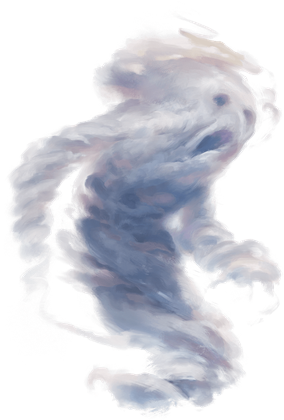
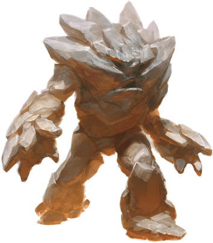
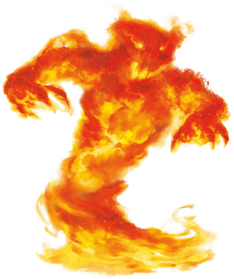
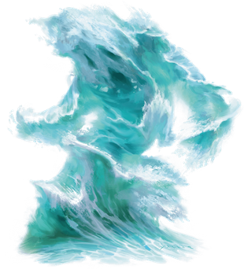

# Elementals
Elementals are incarnations of the elements that make up the universe: air, earth, fire, and water. Though little more than animated energy on their own planes of existence, they can be called on by spellcasters and powerful beings, binding elemental essence into a discrete form, to take shape and perform tasks. As the essence spends time in that shape, it may develop personality and individual characteristics.

> Jump to: [Air](#air) | [Earth](#earth) | [Fire](#fire) | [Ice](#ice) | [Magma](#magma) | [Water](#water)

The elemental planes of water, earth, fire, and air align on planar borders; where elemental essences of each of two planes combine, they sometimes combine in interesting ways, which if they remain combined over time, give rise to individual elementals made of the combined element. This provides ice and magma elementals, among others.

***Living Elements.*** Each elemental plane is a place of purest elemental energy--what is known to scholars as elemental *essence*. This essence is often what's drawn during certain spells to power certain effects (such as drawing just the tiniest amount of essence of fire to project flame during a [burning hands](../Magic/Spells/burning-hands.md) spell, for example). On its own, essence has no identity, personality, memory, or individual characteristics.

When essence is drawn and poured into a discrete shape--what casters call "summoning an elemental"--the essence can, over time, develop identity. These elementals begin their existence as a dim consciousness, often following only the will of the caster. Over time, however, elementals can develop a sense of identity and self, and often take on names. In some quiet corners of scholarly discourse, it is even believed that elementals can form hierarchies or societies.

Some elementals desire only to return to their native plane and "rejoin" the planar essence, essentially losing all sense of identity and memory. Others enjoy their existence, and resist being returned.

***Conjured by Magic.*** Certain spells and magic items can conjure an elemental, summoning it from the Inner Planes to the Material Plane. By its very nature, elemental essence is a wild force outside of its native plane, and requires the magic and determination to shape it. A creature that summons an elemental must assert force of will to control it.

***Elemental Nature.*** An elemental doesn't require air, food, drink, or sleep.

---

## Air Elemental
An air elemental is a funneling cloud of whirling air with a vague semblance of a face. Although it likes to race across the ground, picking up dust and debris as it goes, it can also fly and attack from above.

An air elemental can turn itself into a screaming cyclone, creating a whirlwind that batters creatures even as it flings them away.

>### Air Elemental
>*Large elemental, neutral*
>___
>- **Armor Class** 15
>- **Hit Points** 90 (12d10 + 24)
>- **Speed** 0 ft., fly 90 ft. (hover)
>___
>|**STR**|**DEX**|**CON**|**INT**|**WIS**|**CHA**|
>|:---:|:---:|:---:|:---:|:---:|:---:|
>|14 (+2)|20 (+5)|14 (+2)|6 (-2)|10 (+0)|6 (-2)|
>
>___
>- **Proficiency Bonus** +3
>- **Saving Throws** 
>- **Damage Vulnerabilities** 
>- **Damage Resistances** lightning,thunder; bludgeoning,piercing,and slashing from nonmagical attacks
>- **Damage Immunities** poison
>- **Condition Immunities** exhaustion,grappled,paralyzed,petrified,poisoned,prone,restrained,unconscious
>- **Skills** 
>- **Senses** darkvision 60 ft.,passive Perception 10
>- **Languages** Auran
>- **Challenge** 5
>___
>***Air Form.*** The elemental can enter a hostile creature's space and stop there. It can move through a space as narrow as 1 inch wide without squeezing.
>
>#### Actions
>***Multiattack.*** The elemental makes two Slam attacks.
>
>***Slam.*** Melee Weapon Attack: +8 to hit, reach 5 ft., one target. Hit: 14 (2d8 + 5) bludgeoning damage.
>
>***Whirlwind (Recharge 4–6).*** Each creature in the elemental's space must make a DC 13 Strength saving throw. On a failure, a target takes 15 (3d8 + 2) bludgeoning damage and is flung up 20 feet away from the elemental in a random direction and knocked prone. If a thrown target strikes an object, such as a wall or floor, the target takes 3 (1d6) bludgeoning damage for every 10 feet it was thrown. If the target is thrown at another creature, that creature must succeed on a DC 13 Dexterity saving throw or take the same damage and be knocked prone.
>
>If the saving throw is successful, the target takes half the bludgeoning damage and isn't flung away or knocked prone.
>

---

## Earth Elemental
An earth elemental plods forward like a walking hill, club-like arms of jagged stone swinging at its sides. Its head and body consist of dirt and stone, occasionally set with chunks of metal, gems, and bright minerals.

Earth elementals glide through rock and earth as though they were liquid. Earthbound creatures have much to fear from an earth elemental, since the elemental can pinpoint the precise location of any foe that stands on solid ground in its vicinity.

>### Earth Elemental
>*Large elemental, neutral*
>___
>- **Armor Class** 17 (natural armor)
>- **Hit Points** 126 (12d10 + 60)
>- **Speed** 30 ft., burrow 30 ft.
>___
>|**STR**|**DEX**|**CON**|**INT**|**WIS**|**CHA**|
>|:---:|:---:|:---:|:---:|:---:|:---:|
>|20 (+5)|8 (-1)|20 (+5)|5 (-3)|10 (+0)|5 (-3)|
>
>___
>- **Proficiency Bonus** +3
>- **Saving Throws** 
>- **Damage Vulnerabilities** thunder
>- **Damage Resistances** bludgeoning,piercing,and slashing from nonmagical attacks
>- **Damage Immunities** poison
>- **Condition Immunities** exhaustion,paralyzed,petrified,poisoned,unconscious
>- **Skills** 
>- **Senses** darkvision 60 ft.,tremorsense 60 ft., passive Perception 10
>- **Languages** Terran
>- **Challenge** 5
>___
>***Earth Glide.*** The elemental can burrow through nonmagical, unworked earth and stone. While doing so, the elemental doesn't disturb the material it moves through.
>
>***Siege Monster.*** The elemental deals double damage to objects and structures.
>
>#### Actions
>***Multiattack.*** The elemental makes two Slam attacks.
>
>***Slam.*** Melee Weapon Attack: +8 to hit, reach 10 ft., one target. Hit: 14 (2d8 + 5) bludgeoning damage.
>

---

## Fire Elemental
A faint humanoid shape threads through the core of this wild, moving flame. A fire elemental is a force of capricious devastation. Wherever it moves, it sets its surroundings ablaze, turning the world to ash, smoke, and cinders. Water can halt its destructive progress, causing the fire elemental to shrink back, hissing and smoking in pain and rage.

>### Fire Elemental
>*Large elemental, neutral*
>___
>- **Armor Class** 13
>- **Hit Points** 102 (12d10 + 36)
>- **Speed** 50 ft.
>___
>|**STR**|**DEX**|**CON**|**INT**|**WIS**|**CHA**|
>|:---:|:---:|:---:|:---:|:---:|:---:|
>|10 (+0)|17 (+3)|16 (+3)|6 (-2)|10 (+0)|7 (-2)|
>
>___
>- **Proficiency Bonus** +3
>- **Saving Throws** 
>- **Damage Vulnerabilities** 
>- **Damage Resistances** bludgeoning,piercing,and slashing from nonmagical attacks
>- **Damage Immunities** fire,poison
>- **Condition Immunities** exhaustion,grappled,paralyzed,petrified,poisoned,prone,restrained,unconscious
>- **Skills** 
>- **Senses** darkvision 60 ft.,passive Perception 10
>- **Languages** Ignan
>- **Challenge** 5
>___
>***Fire Form.*** The elemental can move through a space as narrow as 1 inch wide without squeezing. A creature that touches the elemental or hits it with a melee attack while within 5 feet of it takes 5 (1d10) fire damage. In addition, the elemental can enter a hostile creature's space and stop there. The first time it enters a creature's space on a turn, that creature takes 5 (1d10) fire damage and catches fire; until someone takes an action to douse the fire, the creature takes 5 (1d10) fire damage at the start of each of its turns.
>
>***Illumination.*** The elemental sheds bright light in a 30-foot radius and dim light in an additional 30 feet.
>
>***Water Susceptibility.*** For every 5 feet the elemental moves in water, or for every gallon of water splashed on it, it takes 1 cold damage.
>
>#### Actions
>***Multiattack.*** The elemental makes two Touch attacks.
>
>***Touch.*** Melee Weapon Attack: +6 to hit, reach 5 ft., one target. Hit: 10 (2d6 + 3) fire damage. If the target is a creature or a flammable object, it ignites. Until a creature takes an action to douse the fire, the target takes 5 (1d10) fire damage at the start of each of its turns.
>

---

## Ice Elemental
An ice elemental appears as a large chunk of jagged ice often formed into a vaguely humanoid shape. It floats through icy water in frosted landscapes or rests inside tranquil snowbanks, creaking as it moves its frozen body.

Anything that touches an ice elemental is magically chilled by an icy cold that seeps into the bones. They are also capable of expelling a frigid blast of icy wind from small cracks in their bodies. Ice elementals are wary of fire, and screech like dry ice when burned.

>### Ice Elemental
>*Large elemental (water/air), neutral*
>___
>- **Armor Class** 15 (natural armor)
>- **Hit Points** 127 (15d10 + 45)
>- **Speed** 30 ft., swim 30 ft., burrow 15ft.
>___
>|**STR**|**DEX**|**CON**|**INT**|**WIS**|**CHA**|
>|:---:|:---:|:---:|:---:|:---:|:---:|
>|18 (+4)|9 (-1)|17 (+3)|6 (-2)|10 (+0)|7 (-2)|
>
>___
>- **Proficiency Bonus** +3
>- **Saving Throws** 
>- **Damage Vulnerabilities** fire, thunder
>- **Damage Immunities** cold, poison
>- **Damage Resistances** acid; piercing, and slashing from nonmagical attacks
>- **Condition Immunities** exhaustion, paralyzed, petrified, poisoned, unconscious
>- **Senses** darkvision 60 ft., passive Perception 10
>- **Languages** Aquan, Auran
>- **Challenge** 6
>___
>***Chilling.*** A creature that touches the elemental or hits it with a melee attack while within 5 feet of it takes 3 (1 d6) cold damage, and if the creature doesn't have resistance or immunity to cold damage, it has disadvantage on the next weapon attack roll it makes before the end of its next turn.
>
>***Ice Glide.*** The elemental can burrow through ice and snow at a burrowing speed of 15 feet. While doing so, the elemental doesn't disturb the material it moves through.
>
>### Actions
>***Multiattack.*** The elemental makes two Slam attacks. 
>
>***Slam.*** Melee Weapon Attack: +7 to hit, reach 1Oft., one target. Hit: 13 (2d8 + 4) bludgeoning damage plus 3 (1d6) cold damage.
>
>***Ice Breath (Recharge 4-6).*** The elemental releases a blast of freezing ice and snow in a 30-foot cone. Each creature in the area must make a DC 15 Constitution saving throw. On a failed save, a creature takes 18 (4d8) cold damage and its speed is reduced by 20 feet until the end of its next turn.

---

## Magma Elemental
A magma elemental, composed of earth and fire, appears as a large, vaguely humanoid-shaped pile of magma. If unmoving, it will easily pass as a strangely-shaped pile of lava, and while moving, burbling sounds emanate from its body, typically along with the hiss of steam and smoke as it moves across the ground.

Anything that touches an magma elemental is magically scalded by an intense burn that feels like it sets the whole soul on fire. They are also capable of expelling a blast of meteoric chunks, primarily from a central opening near the top of the humanoid shape--from its "mouth", as it were. Magma elementals are wary of water, and howl like banshees when doused.

>### Magma Elemental
>*Huge elemental (earth/fire), neutral*
>___
>- **Armor Class** 16 (natural armor)
>- **Hit Points** 228 (24d12 + 72)
>- **Speed** 40ft, burrow 40 ft.
>___
>|**STR**|**DEX**|**CON**|**INT**|**WIS**|**CHA**|
>|:---:|:---:|:---:|:---:|:---:|:---:|
>|23(+6)|11(+0)|17(+3)|4(-3)|10(+0)|9(-1)|
>
>___
>- **Proficiency Bonus** +5
>- **Saving Throws** Str + 11, Con +8
>- **Damage Vulnerabilities** 
>- **Damage Resistances** bludgeoning, piercing, and slashing from nonmagical weapons
>- **Damage Immunities** fire, poison
>- **Condition Immunities** exhaustion, paralyzed, petrified, poisoned, unconscious
>- **Skills** 
>- **Senses** darkvision 60 ft., tremorsense 60 ft., passive Perception 10
>- **Languages** Ignan, Terran
>- **Challenge** 13
>___
>***Lava Form.*** A creature or object that touches the elemental or hits it with a melee attack while within 5 feet of it takes 10 (3d6) fire damage. A creature that ends its turn within 5 feet of the elemental takes 5 (1d10) fire damage. At the end of the elemental's turn, it ignites any flammable objects within 5 feet of it that aren't being worn or carried.
>
>***Cooled Lava.*** If the elemental takes cold damage, it partially cools to stone; its speed is reduced by 20 feet until the end of its next turn, and its Lava Form trait doesn't function for that duration.
>
>***False Appearance.*** While the elemental remains motionless, it can choose to suppress its Lava Form trait, causing it to be indistinguishable from a normal (albeit huge) boulder.
>
>***Illumination.*** The elemental sheds bright light in a 30- foot radius and dim light in an additional 30 feet while its Lava Form trait is functioning.
>
>***Molten Tunnels.*** When it burrows, the elemental leaves a tunnel in its wake. The sides of this tunnel remain burning hot for 10 minutes, after which the tunnel collapses. When a creature enters the tunnel for the first time on a turn or starts its turn inside the tunnel, it takes 11 (2d10) fire damage.
>
>***Siege Monster.*** The elemental deals double damage to objects and structures.
>
>***Water Susceptibility.*** For every 5 feet the elemental moves in water, or for every gallon of water splashed on it, it takes 1 cold damage.
>
>### Actions
>***Multiattack.*** The elemental makes two Smash attacks.
>
>***Smash.*** Melee Weapon Attack: +8 to hit, reach 10ft., one creature. Hit: 16 (2d 10 + 5) bludgeoning damage plus 21 (6d6) fire damage, and the target must succeed on a DC 16 Strength saving throw or be knocked prone. If the target is not flying, on a hit or a miss, the area of ground in a 15-foot diameter circle centered beneath the target becomes filled with lava. The area is difficult terrain for the next 10 minutes, and any creature who enters the area or ends its turn there takes 21 (6d6) fire damage.
>
>***Meteor Breath.*** The elemental spews tiny chunks of burning stone. Each creature in a 10-foot radius sphere centered on a point within 60 feet of the elemental must make a DC 16 Dexterity saving throw. On a failure, a target takes 10 (3d6) bludgeoning damage plus 10 (3d6) fire damage, or half as much damage on a success. Each object within the area that isn't being held or carried also takes full damage, and is ignited if it is flammable.

---

## Water Elemental
A water elemental is a cresting wave that rolls across the ground, becoming nearly invisible at it courses through a larger body of water. It engulfs creatures that stand against it, filling their mouths and lungs as easily as it smothers flame.

>### Water Elemental
>*Large elemental, neutral*
>___
>- **Armor Class** 14 (natural armor)
>- **Hit Points** 114 (12d10 + 48)
>- **Speed** 30 ft., swim 90 ft.
>___
>|**STR**|**DEX**|**CON**|**INT**|**WIS**|**CHA**|
>|:---:|:---:|:---:|:---:|:---:|:---:|
>|18 (+4)|14 (+2)|18 (+4)|5 (−3)|10 (+0)|8 (−1)|
>
>___
>- **Proficiency Bonus** +3
>- **Saving Throws** 
>- **Damage Vulnerabilities** 
>- **Damage Resistances** acid; bludgeoning, piercing, and slashing from nonmagical attacks
>- **Damage Immunities** poison
>- **Condition Immunities** exhaustion, grappled, paralyzed, petrified, poisoned, prone, restrained, unconscious
>- **Senses** darkvision 60 ft., passive Perception 10
>- **Languages** Aquan
>- **Challenge** 5
>___
>***Water Form.*** The elemental can enter a hostile creature's space and stop there. It can move through a space as narrow as 1 inch wide without squeezing.
>
>***Freeze.*** If the elemental takes cold damage, it partially freezes; its speed is reduced by 20 feet until the end of its next turn.
>
>***Undetectable in Water.*** While the water elemental is entirely immersed within water of any kind, it is invisible and it can't be sensed by blindsight.
>
>### Actions
>***Multiattack.*** The elemental makes two Slam attacks.
>
>***Slam.*** Melee Weapon Attack: +7 to hit, reach 5 ft., one target. Hit: 13 (2d8 + 4) bludgeoning damage.
>
>***Whelm (Recharge 4–6).*** Each creature in the elemental's space must make a DC 15 Strength saving throw. On a failure, a target takes 13 (2d8 + 4) bludgeoning damage. If it is Large or smaller, it is also grappled (escape DC 14). Until this grapple ends, the target is restrained and unable to breathe unless it can breathe water. If the saving throw is successful, the target is pushed out of the elemental's space.
>
>The elemental can grapple one Large creature or up to two Medium or smaller creatures at one time. At the start of each of the elemental's turns, each target grappled by it takes 13 (2d8 + 4) bludgeoning damage. A creature within 5 feet of the elemental can pull a creature or object out of it by taking an action to make a DC 14 Strength check and succeeding.

