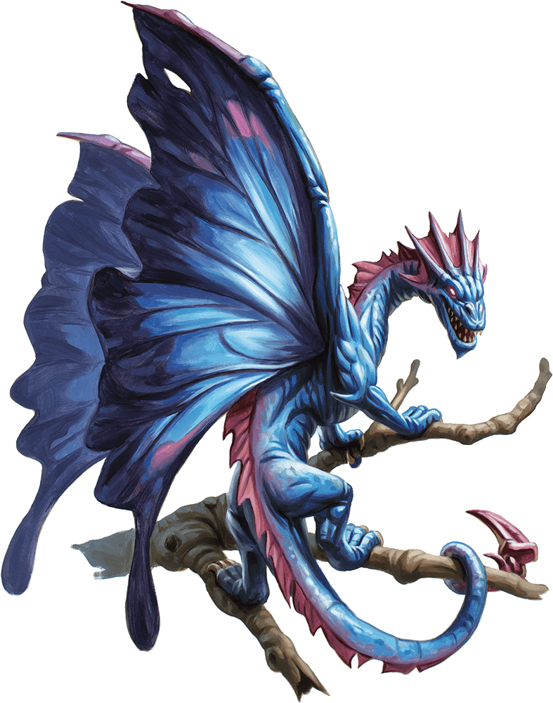

## Faerie Dragon
A faerie dragon is a cat-sized dragon with butterfly wings. It wears a sharp-toothed grin and expresses its delight by the twitching of its tail, its merriment fading only if it is attacked.

***Invisible Tricksters.*** The only warning of a faerie dragon's presence is a stifled giggle. The dragon stays out of sight, watching invisibly as its victims contend with its pranks. When its fun is done, the dragon might reveal itself, depending on the disposition of its "prey."

***Friendly and Bright.*** A faerie dragon has a sharp mind, a fondness for treasure and good company, and a puckish sense of humor. Travelers can play to a faerie dragon's draconic nature by offering it "treasure" in the form of sweets, baked goods, and baubles in exchange for information or safe passage through its territory.

***The Colors of Age.*** A faerie dragon's scales change hue as it ages, moving through all the colors of the rainbow. All faerie dragons have innate spellcasting ability, gaining new spells as they mature.

Dragon Color | Age Range
------------ | ---------
Red | 5 years or less
Orange | 6–10 years
Yellow | 11–20 years
Green | 21–30 years
Blue | 31–40 years
Indigo  | 41–50 years
Violet | 51 years or more

### Environment
Forest

### Token

>### Faerie Dragon
>*Tiny dragon, chaotic good*
>___
>- **Armor Class** 15
>- **Hit Points** 14 (4d4 + 4)
>- **Speed** 10 ft., fly 60 ft.
>___
>|**STR**|**DEX**|**CON**|**INT**|**WIS**|**CHA**|
>|:---:|:---:|:---:|:---:|:---:|:---:|
>|3 (-4)|20 (+5)|13 (+1)|14 (+2)|12 (+1)|16 (+3)|
>
>___
>- **Proficiency Bonus** +2
>- **Saving Throws** 
>- **Damage Vulnerabilities** 
>- **Damage Resistances** 
>- **Damage Immunities** 
>- **Condition Immunities** 
>- **Skills** Arcana +4,Perception +3,Stealth +7
>- **Senses** darkvision 60 ft.,passive Perception 13
>- **Languages** Draconic,Sylvan
>- **Challenge** 1
>___
>***Superior Invisibility.*** As a bonus action, the dragon can magically turn invisible until its concentration ends (as if concentrating on a spell). Any equipment the dragon wears or carries is invisible with it.
>
>***Limited Telepathy.*** Using telepathy, the dragon can magically communicate with any other faerie dragon within 60 feet of it.
>
>***Magic Resistance.*** The dragon has advantage on saving throws against spells and other magical effects.
>
>#### Actions
>***Bite.*** Melee Weapon Attack: +7 to hit, reach 5 ft., one creature. Hit: 1 piercing damage.
>
>***Euphoria Breath (Recharge 5–6).*** The dragon exhales a puff of euphoria gas at one creature within 5 feet of it. The target must succeed on a DC 11 Wisdom saving throw, or for 1 minute, the target can't take reactions and must roll a d6 at the start of each of its turns to determine its behavior during the turn:
>
>* **1–4.** The target takes no action or bonus action and uses all of its movement to move in a random direction.
>
>* ***5–6.** The target doesn't move, and the only thing it can do on its turn is make a DC 11 Wisdom saving throw, ending the effect on itself on a success.
>
>***Innate Spellcasting.*** The dragon's innate spellcasting ability is Charisma (spell save DC 13). It can innately cast a number of spells, requiring no material components. As the dragon ages and changes color, it gains additional spells as shown below.
>* Red, 1/day each: dancing lights, mage hand, minor illusion
>* Orange, 1/day: color spray
>* Yellow, 1/day: mirror image
>* Green, 1/day: suggestion
>* Blue, 1/day: major image
>* Indigo, 1/day: hallucinatory terrain
>* Violet, 1/day: polymorph
>
