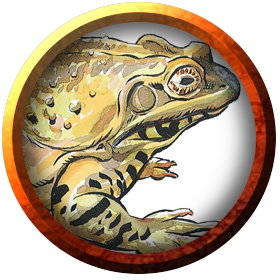
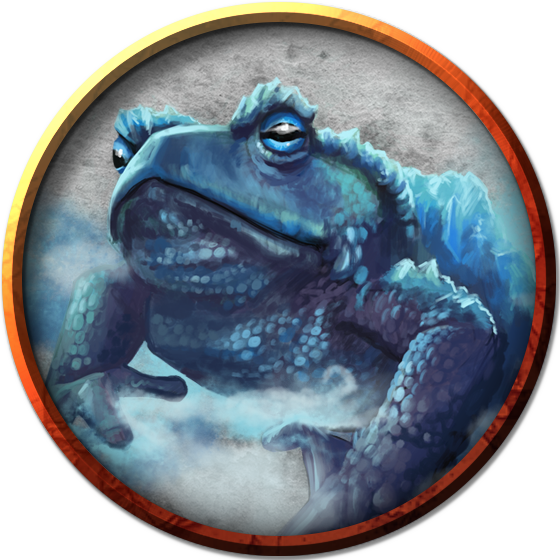
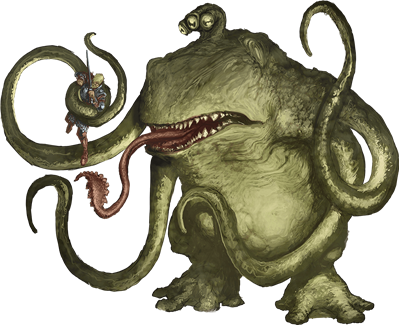

# Frogs
The classic reptile found in swamps, marshlands, grasslands, prairies, and anywhere small insects can be found. Frogs are often considered good luck by many Hordes tribes, though some Dradehalians--having had unpleasant encounters with [bullywug](Bullywug.md)s in the past--believe they are the symbol of unfortunate travels, and have taken to throwing a coin to any frog they see in order to placate the unlucky spirits.

> Jump to: [Frog](Frogs.md#frog) | [Giant Frog](Frogs.md#giant-frog) | [Giant Ice Toad](Frogs.md#giant-ice-toad) | [Giant Toad](Frogs.md#giant-toad) | [Froghemoth](Frogs.md#froghemoth)

---

## Frog
A frog has no effective attacks. It feeds on small insects and typically dwells near water, in trees, or underground. The frog's statistics can also be used to represent a toad, though some say toads are slightly better-looking and slightly less wise. (Kidding.)

### Environment
(FIXME)

### Token

>### Frog
>*Tiny beast, unaligned*
>___
>- **Armor Class** 11
>- **Hit Points** 1 (1d4 − 1)
>- **Speed** 20 ft., swim 20 ft.
>___
>|**STR**|**DEX**|**CON**|**INT**|**WIS**|**CHA**|
>|:---:|:---:|:---:|:---:|:---:|:---:|
>|1 (-5)|13 (+1)|8 (-1)|1 (-5)|8 (-1)|3 (-4)|
>
>___
>- **Proficiency Bonus** +2
>- **Saving Throws** 
>- **Damage Vulnerabilities** 
>- **Damage Resistances** 
>- **Damage Immunities** 
>- **Condition Immunities** 
>- **Skills** Perception +1,Stealth +3
>- **Senses** darkvision 30 ft.,passive Perception 11
>- **Languages** —
>- **Challenge** 0
>___
>***Amphibious.*** The frog can breathe air and water.
>
>***Standing Leap.*** The frog's long jump is up to 10 feet and its high jump is up to 5 feet, with or without a running start.
>
>#### Actions

---

## Giant Frog
(No description given)

### Environment
(FIXME)

### Token

>### Giant Frog
>*Medium beast, unaligned*
>___
>- **Armor Class** 11
>- **Hit Points** 18 (4d8)
>- **Speed** 30 ft., swim 30 ft.
>___
>|**STR**|**DEX**|**CON**|**INT**|**WIS**|**CHA**|
>|:---:|:---:|:---:|:---:|:---:|:---:|
>|12 (+1)|13 (+1)|11 (+0)|2 (-4)|10 (+0)|3 (-4)|
>
>___
>- **Proficiency Bonus** +2
>- **Saving Throws** 
>- **Damage Vulnerabilities** 
>- **Damage Resistances** 
>- **Damage Immunities** 
>- **Condition Immunities** 
>- **Skills** Perception +2,Stealth +3
>- **Senses** darkvision 30 ft.,passive Perception 12
>- **Languages** —
>- **Challenge** 1/4
>___
>***Amphibious.*** The frog can breathe air and water.
>
>***Standing Leap.*** The frog's long jump is up to 20 feet and its high jump is up to 10 feet, with or without a running start.
>
>#### Actions
>***Bite.*** Melee Weapon Attack: +3 to hit, reach 5 ft., one target. Hit: 4 (1d6 + 1) piercing damage, and the target is grappled (escape DC 11). Until this grapple ends, the target is restrained, and the frog can't bite another target.
>
>***Swallow.*** The frog makes one bite attack against a Small or smaller target it is grappling. If the attack hits, the target is swallowed, and the grapple ends. The swallowed target is blinded and restrained, it has total cover against attacks and other effects outside the frog, and it takes 5 (2d4) acid damage at the start of each of the frog's turns. The frog can have only one target swallowed at a time.
>
>If the frog dies, a swallowed creature is no longer restrained by it and can escape from the corpse using 5 feet of movement, exiting prone.
>

---

## Giant Ice Toad
Giant ice toads are a wild magic-infused elemental offshoot of the giant toad, infused with just a touch of air and water elemental essence. This manifests as a giant toad, encased in ice, able to expel frost as a breath weapon to any foes who might challenge its icy home. Given the overall climate of Azgaarnoth, these are not common, but a few are found in the very southern reaches of the [Dradehalian continent](../Geography/Dradehalia.md), where the temperatures can drop below zero, and out on the ice sheet that extends from there to the southern pole.

### Environment
Arctic

### Token

>### Giant Ice Toad
>*Large beast, unaligned*
>___
>- **Armor Class** 15 (natural armor)
>- **Hit Points** 39 (8d10 + 8)
>- **Speed** 20 ft., burrow 40 ft. (ice only)
>___
>|**STR**|**DEX**|**CON**|**INT**|**WIS**|**CHA**|
>|:---:|:---:|:---:|:---:|:---:|:---:|
>|15 (+2)|13 (+1)|13 (+1)|2 (-4)|10 (+0)|3 (-4)|
>
>___
>- **Proficiency Bonus** +2
>- **Saving Throws** 
>- **Damage Vulnerabilities** 
>- **Damage Resistances** 
>- **Damage Immunities** cold
>- **Condition Immunities** 
>- **Skills** 
>- **Senses** darkvision 30 ft.,passive Perception 10
>- **Languages** —
>- **Challenge** 2
>___
>***Standing Leap.*** The toad's long jump is up to 20 feet and its high jump is up to 10 feet, with or without a running start.
>
>***Sure Footing.*** The toad never finds ice or snow to be difficult terrain.
>
>#### Actions
>***Bite.*** Melee Weapon Attack: +4 to hit, reach 5 ft., one target. Hit: 7 (1d10 + 2) piercing damage plus 5 (1d10) poison damage, and the target is grappled (escape DC 13). Until this grapple ends, the target is restrained, and the toad can't bite another target.
>
>***Swallow.*** The toad makes one bite attack against a Medium or smaller target it is grappling. If the attack hits, the target is swallowed, and the grapple ends. The swallowed target is blinded and restrained, it has total cover against attacks and other effects outside the toad, and it takes 10 (3d6) acid damage at the start of each of the toad's turns. The toad can have only one target swallowed at a time.
>
>If the toad dies, a swallowed creature is no longer restrained by it and can escape from the corpse using 5 feet of movement, exiting prone.
>
>***Breath Weapon (Recharge 5-6).*** Frost, in a 15-­foot cone. Each creature in that area must make a DC 15 Dexterity saving throw, taking 24 (4d8) frost damage on a failed save, or half as much damage on a successful one.
>

---

## Giant Toad
Giant toads breed successfully in the wild, and usually prefer deep forests, such as the wilderness of [Northern Bedia](../Geography/Bedia.md). Many, however, have been domesticated by various tribes, and so they can often be found in entirely non-native habitats, including the [Underdark](../Geography/Underdark.md). They are also commonly found among the various [Undersea](../Geography/Undersea.md) tribes.

### Environment
Forest, Swamp, Underdark

### Token

>### Giant Toad
>*Large beast, unaligned*
>___
>- **Armor Class** 11
>- **Hit Points** 39 (6d10 + 6)
>- **Speed** 20 ft., swim 40 ft.
>___
>|**STR**|**DEX**|**CON**|**INT**|**WIS**|**CHA**|
>|:---:|:---:|:---:|:---:|:---:|:---:|
>|15 (+2)|13 (+1)|13 (+1)|2 (-4)|10 (+0)|3 (-4)|
>
>___
>- **Proficiency Bonus** +2
>- **Saving Throws** 
>- **Damage Vulnerabilities** 
>- **Damage Resistances** 
>- **Damage Immunities** 
>- **Condition Immunities** 
>- **Skills** 
>- **Senses** darkvision 30 ft.,passive Perception 10
>- **Languages** —
>- **Challenge** 1
>___
>***Amphibious.*** The toad can breathe air and water.
>
>***Standing Leap.*** The toad's long jump is up to 20 feet and its high jump is up to 10 feet, with or without a running start.
>
>#### Actions
>***Bite.*** Melee Weapon Attack: +4 to hit, reach 5 ft., one target. Hit: 7 (1d10 + 2) piercing damage plus 5 (1d10) poison damage, and the target is grappled (escape DC 13). Until this grapple ends, the target is restrained, and the toad can't bite another target.
>
>***Swallow.*** The toad makes one bite attack against a Medium or smaller target it is grappling. If the attack hits, the target is swallowed, and the grapple ends. The swallowed target is blinded and restrained, it has total cover against attacks and other effects outside the toad, and it takes 10 (3d6) acid damage at the start of each of the toad's turns. The toad can have only one target swallowed at a time.
>
>If the toad dies, a swallowed creature is no longer restrained by it and can escape from the corpse using 5 feet of movement, exiting prone.
>

---

## Froghemoth
A froghemoth is an amphibious predator as big as an elephant. It lairs in swamps and has four tentacles, a thick rubbery hide, a fang-filled maw with a prehensile tongue, and an extendable stalk sporting three bulbous eyes that face in different directions.

Froghemoths are creatures not of this world. A journal purportedly written long ago by the wizard Lum describes strange, cylindrical chambers of metal buried in the ground from which froghemoths emerged, but no reliable reports of the location of such places exist.

Every few years, a froghemoth can lay a fertile egg without mating. The froghemoth cares nothing for its egg and might eat the hatchling. A young froghemoth's survival thus depends on its parent leaving it behind in indifference. A newborn froghemoth grows to full size over a period of months by indiscriminately preying on other creatures in its swampy domain. It learns to hide its enormous body in murky pools, keeping only its eyestalk above water to watch for passing creatures. When food comes within reach, the froghemoth erupts from its pool, tentacles and tongue flailing. It can grab several targets at once; it wraps its tongue around one and pulls it in to be devoured while holding the rest at bay.

If [bullywugs](Bullywug.md) come across a froghemoth, the bullywugs may treat the froghemoth as a god and do all they can to coax the monster into their den. A froghemoth can be tamed (after a fashion) by offering it food, and bullywugs can communicate with it on a basic level, so the creature might eat only a few bullywugs before following the rest. The bullywugs gather food as tribute for it, provide it with a comfortable lair, protect it from harm, and try to ensure that any of its offspring reach maturity.

### Environment
Swamp, Underdark

### Token

>### Froghemoth
>*Huge monstrosity, Unaligned*
>___
>- **Armor Class** 14 (natural armor)
>- **Hit Points** 161 (14d12 + 70)
>- **Speed** 30 ft., swim 30 ft.
>___
>|**STR**|**DEX**|**CON**|**INT**|**WIS**|**CHA**|
>|:---:|:---:|:---:|:---:|:---:|:---:|
>|23 (+6)|13 (+1)|20 (+5)|2 (-4)|12 (+1)|5 (-3)|
>
>___
>- **Proficiency Bonus** +4
>- **Saving Throws** Con +9,Wis +5
>- **Damage Vulnerabilities** 
>- **Damage Resistances** fire,lightning
>- **Damage Immunities** 
>- **Condition Immunities** 
>- **Skills** Perception +9,Stealth +5
>- **Senses** darkvision 60 ft.,passive Perception 19
>- **Languages** --
>- **Challenge** 10
>___
>***Amphibious.*** The froghemoth can breathe air and water.
>
>***Shock Susceptibility.*** If the froghemoth takes lightning damage, it suffers two effects until the end of its next turn: its speed is halved, and it has disadvantage on Dexterity saving throws.
>
>#### Actions
>***Multiattack.*** The froghemoth makes one Bite attack and two Tentacle attacks, and it can use Tongue.
>
>***Bite.*** Melee Weapon Attack: +10 to hit, reach 5 ft., one target. Hit: 22 (3d10 + 6) piercing damage, and the target is swallowed if it is a Medium or smaller creature. A swallowed creature is blinded and restrained, has total cover against attacks and other effects outside the froghemoth, and takes 10 (3d6) acid damage at the start of each of the froghemoth's turns.
>
>The froghemoth's gullet can hold up to two creatures at a time. If the froghemoth takes 20 damage or more on a single turn from a creature inside it, the froghemoth must succeed on a DC 20 Constitution saving throw at the end of that turn or regurgitate all swallowed creatures, each of which falls prone in a space within 10 feet of the froghemoth. If the froghemoth dies, any swallowed creature is no longer restrained by it and can escape from the corpse using 10 feet of movement, exiting prone.
>
>***Tentacle.*** Melee Weapon Attack: +10 to hit, reach 20 ft., one target. Hit: 19 (3d8 + 6) bludgeoning damage, and the target is grappled (escape DC 16) if it is a Huge or smaller creature. Until the grapple ends, the froghemoth can't use this tentacle on another target. The froghemoth has four tentacles.
>
>***Tongue.*** The froghemoth targets one Medium or smaller creature that it can see within 20 feet of it. The target must make a DC 18 Strength saving throw. On a failed save, the target is pulled into an unoccupied space within 5 feet of the froghemoth.
>

