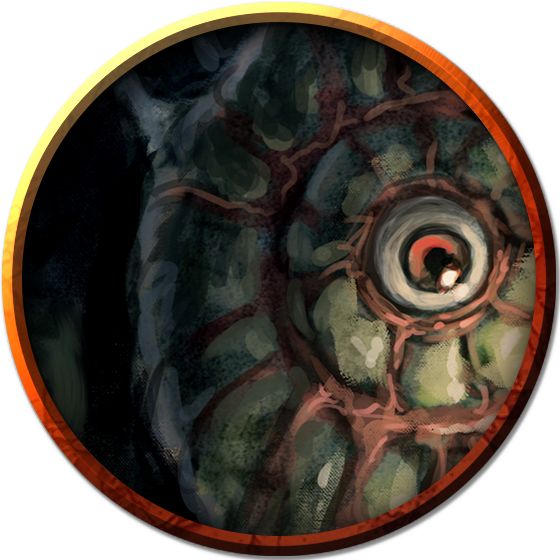

# Fungi
With its sky of jagged stone and perpetual night, the Underdark is home to all manner of fungi. Taking the place of plants in the subterranean realm, fungi are vital to the survival of many underground species, providing nourishment and shelter in the unforgiving darkness.

> Jump to: [Gas Spore](Fungi.md#gas-spore) | [Shrieker](Fungi.md#shrieker) | [Violet Fungus](Fungi.md#violet-fungus)

Fungi spawn in organic matter, then break that matter down to consume it, feeding on filth and corpses. As they mature, fungi eject spores that drift on the lightest breeze to spawn new fungi.

Not needing sunlight or warmth to grow, fungi thrive in every corner and crevice of the Underdark. Transformed by the magic that permeates that underground realm, Underdark fungi often develop potent defensive mechanisms or abilities of mimicry and attack. The largest specimens can spread to create vast subterranean forests in which countless creatures live and feed.

---

## Gas Spore
The first gas spores are thought to have been spawned from dead beholders, whose moldering corpses fed a parasitic fungus with aberrant magic. Having long since adapted into a unique plant creature, a gas spore grows quickly and purposefully out of any corpse, creating a malevolent-looking mockery of the most feared denizen of the Underdark.

***Eye Tyrant's Form.*** A gas spore is a spherical, balloon-like fungus that resembles a beholder from a distance, though its true nature becomes increasingly obvious as one approaches it. The monster possesses a blind central "eye" and rhizome growths sprouting from its upper surface, superficially resembling a beholder's eyestalks.

***Death Burst.*** A gas spore is a hollow shell filled with a lighter-than-air gas that enables it to float as a beholder does. Piercing the shell with even the weakest attack causes the creature to burst apart, releasing a cloud of deadly spores. A creature that inhales the spores becomes host to them, and is often dead within a day. Its corpse then becomes the spawning ground from which new gas spores arise.

***Beholder Memories.*** A gas spore that sprouts from a beholder's corpse sometimes carries within it memories of its deceased parent. When the gas spore explodes, its deadly spores cast those memories adrift. Any creature that inhales the spores and survives inherits one or more of the beholder's fragmented memories, and might gain useful information about the beholder's former lair and other nearby places and creatures of interest.

### Environment
Underdark

### Token

>### Gas Spore
>*Large plant, unaligned*
>___
>- **Armor Class** 5
>- **Hit Points** 1 (1d10 − 4)
>- **Speed** 0 ft., fly 10 ft. (hover)
>___
>|**STR**|**DEX**|**CON**|**INT**|**WIS**|**CHA**|
>|:---:|:---:|:---:|:---:|:---:|:---:|
>|5 (-3)|1 (-5)|3 (-4)|1 (-5)|1 (-5)|1 (-5)|
>
>___
>- **Proficiency Bonus** +2
>- **Saving Throws** 
>- **Damage Vulnerabilities** 
>- **Damage Resistances** 
>- **Damage Immunities** poison
>- **Condition Immunities** blinded,deafened,frightened,paralyzed,poisoned,prone
>- **Skills** 
>- **Senses** blindsight 30 ft. (blind beyond this radius),passive Perception 5
>- **Languages** —
>- **Challenge** 1/2
>___
>***Death Burst.*** The gas spore explodes when it drops to 0 hit points. Each creature within 20 feet of it must succeed on a DC 15 Constitution saving throw or take 10 (3d6) poison damage and become infected with a disease on a failed save. Creatures immune to the poisoned condition are immune to this disease.
>
>Spores invade an infected creature's system, killing the creature in a number of hours equal to 1d12 + the creature's Constitution score, unless the disease is removed. In half that time, the creature becomes poisoned for the rest of the duration. After the creature dies, it sprouts 2d4 Tiny gas spores that grow to full size in 7 days.
>
>***Eerie Resemblance.*** The gas spore resembles a beholder. A creature that can see the gas spore can discern its true nature with a successful DC 15 Intelligence (Nature) check.
>
>#### Actions
>***Touch.*** Melee Weapon Attack: +0 to hit, reach 5 ft., one creature. Hit: 1 poison damage, and the creature must succeed on a DC 10 Constitution saving throw or become infected with the disease described in the Death Burst trait.
>

---

## Shrieker
A shrieker is a human-sized mushroom that emits a piercing screech to drive off creatures that disturb it. Other creatures use the fungi as an alarm to signal the approach of prey, and various intelligent races of the Underdark cultivate shriekers on the outskirts of their communities to discourage trespassers.

### Environment
Underdark

### Token

>### Shrieker
>*Medium plant, unaligned*
>___
>- **Armor Class** 5
>- **Hit Points** 13 (3d8)
>- **Speed** 0 ft.
>___
>|**STR**|**DEX**|**CON**|**INT**|**WIS**|**CHA**|
>|:---:|:---:|:---:|:---:|:---:|:---:|
>|1 (-5)|1 (-5)|10 (+0)|1 (-5)|3 (-4)|1 (-5)|
>
>___
>- **Proficiency Bonus** +2
>- **Saving Throws** 
>- **Damage Vulnerabilities** 
>- **Damage Resistances** 
>- **Damage Immunities** 
>- **Condition Immunities** blinded,deafened,frightened
>- **Skills** 
>- **Senses** blindsight 30 ft. (blind beyond this radius),passive Perception 6
>- **Languages** —
>- **Challenge** 0
>___
>***False Appearance.*** While the shrieker remains motionless, it is indistinguishable from an ordinary fungus.
>
>Reactions
>
>***Shriek.*** When bright light or a creature is within 30 feet of the shrieker, it emits a shriek audible within 300 feet of it. The shrieker continues to shriek until the disturbance moves out of range and for 1d4 of the shrieker's turns afterward.
>
>#### Actions

---

## Violet Fungus
This purplish mushroom uses root-like feelers growing from its base to creep across cavern floors. The four stalks protruding from a violet fungi's central mass are used to lash out at prey, rotting flesh with the slightest touch. Any creature killed by a violet fungus decomposes rapidly. A new violet fungus sprouts from the moldering corpse, growing to full size in 2d6 days.

### Environment
Underdark

### Token

>### Violet Fungus
>*Medium plant, unaligned*
>___
>- **Armor Class** 5
>- **Hit Points** 18 (4d8)
>- **Speed** 5 ft.
>___
>|**STR**|**DEX**|**CON**|**INT**|**WIS**|**CHA**|
>|:---:|:---:|:---:|:---:|:---:|:---:|
>|3 (-4)|1 (-5)|10 (+0)|1 (-5)|3 (-4)|1 (-5)|
>
>___
>- **Proficiency Bonus** +2
>- **Saving Throws** 
>- **Damage Vulnerabilities** 
>- **Damage Resistances** 
>- **Damage Immunities** 
>- **Condition Immunities** blinded,deafened,frightened
>- **Skills** 
>- **Senses** blindsight 30 ft. (blind beyond this radius),passive Perception 6
>- **Languages** —
>- **Challenge** 1/4
>___
>***False Appearance.*** While the violet fungus remains motionless, it is indistinguishable from an ordinary fungus.
>
>#### Actions
>***Multiattack.*** The fungus makes 1d4 Rotting Touch attacks.
>
>***Rotting Touch.*** Melee Weapon Attack: +2 to hit, reach 10 ft., one creature. Hit: 4 (1d8) necrotic damage.
>

