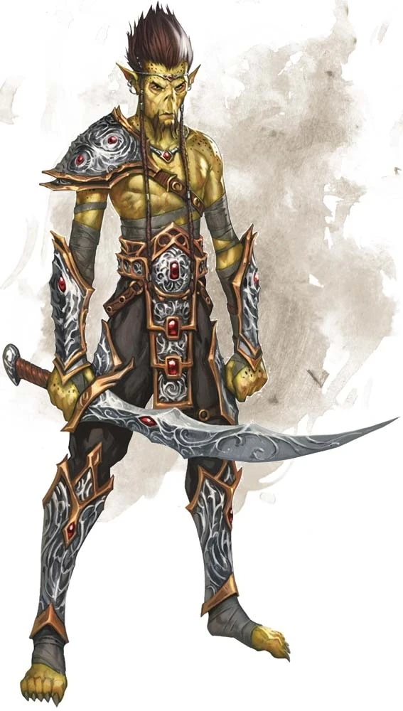

# Githyanki
Githyanki descend from an ancient people who were also the progenitors of githzerai (also in this book). These tall, gaunt folk have potent psionic powers and dwell, for the most part, on the Astral Plane. Among the best-known githyanki are the bellicose followers of the Lich Queen Vlaakith. They terrorize the Astral Plane, raiding into other planes to plunder the multiverse of its magic and riches.

> Jump to: [Githyanki Warrior](Githyanki.md#githyanki-warrior) | [Githyanki Knight](Githyanki.md#githyanki-knight) | [Githyanki Gish](Githyanki.md#githyanki-gish) | [Githyanki Kith'rak](Githyanki.md#githyanki-kith'rak) | [Githyanki General](Githyanki.md#githyanki-general)

***Followers of Gith.*** In their own language, githyanki means "followers of Gith." Under the guidance of Gith, the githyanki stratified into a militaristic society, with a strict caste system, dedicated to the ongoing fight against the victims and sworn enemies of their race. When their leader Gith perished, she was replaced by her undead adviser, Vlaakith. The lich-queen forbade worship of all beings except herself.

Of all their enemies, the githyanki most hate their former masters, the mind flayers. Their close kin, the githzerai, are second in their enmity. All other creatures are treated with simple contempt by the githyanki, whose xenophobic pride defines their view of inferior races.

***Silver Swords.*** In ancient times, gith knights created special weapons to combat their mind flayer masters. These silver swords channel the force of the wielder's will, dealing psychic as well as physical damage. A githyanki can't become a knight until it masters the singular discipline needed to will such a blade into existence. A silver sword is equivalent to a greatsword, and takes on the properties of a +3 greatsword in the hands of its creator.

In the eyes of the githyanki, each silver sword is a priceless relic and a work of art. Githyanki knights will hunt down and destroy any non-githyanki that dares to carry or wield a silver sword, reclaiming it for their people.

***Red Dragon Riders.*** In the uprising against the illithids, Gith sought allies. Her adviser Vlaakith appealed to Tiamat, the goddess of evil dragonkind, and Gith ventured into the Nine Hells to meet with her. Only Tiamat now knows what passed between them, but Vlaakith returned to the Astral Plane with the Dragon Queen's red dragon consort Ephelomon, who proclaimed that his kind would forever act as allies to the githyanki. Not all red dragons honor the alliance kindled so long ago, but most at least don't consider the githyanki their enemies.

***Outposts in the Mortal Realm.*** Since creatures that dwell on the Astral Plane don't age, the githyanki establish creches in remote areas of the Material Plane to raise their young. Doubling as military academies, these creches train young githyanki to harness their psychic and combat abilities. When a githyanki grows to adulthood and slays a mind flayer as part of a sacred rite of passage, it is permitted to rejoin its people on the Astral Plane.

***Astral Raiders.*** The githyanki despise all other races, undertaking devastating raids that take them from their strongholds in the Astral Plane to the far-flung corners of the multiverse. War is the ultimate expression of githyanki culture, and their pitiless black eyes know no mercy. After a raid, they leave shattered survivors enough food and resources to weakly endure. Later, the githyanki return to their conquered foes, plundering them again and again.

***Playable Race: Masters of Mind.*** [Githyanki](../Races/Gith.md) are a playable race by players interested in doing so. Githyanki gravitate towards martial and arcane, however both githyanki and githzerai races have shown they are equally facile in any class. While they are under no obligations to continue their ancestral hatred of the other side of their gith heritage, players should prepare a backstory that explains their particular reactions if they deviate from the norm. Note that gith are not common in Azgaarnoth, and as such they will often be mistaken for "Charisma-challenged elves".

---

## Githyanki Warrior
(No description given)

### Environment
(FIXME)

### Token

>### Githyanki Warrior
>*Medium humanoid (gith), lawful evil*
>___
>- **Armor Class** 17 (half plate)
>- **Hit Points** 49 (9d8 + 9)
>- **Speed** 30 ft.
>___
>|**STR**|**DEX**|**CON**|**INT**|**WIS**|**CHA**|
>|:---:|:---:|:---:|:---:|:---:|:---:|
>|15 (+2)|14 (+2)|12 (+1)|13 (+1)|13 (+1)|10 (+0)|
>
>___
>- **Proficiency Bonus** +2
>- **Saving Throws** Con +3,Int +3,Wis +3
>- **Damage Vulnerabilities** 
>- **Damage Resistances** 
>- **Damage Immunities** 
>- **Condition Immunities** 
>- **Skills** 
>- **Senses** passive Perception 11
>- **Languages** Gith
>- **Challenge** 3
>___
>***Innate Spellcasting (Psionics).*** The githyanki's innate spellcasting ability is Intelligence. It can innately cast the following spells, requiring no components:
>
>* *At will:* mage hand (the hand is invisible)
>* *3/day each:* jump, misty step, nondetection (self only)
>
>#### Actions
>***Multiattack.*** The githyanki makes two greatsword attacks.
>
>***Greatsword.*** Melee Weapon Attack: +4 to hit, reach 5 ft., one target. Hit: 9 (2d6 + 2) slashing damage plus 7 (2d6) psychic damage.
>

---

## Githyanki Knight
(No description given)

### Environment
(FIXME)

### Token

>### Githyanki Knight
>*Medium humanoid (gith), lawful evil*
>___
>- **Armor Class** 18 (plate)
>- **Hit Points** 91 (14d8 + 28)
>- **Speed** 30 ft.
>___
>|**STR**|**DEX**|**CON**|**INT**|**WIS**|**CHA**|
>|:---:|:---:|:---:|:---:|:---:|:---:|
>|16 (+3)|14 (+2)|15 (+2)|14 (+2)|14 (+2)|15 (+2)|
>
>___
>- **Proficiency Bonus** +3
>- **Saving Throws** Con +5,Int +5,Wis +5
>- **Damage Vulnerabilities** 
>- **Damage Resistances** 
>- **Damage Immunities** 
>- **Condition Immunities** 
>- **Skills** 
>- **Senses** passive Perception 12
>- **Languages** Gith
>- **Challenge** 8
>___
>***Innate Spellcasting (Psionics).*** The githyanki's innate spellcasting ability is Intelligence (spell save DC 13, +5 to hit with spell attacks). It can innately cast the following spells, requiring no components:
>
>* *At will:* mage hand (the hand is invisible)
>* *3/day each:* jump, misty step, nondetection (self only), tongues
>* *1/day each:* plane shift, telekinesis
>
>#### Actions
>***Multiattack.*** The githyanki makes two silver greatsword attacks.
>
>***Silver Greatsword.*** Melee Weapon Attack: +9 to hit, reach 5 ft., one target. Hit: 13 (2d6 + 6) slashing damage plus 10 (3d6) psychic damage. This is a magic weapon attack. On a critical hit against a target in an astral body (as with the astral projection spell), the githyanki can cut the silvery cord that tethers the target to its material body, instead of dealing damage.
>

---

## Githyanki Gish
Gish blend their magical abilities with swordplay to become dangerous foes in battle. Their specialized capabilities make them well suited for assassination, raiding, and espionage.

### Environment
(FIXME)

### Token

>### Githyanki Gish
>*Medium humanoid  (Gith, Wizard), Any Alignment*
>___
>- **Armor Class** 17 (half plate)
>- **Hit Points** 130 (20d8 + 40)
>- **Speed** 30 ft.
>___
>|**STR**|**DEX**|**CON**|**INT**|**WIS**|**CHA**|
>|:---:|:---:|:---:|:---:|:---:|:---:|
>|17 (+3)|15 (+2)|14 (+2)|16 (+3)|15 (+2)|16 (+3)|
>
>___
>- **Proficiency Bonus** +4
>- **Saving Throws** Con +6,Int +7,Wis +6
>- **Damage Vulnerabilities** 
>- **Damage Resistances** 
>- **Damage Immunities** 
>- **Condition Immunities** 
>- **Skills** Insight +6,Perception +6,Stealth +6
>- **Senses** passive Perception 16
>- **Languages** Gith
>- **Challenge** 10
>___
>#### Actions
>***Multiattack.*** The githyanki makes three Longsword or Telekinetic Bolt attacks, or it makes one of those attacks and uses Spellcasting.
>
>***Longsword.*** Melee Weapon Attack: +7 to hit, reach 5 ft., one target. Hit: 7 (1d8 + 3) slashing damage, or 8 (1d10 + 3) slashing damage if used with two hands, plus 22 (5d8) psychic damage.
>
>***Telekinetic Bolt.*** Ranged Spell Attack: +7 to hit, range 120 ft., one target. Hit: 28 (8d6) force damage.
>
>***Spellcasting (Psionics).*** The githyanki casts one of the following spells, requiring no spell components and using Intelligence as the spellcasting ability (spell save DC 15):
>
>* *At will:* light, mage hand (the hand is invisible), message
>* *3/day each:* fireball, invisibility, nondetection (self only)
>* *1/day each:* dimension door, plane shift, telekinesis
>
>#### Bonus Actions
>***Astral Step (Recharge 4-6).*** The githyanki teleports, along with any equipment it is wearing or carrying, up to 30 feet to an unoccupied space it can see.
>

---

## Githyanki Kith'rak
Militarized githyanki cultures assign ranks and responsibilities to citizens. Groups of ten warriors follow the commands of sarths (githyanki warriors; see the Monster Manual), while ten sarths obey the commands of a mighty kith'rak. These champions undergo torturous training and psionic testing until they can command the respect of their underlings.

### Environment
(FIXME)

### Token

>### Githyanki Kith'rak
>*Medium humanoid  (Gith), Any Alignment*
>___
>- **Armor Class** 18 (plate)
>- **Hit Points** 180 (24d8 + 72)
>- **Speed** 30 ft.
>___
>|**STR**|**DEX**|**CON**|**INT**|**WIS**|**CHA**|
>|:---:|:---:|:---:|:---:|:---:|:---:|
>|18 (+4)|16 (+3)|17 (+3)|16 (+3)|15 (+2)|17 (+3)|
>
>___
>- **Proficiency Bonus** +4
>- **Saving Throws** Con +7,Int +7,Wis +6
>- **Damage Vulnerabilities** 
>- **Damage Resistances** 
>- **Damage Immunities** 
>- **Condition Immunities** 
>- **Skills** Intimidation +7,Perception +6
>- **Senses** passive Perception 16
>- **Languages** Gith
>- **Challenge** 12
>___
>#### Actions
>***Multiattack.*** The githyanki makes three Greatsword attacks.
>
>***Greatsword.*** Melee Weapon Attack: +8 to hit, reach 5 ft., one target. Hit: 11 (2d6 + 4) slashing damage plus 17 (5d6) psychic damage.
>
>***Spellcasting (Psionics).*** The githyanki casts one of the following spells, requiring no spell components and using Intelligence as the spellcasting ability (spell save DC 15):
>
>* *At will:* mage hand (the hand is invisible)
>* *3/day each:* blur, nondetection (self only)
>* *1/day each:* plane shift, telekinesis
>
>#### Bonus Actions
>***Astral Step (Recharge 4-6).*** The githyanki teleports, along with any equipment it is wearing or carrying, up to 30 feet to an unoccupied space it can see.
>
>***Rally the Troops.*** The githyanki magically ends the charmed and frightened conditions on itself and each creature of its choice that it can see within 30 feet of it.
>
>#### Reactions
>***Parry.*** The githyanki adds 4 to its AC against one melee attack that would hit it. To do so, the githyanki must see the attacker and be wielding a melee weapon.
>

---

## Githyanki General
Generals lead armies, each one commanding ten kith'raks, who in turn lead the rest of their forces. Most Generals ride red dragons (see the Monster Manual) into battle.

### Environment
(FIXME)

### Token

>### Githyanki General
>*Medium humanoid  (Gith), Any Alignment*
>___
>- **Armor Class** 18 (plate)
>- **Hit Points** 187 (22d8 + 88)
>- **Speed** 30 ft.
>___
>|**STR**|**DEX**|**CON**|**INT**|**WIS**|**CHA**|
>|:---:|:---:|:---:|:---:|:---:|:---:|
>|19 (+4)|17 (+3)|18 (+4)|16 (+3)|16 (+3)|18 (+4)|
>
>___
>- **Proficiency Bonus** +5
>- **Saving Throws** Con +9,Int +8,Wis +8
>- **Damage Vulnerabilities** 
>- **Damage Resistances** 
>- **Damage Immunities** 
>- **Condition Immunities** 
>- **Skills** Insight +8,Intimidation +9,Perception +8
>- **Senses** passive Perception 18
>- **Languages** Gith
>- **Challenge** 14
>___
>***Legendary Resistance (3/Day).*** If the githyanki fails a saving throw, it can choose to succeed instead.
>
>#### Actions
>***Multiattack.*** The githyanki makes two Silver Greatsword attacks.
>
>***Silver Greatsword.*** Melee Weapon Attack: +12 to hit, reach 5 ft., one target. Hit: 14 (2d6 + 7) slashing damage plus 17 (5d6) psychic damage. On a critical hit against a target in an astral body (as with the astral projection spell), the githyanki can cut the silvery cord that tethers the target to its material body, instead of dealing damage.
>
>***Spellcasting (Psionics).*** The githyanki casts one of the following spells, requiring no spell components and using Intelligence as the spellcasting ability (spell save DC 16):
>
>* *At will:* mage hand (the hand is invisible)
>* *3/day each:* levitate (self only), nondetection (self only)
>* *1/day each:* Bigby's hand, mass suggestion, plane shift, telekinesis
>
>#### Bonus Actions
>***Astral Step.*** The githyanki teleports, along with any equipment it is wearing or carrying, up to 30 feet to an unoccupied space it can see.
>
>#### Reactions
>***Parry.*** The githyanki adds 5 to its AC against one melee attack that would hit it. To do so, the githyanki must see the attacker and be wielding a melee weapon.
>
>#### Legendary Actions
>The githyanki can take 3 legendary actions, choosing from the options below. Only one legendary action option can be used at a time and only at the end of another creature's turn. The githyanki regains spent legendary actions at the start of its turn.
>
>***Command Ally.*** The githyanki targets one ally it can see within 30 feet of it. If the target can see or hear the githyanki, the target can make one melee weapon attack using its reaction, if available, and has advantage on the attack roll.
>
>***Attack (2 Actions).*** The githyanki makes one Silver Greatsword attack.
>

