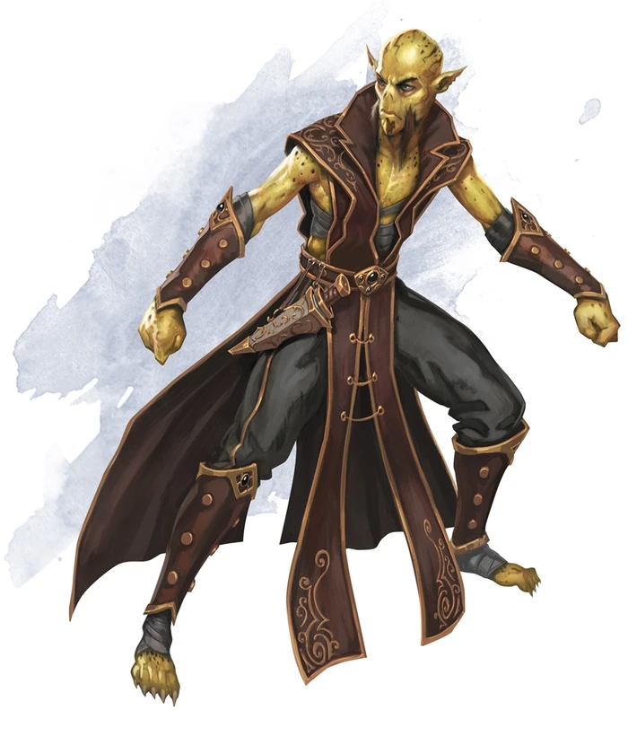

# Githzerai
Githzerai are otherworldly folk with psionic powers who share an ancestral link to githyanki (also in this book). The githzerai followers of the great leader Zaerith Menyar-Ag-Gith are an ascetic people who live apart from the rest of the cosmos, within the confines of fortresses floating through the chaos of Limbo. Instead of imposing their will on other peoples, they focus on controlling and manipulating their endlessly malleable home.

> Jump to: [Githzerai Monk](Githzerai.md#githzerai-monk) | [Githzerai Zerth](Githzerai.md#githzerai-zerth) | [Githzerai Anarch](Githzerai.md#githzerai-anarch) | [Githzerai Enlightened](Githzerai.md#githzerai-enlightened)

Focused philosophers and austere ascetics, the githzerai pursue lives of rigid order. Lean and muscular, they wear unadorned clothing free of ornamentation, keeping their own counsel and trusting few creatures outside of their own kind. Having turned their backs on their warlike githyanki kin, the githzerai maintain a strict monastic lifestyle, dwelling on islands of order in the vast sea of chaos that is the plane of Limbo.

***Order amid Chaos.*** The githzerai willingly dwell in the heart of utter chaos in Limbo — a twisting, mercurial plane prone to manipulation and subjugation by githzerai minds strong enough to master it. Limbo is a maelstrom of primal matter and energy, its terrain a storm of rock and earth swept up in torrents of murky liquid, buffeted by strong winds, blasted by fire, and chilled by crushing walls of ice.

The forces of Limbo react to sentience, however. Using the power of their minds, the githzerai tame the plane's chaotic elements, causing them to settle into fixed and survivable forms and creating oases and sanctuaries within the maelstrom.

Githzerai fortress-monasteries stand resolute against the chaos that surrounds them, virtually impervious to the turmoil of their surroundings, because the githzerai will it. Each monastery is overseen by monks that impose a strict schedule of chants, meals, martial arts training, and devotions according to their own philosophy. Behind their psionically fortified walls, the githzerai embrace thought, learning, psionic power, order, and discipline above all other things.

The social hierarchy of the githzerai is based on merit, and those githzerai who are the wisest teachers and the most skilled at physical and mental combat become leaders. The githzerai revere great heroes and teachers of the past, emulating those figures' virtues in their everyday lives.

***Disciples of Zerthimon.*** Githzerai revere Zerthimon, the founder of their race. Although Gith won their people's freedom, Zerthimon saw her as unfit to lead. He believed that her warmongering would soon make her a tyrant no better than the mind flayers.

***Psionic Adepts.*** The progenitors of the githzerai adapted to — and were transformed by — the psychic environment imposed on them by their illithid overlords. Under the teachings of Zerthimon, who called on his people to abandon the warlike ambitions of Gith, the githzerai focused their mental energy on creating physical and psychic barriers to protect them from attack, psychic or otherwise. Fighting is personal to a githzerai, which uses its mind to daze and incapacitate opponents, leaving them vulnerable to physical punishment.

***Beyond Limbo.*** Though githzerai rarely deal with the realms beyond Limbo, advanced monks of other races sometimes seek out a githzerai monastery and attempt to gain admittance as students. More rarely, a githzerai master establishes a hidden monastery on the Material Plane to train young githzerai or to spread the philosophy and teachings of Zerthimon.

As disciplined as they are, the githzerai have never forgotten their long imprisonment by the mind flayers. As a special devotion, they organize a rrakkma — an illithid hunting party — to other planes, not returning to their monasteries until they slay at least as many illithids as there are hunters in the party.

***Playable Race: Masters of Mind.*** [Githzerai](../Races/Gith.md) are a playable race by players interested in doing so. Githzerai gravitate towards rogue, clerical, and monk careers, however both githyanki and githzerai races have shown they are equally facile in any class. While they are under no obligations to continue their ancestral hatred of the other side of their gith heritage, players should prepare a backstory that explains their particular reactions if they deviate from the norm. Note that gith are not common in Azgaarnoth, and as such they will often be mistaken for "Charisma-challenged elves".

---

## Githzerai Monk
(No description given)

### Environment
(FIXME)

### Token

>### Githzerai Monk
>*Medium humanoid (gith), lawful neutral*
>___
>- **Armor Class** 14
>- **Hit Points** 38 (7d8 + 7)
>- **Speed** 30 ft.
>___
>|**STR**|**DEX**|**CON**|**INT**|**WIS**|**CHA**|
>|:---:|:---:|:---:|:---:|:---:|:---:|
>|12 (+1)|15 (+2)|12 (+1)|13 (+1)|14 (+2)|10 (+0)|
>
>___
>- **Proficiency Bonus** +2
>- **Saving Throws** Str +3,Dex +4,Int +3,Wis +4
>- **Damage Vulnerabilities** 
>- **Damage Resistances** 
>- **Damage Immunities** 
>- **Condition Immunities** 
>- **Skills** Insight +4,Perception +4
>- **Senses** passive Perception 14
>- **Languages** Gith
>- **Challenge** 2
>___
>***Innate Spellcasting (Psionics).*** The githzerai's innate spellcasting ability is Wisdom. It can innately cast the following spells, requiring no components:
>
>* *At will:* mage hand (the hand is invisible)
>* *3/day each:* feather fall, jump, see invisibility, shield
>
>***Psychic Defense.*** While the githzerai is wearing no armor and wielding no shield, its AC includes its Wisdom modifier.
>
>#### Actions
>***Multiattack.*** The githzerai makes two unarmed strikes.
>
>***Unarmed Strike.*** Melee Weapon Attack: +4 to hit, reach 5 ft., one target. Hit: 6 (1d8 + 2) bludgeoning damage plus 9 (2d8) psychic damage. This is a magic weapon attack.
>

---

## Githzerai Zerth
Skilled githzerai monks that best exemplify the teachings and principles of Zerthimon are called zerths. These powerful and disciplined monks can shift their bodies from one plane to another using only the power of their minds.

### Environment
(FIXME)

### Token

>### Githzerai Zerth
>*Medium humanoid (gith), lawful neutral*
>___
>- **Armor Class** 17
>- **Hit Points** 84 (13d8 + 26)
>- **Speed** 30 ft.
>___
>|**STR**|**DEX**|**CON**|**INT**|**WIS**|**CHA**|
>|:---:|:---:|:---:|:---:|:---:|:---:|
>|13 (+1)|18 (+4)|15 (+2)|16 (+3)|17 (+3)|12 (+1)|
>
>___
>- **Proficiency Bonus** +3
>- **Saving Throws** Str +4,Dex +7,Int +6,Wis +6
>- **Damage Vulnerabilities** 
>- **Damage Resistances** 
>- **Damage Immunities** 
>- **Condition Immunities** 
>- **Skills** Arcana +6,Insight +6,Perception +6
>- **Senses** passive Perception 16
>- **Languages** Gith
>- **Challenge** 6
>___
>***Innate Spellcasting (Psionics).*** The githzerai's spellcasting ability is Wisdom (spell save DC 14, +6 to hit with spell attacks). It can innately cast the following spells, requiring no components:
>
>* *At will:* mage hand (the hand is invisible)
>* *3/day each:* feather fall, jump, see invisibility, shield
>* *1/day each:* phantasmal killer, plane shift
>
>***Psychic Defense.*** While the githzerai is wearing no armor and wielding no shield, its AC includes its Wisdom modifier.
>
>#### Actions
>***Multiattack.*** The githzerai makes two unarmed strikes.
>
>***Unarmed Strike.*** Melee Weapon Attack: +7 to hit, reach 5 ft., one target. Hit: 11 (2d6 + 4) bludgeoning damage plus 13 (3d8) psychic damage. This is a magic weapon attack.
>

---

## Githzerai Anarch
Anarchs are githzerai sages and mystics who lead communities and maintain the adamantine citadels that serve as strong points in Limbo and on other planes. They have formidable psionic capabilities and are able to manipulate the unformed substance of their adopted plane with a thought.

### Environment
(FIXME)

### Token

>### Githzerai Anarch
>*Medium humanoid  (Gith), Any Alignment*
>___
>- **Armor Class** 20 (Psychic Defense)
>- **Hit Points** 144 (17d8 + 68)
>- **Speed** 30 ft., fly 40 ft. (hover)
>___
>|**STR**|**DEX**|**CON**|**INT**|**WIS**|**CHA**|
>|:---:|:---:|:---:|:---:|:---:|:---:|
>|16 (+3)|21 (+5)|18 (+4)|18 (+4)|20 (+5)|14 (+2)|
>
>___
>- **Proficiency Bonus** +5
>- **Saving Throws** Str +8,Dex +10,Int +9,Wis +10
>- **Damage Vulnerabilities** 
>- **Damage Resistances** 
>- **Damage Immunities** 
>- **Condition Immunities** 
>- **Skills** Arcana +9,Insight +10,Perception +10
>- **Senses** passive Perception 20
>- **Languages** Gith
>- **Challenge** 16
>___
>***Legendary Resistance (3/Day).*** If the githzerai fails a saving throw, it can choose to succeed instead.
>
>***Psychic Defense.*** While the githzerai is wearing no armor and wielding no shield, its AC includes its Wisdom modifier.
>
>#### Actions
>***Multiattack.*** The githzerai makes three Unarmed Strike attacks.
>
>***Unarmed Strike.*** Melee Weapon Attack: +10 to hit, reach 5 ft., one target. Hit: 9 (1d8 + 5) bludgeoning damage plus 18 (4d8) psychic damage.
>
>***Spellcasting (Psionics).*** The githzerai casts one of the following spells, requiring no spell components and using Wisdom as the spellcasting ability (spell save DC 18):
>
>* *At will:* mage hand (the hand is invisible)
>* *3/day each:* see invisibility, telekinesis
>* *1/day each:* globe of invulnerability, plane shift, wall of force
>
>#### Legendary Actions
>The githzerai can take 3 legendary actions, choosing from the options below. Only one legendary action option can be used at a time and only at the end of another creature's turn. The githzerai regains spent legendary actions at the start of its turn.
>
>***Strike.*** The githzerai makes one Unarmed Strike attack.
>
>***Teleport.*** The githzerai teleports, along with any equipment it is wearing or carrying, to an unoccupied space it can see within 30 feet of it.
>
>***Change Gravity (Costs 3 Actions).*** The githzerai casts the reverse gravity spell, using Wisdom as the spellcasting ability. The spell has the normal effect, except that the githzerai can orient the area in any direction and creatures and objects fall toward the end of the area.
>
>### Lair Actions
>
> Create Object. The anarch casts the creation spell (as a 9th-level spell) using the unformed substance of Limbo instead of shadow material. If used in Limbo, the object remains until the anarch's concentration is broken, regardless of its composition. If the anarch moves more than 120 feet from the object, the anarch's concentration breaks.
>
> Move Object. The anarch can magically move an object it can see within 150 feet of it by making a Wisdom check with advantage. The DC depends on the object's size: DC 5 for Tiny, DC 10 for Small, DC 15 for Medium, DC 20 for Large, and DC 25 for Huge or larger.
>
> Psionic Bolt. The anarch casts the lightning bolt spell (at 5th level), but the anarch can change the damage type from lightning to cold, fire, psychic, radiant, or thunder. If the spell deals damage other than fire or lightning, it doesn't ignite flammable objects.
>
>### Regional Effects
>
> Form Substance. In Limbo, the anarch can spend 10 minutes stabilizing a 5-mile area centered on it, causing the unformed substance to take whatever inanimate form the anarch chooses. During that process, the anarch determines the shape and composition of the forms created.
>
> Stabilize Object. The anarch stabilizes any object created in Limbo and brought to the Material Plane for as long as the anarch remains within 1 mile of it (no action required).
>
> If the anarch dies, these effects end after 1d6 rounds. All formed substance becomes a chaotic churn of energy and matter, unraveling into unformed substance that dissipates 1d6 rounds later.
>

### A Githzerai Anarch's Lair
In Limbo, githzerai anarchs create islands of tranquility in this turbulent plane. An anarch can use its psionic power to give form to formless substance, creating mountains, lakes, and structures to serve as a foundation for a githzerai community.The anarch's challenge rating is 17 (18,000 XP) when it's encountered in its lair.

#### Lair Actions

#### Regional Effects

---

## Githzerai Enlightened
Some spiritual githzerai spend long hours in meditation to transcend the limits of their forms and to apprehend the nature of reality. Zerths who complete the next tier of their training become known as the enlightened.

### Environment
(FIXME)

### Token

>### Githzerai Enlightened
>*Medium humanoid  (Gith), Any Alignment*
>___
>- **Armor Class** 18 (Psychic Defense)
>- **Hit Points** 112 (15d8 + 45)
>- **Speed** 40 ft.
>___
>|**STR**|**DEX**|**CON**|**INT**|**WIS**|**CHA**|
>|:---:|:---:|:---:|:---:|:---:|:---:|
>|14 (+2)|19 (+4)|16 (+3)|17 (+3)|19 (+4)|13 (+1)|
>
>___
>- **Proficiency Bonus** +4
>- **Saving Throws** Str +6,Dex +8,Int +7,Wis +8
>- **Damage Vulnerabilities** 
>- **Damage Resistances** 
>- **Damage Immunities** 
>- **Condition Immunities** 
>- **Skills** Arcana +7,Insight +8,Perception +8
>- **Senses** passive Perception 18
>- **Languages** Gith
>- **Challenge** 10
>___
>***Psychic Defense.*** While the githzerai is wearing no armor and wielding no shield, its AC includes its Wisdom modifier.
>
>#### Actions
>***Multiattack.*** The githzerai makes three Unarmed Strike attacks.
>
>***Unarmed Strike.*** Melee Weapon Attack: +8 to hit, reach 5 ft., one target. Hit: 13 (2d8 + 4) bludgeoning damage plus 18 (4d8) psychic damage.
>
>***Spellcasting (Psionics).*** The githzerai casts one of the following spells, requiring no spell components and using Wisdom as the spellcasting ability (spell save DC 16):
>
>* *At will:* mage hand (the hand is invisible)
>* *3/day:* see invisibility
>* *1/day each:* plane shift, teleport
>
>***Temporal Strike (Recharge 6).*** Melee Weapon Attack: +8 to hit, reach 5 ft., one creature. Hit: 13 (2d8 + 4) bludgeoning damage plus 52 (8d12) psychic damage. The target must succeed on a DC 16 Wisdom saving throw or move 1 round forward in time. A target moved forward in time vanishes for the duration. When the effect ends, the target reappears in the space it left or in an unoccupied space nearest to that space if it's occupied.
>
>#### Reactions
>***Slow Fall.*** When the githzerai falls, it reduces any falling damage it takes by 50.
>

