# Gnolls
Gnolls are feral humanoids that attack settlements along the frontiers and borderlands of civilization without warning, slaughtering their victims and devouring their flesh. Gnolls are infamous among "civilized" nations for their brutality and demonic heritage. For the most part, they earned their reputation honestly. Many gnoll packs are indeed aggressive and have a demonic side to their affairs. Typically they worship the demon lord Yeenoghu. They also tend to be rather aggressive and are still mistrusted and avoided. To them, the pack is more important than anything else.

> Jump to: [Gnoll](Gnolls.md#gnoll) | [Gnoll Pack Lord](Gnolls.md#gnoll-pack-lord) | [Gnoll Fang of Yeenoghu](Gnolls.md#gnoll-fang-of-yeenoghu) | [Flind](Gnolls.md#flind) | [Gnoll Flesh Gnawer](Gnolls.md#gnoll-flesh-gnawer) | [Gnoll Hunter](Gnolls.md#gnoll-hunter) | [Gnoll Witherling](Gnolls.md#gnoll-witherling) | [Gnoll Headhunter](Gnolls.md#gnoll-headhunter) | [Gnoll Hunt Master](Gnolls.md#gnoll-hunt-master)

***Hordish Background.*** Gnoll packs were a large part of the Hordes that battled against the Eldar from the earliest days of Azgaarnoth's history; since that time, most have continued their tribal, nomadic ways, generally moving southward and now making up a significant percentage of the Ulmhorde. Some tribes chose to seek a more permanent existence within the more "civilized" Hordes, and many gnolls found themselves finding peace within Yithi and Zhi. Other tribes keep to their nomadic background but seek less to pillage and more to trade. Those gnolls who have "civilized" tend to worship any of the other gods *except* Yeenoghu.

***Demonic Origin.*** The origin of the gnolls traces back to the coming of the Hordes, but gnoll shamans tell of a time when the demon lord Yeenoghu found his way to the Material Plane and ran amok. Packs of ordinary hyenas followed in his wake, scavenging the demon lord's kills. Those hyenas were transformed into the first gnolls, parading after Yeenoghu until he was banished back to the Abyss. The gnolls then scattered across the face of the world, a dire reminder of demonic power.

***Nomadic Destroyers.*** Gnolls are dangerous because they strike at random. They emerge from the wilderness, plunder and slaughter, then move elsewhere. They attack like a plague of locusts, pillaging settlements and leaving little behind but razed buildings, gnawed corpses, and befouled land. Gnolls choose easy targets for their raids. Armored warriors holed up in a fortified castle will survive a rampaging gnoll horde unscathed, even as the towns, villages, and farms that surround the castle are ablaze, their people slaughtered and devoured.

Gnolls rarely build permanent structures or craft anything of lasting value. They don't make weapons or armor, but scavenge such items from the corpses of their fallen victims, stringing ears, teeth, scalps, and other trophies from their foes onto their patchwork armor. Some gnolls will move into cities, but often their personal hygiene habits clash with those of a city, and as a result most will reside either just outside the city walls in tents or huts, or in the worst parts of town. In fact, more than once a gnoll tribe has moved into the slums of a large city and essentially traded the plunder-and-slaughter of wilderness life for the muted-but-more-rewarding lesser-levels-of-plunder-and-slaughter they can get away with in the Slums. However, should two gnoll tribes encouter each other in the same slums district, they will immediately break out into open conflict until one tribe has defeated and absorbed the other.

***Thirst for Blood.*** No goodness or compassion resides in the heart of a gnoll. Like a demon, it lacks anything resembling a conscience, and can't be taught or coerced to put aside its destructive tendencies. The gnolls' frenzied bloodlust makes them an enemy to all, and when they lack a common foe, they fight among themselves. Even the most savage orcs avoid allying with gnolls.

## Physical Description
Demon-worshiping is not the only reason many races are wary of gnolls. A lean, muscular 7-foot tall gnoll can be an imposing sight. Despite their musculature, they move rather quickly, easily outpacing most other races. Gnolls also outpace most other races in how quickly they mature. A gnoll matures by the age of 5 and lives to be about 30. Oddly a gnoll's vitality will remain with them until very soon before their natural death.

Gnolls have reflective eyes that are typically bright green or yellow. They also have a thick coat of fur, which is generally light brown or dark brown. Certain clans may possess a single-colored coat or a spotted or striped coat. Some gnolls possess crest like manes of hair going from their head down their spine which rise up when they become frightened or angry.

Adding to other races distrust about gnolls, occasionally a gnoll's demonic ancestry will result in peculiar physical traits. This might be manifested in the claws of gnoll claw fighters or an abnormal eye or coat colors.

## History
Gnolls are widely known as raiders and slavers. The pack will often serve as a "reconnaissance-in-force" scouting party for a Horde making its way across the landscape during a campaign, but gnolls typically are not known as civilized soldiers. In the middle of the night, they attack a village or town, killing and eating guards and taking slaves. These slaves are then brutalized physically and mentally. This has become an art among many gnoll tribes. In fact, many gnoll tribes have *tantekurash* or "spirit breakers" who are experts at breaking the wills of slaves. If the slave resists, it is eaten. Occasionally a slave's mind becomes so broken they revere the brutality of their gnoll captors. They then become *kryshantel* or "savage souls" who follow their gnoll masters into battle as thralls. (It is rumored that some have applied the same formula to captured gnolls and earned the loyalty of the gnoll, but this method retains the gnoll's love of savagery and brutality, making it a tactic generally only used by those who wish to use the gnoll for such purposes.)

However, not all gnoll tribes are evil. There are a scattered few nomadic tribes who specialize as hunters and trappers. They may even come to peacefully interact with other races and often offer their service as hunters or trappers. Even so, they remain fairly aggressive and quick to anger, so other races have to be careful not to offend them. One large gnoll pack has even formed a mercenary company, the [Barking Dogs](../Organizations/MercCompanies/BarkingDogs.md). The [Dread Emperor](../People/DreadEmperor.md) has been rumored to be capturing and "turning" gnoll packs to serve as part of his armies, though if this is true they have yet to be used anywhere other than on the front lines against the Ulmhorde. Gnolls are also particularly desirable bodygards for the [Zhi](../Nations/Zhi.md) mystics and elite, as they are extremely difficult to be bought or enticed to betrayal.

In addition to the typical variety of gnoll, there is a sub-race known as flind gnolls. They tend to be shorter and stouter than other gnolls, use flindbars more commonly, and live in more hilly areas than other gnolls who live in plains. Flind gnolls can be either raiders or hunters as described above. If you want to play a flind gnoll, make yourself somewhat short and stout and consider using a flindbar.

***Society.*** While there may be struggles within packs to determine who the alpha is, throughout these conflicts, both sides remain allies. To gnolls, the good of the pack is far more important than any personal glory. As a result, gnolls can be loyal to a fault to their chosen pack. In battle gnolls strive endlessly to prevent their packmates from being harmed, even taking an injury themselves.

Furthermore, a gnoll's mind is undeniably primal. They are natural predators and love the thrill and challenge of the hunt. This has resulted in a few traits in most gnolls. For the most part, gnolls prefer the wilds to any sort of urban area, though there are exceptions who see a city as a unique form of wilderness. Moreover, gnolls typically avoid diplomacy in favor of intimidating an answer out of others. It is simpler that way.

***Monstrous Gnoll Feats.*** For those gnolls which are favored by Yeenoghu enough to survive to the appropriate levels, a number of gnoll-specific [feats](../Classes/Feats.md) are available.

***Playable Race: Incomparable Companions.*** Gnoll [player characters](../Races/Gnolls.md) can be of any temperament--within the last millenium, an enlightenment has reached a number of gnoll packs, and those who seek more than just plunder and slaughter have made their way into a more "civilized" existence. While exceptions exist, most gnolls continue to show their traditional ways, and when coming upon a gnoll in the wild, travelers are strongly suggested to keep weapons close at hand.

---

## Gnoll
The average gnoll is fierce, aggressive, and loyal to their pack. They can often be cowed into submission (or at least out of aggression) by displays of strength and power, but the pack backing them makes them braver than they often should be, and when a gnoll feels brave, it tends to attack first and think later.

### Environment
Coastal, Desert, Forest, Grassland, Hill, Mountain, Swamp, Underdark, Urban

### Token
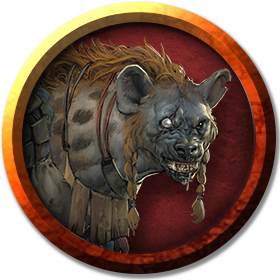

>### Gnoll
>*Medium humanoid (gnoll), chaotic evil*
>___
>- **Armor Class** 15 (hide armor, shield)
>- **Hit Points** 22 (5d8)
>- **Speed** 30 ft.
>___
>|**STR**|**DEX**|**CON**|**INT**|**WIS**|**CHA**|
>|:---:|:---:|:---:|:---:|:---:|:---:|
>|14 (+2)|12 (+1)|11 (+0)|6 (-2)|10 (+0)|7 (-2)|
>
>___
>- **Proficiency Bonus** +2
>- **Saving Throws** 
>- **Damage Vulnerabilities** 
>- **Damage Resistances** 
>- **Damage Immunities** 
>- **Condition Immunities** 
>- **Skills** 
>- **Senses** darkvision 60 ft.,passive Perception 10
>- **Languages** Gnoll
>- **Challenge** 1/2
>___
>***Rampage.*** When the gnoll reduces a creature to 0 hit points with a melee attack on its turn, the gnoll can take a bonus action to move up to half its speed and make a bite attack.
>
>#### Actions
>***Bite.*** Melee Weapon Attack: +4 to hit, reach 5 ft., one creature. Hit: 4 (1d4 + 2) piercing damage.
>
>***Spear.*** Melee or Ranged Weapon Attack: +4 to hit, reach 5 ft. or range 20/60 ft., one target. Hit: 5 (1d6 + 2) piercing damage, or 6 (1d8 + 2) piercing damage if used with two hands to make a melee attack.
>
>***Longbow.*** Ranged Weapon Attack: +3 to hit, range 150/600 ft., one target. Hit: 5 (1d8 + 1) piercing damage.
>

---

## Gnoll Pack Lord
The alpha of a gnoll pack is the pack lord, ruling by might and cunning. A pack lord earns the best of a gnoll pack's spoils, food, valuable trinkets, and magic items. It ornaments its body with brutal piercings and grotesque trophies, dyeing its fur with demonic sigils, hoping Yeenoghu will make it invulnerable.

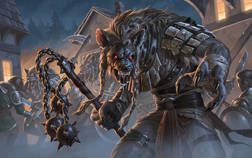

### Environment
Coastal, Desert, Forest, Grassland, Hill, Mountain, Swamp, Underdark, Urban

### Token
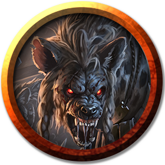

>### Gnoll Pack Lord
>*Medium humanoid (gnoll), chaotic evil*
>___
>- **Armor Class** 15 (chain shirt)
>- **Hit Points** 49 (9d8 + 9)
>- **Speed** 30 ft.
>___
>|**STR**|**DEX**|**CON**|**INT**|**WIS**|**CHA**|
>|:---:|:---:|:---:|:---:|:---:|:---:|
>|16 (+3)|14 (+2)|13 (+1)|8 (-1)|11 (+0)|9 (-1)|
>
>___
>- **Proficiency Bonus** +2
>- **Saving Throws** 
>- **Damage Vulnerabilities** 
>- **Damage Resistances** 
>- **Damage Immunities** 
>- **Condition Immunities** 
>- **Skills** 
>- **Senses** darkvision 60 ft.,passive Perception 10
>- **Languages** Gnoll
>- **Challenge** 2
>___
>***Rampage.*** When the gnoll reduces a creature to 0 hit points with a melee attack on its turn, the gnoll can take a bonus action to move up to half its speed and make a bite attack.
>
>#### Actions
>***Multiattack.*** The gnoll makes two attacks, either with its glaive or its longbow, and uses its Incite Rampage if it can.
>
>***Bite.*** Melee Weapon Attack: +5 to hit, reach 5 ft., one creature. Hit: 5 (1d4 + 3) piercing damage.
>
>***Glaive.*** Melee Weapon Attack: +5 to hit, reach 10 ft., one target. Hit: 8 (1d10 + 3) slashing damage.
>
>***Longbow.*** Ranged Weapon Attack: +4 to hit, range 150/600 ft., one target. Hit: 6 (1d8 + 2) piercing damage.
>
>***Incite Rampage (Recharge 5–6).*** One creature the gnoll can see within 30 feet of it can use its reaction to make a melee attack if it can hear the gnoll and has the Rampage trait.
>

---

## Gnoll Fang of Yeenoghu
Gnolls celebrate their victories by performing demonic rituals and making blood offerings to Yeenoghu. Sometimes the demon lord rewards his worshipers by allowing one of them to be possessed by a demonic spirit. Marked as Yeenoghu's favorite, the lucky recipient becomes a fang of Yeenoghu, the chosen of the Gnoll Lord. In much the same way Yeenoghu created the first gnolls, a hyena that feasts on a fang's slain foe undergoes a horrible transformation, becoming a full-grown adult gnoll. Depending on the number of hyenas in a region, a fang of Yeenoghu can lead to a startling increase in the gnoll population. Finding and killing the fang is the only way to keep that population in check.

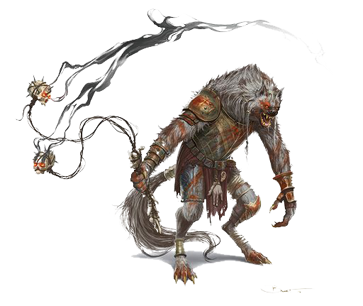

### Environment
Coastal, Desert, Forest, Grassland, Hill, Mountain, Swamp, Underdark, Urban

### Token
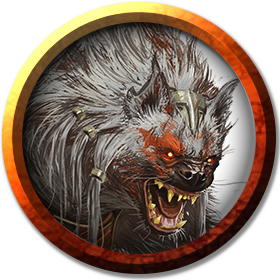

>### Gnoll Fang of Yeenoghu
>*Medium fiend (gnoll), chaotic evil*
>___
>- **Armor Class** 14 (hide armor)
>- **Hit Points** 65 (10d8 + 20)
>- **Speed** 30 ft.
>___
>|**STR**|**DEX**|**CON**|**INT**|**WIS**|**CHA**|
>|:---:|:---:|:---:|:---:|:---:|:---:|
>|17 (+3)|15 (+2)|15 (+2)|10 (+0)|11 (+0)|13 (+1)|
>
>___
>- **Proficiency Bonus** +2
>- **Saving Throws** Con +4,Wis +2,Cha +3
>- **Damage Vulnerabilities** 
>- **Damage Resistances** 
>- **Damage Immunities** 
>- **Condition Immunities** 
>- **Skills** 
>- **Senses** darkvision 60 ft.,passive Perception 10
>- **Languages** Abyssal,Gnoll
>- **Challenge** 4
>___
>***Rampage.*** When the gnoll reduces a creature to 0 hit points with a melee attack on its turn, the gnoll can take a bonus action to move up to half its speed and make a bite attack.
>
>#### Actions
>***Multiattack.*** The gnoll makes three attacks: one with its bite and two with its claws.
>
>***Bite.*** Melee Weapon Attack: +5 to hit, reach 5 ft., one creature. Hit: 6 (1d6 + 3) piercing damage, and the target must succeed on a DC 12 Constitution saving throw or take 7 (2d6) poison damage.
>
>***Claw.*** Melee Weapon Attack: +5 to hit, reach 5 ft., one target. Hit: 7 (1d8 + 3) slashing damage.
>

---

## Flind
When the demon lord Yeenoghu (appears in this book) wants to create a particularly fearsome war band leader, he transforms an exceptionally strong and vicious gnoll into a demonic warrior known as a flind.

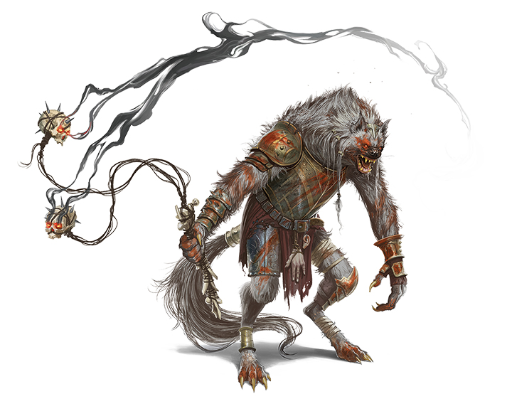

A war band of demon-worshiping gnolls typically contains only one flind, and that creature sets the war band's path. Because of its special connection to Yeenoghu, a flind uses demonic insight to guide the gnolls toward weak prey ripe for slaughter.

Unlike other leaders who might skulk behind their minions, a flind leads the charge in battle. Its flail causes wracking pain, paralysis, and disorientation in those it strikes.

### Environment
Coastal, Desert, Forest, Grassland, Hill, Mountain, Swamp, Underdark, Urban

### Token
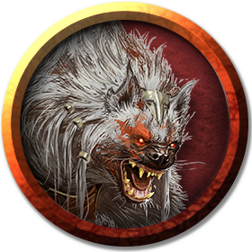

>### Flind
>*Medium fiend (Gnoll), Typically Chaotic Evil*
>___
>- **Armor Class** 16 (breastplate)
>- **Hit Points** 127 (15d8 + 60)
>- **Speed** 30 ft.
>___
>|**STR**|**DEX**|**CON**|**INT**|**WIS**|**CHA**|
>|:---:|:---:|:---:|:---:|:---:|:---:|
>|20 (+5)|14 (+2)|19 (+4)|11 (+0)|13 (+1)|12 (+1)|
>
>___
>- **Proficiency Bonus** +4
>- **Saving Throws** Con +8,Wis +5
>- **Damage Vulnerabilities** 
>- **Damage Resistances** 
>- **Damage Immunities** 
>- **Condition Immunities** 
>- **Skills** Intimidate +5,Perception +5
>- **Senses** darkvision 60 ft.,passive Perception 15
>- **Languages** Gnoll,Abyssal
>- **Challenge** 9
>___
>***Aura of Bloodthirst.*** If the flind isn't incapacitated, any creature that has Rampage can make a Bite attack as a bonus action while within 10 feet of the flind.
>
>#### Actions
>***Multiattack.*** The flind makes one Flail of Chaos attack, one Flail of Pain attack, and one Flail of Paralysis attack, or it makes three Longbow attacks.
>
>***Flail of Chaos.*** Melee Weapon Attack: +9 to hit, reach 10 ft., one target. Hit: 10 (1d10 + 5) bludgeoning damage, and the target must make a DC 16 Wisdom saving throw. On a failed save, the target must use its reaction, if available, to make one melee attack against a random creature, other than the flind, within its reach. If there's no creature within reach, the target instead moves half its speed in a random direction.
>
>***Flail of Pain.*** Melee Weapon Attack: +9 to hit, reach 10 ft., one target. Hit: 10 (1d10 + 5) bludgeoning damage plus 16 (3d10) psychic damage.
>
>***Flail of Paralysis.*** Melee Weapon Attack: +9 to hit, reach 10 ft., one target. Hit: 10 (1d10 + 5) bludgeoning damage, and the target must succeed on a DC 16 Constitution saving throw or be paralyzed until the end of its next turn.
>
>***Longbow.*** Ranged Weapon Attack: +6 to hit, range 150/600 ft., one target. Hit: 6 (1d8 + 2) piercing damage.
>

---

## Gnoll Flesh Gnawer
These gnolls eschew the use of ranged weapons in favor of short blades that they wield with great speed and efficiency. In the thick of a fight, they dash across the battlefield, slashing and snarling as they run down stragglers and finish off wounded foes.

### Environment
Coastal, Desert, Forest, Grassland, Hill, Mountain, Swamp, Underdark, Urban

### Token

>### Gnoll Flesh Gnawer
>*Medium monstrosity, Typically Chaotic Evil*
>___
>- **Armor Class** 14 (studded leather)
>- **Hit Points** 22 (4d8 + 4)
>- **Speed** 30 ft.
>___
>|**STR**|**DEX**|**CON**|**INT**|**WIS**|**CHA**|
>|:---:|:---:|:---:|:---:|:---:|:---:|
>|12 (+1)|14 (+2)|12 (+1)|8 (-1)|10 (+0)|8 (-1)|
>
>___
>- **Proficiency Bonus** +2
>- **Saving Throws** Dex +4
>- **Damage Vulnerabilities** 
>- **Damage Resistances** 
>- **Damage Immunities** 
>- **Condition Immunities** 
>- **Skills** 
>- **Senses** darkvision 60 ft.,passive Perception 10
>- **Languages** Gnoll
>- **Challenge** 1
>___
>#### Actions
>***Multiattack.*** The gnoll makes one Bite attack and two Shortsword attacks.
>
>***Bite.*** Melee Weapon Attack: +4 to hit, reach 5 ft., one target. Hit: 4 (1d4 + 2) piercing damage.
>
>***Shortsword.*** Melee Weapon Attack: +4 to hit, reach 5 ft., one target. Hit: 5 (1d6 + 2) piercing damage.
>
>***Sudden Rush.*** Until the end of the turn, the gnoll's speed increases by 60 feet and it doesn't provoke opportunity attacks.
>
>#### Bonus Actions
>***Rampage.*** After the gnoll reduces a creature to 0 hit points with a melee attack on its turn, the gnoll moves up to half its speed and makes a Bite attack.
>

---

## Gnoll Hunter
Hunters are the stealthiest gnolls in a war band. In the vanguard, they creep around, picking off isolated opposition while clearing the way for the rest of the force to advance.

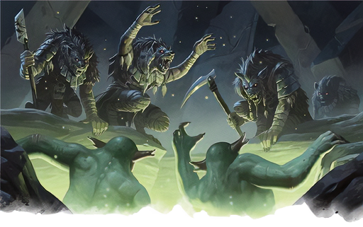

Hunters are particularly skilled with the longbow, and they fire arrows with viciously barbed heads. Even when a hunter doesn't kill their target with their first shot, the arrow strike brings so much pain that the victim is hobbled in its attempt to run away.

### Environment
Coastal, Desert, Forest, Grassland, Hill, Mountain, Swamp, Underdark, Urban

### Token
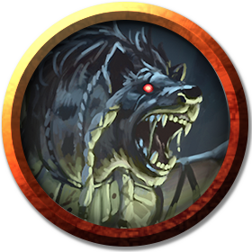

>### Gnoll Hunter
>*Medium monstrosity, Typically Chaotic Evil*
>___
>- **Armor Class** 13 (leather armor)
>- **Hit Points** 22 (4d8 + 4)
>- **Speed** 30 ft.
>___
>|**STR**|**DEX**|**CON**|**INT**|**WIS**|**CHA**|
>|:---:|:---:|:---:|:---:|:---:|:---:|
>|14 (+2)|14 (+2)|12 (+1)|8 (-1)|12 (+1)|8 (-1)|
>
>___
>- **Proficiency Bonus** +2
>- **Saving Throws** 
>- **Damage Vulnerabilities** 
>- **Damage Resistances** 
>- **Damage Immunities** 
>- **Condition Immunities** 
>- **Skills** Perception +3,Stealth +4
>- **Senses** darkvision 60 ft.,passive Perception 13
>- **Languages** Gnoll
>- **Challenge** 1/2
>___
>#### Actions
>***Multiattack.*** The gnoll makes two Bite, Spear, or Longbow attacks.
>
>***Bite.*** Melee Weapon Attack: +4 to hit, reach 5 ft., one target. Hit: 4 (1d4 + 2) piercing damage.
>
>***Spear.*** Melee or Ranged Weapon Attack: +4 to hit, reach 5 ft. or range 20/60 ft., one target. Hit: 5 (1d6 + 2) piercing damage, or 6 (1d8 + 2) piercing damage when used with two hands to make a melee attack.
>
>***Longbow.*** Ranged Weapon Attack: +4 to hit, range 150/600 ft., one target. Hit: 6 (1d8 + 2) piercing damage, and the target's speed is reduced by 10 feet until the end of its next turn.
>
>#### Bonus Actions
>***Rampage.*** After the gnoll reduces a creature to 0 hit points with a melee attack on its turn, the gnoll moves up to half its speed and makes a Bite attack.
>

---

## Gnoll Witherling
Sometimes the gnolls of Yeenoghu turn against each other, perhaps to determine who rules a war band or because of extreme starvation. Even under ordinary circumstances, gnolls that are deprived of victims for too long struggle to control their hunger and violent urges. Eventually, they fight among themselves.

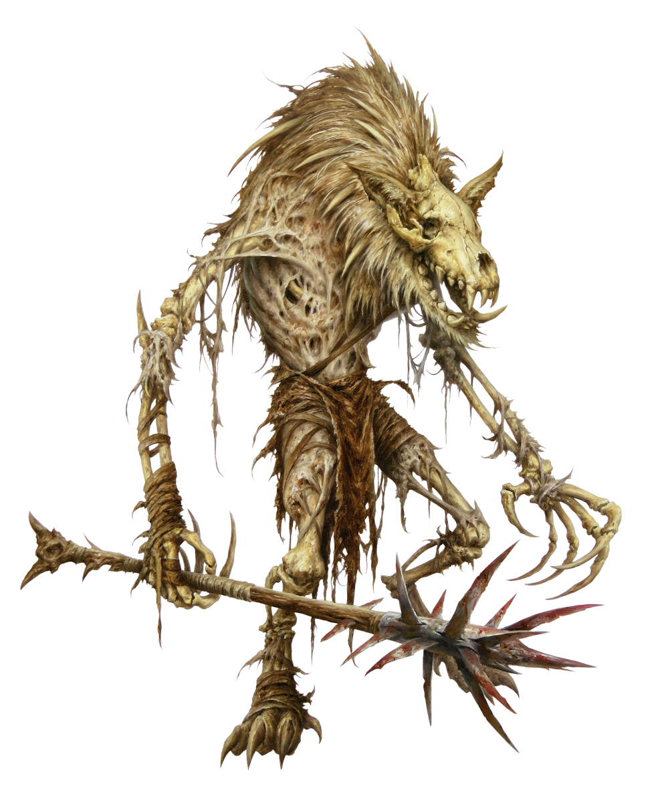

The survivors devour the flesh of their slain comrades but preserve the bones. Then, by invoking rituals to Yeenoghu (appears in this book) they bring the remains back to a semblance of life in the form of a gnoll witherling. 

Witherlings travel with their comrades and try to kill anything in their path. They don't eat and aren't motivated by hunger, leaving more flesh for the rest of the war band.

### Environment
Coastal, Desert, Forest, Grassland, Hill, Mountain, Swamp, Underdark, Urban

### Token
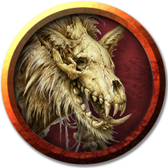

>### Gnoll Witherling
>*Medium undead, Typically Chaotic Evil*
>___
>- **Armor Class** 12 (natural armor)
>- **Hit Points** 11 (2d8 + 2)
>- **Speed** 30 ft.
>___
>|**STR**|**DEX**|**CON**|**INT**|**WIS**|**CHA**|
>|:---:|:---:|:---:|:---:|:---:|:---:|
>|14 (+2)|8 (-1)|12 (+1)|5 (-3)|5 (-3)|5 (-3)|
>
>___
>- **Proficiency Bonus** +2
>- **Saving Throws** 
>- **Damage Vulnerabilities** 
>- **Damage Resistances** 
>- **Damage Immunities** poison
>- **Condition Immunities** exhaustion,poisoned
>- **Skills** 
>- **Senses** darkvision 60 ft.,passive Perception 7
>- **Languages** understands Gnoll but can't speak
>- **Challenge** 1/4
>___
>***Unusual Nature.*** The witherling doesn't require air, food, drink, or sleep.
>
>#### Actions
>***Multiattack.*** The witherling makes two Bite or Spiked Club attacks.
>
>***Bite.*** Melee Weapon Attack: +4 to hit, reach 5 ft., one target. Hit: 4 (1d4 + 2) necrotic damage.
>
>***Spiked Club.*** Melee Weapon Attack: +4 to hit, reach 5 ft., one target. Hit: 4 (1d4 + 2) piercing damage.
>
>#### Bonus Actions
>***Rampage.*** After the witherling reduces a creature to 0 hit points with a melee attack on its turn, the gnoll moves up to half its speed and makes one Bite attack.
>
>#### Reactions
>***Vengeful Strike.*** In response to a gnoll being reduced to 0 hit points within 30 feet of the witherling, the witherling makes one Bite or Spiked Club attack.
>

---

## Gnoll Headhunter
The fiercest and most experienced gnolls become viciously proficient and hunting and killing. When gnolls of this caliber find each other, they set out together to collect the heads of enemies. These hunting packs are often held in awe by lesser gnolls.

### Environment
Coastal, Desert, Forest, Grassland, Hill, Mountain, Swamp, Underdark, Urban

### Token

>### Gnoll Headhunter
>*Medium humanoid (gnoll), chaotic evil*
>___
>- **Armor Class** 14 (studded leather)
>- **Hit Points** 65 (10d8 + 20 )
>- **Speed** 30 ft.
>___
>|**STR**|**DEX**|**CON**|**INT**|**WIS**|**CHA**|
>|:---:|:---:|:---:|:---:|:---:|:---:|
>|17 (+3)|15 (+2)|15 (+2)|8 (-1)|11 (+0)|9 (-1)|
>
>___
>- **Proficiency Bonus** +0
>- **Saving Throws** Con +4
>- **Damage Vulnerabilities** 
>- **Damage Resistances** 
>- **Damage Immunities** 
>- **Condition Immunities** 
>- **Skills** Perception +2,Survival +2
>- **Senses** darkvision 60 ft.,passive Perception 12
>- **Languages** Gnoll
>- **Challenge** 
>___
>***Rampage.*** When a gnoll reduces a creature to 0 hit points with a melee attack on its turn, the gnoll can take a bonus action to move up to half its speed and make a bite attack.
>
>#### Actions
>***Multiattack.*** The gnoll makes two melee attacks with its glaive or two ranged  attacks with its longbow. It may substitute its bite for one of its melee attacks.
>
>***Bite.*** Melee Weapon Attack:  +5 to hit, reach 5 ft., one target. Hit: 6 (1d6 + 3 ) piercing damage.
>
>***Glaive.*** Melee Weapon Attack:  +5 to hit, reach 10 ft., one target. Hit: 8 (1d10 + 3 ) slashing damage.
>
>***Longbow.*** Ranged Weapon Attack:  +4 to hit, range 150/600 ft., one target. Hit: 6 (1d8  + 2) piercing damage.
>
>#### Reactions
>***Revenge.*** When hit by a melee attack, the gnoll can mark the attacker for revenge. On its next turn, the gnoll has advantage on its first attack against that opponent.
>

---

## Gnoll Hunt Master
The bloodiest gnoll hunters become legendary among their race. Gnoll Headhunters travel far and wide to find and hunt with them. Gnoll hunt masters can attract large and dangerous hunting packs. Some prefer to hunt in small bands of masters only, and are among the most dreaded prowlers of the wilderness.

### Environment
Coastal, Desert, Forest, Grassland, Hill, Mountain, Swamp, Underdark, Urban

### Token

>### Gnoll Hunt Master
>*Medium humanoid (gnoll), chaotic evil*
>___
>- **Armor Class** 15 (studded leather)
>- **Hit Points** 97 (13d8 + 39 )
>- **Speed** 30 ft.
>___
>|**STR**|**DEX**|**CON**|**INT**|**WIS**|**CHA**|
>|:---:|:---:|:---:|:---:|:---:|:---:|
>|18 (+4)|16 (+3)|16 (+3)|10 (+0)|12 (+1)|13 (+1)|
>
>___
>- **Proficiency Bonus** +0
>- **Saving Throws** Con +6,Wis +4
>- **Damage Vulnerabilities** 
>- **Damage Resistances** 
>- **Damage Immunities** 
>- **Condition Immunities** 
>- **Skills** Perception +4,Survival +4
>- **Senses** darkvision 60 ft.,passive Perception 14
>- **Languages** Gnoll
>- **Challenge** 6
>___
>***Rampage.*** When a gnoll reduces a creature to 0 hit points with a melee attack on its turn, the gnoll can take a bonus action to move up to half its speed and make a bite attack .
>
>#### Actions
>***Multiattack.*** The gnoll makes two melee attacks with its glaive and one with its bite, or two ranged attacks with its longbow.
>
>***Bite.*** Melee Weapon Attack: +7 to hit, reach 5 ft., one target. Hit: 7 (1d6 + 4) piercing damage.
>
>***Glaive.*** Melee Weapon Attack: +7 to hit, rea ch 10 ft., one target. Hit: 9 (1d10 + 4) slashing damage.
>
>***Longbow.*** Ranged Weapon Attack: +6 to hit, range 150/600 ft., one target. Hit: 7 (1d8 + 3) piercing damage.
>
>#### Reactions
>***Revenge.*** When hit by a melee attack, the gnoll can mark the attacker for revenge. On its next turn, the gnoll has advantage on its first attack against that opponent.
>

