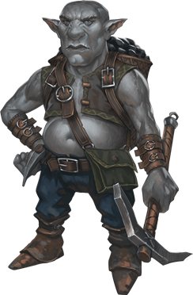

# Gnomes
A constant hum of busy activity pervades the warrens and neighborhoods where gnomes form their close-knit communities. Louder sounds punctuate the hum: a crunch of grinding gears here, a minor explosion there, a yelp of surprise or triumph, and especially bursts of laughter. Wafting sounds of music fill the air, some less perfected than others, while drawings and paintings, sometimes half-finished, often lie in corners or on walls. Gnomes take delight in life, enjoying every moment of invention, exploration, investigation, creation, and play.

> Jump to: [Deep](#deep-gnome) | [Rock](#rock-gnome) | [Forest](#forest-gnome)

***Vibrant Expression.*** A gnome's energy and enthusiasm for living shines through every inch of his or her tiny body. Gnomes average slightly over 3 feet tall and weigh 40 to 45 pounds. Their tan or brown faces are usually adorned with broad smiles (beneath their prodigious noses), and their bright eyes shine with excitement. Their fair hair has a tendency to stick out in every direction, as if expressing the gnome's insatiable interest in everything around.

A gnome's personality is writ large in his or her appearance. A male gnome's beard, in contrast to his wild hair, is kept carefully trimmed but often styled into curious forks or neat points. A gnome's clothing, though usually made in modest earth tones, is elaborately decorated with embroidery, embossing, or gleaming jewels.

***Delighted Dedication.*** As far as gnomes are concerned, being alive is a wonderful thing, and they squeeze every ounce of enjoyment out of their century of life. Humans might wonder about getting bored over the course of such a long life, and elves take plenty of time to savor the beauties of the world in their long years, but gnomes seem to worry that even with all that time, they can't get in enough of the things they want to do and see.

Gnomes often speak in rapid patter, as if they can't get the thoughts out of their heads fast enough. Even as they offer ideas and opinions on a range of subjects, they still manage to listen carefully to others, adding the appropriate exclamations of surprise and appreciation along the way.

Though gnomes love jokes of all kinds, particularly puns and pranks, they're just as dedicated to the more serious tasks they undertake. Many gnomes are skilled engineers, artificers, artists, and explorers. They're willing to make mistakes and laugh at themselves in the process of perfecting what they do, taking bold (sometimes foolhardy) risks and dreaming large.

Gnomes who settle outside their own communities are commonly gemcutters, engineers, sages, or tinkers. Many noble houses and merchant guild families retain gnome tutors, ensuring that their pupils enjoy a mix of serious learning and delighted enjoyment. A gnome might tutor several generations of a single human family over the course of his or her life.

***Dark cousins.*** The [derro](Derro.md) are often called dwarven-kin, but in truth they are closer to gnomish-kin. Theories abound that when the ancient dwarvish ancestors of the duergar were captured by the mind flayers, so too were the ancient ancestors of the derro, more gnomish than dwarvish by then. Derro recognize no lineage with gnomes, however, and gnomes are just as happy to ignore any sort of connection to the gloomy derro.

***Playable Race: Judge Not By My Size.*** [Gnomes](../Races/Gnomes.md) make for fine artificers, given their natural curiosity and innovation, but never discount the gnomish rogue, wizard, or sorcerer, either. Gnomish clerics and shamans are common, as are gnomish druids (particularly among the forest gnomes), but pity the unwary enemy who undersestimates the fierce martial prowess of the gnomish fighter, ranger, or paladin--and many's the corpse that laughed at the gnomish barbarian. Their size makes them natural rogues, of course, but also bards. Doubt not the sincerity and discipline of the gnome, either, for they make fierce monks and powerful mystics. Lastly, although more rare, some gnomes, shattered by tragedy, turn to patrons or necromancy for answers, and become warlocks or pale masters.

---

## Rock Gnome
Rock gnomes are often found in the Daw Range, but also within the many hillsides that litter the continent. Surprisingly larger numbers of rock gnome settlements are found on the Al'Uma/Yithi side of the Daws, but this may be simply coincidence. Rock gnomes in Azgaarnoth are not quite as inventive as Mordenkainen posits, but the trait is found in many, and for this reason rock gnomes are often drawn to the [Order of the Steel Dragon](../Organizations/MilitantOrders/DraconicOrder/Steel.md) and some of the larger [Merchant Guilds](../Organizations/MerchantGuilds/index.md), particularly the Alchemists' Guilds.

***Bright Burrows.*** Rock gnomes make their homes in hilly, wooded lands. They live underground but get more fresh air than dwarves do, enjoying the natural, living world on the surface whenever they can. Their homes are well hidden by both clever construction and simple illusions. Welcome visitors are quickly ushered into the bright, warm burrows. Those who are not welcome are unlikely to find the burrows in the first place.

### Environment
Hill, Mountain, Underdark

### Token

>### Rock Gnome
>*Small humanoid (gnome), neutral good*
>___
>- **Armor Class** 15 (chain shirt)
>- **Hit Points** 16 (3d6 + 6)
>- **Speed** 20 ft.
>___
>|**STR**|**DEX**|**CON**|**INT**|**WIS**|**CHA**|
>|:---:|:---:|:---:|:---:|:---:|:---:|
>|15 (+2)|14 (+2)|14 (+2)|12 (+1)|10 (+0)|9 (-1)|
>
>___
>- **Proficiency Bonus** +2
>- **Saving Throws** 
>- **Damage Vulnerabilities** 
>- **Damage Resistances** 
>- **Damage Immunities** 
>- **Condition Immunities** 
>- **Skills** Investigation +3,Perception +2,Stealth +4
>- **Senses** darkvision 120 ft.,passive Perception 12
>- **Languages** Gnomish,Terran,Undercommon
>- **Challenge** 1/2
>___
>***Stone Camouflage.*** The gnome has advantage on Dexterity (Stealth) checks made to hide in rocky terrain.
>
>***Gnome Cunning.*** The gnome has advantage on Intelligence, Wisdom, and Charisma saving throws against magic.
>
>#### Actions
>***War Pick.*** Melee Weapon Attack: +4 to hit, reach 5 ft., one target. Hit: 6 (1d8 + 2) piercing damage.
>

---

## Forest Gnome
Forest gnomes are creatures of woods and glens, making homes nestled among the trunks of mighty trees. Forest gnomes have a natural knack for illusion and inherent quickness and stealth, and are often rare and secretive. They gather in hidden communities in sylvan forests, using illusions and trickery to conceal themselves from threats or to mask their escape should they be detected. Forest gnomes tend to be friendly with other good-spirited woodland folk, and they regard elves and good fey as their most important allies. These gnomes also befriend small forest animals and rely on them for information about threats that might prowl their lands.

Many of the forest gnomes have spent time with the [Glittering Eye](../Organizations/MageSchools/GlitteringEye.md) mage school, to perfect their illusions, and often work closely with druids to maintain their forest home when threatened. Some gnomes have even brought the school into their homes, creating an entire village of illusionists.

***Natural Burrows.*** Forest gnome villages are found in almost every wooded area on Azgaarnoth--if you can find them. Individual forest gnomes are not common, yet they are not so rare as to draw immediate attention when they wander into town. Their homes are often intertwined with the trees and forest floor, well-lit and comfortably furnished inside, offering both connection to nature and defense from predators that find the village.

Forest gnomes are often no strangers to more urban settings, often looking for ways to benefit from the proximity of cities (and the protection they provide) without revealing too much of their own community. Most forest gnomes encountered ouotside of forests are wanderers, defenders, or traders, as forest gnomes carry on the creative and innovative energy of their race, but in more forest ways--they are woodworkers almost without peer, and many have taken up urban lives as gardeners and groundskeepers.

### Environment
Forest

### Token

>### Forest Gnome
>*Small humanoid (gnome), neutral good*
>___
>- **Armor Class** 15 (chain shirt)
>- **Hit Points** 16 (3d6 + 6)
>- **Speed** 20 ft.
>___
>|**STR**|**DEX**|**CON**|**INT**|**WIS**|**CHA**|
>|:---:|:---:|:---:|:---:|:---:|:---:|
>|15 (+2)|14 (+2)|14 (+2)|12 (+1)|10 (+0)|9 (-1)|
>
>___
>- **Proficiency Bonus** +2
>- **Saving Throws** 
>- **Damage Vulnerabilities** 
>- **Damage Resistances** 
>- **Damage Immunities** 
>- **Condition Immunities** 
>- **Skills** Investigation +3,Perception +2,Stealth +4
>- **Senses** darkvision 120 ft.,passive Perception 12
>- **Languages** Gnomish,Terran,Undercommon
>- **Challenge** 1/2
>___
>***Forest Camouflage.*** The gnome has advantage on Dexterity (Stealth) checks made to hide in forest terrain.
>
>***Gnome Cunning.*** The gnome has advantage on Intelligence, Wisdom, and Charisma saving throws against magic.
>
>#### Actions
>***War Pick.*** Melee Weapon Attack: +4 to hit, reach 5 ft., one target. Hit: 6 (1d8 + 2) piercing damage.
>
>***Spellcasting.*** The gnome's innate spellcasting ability is Intelligence (spell save DC 11). It can innately cast the following spells, requiring no material components:
>
>* At will: minor illusion

---

## Deep Gnome
Deep gnomes, or svirfneblin, live far below the world's surface in twisting warrens and sculpted caverns. They survive by virtue of their stealth, cleverness, and tenacity. Their gray skin allows them to blend in with surrounding stonework. They are also surprisingly heavy and strong for their size. An average adult weighs 100 to 120 pounds and stands 3 feet tall.

A typical svirfneblin enclave contains several hundred deep gnomes and is strongly fortified. Secret tunnels lead to and from the settlement, and the deep gnomes use these as evacuation routes when the enclave comes under attack.

***Established Gender Roles.*** Male svirfneblin are bald, while females have stringy gray hair. Traditionally, females run the enclaves while males scour the outskirts in search of enemies and deposits of precious gemstones.

***Gemstone Harvesters.*** Svirfneblin cherish fine gemstones, especially rubies, which they harvest from mines deep in the Underdark. The hunt for gems often brings them into conflict with beholders, drow, kuo-toa, duergar, and mind flayers. Of all their natural enemies, deep gnomes fear and despise the murderous, demon-worshiping drow the most.

***Earth Friends.*** Deep gnomes are often encountered in the company of creatures from the Elemental Plane of Earth. Some svirfneblin can summon such creatures. Earth creatures guard svirfneblin settlements, especially xorn enticed to service with the promise of gems to feed on.

***Playable Race: Delvers of the Deep.*** Svirfneblin [do often venture out on their own as adventurers](../Races/Gnomes.md#svirfneblin-deep-gnomes), often to benefit their community: learning valuable skills, gathering treasure and powerful magic, and making allies among others. They 

### Environment
Underdark

### Token

>### Deep Gnome (Svirfneblin)
>*Small humanoid (gnome), neutral good*
>___
>- **Armor Class** 15 (chain shirt)
>- **Hit Points** 16 (3d6 + 6)
>- **Speed** 20 ft.
>___
>|**STR**|**DEX**|**CON**|**INT**|**WIS**|**CHA**|
>|:---:|:---:|:---:|:---:|:---:|:---:|
>|15 (+2)|14 (+2)|14 (+2)|12 (+1)|10 (+0)|9 (-1)|
>
>___
>- **Proficiency Bonus** +2
>- **Saving Throws** 
>- **Damage Vulnerabilities** 
>- **Damage Resistances** 
>- **Damage Immunities** 
>- **Condition Immunities** 
>- **Skills** Investigation +3,Perception +2,Stealth +4
>- **Senses** darkvision 120 ft.,passive Perception 12
>- **Languages** Gnomish,Terran,Undercommon
>- **Challenge** 1/2
>___
>***Stone Camouflage.*** The gnome has advantage on Dexterity (Stealth) checks made to hide in rocky terrain.
>
>***Gnome Cunning.*** The gnome has advantage on Intelligence, Wisdom, and Charisma saving throws against magic.
>
>***Innate Spellcasting.*** The gnome's innate spellcasting ability is Intelligence (spell save DC 11). It can innately cast the following spells, requiring no material components:
>
>At will: nondetection (self only)
>
>1/day each: blindness/deafness, blur, disguise self
>
>#### Actions
>***War Pick.*** Melee Weapon Attack: +4 to hit, reach 5 ft., one target. Hit: 6 (1d8 + 2) piercing damage.
>
>***Poisoned Dart.*** Ranged Weapon Attack: +4 to hit, range 30/120 ft., one creature. Hit: 4 (1d4 + 2) piercing damage, and the target must succeed on a DC 12 Constitution saving throw or be poisoned for 1 minute. The target can repeat the saving throw at the end of each of its turns, ending the effect on itself on a success.
>
