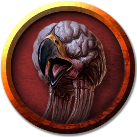

## Grell
A grell resembles a bulbous floating brain with a wide, sharp beak. Its ten long tentacles are made of hundreds of ring-shaped muscles sheathed in tough fibrous hide. Sharp barbs line the tip each tentacle and inject paralytic venom. The grell can partially retract its barbs into its tentacles to handle or manipulate objects it doesn't want to pierce or tear.

Grells have no eyes and floats by means of a sort of levitation. They have keen hearing, however, and their skin is sensitive to vibrations and electrical fields, allowing them to detect the presence of creatures and objects in their immediate vicinity. The creature's ability to manipulate electricity to sense and move also allow it to absorb lightning without harm.

Although solitary by nature, grells sometimes gather in small groups called covens.

***Floating Ambushers.*** A grell prefers to ambush lone creatures or stragglers, hovering silently near the ceiling of a passage or cavern until a suitable target passes below, whereupon it descends quickly and wraps its tentacles around its prey. It then floats away to its lair with the paralyzed creature in its clutches.

***Alien Devourers.*** Grell are alien predators that group other creatures into three categories: edibles, inedibles, and Great Eaters (those rare creatures that might prey on a grell). Grells have no compunction about attacking creatures they classify as edible, including humanoids. They tend to avoid bigger creatures that they have little hope of carrying away.

A grell will sometimes allow adventurers to wage war on the other monstrous inhabitants of the dungeon complex it calls home, staying out of the adventurers' way as they dispose of larger threats while waiting for the right time to strike.

### Environment
(FIXME)

### Token

>### Grell
>*Medium aberration, neutral evil*
>___
>- **Armor Class** 12
>- **Hit Points** 55 (10d8 + 10)
>- **Speed** 10 ft., fly 30 ft. (hover)
>___
>|**STR**|**DEX**|**CON**|**INT**|**WIS**|**CHA**|
>|:---:|:---:|:---:|:---:|:---:|:---:|
>|15 (+2)|14 (+2)|13 (+1)|12 (+1)|11 (+0)|9 (-1)|
>
>___
>- **Proficiency Bonus** +2
>- **Saving Throws** 
>- **Damage Vulnerabilities** 
>- **Damage Resistances** 
>- **Damage Immunities** lightning
>- **Condition Immunities** blinded,prone
>- **Skills** Perception +4,Stealth +6
>- **Senses** blindsight 60 ft. (blind beyond this radius),passive Perception 14
>- **Languages** Grell
>- **Challenge** 3
>___
>#### Actions
>***Multiattack.*** The grell makes two attacks: one with its tentacles and one with its beak.
>
>***Tentacles.*** Melee Weapon Attack: +4 to hit, reach 10 ft., one creature. Hit: 7 (1d10 + 2) piercing damage, and the target must succeed on a DC 11 Constitution saving throw or be poisoned for 1 minute. The poisoned target is paralyzed, and it can repeat the saving throw at the end of each of its turns, ending the effect on a success.
>
>The target is also grappled (escape DC 15). If the target is Medium or smaller, it is also restrained until this grapple ends. While grappling the target, the grell has advantage on attack rolls against it and can't use this attack against other targets. When the grell moves, any Medium or smaller target it is grappling moves with it.
>
>***Beak.*** Melee Weapon Attack: +4 to hit, reach 5 ft., one target. Hit: 7 (2d4 + 2) piercing damage.
>
