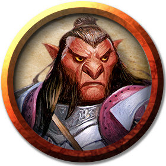
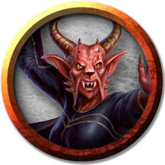

# Hobgoblins
War horns sound, stones fly from catapults, and the thunder of a thousand booted feet echoes across the land as hobgoblins march to battle. Across the borderlands of civilization, settlements and settlers must contend with these aggressive humanoids, whose thirst for conquest is never satisfied.

> Jump to: [Hobgoblin](Hobgoblins.md#hobgoblin) | [Hobgoblin Warrior](Hobgoblins.md#hobgoblin-warrior) | [Hobgoblin Veteran](Hobgoblins.md#hobgoblin-veteran) | [Hobgoblin Sergeant](Hobgoblins.md#hobgoblin-sergeant) | [Hobgoblin Captain](Hobgoblins.md#hobgoblin-captain) | [Hobgoblin Warlord](Hobgoblins.md#hobgoblin-warlord) | [Bladebearer](Hobgoblins.md#bladebearer) | [Devastator](Hobgoblins.md#devastator) | [Iron Shadow](Hobgoblins.md#hobgoblin-iron-shadow) | [Kulkor Zhul War Adept](Hobgoblins.md#kulkor-zhul-war-adept) | [Kulkor Zhul Mindbender](Hobgoblins.md#kulkor-zhul-mindbender) | [Doom Hand Cleric](Hobgoblins.md#doom-hand-cleric) | [Doom Fist Monk](Hobgoblins.md#doom-fist-monk) | [Hobgoblin General](#hobgoblin-general)

Hobgoblins have dark orange or red-orange skin, and hair ranging from dark red-brown to dark gray. Yellow or dark brown eyes peer out beneath their beetling brows, and their wide mouths sport sharp and yellowed teeth. A male hobgoblin might have a large blue or red nose, which symbolizes virility and power among goblinkin. Hobgoblins can live as long as humans, though their love of warfare and battle means that few do.

***Goblinoids.*** Hobgoblins belong to a family of creatures called goblinoids. They are often found lording over their cousins, the smaller goblins and the ferocious bugbears.

***Martial Might.*** A hobgoblin measures virtue by physical strength and martial prowess, caring about nothing except the opportunity to demonstrate skill and cunning in battle. Hobgoblins of high military rank attain their positions by force, then hold those positions by imposing their authority through draconian measures.

Hobgoblins train to fight with a variety of weapons, and have great skill at crafting arms, armor, siege engines, and other military devices. Organized and disciplined, they take exceptional care of their weapons, armor, and personal possessions. They favor the bold colors associated with their tribes, and trim their often-elaborate uniforms with blood-red piping and leather dyed black.

***Strategic Thinkers.*** Hobgoblins have a strong grasp of tactics and discipline, and can carry out sophisticated battle plans under the direction of a strategically minded leader. However, they hate elves and attack them first in battle over any other opponents, even if doing so would be a tactical error.

***Military Legions.*** Hobgoblins organize themselves into tribal bands known as legions. In their martial society, every hobgoblin has a rank, from the powerful leaders and champions, to the rank-and-file foot soldiers, to the goblins that find themselves driven into the front lines at spear point. A legion is headed by a warlord with several captains serving under its command. A hobgoblin warlord is a ruthless tyrant more interested in strategy, victory, glory, reputation, and dominion than leading troops into battle.

As loyal and disciplined as hobgoblins are in their own legion, rival legions compete constantly for reputation and status. Meetings between legions erupt in violence if troops aren't restrained, and only exceptionally powerful leaders can force legions to cooperate on the battlefield.

Legions often supplement their ranks with less reliable and more expendable troops, including [Goblins](goblin.md), [Bugbears](Bugbear.md), [orcs](Orc.md), evil [Firstborn](../Races/index.md#firstborn) and [Humans](../Races/Humans.md), [ogres](Ogres.md), and [Giants](Giants.md). Legions are often a core backbone to the Hordes along with [Orcs](../Races/Orc.md), but often clash with their chaotic counterparts on a regular basis, as well.

***Beast Trainers.*** Hobgoblins have a long history of training animals to service. Like the more civilized races, they use oxen and horses to transport goods and weaponry over long distances. They communicate with each other using trained ravens, and keep vicious wolves to guard prisoners and protect hobgoblin camps. Hobgoblin cavalry use trained worgs as steeds, in the same way that goblins ride wolves. Some tribes even keep carnivorous apes as fighting beasts.

***Conquer and Control.*** Hobgoblins claim lands with abundant resources, and they can be found in forests and mountains, near mines and humanoid settlements, and anywhere else that wood, metal, and potential slaves can be found. They build and conquer strongholds in strategically advantageous locations, which they then use as staging areas to expand their territory. As part of the earliest battles fought by the Hordes, hobgoblins were among the first to claim the lands now owned by [Yithi](../Nations/Yithi.md), but all these years later, hobgoblin villages and legions can be found almost entirely across Azgaarnoth.

Hobgoblin warlords never tire of combat, but they don't take up arms lightly. Before they Attack, Hobgoblins conduct thorough reconnaissance to gauge the strengths and weaknesses of their foes. When assaulting a stronghold, they surround it first to cut off escape routes and supply lines, then slowly starve their enemies out.

Hobgoblins fortify their own holdings, bolstering existing defenses with innovations of their own. Whether they lair in cavern complexes, dungeons, cities, or forests, they protect their strongholds with ditches, fences, gates, guard towers, pit traps, and catapults or ballistas.

***Legion of Maglubiyet.*** Traditional Hobgoblins worship [Maglubiyet the Mighty One](../Religions/Pantheon/Maglubiyet.md), the greater god of Goblinoids. As terrifying as this figure is, Hobgoblins don't fear death, believing that when they die in battle, their spirits join the honored ranks of Maglubiyet's army on the plane of Acheron.

More recently, hobgoblins have come to revere [Lythtzu](../Religions/Pantheon/Lythtzu.md), the god of battle and combat, as an alternative to Maglubiyet. The followers of Lythtzu believe in honor and adherence to the principles of honor, even beyond the ethos of good or evil. As such, followers of Lythtzu still don't fear death, believing that when they die in battle, their spirits join Lythtzu's army in the Blood Wars of the afterlife, fighting to maintain the cosmic balance, even against Maglubiyet's followers. (As a result, Maglubiyet's followers and Lythtzu's followers tend to fight on sight of each other.)

***Secret Organizations.*** Hobgoblins of the cruelest bent gain admittance to elite organizations and traditions that provide special training above and beyond what military service has to offer. The [Academy of Devastation](#devastator) and the [Iron Shadows](#iron-shadow) are two such, and their graduates are feared among the ranks of goblinkind. Still others follow a code of swordsmanship and become [Bladebearers](#bladebearer). The [Mindbenders](#kulkor-zhul-mindbender) and [War Adepts](#kulkor-zhul-war-adept) are both of the Kulkor Zhul school (somewhere deep in Tragekia) that teach bardic and arcane skills. Similarly, a different (and rival) school, known colloquially as the "School of Doom", teaches [clerics](#doom-hand-cleric) and [monks](#doom-fist-monk) ways of hobgoblin supremacy.

***Playable Race: Flexible Soldiers.*** Many [hobgoblins](../Races/Hobgoblin.md) wander alone or as part of small adventuring groups all across Azgaarnoth, and have proven themselves to be capable and able in every class across the spectrum.

---

## Hobgoblin
Hobgoblins are generally disciplined in their daily lives, each contributing in their way to the common good of the tribe, town, city, or Horde.

### Environment
Arctic, Coastal, Desert, Forest, Hill, Mountain, Swamp, Underdark, Urban

### Token

>### Hobgoblin
>*Medium humanoid (goblinoid), lawful evil*
>___
>- **Armor Class** 16 (chain mail (14), shield (+2))
>- **Hit Points** 11 (2d8 + 2)
>- **Speed** 30 ft.
>___
>|**STR**|**DEX**|**CON**|**INT**|**WIS**|**CHA**|
>|:---:|:---:|:---:|:---:|:---:|:---:|
>|13 (+1)|11 (+0)|12 (+1)|10 (+0)|10 (+0)|9 (-1)|
>
>___
>- **Proficiency Bonus** +2
>- **Saving Throws** 
>- **Damage Vulnerabilities** 
>- **Damage Resistances** 
>- **Damage Immunities** 
>- **Condition Immunities** 
>- **Skills** 
>- **Senses** darkvision 60 ft.,passive Perception 10
>- **Languages** Common,Goblin
>- **Challenge** 1/2
>___
>***Martial Advantage.*** Once per turn, the hobgoblin can deal an extra 7 (2d6) damage to a creature it hits with a weapon attack if that creature is within 5 feet of an ally of the hobgoblin that isn't incapacitated.
>
>#### Actions
>***Longsword.*** Melee Weapon Attack: +3 to hit, reach 5 ft., one target. Hit: 5 (1d8 + 1) slashing damage, or 6 (1d10 + 1) slashing damage if used with two hands.
>
>***Longbow.*** Ranged Weapon Attack: +3 to hit, range 150/600 ft., one target. Hit: 5 (1d8 + 1) piercing damage.
>

---

## Hobgoblin Warrior
Hobgoblins which survive combat after a while get tougher and more skilled.

### Environment
Arctic, Coastal, Desert, Forest, Hill, Mountain, Swamp, Underdark, Urban

### Token

>### Hobgoblin Warrior
>*Medium humanoid (goblinoid), lawful evil*
>___
>- **Armor Class** 17 (chain mail (14), shield (+2), DEX (+1))
>- **Hit Points** 18 (3d8 + 3)
>- **Speed** 30 ft.
>___
>|**STR**|**DEX**|**CON**|**INT**|**WIS**|**CHA**|
>|:---:|:---:|:---:|:---:|:---:|:---:|
>|14 (+2)|12 (+1)|12 (+1)|10 (+0)|10 (+0)|9 (-1)|
>
>___
>- **Proficiency Bonus** +2
>- **Saving Throws** 
>- **Damage Vulnerabilities** 
>- **Damage Resistances** 
>- **Damage Immunities** 
>- **Condition Immunities** 
>- **Skills** 
>- **Senses** darkvision 60 ft.,passive Perception 10
>- **Languages** Common,Goblin
>- **Challenge** 1/2
>___
>***Martial Advantage.*** Once per turn, the hobgoblin can deal an extra 7 (2d6) damage to a creature it hits with a weapon attack if that creature is within 5 feet of an ally of the hobgoblin that isn't incapacitated.
>
>#### Actions
>***Longsword.*** Melee Weapon Attack: +3 to hit, reach 5 ft., one target. Hit: 5 (1d8 + 3) slashing damage, or 6 (1d10 + 3) slashing damage if used with two hands.
>
>***Longbow.*** Ranged Weapon Attack: +3 to hit, range 150/600 ft., one target. Hit: 5 (1d8 + 1) piercing damage.
>

---

## Hobgoblin Veteran
After a few years of combat, hobgoblin veterans are tough as nails and ridiculously hard to kill.

### Environment
Arctic, Coastal, Desert, Forest, Hill, Mountain, Swamp, Underdark, Urban

### Token

>### Hobgoblin Veteran
>*Medium humanoid (goblinoid), lawful evil*
>___
>- **Armor Class** 17 (chain mail (14), shield (+2), DEX (+1))
>- **Hit Points** 25 (4d8 + 4)
>- **Speed** 30 ft.
>___
>|**STR**|**DEX**|**CON**|**INT**|**WIS**|**CHA**|
>|:---:|:---:|:---:|:---:|:---:|:---:|
>|14 (+2)|12 (+1)|12 (+1)|10 (+0)|10 (+0)|9 (-1)|
>
>___
>- **Proficiency Bonus** +2
>- **Saving Throws** 
>- **Damage Vulnerabilities** 
>- **Damage Resistances** 
>- **Damage Immunities** 
>- **Condition Immunities** 
>- **Skills** 
>- **Senses** darkvision 60 ft.,passive Perception 10
>- **Languages** Common,Goblin
>- **Challenge** 1
>___
>***Martial Advantage.*** Once per turn, the hobgoblin can deal an extra 7 (2d6) damage to a creature it hits with a weapon attack if that creature is within 5 feet of an ally of the hobgoblin that isn't incapacitated.
>
>#### Actions
>***Multiattack.***  The hobgoblin makes two longsword attacks or two longbow attacks.
>
>***Longsword.*** Melee Weapon Attack: +3 to hit, reach 5 ft., one target. Hit: 8 (1d8 + 4) slashing damage, or 9 (1d10 + 4) slashing damage if used with two hands.
>
>***Longbow.*** Ranged Weapon Attack: +3 to hit, range 150/600 ft., one target. Hit: 6 (1d8 + 2) piercing damage.
>

---

## Hobgoblin Sargeant
The hobgoblin sargeant is a veteran responsible for the training and safety of the soldiers in its command, a responsibility which it does not take lightly.

### Environment
Arctic, Coastal, Desert, Forest, Hill, Mountain, Swamp, Underdark, Urban

### Token

>### Hobgoblin Sargeant
>*Medium humanoid (goblinoid), lawful evil*
>___
>- **Armor Class** 18 (chain mail (14), shield (+2), DEX (+2))
>- **Hit Points** 78 (12d8 + 24)
>- **Speed** 30 ft.
>___
>|**STR**|**DEX**|**CON**|**INT**|**WIS**|**CHA**|
>|:---:|:---:|:---:|:---:|:---:|:---:|
>|15 (+2)|14 (+2)|14 (+2)|12 (+1)|12 (+1)|13 (+1)|
>
>___
>- **Proficiency Bonus** +3
>- **Saving Throws** 
>- **Damage Vulnerabilities** 
>- **Damage Resistances** 
>- **Damage Immunities** 
>- **Condition Immunities** 
>- **Skills** 
>- **Senses** darkvision 60 ft.,passive Perception 11
>- **Languages** Common,Goblin
>- **Challenge** 3
>___
>***Martial Advantage.*** Once per turn, the hobgoblin can deal an extra 10 (3d6) damage to a creature it hits with a weapon attack if that creature is within 5 feet of an ally of the hobgoblin that isn't incapacitated.
>
>***Military Training.*** The sargeant has advantage on an attack roll against a creature if at least one of the soldier's allies is within 5 feet of the creature and the ally isn't incapacitated.
>
>#### Actions
>***Multiattack.*** The hobgoblin makes three greatsword attacks or three javelin attacks. The sargeant can use its Battle Command action in place of one of its attacks.
>
>***Greatsword.*** Melee Weapon Attack: +4 to hit, reach 5 ft., one target. Hit: 9 (2d6 + 2) piercing damage.
>
>***Javelin.*** Melee or Ranged Weapon Attack: +4 to hit, reach 5 ft. or range 30/120 ft., one target. Hit: 5 (1d6 + 2) piercing damage.
>
>***Leadership (Recharges after a Short or Long Rest).*** For 1 minute, the hobgoblin can utter a special command or warning whenever a nonhostile creature that it can see within 30 feet of it makes an attack roll or a saving throw. The creature can add a d4 to its roll provided it can hear and understand the hobgoblin. A creature can benefit from only one Leadership die at a time. This effect ends if the hobgoblin is incapacitated.
>
>***Battle Command.*** Choose one creature within 30 feet of the sargeant that the sargeant can see. If the chosen creature can see or hear the sargeant, that creature can use its reaction to make one melee attack or to take the Dodge or Hide action.
>

---

## Hobgoblin Captain
The hobgoblin captain is generally the leader of an organized force of goblinoids, 

### Environment
Arctic, Coastal, Desert, Forest, Hill, Mountain, Swamp, Underdark, Urban

### Token

>### Hobgoblin Captain
>*Medium humanoid (goblinoid), lawful evil*
>___
>- **Armor Class** 17 (half plate (15), DEX (+2))
>- **Hit Points** 60 (9d8 + 18)
>- **Speed** 30 ft.
>___
>|**STR**|**DEX**|**CON**|**INT**|**WIS**|**CHA**|
>|:---:|:---:|:---:|:---:|:---:|:---:|
>|15 (+2)|15 (+2)|15 (+2)|12 (+1)|10 (+0)|13 (+1)|
>
>___
>- **Proficiency Bonus** +3
>- **Saving Throws** 
>- **Damage Vulnerabilities** 
>- **Damage Resistances** 
>- **Damage Immunities** 
>- **Condition Immunities** 
>- **Skills** 
>- **Senses** darkvision 60 ft.,passive Perception 10
>- **Languages** Common,Goblin
>- **Challenge** 3
>___
>***Martial Advantage.*** Once per turn, the hobgoblin can deal an extra 10 (3d6) damage to a creature it hits with a weapon attack if that creature is within 5 feet of an ally of the hobgoblin that isn't incapacitated.
>
>#### Actions
>***Multiattack.*** The hobgoblin makes two greatsword attacks.
>
>***Greatsword.*** Melee Weapon Attack: +4 to hit, reach 5 ft., one target. Hit: 9 (2d6 + 2) piercing damage.
>
>***Javelin.*** Melee or Ranged Weapon Attack: +4 to hit, reach 5 ft. or range 30/120 ft., one target. Hit: 5 (1d6 + 2) piercing damage.
>
>***Leadership (Recharges after a Short or Long Rest).*** For 1 minute, the hobgoblin can utter a special command or warning whenever a nonhostile creature that it can see within 30 feet of it makes an attack roll or a saving throw. The creature can add a d4 to its roll provided it can hear and understand the hobgoblin. A creature can benefit from only one Leadership die at a time. This effect ends if the hobgoblin is incapacitated.
>
>***Battle Command.*** Choose one creature within 30 feet of the sargeant that the sargeant can see. If the chosen creature can see or hear the sargeant, that creature can use its reaction to make one melee attack or to take the Dodge or Hide action.
>

---

## Hobgoblin Warlord
Hobgoblin warlords are masters of battle. Some often have additional levels in a playable class, in addition to the statistics below.

### Environment
Arctic, Coastal, Desert, Forest, Hill, Mountain, Swamp, Underdark, Urban

### Token

>### Hobgoblin Warlord
>*Medium humanoid (goblinoid), lawful evil*
>___
>- **Armor Class** 20 (plate, shield)
>- **Hit Points** 97 (13d8 + 39)
>- **Speed** 30 ft.
>___
>|**STR**|**DEX**|**CON**|**INT**|**WIS**|**CHA**|
>|:---:|:---:|:---:|:---:|:---:|:---:|
>|16 (+3)|14 (+2)|16 (+3)|14 (+2)|11 (+0)|15 (+2)|
>
>___
>- **Proficiency Bonus** +4
>- **Saving Throws** Int +5,Wis +3,Cha +5
>- **Damage Vulnerabilities** 
>- **Damage Resistances** 
>- **Damage Immunities** 
>- **Condition Immunities** 
>- **Skills** 
>- **Senses** darkvision 60 ft.,passive Perception 10
>- **Languages** Common,Goblin
>- **Challenge** 6
>___
>***Martial Advantage.*** Once per turn, the hobgoblin can deal an extra 14 (4d6) damage to a creature it hits with a weapon attack if that creature is within 5 feet of an ally of the hobgoblin that isn't incapacitated.
>
>#### Actions
>***Multiattack.*** The hobgoblin makes three melee attacks. Alternatively, it can make two ranged attacks with its javelins.
>
>***Longsword.*** Melee Weapon Attack: +9 to hit, reach 5 ft., one target. Hit: 7 (1d8 + 3) slashing damage, or 8 (1d10 + 3) slashing damage if used with two hands.
>
>***Shield Bash.*** Melee Weapon Attack: +9 to hit, reach 5 ft., one creature. Hit: 5 (1d4 + 3) bludgeoning damage. If the target is Large or smaller, it must succeed on a DC 14 Strength saving throw or be knocked prone.
>
>***Javelin.*** Melee or Ranged Weapon Attack: +9 to hit, reach 5 ft. or range 30/120 ft., one target. Hit: 6 (1d6 + 3) piercing damage.
>
>***Leadership (Recharges after a Short or Long Rest).*** For 1 minute, the hobgoblin can utter a special command or warning whenever a nonhostile creature that it can see within 30 feet of it makes an attack roll or a saving throw. The creature can add a d4 to its roll provided it can hear and understand the hobgoblin. A creature can benefit from only one Leadership die at a time. This effect ends if the hobgoblin is incapacitated.
>
>#### Reactions
>***Parry.*** The hobgoblin adds 3 to its AC against one melee attack that would hit it. To do so, the hobgoblin must see the attacker and be wielding a melee weapon.
>

---

## Bladebearer
Among all the Hordes, hobgoblin Bladebearers are the solitary, legendary warriors of the hobgoblin species, spending hours in intense training and meditation around nothing but combat and the mastery of the form. When pressed, they can use crossbows for ranged combat, but would much prefer to engage with their blades--and most of all against what appears to be the most skilled of the opponents facing them.

Bladebearers are powerful warriors, and many have adventured solo or undertaken other activities to increase their personal martial skill; any such additional levels of Fighter would add on to this template. Many choose to specialize; the most popular specialization classes being [Weapon Master](../Classes/Fighter/WeaponMaster.md) and [Duelist](../Classes/Fighter/Duelist.md), but many also explore the mysteries of the [Psi Knight](../Classes/Fighter/PsiKnight.md), and a rare few have taken up the cause of the [Samurai](../Classes/Fighter/Samurai.md), particularly in Yithi and Zhi.

Among the [Tragedian United Hordes](../Nations/Tragekia.md), Bladebearers are known to participate and be members of the various [Dueling Colleges](../Organizations/DuelingColleges.md) there. Some will occasionally wander into [Liria](../Nations/Liria.md) in similar pursuit, though often meet with high amounts of distrust and unease, particularly if (when) they win.

### Environment
Arctic, Coastal, Desert, Forest, Hill, Mountain, Swamp, Underdark, Urban

### Token

>### Bladebearer
>*Medium humanoid, lawful evil*
>___
>- **Armor Class** 16 (half plate (15), DEX (+1))
>- **Hit Points** 58 (9d8 + 18)
>- **Speed** 30 ft.
>___
>|**STR**|**DEX**|**CON**|**INT**|**WIS**|**CHA**|
>|:---:|:---:|:---:|:---:|:---:|:---:|
>|16 (+3)|13 (+1)|14 (+2)|10 (+0)|11 (+0)|10 (+0)|
>
>___
>- **Proficiency Bonus** +2
>- **Saving Throws** 
>- **Damage Vulnerabilities** 
>- **Damage Resistances** 
>- **Damage Immunities** 
>- **Condition Immunities** 
>- **Skills** Athletics +5,Perception +2
>- **Senses** darkvision 60 ft.,passive Perception 10
>- **Languages** Common,Goblin
>- **Challenge** 3
>___
>***Martial Advantage.*** Once per turn, the hobgoblin can deal an extra 10 (3d6) damage to a creature it hits with a weapon attack if that creature is within 5 feet of an ally of the hobgoblin that isn't incapacitated.
>
>#### Actions
>***Multiattack.*** The hobgoblin bladebearer makes two longsword attacks. If it has a shortsword drawn, it can also make a shortsword attack.
>
>***Longsword.*** Melee Weapon Attack: +5 to hit, reach 5 ft., one target. Hit: 7 (1d8 + 3) slashing damage, or 8 (1d10 + 3) slashing damage if used with two hands.
>
>***Shortsword.*** Melee Weapon Attack: +5 to hit, reach 5 ft., one target. Hit: 6 (1d6 + 3) piercing damage.
>
>***Heavy Crossbow.*** Ranged Weapon Attack: +3 to hit, range 100/400 ft., one target. Hit: 6 (1d10 + 1) piercing damage.
>

---

## Devastator
Within the Ulmhorde, the Academy of Devastation identifies hobgoblins with a talent for magic and puts them through a grueling training regimen that endows them with the ability to call down fireballs and other destructive magic on the host's behalf. A hobgoblin devastator on the battlefield is simultaneously a boon to all its allies and a threat to every foe around it. Devastators have the respect of other members of the host, and they receive obedience and deference from many quarters. Their ability to lay waste to entire formations with a single use of magic allows them to gain far more glory in battle than a single warrior. Other cultures might view the use of such abilities as a short cut to glory, but to hobgoblins a gift for magic is as valued and useful as a strong sword arm or brilliance in tactics. They are all boons from Maglubiyet that must be cultivated and unleashed upon the enemy.

***Into the Fray.*** While other cultures treat their wizards as cloistered academics, hobgoblins expect their spellcasters to fight. Devastators learn the basics of weapon use, and they measure their deeds by the enemies defeated though their magic.

***Only Results Matter.*** Devastators study a simplified form of evocation magic. Their training lacks the theory and context that other folk study, making them Skilled in battle but relatively illiterate on the finer points of how and why their magic works. The Academy of Devastation believes that an academic approach to magic is a sign of weakness and inefficiency. A warrior doesn't need to know about metallurgy to wield a blade, so why should a wizard care about where magic comes from? Devastators love to prove their superiority in battle by seeking out enemy spellcasters and destroying them. 

If they survive long enough, Devastators usually end up looking to join one of the Evocation-friendly [Mage Schools](../Organizations/MageSchools/index.md) to further their education, and return to their legion, tribe, Horde, or city even more frightening and powerful.

### Environment
Arctic, Coastal, Desert, Forest, Hill, Mountain, Swamp, Underdark, Urban

### Token

>### Devastator
>*Medium fey (Goblinoid), typically Lawful Neutral*
>___
>- **Armor Class** 13 (studded leather)
>- **Hit Points** 45 (7d8 + 14)
>- **Speed** 30 ft.
>___
>|**STR**|**DEX**|**CON**|**INT**|**WIS**|**CHA**|
>|:---:|:---:|:---:|:---:|:---:|:---:|
>|13 (+1)|12 (+1)|14 (+2)|16 (+3)|13 (+1)|11 (+0)|
>
>___
>- **Proficiency Bonus** +2
>- **Saving Throws** 
>- **Damage Vulnerabilities** 
>- **Damage Resistances** 
>- **Damage Immunities** 
>- **Condition Immunities** 
>- **Skills** Arcana +5
>- **Senses** darkvision 60 ft.,passive Perception 11
>- **Languages** Common,Goblin
>- **Challenge** 4
>___
>***Army Arcana.*** When the hobgoblin casts a spell that causes damage or that forces other creatures to make a saving throw, it can choose itself and any number of allies to be immune to the damage caused by the spell and to succeed on the required saving throw.
>
>#### Actions
>***Multiattack.*** The hobgoblin makes two Quarterstaff or Devastating Bolt attacks.
>
>***Quarterstaff.*** Melee Weapon Attack: +3 to hit, reach 5 ft., one target. Hit: 4 (1d6 + 1) bludgeoning damage, or 5 (1d8 + 1) bludgeoning damage if used with two hands, plus 13 (3d8) force damage.
>
>***Devastating Bolt.*** Ranged Spell Attack: +5 to hit, range 60 ft., one target. Hit: 21 (4d8 + 3) force damage, and the target is knocked prone.
>
>***Spellcasting.*** The hobgoblin is a 7th-level spellcaster. Its spellcasting ability is Intelligence (spell save DC 13, +5 to hit with spell attacks). It usually has the following wizard spells prepared:
>
>* *Cantrips (at will):* [acid splash](http://azgaarnoth.tedneward.com/magic/spells/acid-splash), [fire bolt](http://azgaarnoth.tedneward.com/magic/spells/fire-bolt), [ray of frost](http://azgaarnoth.tedneward.com/magic/spells/ray-of-frost), [shocking grasp](http://azgaarnoth.tedneward.com/magic/spells/shocking-grasp)
>* *1st level (4 slots):* [fog cloud](http://azgaarnoth.tedneward.com/magic/spells/fog-cloud), [magic missile](http://azgaarnoth.tedneward.com/magic/spells/magic-missile), [thunderwave](http://azgaarnoth.tedneward.com/magic/spells/thunderwave)
>* *2nd level (3 slots):* [gust of wind](http://azgaarnoth.tedneward.com/magic/spells/gust-of-wind), [Melf's acid arrow](http://azgaarnoth.tedneward.com/magic/spells/melfs-acid-arrow), [scorching ray](http://azgaarnoth.tedneward.com/magic/spells/scorching-ray)
>* *3rd level (3 slots):* [fireball](http://azgaarnoth.tedneward.com/magic/spells/fireball), [fly](http://azgaarnoth.tedneward.com/magic/spells/fly), [lightning bolt](http://azgaarnoth.tedneward.com/magic/spells/lightning-bolt)
>* *4th level (1 slot):* [ice storm](http://azgaarnoth.tedneward.com/magic/spells/ice-storm)
>

---

## Iron Shadow
Iron shadows are hobgoblin martial artists who serve fey and mortal courts as secret police, scouts, and assassins. They spy to ferret out treachery, rebellion, and betrayal and deal with it ruthlessly. Iron shadows possess agility and stamina matched only by their ironclad commitment to the will of their masters. They wield a deadly combination of unarmed fighting techniques and shadow magic to deceive and defeat their foes. While on secret missions, they wear masks crafted to resemble monsters, both to conceal their identities and to strike fear into their foes.

***Trained in Secret.*** Iron Shadows are routinely recruited from across hobgoblin tribes, cities, and Hordes. Each member keeps her eyes open for potential recruits, those whose agility and stamina are matched only by an ironclad commitment to Maglubiyet's will. A candidate for admission undergoes a series of tests designed to reveal any potential for treachery. Those who fail are slain, while those who pass receive secret training in the magical and martial arts. This indoctrination is a slow and arduous process; many aspirants don't finish it, and years might go by during which the Iron Shadows welcome no new members into their ranks. While a recruit is in training, it serves the Iron Shadows by looking for and reporting suspicious behavior.

Most Iron Shadow training appears to take place within Ulm, though many monasteries in Tragekia are also rumored to exist.

***Masters of Shadow and Fist.*** When a recruit's training is complete, she is ready to wield a deadly combination of unarmed fighting techniques and shadow magic to deceive and defeat her foes. She continues to spy on other Hobgoblins, but is now also empowered to conduct assassinations and spy missions, both against enemies and among Goblinoids. These missions are ordained by the Children of Maglubiyet, who keep a careful eye on the goblinoid community to ensure that it functions according to Maglubiyet's will.

***Masked Devils.*** Iron Shadows on a secret mission wear masks crafted to resemble devils, both to conceal their identities and to strike fear into their foes. Their masks also signify the supposed origin of their fighting techniques. The Children of Maglubiyet teach that the Great One stole the secrets of shadows from an archdevil, allowing his followers to conceal their identities, walk between shadows, and craft illusions to confuse and confound their enemies.

It is rumored that the Order of Iron Shadows is organized precisely along the same lines as any [Monastic Order](../Organizations/MonasticOrders/MonasticOrders.md), and could--if a candidate were dedicated enough--accept candidates of other races.

### Environment
Arctic, Coastal, Desert, Forest, Hill, Mountain, Swamp, Underdark, Urban

### Token

>### Iron Shadow
>*Medium fey (Goblinoid), typically Lawful Neutral*
>___
>- **Armor Class** 17 (Unarmored Defense (14), DES (+3))
>- **Hit Points** 32 (5d8 + 10)
>- **Speed** 40 ft.
>___
>|**STR**|**DEX**|**CON**|**INT**|**WIS**|**CHA**|
>|:---:|:---:|:---:|:---:|:---:|:---:|
>|14 (+2)|16 (+3)|15 (+2)|14 (+2)|15 (+2)|11 (+0)|
>
>___
>- **Proficiency Bonus** +2
>- **Saving Throws** 
>- **Damage Vulnerabilities** 
>- **Damage Resistances** 
>- **Damage Immunities** 
>- **Condition Immunities** 
>- **Skills** Acrobatics +5,Athletics +4,Stealth +5
>- **Senses** darkvision 60 ft.,passive Perception 12
>- **Languages** Common,Goblin
>- **Challenge** 2
>___
>***Unarmored Defense.*** While the hobgoblin is wearing no armor and wielding no shield, its AC includes its Wisdom modifier.
>
>#### Actions
>***Multiattack.*** The hobgoblin makes four attacks, each of which can be an Unarmed Strike or a Dart attack. It can also use Shadow Jaunt once, either before or after one of the attacks.
>
>***Unarmed Strike.*** Melee Weapon Attack: +5 to hit, reach 5 ft., one target. Hit: 5 (1d4 + 3) bludgeoning damage.
>
>***Dart.*** Ranged Weapon Attack. +5 to hit, range 20/60 ft., one target. Hit: 5 (1d4 + 3) piercing damage.
>
>***Shadow Jaunt.*** The hobgoblin teleports, along with any equipment it is wearing or carrying, up to 30 feet to an unoccupied space it can see. Both the space it leaves and its destination must be in dim light or darkness.
>
>***Spellcasting.*** The hobgoblin casts one of the following spells, using Intelligence as the spellcasting ability (spell save DC 12):
>
>* *At will:* [minor illusion](http://azgaarnoth.tedneward.com/magic/spells/minor-illusion), [prestidigitation](http://azgaarnoth.tedneward.com/magic/spells/prestidigitation)
>* *1/day each:* [charm person](http://azgaarnoth.tedneward.com/magic/spells/charm-person), [disguise self](http://azgaarnoth.tedneward.com/magic/spells/disguise-self), [silent image](http://azgaarnoth.tedneward.com/magic/spells/silent-image)
>

---

## Kulkor Zhul War Adept
The Kulkor Zhul War Adepts are a sect of hobgoblin that have embraced their sorcerous draconic heritage and used that to arcane advantage. They are crafty, cunning casters, and often lead hobgoblin detachments as well as support them with their spells.

### Environment
Arctic, Coastal, Desert, Forest, Hill, Mountain, Swamp, Underdark, Urban

### Token

>### Kulkor Zhul War Adept
>*Medium humanoid, lawful evil*
>___
>- **Armor Class** 15 (studded leather)
>- **Hit Points** 58 (8d8 + 8)
>- **Speed** 30 ft
>___
>|**STR**|**DEX**|**CON**|**INT**|**WIS**|**CHA**|
>|:---:|:---:|:---:|:---:|:---:|:---:|
>|10 (+0)|14 (+2)|12 (+1)|10 (+0)|15 (+2)|18 (+4)|
>
>___
>- **Proficiency Bonus** +3
>- **Saving Throws** 
>- **Damage Vulnerabilities** 
>- **Damage Resistances** 
>- **Damage Immunities** 
>- **Condition Immunities** 
>- **Skills** Perception +6,Deception +6,Intimidation +6
>- **Senses** darkvision 60 ft,passive Perception 17
>- **Languages** Goblin,Abyssal
>- **Challenge** 3
>___
>***Sorcery Points.*** 8 sorcery points, which can be used as follows:
>
>* *Creating Spell Slots* 1st requires 2 points, 2nd requires 3 points, 3rd requires 5 points, 4th requires 6 points.
>* *Converting a Spell Slot to Sorcery Points* Expend one spell slot and gain a number of sorcery points equal to the slot's level.
>* *Empowering Reserves* When you make an ability check on your turn, you can spend 2 sorcery points to gain advantage on the check.
>* *Imbuing Touch* As an action, you can touch one nonmagical weapon and spend 2 sorcery points to imbue it with magic for one minute. For the duration, the weapon is considered magical for the purpose of overcoming immunity and resistance to nonmagical attacks.
>* *Sorcerous Fortitude* As an action, you can spend any number of sorcery points to roll a d4 for each point expended. You gain a number of temporary hit points equal to the total rolled.
>
>***Metamagic.*** You can only use one metamagic option on a spell when you cast it, unless otherwise noted.
>
>* *Empowered Spell* When you roll damage for a spell, you can spend 1 sorcery point to reroll a number of the damage dice up to your Charisma modifier (minimum of one). You must use the new rolls.
>* *Elemental Spell* When you cast a spell that deals a type of damage from the following list, you can spend 1 sorcery point to change that damage type to one of the other listed types: acid, cold, fire, lightning, thunder.
>
>#### Actions
>***Shortbow.*** Ranged Weapon Attack: +4 to hit, range 80/320 ft., one target. Hit: 5 (1d6 + 2) piercing damage.
>
>***Scimitar.*** Melee Weapon Attack: +4 to hit, reach 5 ft., one target. Hit: 5 (1d6 + 2) slashing damage.
>
>***Spellcaster.*** Sorcerer caster level 8th, spell attack bonus +7, Spell Save DC 15. 5 cantrips known, 9 spells known
>
>* *Cantrips:* acid splash, blade ward, fire bolt, message, true strike
>* *1st (4 slots):* chaos bolt, fog cloud, shield
>* *2nd (3 slots):* cloud of daggers, invisibility
>* *3rd (3 slots):* fireball, haste
>* *4th (2 slots):* ice storm, summon aberrant spirit
>

---

## Kulkor Zhul Mindbender
The Mindbenders are hobgoblin bards that serve as political officers across hobgoblin ranks. Among other hobgoblins, they look to persuade the members of the Legions to act steadfast and true to the cause, as well as "re-educating" those hobgoblins that seem to question or doubt. The Mindbenders are an offshoot of the [College of Whispers](../Classes/Bard/Whispers.md), and likely the result of a direct copy of that bardic college by Tragekian hobgoblin spies millennia ago. Today, many Mindbenders pass their knowledge directly to apprentices, but many others are trained by Tragekian colleges, then employed by Tragekian nobility or even mercenary companies.

### Environment
Arctic, Coastal, Desert, Forest, Hill, Mountain, Swamp, Underdark, Urban

### Token

>### Kulkor Zhul Mindbender
>*Medium humanoid, lawful evil*
>___
>- **Armor Class** 16 (studded leather + DEX)
>- **Hit Points** 49 (7d8 + 14)
>- **Speed** 40 ft
>___
>|**STR**|**DEX**|**CON**|**INT**|**WIS**|**CHA**|
>|:---:|:---:|:---:|:---:|:---:|:---:|
>|10 (+0)|14 (+2)|14 (+2)|10 (+0)|15 (+2)|17 (+3)|
>
>___
>- **Proficiency Bonus** +3
>- **Saving Throws** 
>- **Damage Vulnerabilities** 
>- **Damage Resistances** 
>- **Damage Immunities** 
>- **Condition Immunities** 
>- **Skills** Perception +6,Deception +6,Intimidation +6
>- **Senses** darkvision 60 ft,telepathy 100 ft,passive Perception 17
>- **Languages** Goblin,Abyssal
>- **Challenge** 3
>___
>***Bardic Inspiration (d8).*** Mindbenders can inspire others through stirring words or music. To do so, they use a bonus action on their turn to choose one creature other than themselves within 60 feet of them who can hear them. That creature gains one Bardic Inspiration die, a d8. Once within the next 10 minutes, the creature can roll the die and add the number rolled to one ability check, attack roll, or saving throw it makes. The creature can wait until after it rolls the d20 before deciding to use the Bardic Inspiration die, but must decide before the DM says whether the roll succeeds or fails. Once the Bardic Inspiration die is rolled, it is lost. A creature can have only one Bardic Inspiration die at a time. If a creature has a Bardic Inspiration die from the mindbender and casts a spell, the creature can roll that die and add the number rolled to one damage or healing roll of the spell. The Bardic Inspiration die is then lost. Mindbenders can use this feature a number of times equal to their Charisma modifier (a minimum of once). They regain any expended uses when they finish a long rest.
>
>***Song of Rest.*** Mindbenders can use soothing music or oration to help revitalize their wounded allies during a short rest. If a mindbender or any friendly creatures who can hear their performance regains hit points at the end of the short rest by spending one or more Hit Dice, each of those creatures regains an extra 1d6 hit points.
>
>***Countercharm.*** Mindbenders have the ability to use words of power to disrupt mind-influencing effects. As an action, they can start a performance that lasts until the end of their next turn. During that time, they and any friendly creatures within 30 feet of them have advantage on saving throws against being frightened or charmed. A creature must be able to hear them to gain this benefit. The performance ends early if them are incapacitated or silenced or if they voluntarily end it (no action required).
>
>***Psychic Blades.*** Mindbenders have the ability to make their weapon attacks magically toxic to a creature's mind. When they hit a creature with a weapon attack, they can expend one use of their Bardic Inspiration to deal an additional 3d6 psychic damage to that target. They can do so only once per round on their turn.
>
>***Words of Terror.*** If a mindbender speaks to a humanoid alone for at least 1 minute, they can attempt to seed paranoia and fear into its mind. At the end of the conversation, the target must succeed on a Wisdom saving throw against the mindbender's spell save DC or be frightened of the mindbender or another creature of the mindbender's choice. The target is frightened in this way for 1 hour, until it is attacked or damaged, or until it witnesses its allies being attacked or damaged. If the target succeeds on its saving throw, the target has no hint that the mindbender tried to frighten it. This feature cannot be used again until after a short rest or long rest.
>
>***Mantle of Whispers.*** Mindbenders have the ability to adopt a humanoid's persona. When a humanoid dies within 30 feet of them, they can magically capture its shadow using their reaction. They retain this shadow until they use it or they finish a long rest. The mindbender can use the shadow as an action. When it does so, it vanishes, magically transforming into a disguise that appears on it. It now looks like the dead person, but healthy and alive. This disguise lasts for 1 hour or until the mindbender ends it as a bonus action. While in the disguise, the mindbender gains access to all information that the humanoid would freely share with a casual acquaintance. Such information includes general details on its background and personal life, but doesn't include secrets. The information is enough that the mindbender can pass itself off as the person by drawing on its memories. Another creature can see through this disguise by succeeding on a Wisdom (Insight) check contested by the mindbender's Charisma (Deception) check. The mindbender gains a +5 bonus to the check. Once the mindbender captures a shadow with this feature, it can't capture another one with it until it finishes a short or long rest.
>
>***Spellcasting Focus.*** Mindbenders can use their weapons as an arcane focus for their spells.
>
>#### Actions
>***Shortbow.*** 
>
>***Shortsword.*** 
>
>***Spellcaster.*** Bard caster level 7th, spell attack bonus +6, Spell Save DC 14.
>
>* *Cantrips:* [blade ward](http://azgaarnoth.tedneward.com/magic/spells/blade-ward), [message](http://azgaarnoth.tedneward.com/magic/spells/message), [minor illusion](http://azgaarnoth.tedneward.com/magic/spells/minor-illusion)
>* *1st (4 slots):* [charm person](http://azgaarnoth.tedneward.com/magic/spells/charm-person), [detect magic](http://azgaarnoth.tedneward.com/magic/spells/detect-magic), [disguise self](http://azgaarnoth.tedneward.com/magic/spells/disguise-self)
>* *2nd (3 slots):* [cloud of daggers](http://azgaarnoth.tedneward.com/magic/spells/cloud-of-daggers), [detect thoughts](http://azgaarnoth.tedneward.com/magic/spells/detect-thoughts), [suggestion](http://azgaarnoth.tedneward.com/magic/spells/suggestion)
>* *3rd (3 slots):* [hypnotic pattern](http://azgaarnoth.tedneward.com/magic/spells/hypnotic-pattern), [major image](http://azgaarnoth.tedneward.com/magic/spells/major-image)
>* *4th (1 slot):* [greater invisibility](http://azgaarnoth.tedneward.com/magic/spells/greater-invisibility), [phantasmal killer](http://azgaarnoth.tedneward.com/magic/spells/phatasmal-killer)
>

---

## Doom Hand Cleric
The Doom Hand Clerics are a sect of Maglubiyet worshippers dedicated to the advancement of hobgoblin supremacy. They frequently rally around any Legion that makes a strong move towards the conquest of lands or cities that will benefit goblinoidkind anywhere across Azgaarnoth. While they do not bear any ill will to the Children of Maglubiyet, the two sects often disagree on the will of the Mighty One, and sometimes find themselves working to cross purposes.

### Environment
Arctic, Coastal, Desert, Forest, Hill, Mountain, Swamp, Underdark, Urban

### Token

>### Doom Hand Cleric
>*Medium hobgoblin, lawful evil*
>___
>- **Armor Class** 16 (Chain Mail)
>- **Hit Points** 36 (6d8 + 12)
>- **Speed** 30 ft.
>___
>|**STR**|**DEX**|**CON**|**INT**|**WIS**|**CHA**|
>|:---:|:---:|:---:|:---:|:---:|:---:|
>|14 (+2)|14 (+2)|14 (+2)|10 (+0)|13 (+1)|14 (+2)|
>
>___
>- **Proficiency Bonus** +3
>- **Saving Throws** 
>- **Damage Vulnerabilities** 
>- **Damage Resistances** 
>- **Damage Immunities** 
>- **Condition Immunities** 
>- **Skills** Deception +4,Persuasion +4,Religion +2
>- **Senses** passive Perception 11 Darkvision 60 ft.
>- **Languages** Common,Goblin
>- **Challenge** 2
>___
>***Martial Advantage.*** Once per turn, the hobgoblin can deal an extra 7 (2d6) damage to a creature it hits with a weapon attack if that creature is within 5 feet of an ally of the hobgoblin that isn't incapacitated.
>
>***Dark Devotion.*** The doom hand cleric has advantage on saving throws against being charmed or frightened.
>
>#### Actions
>***Multiattack.*** The doom hand makes two melee attacks. It can cast a cantrip in place of one of its attacks.
>
>***Scimitar.*** Melee Weapon Attack: +5 to hit, reach 5 ft., one creature. Hit: 5 (2d4 + 2) slashing damage.
>
>***Spellcasting.*** The doom hand cleric is a 4th-level spellcaster. Its spellcasting ability is Wisdom (spell save DC 12, +4 to hit with spell attacks). The doom hand has the following cleric spells prepared:
>
>* *Cantrips (at will):* [resistance](http://azgaarnoth.tedneward.com/magic/spells/resistance/), [spare the dying](http://azgaarnoth.tedneward.com/magic/spells/spare-the-dying/), [thaumaturgy](http://azgaarnoth.tedneward.com/magic/spells/thaumaturgy/)
>* *1st level (4 slots):* [bane](http://azgaarnoth.tedneward.com/magic/spells/bane)/[bless](http://azgaarnoth.tedneward.com/magic/spells/bless/), [inflict wounds](http://azgaarnoth.tedneward.com/magic/spells/inflict-wounds), [guiding bolt](http://azgaarnoth.tedneward.com/magic/spells/guiding-bolt), [shield of faith](http://azgaarnoth.tedneward.com/magic/spells/shield-of-faith)
>* *2nd level (3 slots):* [hold person](http://azgaarnoth.tedneward.com/magic/spells/hold-person), [invisibility](http://azgaarnoth.tedneward.com/magic/spells/invisibility), [spiritual weapon](http://azgaarnoth.tedneward.com/magic/spells/spiritual-weapon)
>

---

## Doom Fist Monk
The Doom First Monks are a monastic order of hobgoblins dedicated to the cause of hobgoblin supremacy. They frequently rally around any Legion that makes a strong move towards the conquest of lands or cities that will benefit goblinoidkind anywhere across Azgaarnoth. The location of their chapterhouses are a closely-guarded secret, and they are second only to the Iron Shadow Monks in number.

### Environment
Arctic, Coastal, Desert, Forest, Hill, Mountain, Swamp, Underdark, Urban

### Token

>### Doom Fist Monk
>*Medium humanoid, lawful evil*
>___
>- **Armor Class** 15 (Unarmored defense (12), DEX (+3))
>- **Hit Points** 32 (5d8 + 10)
>- **Speed** 40 ft.
>___
>|**STR**|**DEX**|**CON**|**INT**|**WIS**|**CHA**|
>|:---:|:---:|:---:|:---:|:---:|:---:|
>|14 (+2)|16 (+3)|15 (+2)|14 (+2)|15 (+2)|11 (+0)|
>
>___
>- **Proficiency Bonus** +2
>- **Saving Throws** 
>- **Damage Vulnerabilities** 
>- **Damage Resistances** 
>- **Damage Immunities** 
>- **Condition Immunities** 
>- **Skills** Acrobatics +5,Athletics +4,Stealth +5
>- **Senses** darkvision 60ft,passive Perception 12
>- **Languages** Common,Goblin
>- **Challenge** 2
>___
>***Unarmored Defense.*** While the doom fist monk is wearing no armor and wielding no shield, its AC includes its Wisdom modifier.
>
>#### Actions
>***Multiattack.*** The doom fist monk makes four attacks, each of which can be an unarmed strike, quarterstaff, or a javelin attack. They can use a cantrip in place of one of these attacks.
>
>***Unarmed Strike.*** Melee Weapon Attack: +5 to hit, Reach 5ft, One target, 1d8+3 bludgeoning damage.
>
>***Quarterstaff.*** Melee Weapon Attack: +5 to hit, reach 5 ft., one target. Hit: 5 (1d6 + 2) bludgeoning damage, or 6 (1d8 + 2) bludgeoning damage if used with two hands.
>
>***Javelin.*** Ranged Weapon Attack: +5 to hit, Range 20/60, One target, 1d8+3 piercing damage.
>
>***Spellcasting.*** The doom fist monk is a 2nd-level spellcaster. Its spellcasting ability is Wisdom (spell save DC 12, +4 to hit with spell attacks). The doom fist has the following spells prepared:
>
>* *Cantrips (at will):* [acid splash](http://azgaarnoth.tedneward.com/magic/spells/acid-splash/), [fire bolt](http://azgaarnoth.tedneward.com/magic/spells/fire-bolt/), [ray of frost](http://azgaarnoth.tedneward.com/magic/spells/ray-of-frost/)
>* *1st level (4 slots):* [burning hands](http://azgaarnoth.tedneward.com/magic/spells/burning-hands/), [mage armor](http://azgaarnoth.tedneward.com/magic/spells/mage-armor/), [thunderwave](http://azgaarnoth.tedneward.com/magic/spells/thunderwave/)
>

---

## Hobgoblin General
Not all hobgoblin warlords are equal; every so often an exceptional commander appears who can suppress the intense rivalry between the legions through personal strength and sheer force of will. Such a hobgoblin is recognized by a rank that translates to "general" in Common. The depth of cunning of these individuals makes them incredibly dangerous for any who stand against the general's goals or allies.

### Environment
Arctic, Coastal, Desert, Forest, Hill, Mountain, Swamp, Underdark, Urban

### Token

>### Hobgoblin General
>*Medium humanoid (goblinoid), lawful evil*
>___
>- **Armor Class** 18 (plate)
>- **Hit Points** 127 (17d8 + 51)
>- **Speed** 30 ft.
>___
>|**STR**|**DEX**|**CON**|**INT**|**WIS**|**CHA**|
>|:---:|:---:|:---:|:---:|:---:|:---:|
>|17 (+3)|14 (+2)|17 (+3)|15 (+2)|12 (+1)|16 (+3)|
>
>___
>- **Proficiency Bonus** +5
>- **Saving Throws** Int +6,Wis +5,Cha +7
>- **Damage Vulnerabilities** 
>- **Damage Resistances** 
>- **Damage Immunities** 
>- **Condition Immunities** 
>- **Skills** 
>- **Senses** darkvision 60 ft.,passive Perception 11
>- **Languages** Common,Goblin
>- **Challenge** 9
>___
>***Martial Advantage.*** Once per turn, the hobgoblin can deal an extra 14 (4d6) damage to a creature it hits with a weapon attack if that creature is within 5 feet of an ally of the hobgoblin that isn't incapacitated.
>
>#### Actions
>***Multiattack.*** The hobgoblin makes three attacks.
>
>***Greatsword.*** Melee Weapon Attack: +11 to hit, reach 5 ft., one target. Hit: 10 (2d6 + 3) slashing damage.
>
>***Javelin.*** Ranged Weapon Attack: +11 to hit, range 30/120 ft., one target. Hit: 6 (1d6 + 3) piercing damage.
>
>***Leadership (Recharges after a Short or Long Rest).*** For 1 minute, the hobgoblin can utter a special command or warning whenever a nonhostile creature that it can see within 30 feet of it makes an attack roll or saving throw. The creature can add a d4 to its roll provided it can hear and understand the hobgoblin. A creature can benefit from only one Leadership die at a time. This effect ends if the hobgoblin is incapacitated.
>
>#### Reactions
>***Parry.*** The hobgoblin adds 4 to its AC against one melee attack that would hit it. To do so, the hobgoblin must see the attacker and be wielding a melee weapon.
>
>#### Legendary Actions
>The hobgoblin general can take 3 legendary actions, choosing from the options below. Only one legendary action option can be used at a time and only at the end of another creature's turn. The hobgoblin general regains spent legendary actions at the start of its turn.
>
>***Attack.*** The hobgoblin general makes one melee weapon attack.
>
>***Bolster.*** All goblinoids within 30 feet of, and including, the hobgoblin general are bolstered until the end of its next turn. Bolstered goblinoids can't be charmed or frightened.
>
>***Maneuver (Costs 2 Actions).*** All goblinoids within 30 feet of, and including, the hobgoblin general can immediately move up to half their speed. Opportunity attacks against them are at disadvantage.
>
