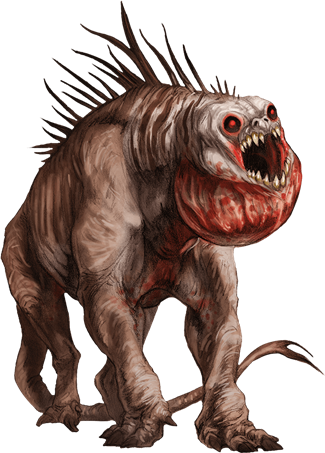

## Howler
A far-off wail precedes the sight of a howler. Even at a distance, listeners' minds cringe at the sound and fill with horror at the realization that the noise is drawing closer. When howlers go on the prowl, courage isn't enough to stand up against them.

These nightmare creatures are native to Pandemonium, but they can be found on most of the Lower Planes, where they are trained as war hounds. Howlers can be domesticated, after a fashion, but they respond only to brutal training in which they are forced to recognize the trainer as the pack's undisputed leader. A trained pack then follows its leader without hesitation. Howler packs course over the battlefields of the Blood War and also serve evil mortals powerful and vicious enough to command their loyalty.

Howlers rely on speed, numbers, and their mind-numbing howling to corner prey before they tear it apart. Their howls flood the minds of their victims, making complex thought impossible. Listeners can do little more than stare in horror and stumble around the battlefield in a search for safety. Fiends especially prize howlers for this reason, because for a few crucial moments in a battle, their howls can neutralize an enemy.

### Environment
Arctic, Astral, Coastal, Desert, Forest, Grassland, Hill, Mountain, Swamp, Underdark, Underwater, Urban,  Summoned/Conjured

### Token

>### Howler
>*Large fiend, Typically Chaotic Evil*
>___
>- **Armor Class** 16 (natural armor)
>- **Hit Points** 90 (12d10 + 24)
>- **Speed** 40 ft.
>___
>|**STR**|**DEX**|**CON**|**INT**|**WIS**|**CHA**|
>|:---:|:---:|:---:|:---:|:---:|:---:|
>|17 (+3)|16 (+3)|15 (+2)|5 (-3)|14 (+2)|6 (-2)|
>
>___
>- **Proficiency Bonus** +3
>- **Saving Throws** 
>- **Damage Vulnerabilities** 
>- **Damage Resistances** cold,fire,lightning; bludgeoning,piercing,and slashing from nonmagical attacks
>- **Damage Immunities** 
>- **Condition Immunities** frightened
>- **Skills** Perception +5
>- **Senses** darkvision 60 ft.,passive Perception 15
>- **Languages** understands Abyssal but can't speak
>- **Challenge** 8
>___
>***Pack Tactics.*** A howler has advantage on attack rolls against a creature if at least one of the howler's allies is within 5 feet of the creature and the ally isn't incapacitated.
>
>#### Actions
>***Multiattack.*** The howler makes two Rending Bite attacks.
>
>***Rending Bite.*** Melee Weapon Attack: +6 to hit, reach 5 ft., one target. Hit: 10 (2d6 + 3) piercing damage, plus 22 (4d10) psychic damage if the target is frightened. This attack ignores damage resistance.
>
>***Mind-Breaking Howl (Recharge 4-6).*** The howler emits a keening howl in a 60-foot cone. Each creature in that area must succeed on a DC 13 Wisdom saving throw or take 16 (3d10) psychic damage and be frightened until the end of the howler's next turn. While a creature is frightened in this way, its speed is halved, and it is incapacitated. A target that successfully saves is immune to the Mind-Breaking Howl of all howlers for the next 24 hours.
>
