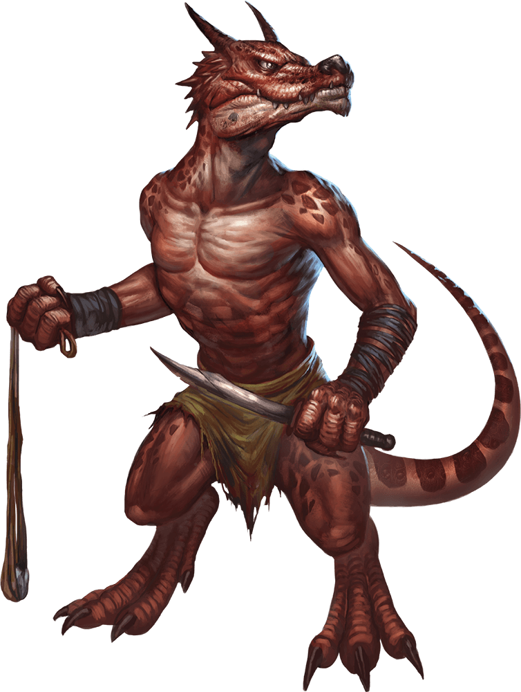
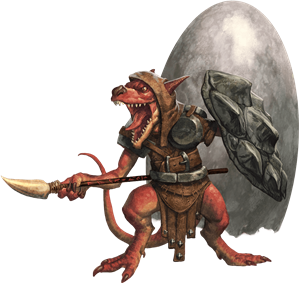
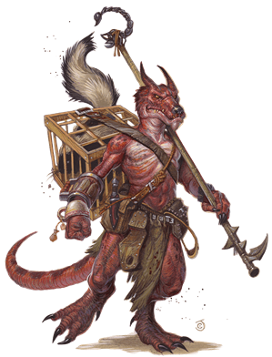
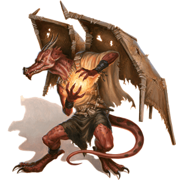
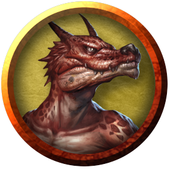

# Kobolds
Some of the smallest draconic creatures in the multiverse, kobolds display their draconic ancestry in the glint of their scales and in their roars. While some legends claim kobolds' arrival came with the Hordes, other legends tell of the first kobolds emerging from the Underdark near the lairs of the earliest dragons.

> Jump to: [Kobold](Kobolds.md#kobold) | [Warrior](Kobolds.md#kobold-warrior)  | [Dragonshield](Kobolds.md#kobold-dragonshield) | [Inventor](Kobolds.md#kobold-inventor) | [Scale Sorcerer](Kobolds.md#kobold-scale-sorcerer) | [Shaman](Kobolds.md#kobold-shaman) | [Winged Kobold](Kobolds.md#winged-kobold)

Historically, kobolds were craven reptilian humanoids that would worship evil dragons as demigods and serve them as minions and toadies. They would inhabit dragons' lairs when they could; they would scour dungeons and ruins when they couldn't, gathering treasures and trinkets to add to their own tiny hoards.

Today, kobolds are often found in service to chromatic dragons--even worshipping them as divine beings--but in recent millennia, as the Hordes have come to understand the benefits of civilization and society, some kobolds chose to take up service with metallic dragons instead. Many have even joined the [Draconic Order](../Organizations/MilitantOrders/DraconicOrder/index.md), and serve as some of their most loyal members.

Some dragons discount the relationship to the kobold, claiming that there is none, for how could such a majestic creature as a dragon be related to such a tiny scrawny creature as the kobold? Whatever that relationship, kobold scales tend to be rust colored, although the occasional kobold sports a scale color more akin to that of a chromatic or a metallic dragon. A kobold's cry can express a range of emotion: anger, resolve, elation, fear, and more. Regardless of the emotion expressed, their cry resonates with draconic power, and serve as a sharp reminder that the dragon-blooded are to be respected, regardless of their size.

***Strength in Numbers.*** Kobolds are egg-laying creatures. They mature quickly and can live to be "great wyrms" more than a century old. However, many kobolds perish before they reach the end of their first decade. Physically weak, they are easy prey for predators. This vulnerability forces them to band together. Their superior numbers can win battles against powerful adversaries, but often with massive casualties on the kobold side.

***Tunnelers and Builders.*** Kobolds make up for their physical ineptitude with a cleverness for trap making and tunneling. Their lairs consist of low tunnels through which they move easily but which hinder larger humanoids. Kobolds also riddle their lairs with traps. The most insidious kobold traps make use of natural hazards and other creatures. A trip wire might connect to a spring-loaded trap that hurls clay pots of flesh-eating green slime or flings crates of venomous giant centipedes at intruders.

***The Lost God.*** In addition to the dragons they revere, kobolds worship a lesser god named Kurtulmak. Legends speak of how Kurtulmak served as Tiamat's vassal in the Nine Hells until Garl Glittergold, the god of gnomes, stole a trinket from the Dragon Queen's hoard. Tiamat sent Kurtulmak to retrieve the trinket, but Garl Glittergold played a trick on him, collapsing the earth and trapping the kobold god in an underground maze for eternity. For this reason, kobolds hate gnomes and pranks of any kind. Kurtulmak's most devoted worshipers dedicate themselves to finding and releasing their lost god from his prison-maze.

---

## Kobold
Individually, the kobold is a diminutive creature, often easily discounted. However, many's the skeleton rotting in the forest that discounted a pack of kobolds. In general, though, the average kobold will prefer to avoid combat, leaving that to the warriors of the tribe, and fights only to ensure the safety of the tribe and/or young.

### Environment
Arctic, Coastal, Desert, Forest, Hill, Mountain, Swamp, Underdark, Urban

### Token

>### Kobold
>*Small humanoid (kobold), any lawful alignment*
>___
>- **Armor Class** 12
>- **Hit Points** 5 (2d6 − 2)
>- **Speed** 30 ft.
>___
>|**STR**|**DEX**|**CON**|**INT**|**WIS**|**CHA**|
>|:---:|:---:|:---:|:---:|:---:|:---:|
>|7 (-2)|15 (+2)|9 (-1)|8 (-1)|7 (-2)|8 (-1)|
>
>___
>- **Proficiency Bonus** +2
>- **Saving Throws** 
>- **Damage Vulnerabilities** 
>- **Damage Resistances** 
>- **Damage Immunities** 
>- **Condition Immunities** 
>- **Skills** 
>- **Senses** darkvision 60 ft.,passive Perception 8
>- **Languages** Common,Draconic
>- **Challenge** 1/8
>___
>***Sunlight Sensitivity.*** While in sunlight, the kobold has disadvantage on attack rolls, as well as on Wisdom (Perception) checks that rely on sight.
>
>***Pack Tactics.*** The kobold has advantage on an attack roll against a creature if at least one of the kobold's allies is within 5 feet of the creature and the ally isn't incapacitated.
>
>#### Actions
>***Dagger.*** Melee Weapon Attack: +4 to hit, reach 5 ft., one target. Hit: 4 (1d4 + 2) piercing damage.
>
>***Sling.*** Ranged Weapon Attack: +4 to hit, range 30/120 ft., one target. Hit: 4 (1d4 + 2) bludgeoning damage.
>

---

## Kobold Warrior
Kobold warriors are the fiercest and strongest of the tribes, and typically the ones encountered outside of the tribe's lair or home.

>### Kobold Warrior
>*Small humanoid (kobold), any lawful alignment*
>___
>- **Armor Class** 15 (wooden shield)
>- **Hit Points** 10 (3d6)
>- **Speed** 30 ft.
>___
>|**STR**|**DEX**|**CON**|**INT**|**WIS**|**CHA**|
>|:---:|:---:|:---:|:---:|:---:|:---:|
>|8 (-1)|16 (+3)|10 (+0)|8 (-1)|7 (-2)|8 (-1)|
>
>___
>- **Proficiency Bonus** +2
>- **Saving Throws** 
>- **Damage Vulnerabilities** 
>- **Damage Resistances** 
>- **Damage Immunities** 
>- **Condition Immunities** 
>- **Skills** 
>- **Senses** darkvision 60 ft.,passive Perception 8
>- **Languages** Common,Draconic
>- **Challenge** 1/2
>___
>***Sunlight Sensitivity.*** While in sunlight, the kobold has disadvantage on attack rolls, as well as on Wisdom (Perception) checks that rely on sight.
>
>***Pack Tactics.*** The kobold has advantage on an attack roll against a creature if at least one of the kobold's allies is within 5 feet of the creature and the ally isn't incapacitated.
>
>#### Actions
>***Shortsword.*** Melee Weapon Attack: +5 to hit, reach 5 ft., one target. Hit: 6 (1d6 + 3) piercing damage.
>
>***Sling.*** Ranged Weapon Attack: +5 to hit, range 30/120 ft., one target. Hit: 5 (1d4 + 3) bludgeoning damage.
>

---

## Kobold Shaman
Kobolds who hear the call of the spirits, or the divine, are commonly called shamans. Though they typically do not take up leadership roles within the pack, kobold shamans often do provide advice and act as important advisers to the tribe as a whole.

>### Kobold Shaman
>*Small humanoid (kobold), any lawful alignment*
>___
>- **Armor Class** 13
>- **Hit Points** 21 (6d6)
>- **Speed** 30 ft.
>___
>|**STR**|**DEX**|**CON**|**INT**|**WIS**|**CHA**|
>|:---:|:---:|:---:|:---:|:---:|:---:|
>|9 (-1)|16 (+3)|11 (+0)|9 (-1)|8 (-1)|12 (+1)|
>
>___
>- **Proficiency Bonus** +3
>- **Saving Throws** 
>- **Damage Vulnerabilities** 
>- **Damage Resistances** 
>- **Damage Immunities** 
>- **Condition Immunities** 
>- **Skills** Arcana +1,Deception +3
>- **Senses** darkvision 60 ft.,passive Perception 9
>- **Languages** Common,Draconic
>- **Challenge** 2
>___
>***Sunlight Sensitivity.*** While in sunlight, the kobold has disadvantage on attack rolls, as well as on Wisdom (Perception) checks that rely on sight.
>
>***Pack Tactics.*** The kobold has advantage on an attack roll against a creature if at least one of the kobold's allies is within 5 feet of the creature and the ally isn't incapacitated.
>
>#### Actions
>***Dagger.*** Melee Weapon Attack: +5 to hit, reach 5 ft., one target. Hit: 5 (1d4 + 3) piercing damage.
>
>***Spellcasting.*** The kobold is a 3rd-level spellcaster. Its spellcasting ability is Charisma (spell save DC 11, +3 to hit with spell attacks). It knows these sorcerer spells:
>
>* Cantrips (at-will): acid splash, blade ward, poison spray, shocking grasp
>* 1st level (4 slots): color spray, shield
>* 2nd level (2 slots): cloud of daggers, misty step
>

---

## Kobold Dragonshield
Kobold dragonshields are champions of their people. Almost all dragonshields begin life as normal kobolds, then are chosen by a dragon and invested with power for the purpose of protecting the dragon's eggs, but once every few years a kobold hatches with an innate version of the dragonshield's abilities. In either case, a dragonshield is skilled at hand-to-hand combat and bears a shield made of dragon scales, as well as scars from desperate fights.

Dragonshields know they have a place of honor among those who venerate dragons, but--being kobolds at heart--most of them feel unworthy of their status and are desperate to prove themselves deserving of it. But they also have the ability to rally in the face of certain death, inspiring others to follow them into battle.

### Environment
Arctic, Coastal, Desert, Forest, Hill, Mountain, Swamp, Underdark, Urban

### Token

>### Kobold Dragonshield
>*Small Dragon, Any Alignment*
>___
>- **Armor Class** 15 (leather, shield)
>- **Hit Points** 44 (8d6 + 16)
>- **Speed** 20 ft.
>___
>|**STR**|**DEX**|**CON**|**INT**|**WIS**|**CHA**|
>|:---:|:---:|:---:|:---:|:---:|:---:|
>|12 (+1)|15 (+2)|14 (+2)|8 (-1)|9 (-1)|10 (+0)|
>
>___
>- **Proficiency Bonus** +2
>- **Saving Throws** 
>- **Damage Vulnerabilities** 
>- **Damage Resistances** see Dragon's Resistance below
>- **Damage Immunities** 
>- **Condition Immunities** 
>- **Skills** Perception +1
>- **Senses** darkvision 60 ft.,passive Perception 11
>- **Languages** Common,Draconic
>- **Challenge** 1
>___
>***Dragon's Resistance.*** The kobold has resistance to a type of damage based on the color of dragon that invested it with power (choose or roll a d10): 1-2, acid (black or copper); 3-4, cold (silver or white); 5-6, fire (brass, gold, or red); 7-8, lightning (blue or bronze); 9-10, poison (green).
>
>***Heart of the Dragon.*** If the kobold is frightened or paralyzed by an effect that allows a saving throw, it can repeat the save at the start of its turn to end the effect on itself and all kobolds within 30 feet of it. Any kobold that benefits from this trait (including the dragonshield) has advantage on its next attack roll.
>
>***Pack Tactics.*** The kobold has advantage on an attack roll against a creature if at least one of the kobold's allies is within 5 feet of the creature and the ally isn't incapacitated.
>
>***Sunlight Sensitivity.*** While in sunlight, the kobold has disadvantage on attack rolls, as well as on Wisdom (Perception) checks that rely on sight.
>
>#### Actions
>***Multiattack.*** The kobold makes two Spear attacks.
>
>***Spear.*** Melee or Ranged Weapon Attack: +3 to hit, reach 5 ft. or range 20/60 ft., one target. Hit: 4 (1d6 + 1) piercing damage, or 5 (1d8 + 1) piercing damage if used with two hands to make a melee attack.
>

---

## Kobold Inventor
A kobold inventor builds improvised weapons to gain an advantage in combat. These weapons last for only one or two attacks before they break and typically work only for the inventor, but they might be surprisingly effective in the meantime. The weapons don't have to be lethal--often one serves its purpose if it distracts, scares, or confuses a creature long enough for the inventor to kill that foe.

### Environment
Arctic, Coastal, Desert, Forest, Hill, Mountain, Swamp, Underdark, Urban

### Token

>### Kobold Inventor
>*Small humanoid , Any Alignment*
>___
>- **Armor Class** 12
>- **Hit Points** 13 (3d6 + 3)
>- **Speed** 30 ft.
>___
>|**STR**|**DEX**|**CON**|**INT**|**WIS**|**CHA**|
>|:---:|:---:|:---:|:---:|:---:|:---:|
>|7 (-2)|15 (+2)|12 (+1)|14 (+2)|10 (+0)|8 (-1)|
>
>___
>- **Proficiency Bonus** +2
>- **Saving Throws** 
>- **Damage Vulnerabilities** 
>- **Damage Resistances** 
>- **Damage Immunities** 
>- **Condition Immunities** 
>- **Skills** 
>- **Senses** darkvision 60 ft.,passive Perception 10
>- **Languages** Common,Draconic
>- **Challenge** 1/4
>___
>***Pack Tactics.*** The kobold has advantage on an attack roll against a creature if at least one of the kobold's allies is within 5 feet of the creature and the ally isn't incapacitated.
>
>***Sunlight Sensitivity.*** While in sunlight, the kobold has disadvantage on attack rolls, as well as on Wisdom (Perception) checks that rely on sight.
>
>#### Actions
>***Dagger.*** Melee or Ranged Weapon Attack: +4 to hit, reach 5 ft. or range 20/60 ft., one target. Hit: 4 (1d4 + 2) piercing damage.
>
>***Sling.*** Ranged Weapon Attack: +4 to hit, range 30/120 ft., one target. Hit: 4 (1d4 + 2) bludgeoning damage.
>
>***Acid (1/Day).*** The kobold hurls a flask of acid. Ranged Weapon Attack: +4 to hit, range 5/20 ft., one target. Hit: 7 (2d6) acid damage.
>
>***Alchemist's Fire (1/Day).*** The kobold throws a flask of alchemist's fire. Ranged Weapon Attack: +4 to hit, range 5/20 ft., one target. Hit: 2 (1d4) fire damage at the start of each of the target's turns. The target can end this damage by using its action to make a DC 10 Dexterity check to extinguish the flames.
>
>***Basket of Centipedes (1/Day).*** The kobold throws a small basket into a 5-foot-square space within 20 feet of it. A swarm of insects (centipedes; see the Monster Manual) with 11 hit points emerges from the basket and rolls initiative. At the end of each of the swarm's turns, there's a 50 percent chance that the swarm disperses.
>
>***Green Slime Pot (1/Day).*** The kobold throws a clay pot full of green slime at the target, and it breaks open on impact. Ranged Weapon Attack: +4 to hit, range 5/20 ft., one target. Hit: 5 (1d10) acid damage, and the target is covered in slime until a creature uses its action to scrape or wash the slime off. A target covered in the slime takes 5 (1d10) acid damage at the start of each of its turns.
>
>***Rot Grub Pot (1/Day).*** The kobold throws a clay pot into a 5-foot-square space within 20 feet of it, and it breaks open on impact. A swarm of rot grubs (in this book) emerges from the shattered pot and remains a hazard in that square.
>
>***Scorpion on a Stick (1/Day).*** The kobold makes a melee attack with a scorpion (see the Monster Manual) tied to the end of a 5-foot-long pole. Melee Weapon Attack: +4 to hit, reach 5 ft., one target. Hit: 1 piercing damage, and the target must make a DC 9 Constitution saving throw, taking 4 (1d8) poison damage on a failed save, or half as much damage on a successful one.
>
>***Skunk in a Cage (1/Day).*** The kobold releases a skunk into an unoccupied space within 5 feet of it. The skunk has a walking speed of 20 feet, AC 10, 1 hit point, and no effective attacks. It rolls initiative and, on its turn, uses its action to spray musk at a random creature within 5 feet of it. The target must succeed on a DC 9 Constitution saving throw, or it retches and is incapacitated for 1 minute. The target can repeat the saving throw at the end of each of its turns, ending the effect on itself on a success. A creature that doesn't need to breathe or is immune to poison automatically succeeds on the saving throw. Once the skunk has sprayed its musk, it can't do so again until it finishes a short or long rest.
>
>***Wasp Nest in a Bag (1/Day).*** The kobold throws a small bag into a 5-foot-square space within 20 feet of it. A swarm of insects (wasps; see the Monster Manual) with 11 hit points emerges from the bag and rolls initiative. At the end of each of the swarm's turns, there's a 50 percent chance that the swarm disperses.
>

---

## Kobold Scale Sorcerer
Kobold scale sorcerers have an innate talent for arcane magic, making them highly valuable members of their communities. These sorcerers typically fill the role of advisor, and when threatened, a scale sorcerer lashes out with colorful magic.

A scale sorcerer who resides in or near a dragon's lair may serve as that dragon's diplomat and mouthpiece--anticipating the dragon's needs, issuing commands to others on the dragon's behalf, and reporting information back to the dragon. Such scale sorcerers often wear artificial wings, which are a sign of their draconic office. Scale sorcerers are just as awed by and respectful of dragons as others who venerate these mighty creatures, but they know that duty requires them not to fawn over their master at all times. They also understand that their frequent proximity to their dragon master means they would probably be the first to die if their master became angry or displeased, so they frantically maintain a balance between adoration and terror in their behavior toward their master.

### Environment
Arctic, Coastal, Desert, Forest, Hill, Mountain, Swamp, Underdark, Urban

### Token

>### Kobold Scale Sorcerer
>*Small humanoid , Any Alignment*
>___
>- **Armor Class** 15 (natural armor)
>- **Hit Points** 27 (5d6 + 10)
>- **Speed** 30 ft.
>___
>|**STR**|**DEX**|**CON**|**INT**|**WIS**|**CHA**|
>|:---:|:---:|:---:|:---:|:---:|:---:|
>|7 (-2)|15 (+2)|14 (+2)|10 (+0)|9 (-1)|14 (+2)|
>
>___
>- **Proficiency Bonus** +2
>- **Saving Throws** 
>- **Damage Vulnerabilities** 
>- **Damage Resistances** 
>- **Damage Immunities** 
>- **Condition Immunities** 
>- **Skills** Arcana +2,Medicine +1
>- **Senses** darkvision 60 ft.,passive Perception 9
>- **Languages** Common,Draconic
>- **Challenge** 1
>___
>***Pack Tactics.*** The kobold has advantage on an attack roll against a creature if at least one of the kobold's allies is within 5 feet of the creature and the ally isn't incapacitated.
>
>***Sunlight Sensitivity.*** While in sunlight, the kobold has disadvantage on attack rolls, as well as on Wisdom (Perception) checks that rely on sight.
>
>#### Actions
>***Multiattack.*** The kobold makes two Dagger or Chromatic Bolt attacks. It can replace one attack with a use of Spellcasting.
>
>***Dagger.*** Melee or Ranged Weapon Attack: +4 to hit, reach 5 ft. or range 20/60 ft., one target. Hit: 4 (1d4 + 2) piercing damage.
>
>***Chromatic Bolt.*** Ranged Spell Attack: +4 to hit, range 60 feet, one target. Hit: 9 (2d6 + 2) of a type of the kobold's choice: acid, cold, fire, lightning, poison, or thunder.
>
>***Spellcasting.*** The kobold casts one of the following spells, requiring no material components and using Charisma as the spellcasting ability (spell save DC 12):
>
>* At will: mage hand, prestidigitation
>* 2/day each: charm person, fog cloud, levitate
>

---

## Winged Kobold
A few kobolds are born with leathery wings and can fly. Known as urds, they like to lurk on high ledges and drop rocks on passersby. Although the urds' wings are seen as gifts from Tiamat, the Dragon Queen, wingless kobolds are envious of those gifts and don't get along with the urds.

### Environment
Arctic, Coastal, Desert, Forest, Hill, Mountain, Swamp, Underdark, Urban

### Token

>### Winged Kobold
>*Small humanoid (kobold), any lawful alignment*
>___
>- **Armor Class** 13
>- **Hit Points** 7 (3d6 − 3)
>- **Speed** 30 ft., fly 30 ft.
>___
>|**STR**|**DEX**|**CON**|**INT**|**WIS**|**CHA**|
>|:---:|:---:|:---:|:---:|:---:|:---:|
>|7 (-2)|16 (+3)|9 (-1)|8 (-1)|7 (-2)|8 (-1)|
>
>___
>- **Proficiency Bonus** +2
>- **Saving Throws** 
>- **Damage Vulnerabilities** 
>- **Damage Resistances** 
>- **Damage Immunities** 
>- **Condition Immunities** 
>- **Skills** 
>- **Senses** darkvision 60 ft.,passive Perception 8
>- **Languages** Common,Draconic
>- **Challenge** 1/4
>___
>***Sunlight Sensitivity.*** While in sunlight, the kobold has disadvantage on attack rolls, as well as on Wisdom (Perception) checks that rely on sight.
>
>***Pack Tactics.*** The kobold has advantage on an attack roll against a creature if at least one of the kobold's allies is within 5 feet of the creature and the ally isn't incapacitated.
>
>#### Actions
>***Dagger.*** Melee Weapon Attack: +5 to hit, reach 5 ft., one target. Hit: 5 (1d4 + 3) piercing damage.
>
>***Dropped Rock.*** Ranged Weapon Attack: +5 to hit, one target directly below the kobold. Hit: 6 (1d6 + 3) bludgeoning damage.
>

