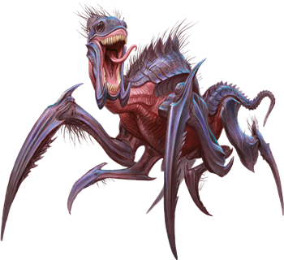

# Kruthiks
Kruthiks are chitin-covered reptiles that hunt in packs and nest in sprawling subterranean warrens. They are attracted to sources of heat, such as dwarven forges and pools of molten lava, and carve out lairs as close to such locations as possible. As they burrow through the earth, they leave behind tunnels--evidence that is often the first clue to the nearby presence of a kruthik hive. Kruthiks also make use of preexisting underground chambers, incorporating them into their lairs when they can.

> Jump to: [Young Kruthik](Kruthiks.md#young-kruthik) | [Adult Kruthik](Kruthiks.md#adult-kruthik) | [Kruthik Hive Lord](Kruthiks.md#kruthik-hive-lord)

Kruthiks communicate with one another through a series of hisses and chittering noises. These sounds can often be heard in advance of a kruthik attack. Whenever their lair is invaded, kruthik guards send out an alarm by rapidly tapping the stone floor with their sharp legs.

In addition to having an acute sense of smell, kruthiks can see in the dark and can detect vibrations in the earth around them. They take the scent of their own dead as a warning and avoid areas where many other kruthiks have died. Slaying a sufficient number of kruthiks in one area might cause the remaining hive members to move elsewhere.

Although they can feed on carrion, kruthiks prefer live prey. They kill enemies by impaling them on their spiked limbs, then grind up the flesh and bones with mandibles strong enough to chew rock. When several kruthiks gang up on a single foe, they become frenzied and even more lethal.

Kruthiks abide the presence of Constructs, Elementals, Oozes, and Undead, and they use such creatures to help guard their hive. They are smart enough to barricade some tunnels and dig new ones that keep their neighbors away from their eggs.

---

## Young Kruthik
Kruthiks hatch from eggs laid by female adults. Each egg is about the size of an adult human's head and hatches within a month. Tiny kruthik hatchlings are harmless and rarely stray far from the nest. They feed primarily on offal and one another. Within a month, the survivors become young kruthiks large enough to hunt and defend themselves.

### Environment
Underdark

### Token

>### Young Kruthik
>*Small monstrosity, Unaligned*
>___
>- **Armor Class** 16 (natural armor)
>- **Hit Points** 9 (2d6 + 2)
>- **Speed** 30 ft., burrow 10 ft., climb 30 ft.
>___
>|**STR**|**DEX**|**CON**|**INT**|**WIS**|**CHA**|
>|:---:|:---:|:---:|:---:|:---:|:---:|
>|13 (+1)|16 (+3)|13 (+1)|4 (-3)|10 (+0)|6 (-2)|
>
>___
>- **Proficiency Bonus** +2
>- **Saving Throws** 
>- **Damage Vulnerabilities** 
>- **Damage Resistances** 
>- **Damage Immunities** 
>- **Condition Immunities** 
>- **Skills** Perception +4
>- **Senses** darkvision 30 ft.,tremorsense 60 ft.,passive Perception 14
>- **Languages** Kruthik
>- **Challenge** 1/8
>___
>***Pack Tactics.*** The kruthik has advantage on an attack roll against a creature if at least one of the kruthik's allies is within 5 feet of the creature and the ally isn't incapacitated.
>
>***Tunneler.*** The kruthik can burrow through solid rock at half its burrowing speed and leaves a 2 1/2-foot-diameter tunnel in its wake.
>
>#### Actions
>***Stab.*** Melee Weapon Attack: +5 to hit, reach 5 ft., one target. Hit: 5 (1d4 + 3) piercing damage.
>

---

## Adult Kruthik
It takes six months of steady eating for a young kruthik to reach adult size. The natural life span of an adult kruthik is roughly seven years.

Adult kruthiks grow spiky protrusions on their legs and can fling these dagger-sized spikes at enemies beyond the reach of their claws.

### Environment
Underdark

### Token

>### Adult Kruthik
>*Medium monstrosity, Unaligned*
>___
>- **Armor Class** 18 (natural armor)
>- **Hit Points** 39 (6d8 + 12)
>- **Speed** 40 ft., burrow 20 ft., climb 40 ft.
>___
>|**STR**|**DEX**|**CON**|**INT**|**WIS**|**CHA**|
>|:---:|:---:|:---:|:---:|:---:|:---:|
>|15 (+2)|16 (+3)|15 (+2)|7 (-2)|12 (+1)|8 (-1)|
>
>___
>- **Proficiency Bonus** +2
>- **Saving Throws** 
>- **Damage Vulnerabilities** 
>- **Damage Resistances** 
>- **Damage Immunities** 
>- **Condition Immunities** 
>- **Skills** Perception +5
>- **Senses** darkvision 60 ft.,tremorsense 60 ft.,passive Perception 15
>- **Languages** Kruthik
>- **Challenge** 2
>___
>***Pack Tactics.*** The kruthik has advantage on an attack roll against a creature if at least one of the kruthik's allies is within 5 feet of the creature and the ally isn't incapacitated.
>
>***Tunneler.*** The kruthik can burrow through solid rock at half its burrowing speed and leaves a 5-foot-diameter tunnel in its wake.
>
>#### Actions
>***Multiattack.*** The kruthik makes two Stab or Spike attacks.
>
>***Stab.*** Melee Weapon Attack: +5 to hit, reach 5 ft., one target. Hit: 6 (1d6 + 3) piercing damage.
>
>***Spike.*** Ranged Weapon Attack: +5 to hit, range 20/60 ft., one target. Hit: 5 (1d4 + 3) piercing damage.
>

---

## Kruthik Hive Lord
A hive lord rules each kruthik hive. When the hive lord dies, the surviving members of the hive abandon their lair and search for a new one. When a suitable location is found, the largest kruthik in the hive undergoes a metamorphosis, forming a cocoon around itself and emerging several weeks later as a hive lord--a bigger and smarter kruthik with the ability to spray digestive acid from its maw. The hive lord claims the largest chamber of the lair and keeps several adult kruthiks nearby as bodyguards.

### Environment
Underdark

### Token

>### Kruthik Hive Lord
>*Large monstrosity, Unaligned*
>___
>- **Armor Class** 20 (natural armor)
>- **Hit Points** 102 (12d10 + 36)
>- **Speed** 40 ft., burrow 20 ft., climb 40 ft.
>___
>|**STR**|**DEX**|**CON**|**INT**|**WIS**|**CHA**|
>|:---:|:---:|:---:|:---:|:---:|:---:|
>|19 (+4)|16 (+3)|17 (+3)|10 (+0)|14 (+2)|10 (+0)|
>
>___
>- **Proficiency Bonus** +3
>- **Saving Throws** 
>- **Damage Vulnerabilities** 
>- **Damage Resistances** 
>- **Damage Immunities** 
>- **Condition Immunities** 
>- **Skills** Perception +8
>- **Senses** darkvision 60 ft.,tremorsense 60 ft.,passive Perception 18
>- **Languages** Kruthik
>- **Challenge** 5
>___
>***Pack Tactics.*** The kruthik has advantage on an attack roll against a creature if at least one of the kruthik's allies is within 5 feet of the creature and the ally isn't incapacitated.
>
>***Tunneler.*** The kruthik can burrow through solid rock at half its burrowing speed and leaves a 10-foot-diameter tunnel in its wake.
>
>#### Actions
>***Multiattack.*** The kruthik makes two Stab or Spike attacks.
>
>***Stab.*** Melee Weapon Attack: +7 to hit, reach 10 ft., one target. Hit: 9 (1d10 + 4) piercing damage.
>
>***Spike.*** Ranged Weapon Attack: +6 to hit, range 30/120 ft., one target. Hit: 7 (1d6 + 4) piercing damage.
>
>***Acid Spray (Recharge 5-6).*** The kruthik sprays acid in a 15-foot cone. Each creature in that area must make a DC 14 Dexterity saving throw, taking 22 (4d10) acid damage on a failed save, or half as much damage on a successful one.
>

