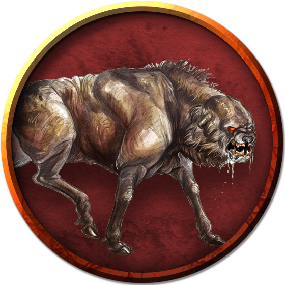

## Leucrotta
A leucrotta is what you would get if you took the head of a giant badger, the legs of a deer, and the body of a large hyena, then put them together and reanimated them with demon ichor without bothering to cover up the stink of death.

It is said that the first leucrottas came into being alongside some gnolls during the rampages of Yeenoghu on the Material Plane. While many of the hyenas that ate Yeenoghu's kills transformed into gnolls, others underwent more bizarre changes; leucrottas were the most numerous of these. What is known is that when the Hordes descended upon Azgaarnoth, leucrottas were a part of the initial ravening. Since that time, leucrottas have almost entirely moved to join the Ulmhorde, though some few still remain with the United Hordes, seeking to return the Hordes to the old ways.

As clever as it is cruel, a leucrotta loves to deceive, torture, and kill. Creatures who venerate Yeenoghu--particularly his gnoll followers--view leucrottas with great respect. Although a leucrotta is unlikely to lead a gnoll war band, it can influence the leader and might agree to carry the leader into battle and offer advice during the fight. Followers of Yeenoghu also see leucrottas as a form of entertainment. They enjoy watching a leucrotta work almost as much as they like doing their own killing, since leucrottas are meticulous in their cruelty and able to draw out kills for better and longer sport. And when there are no victims to be had, a leucrotta can mimic the delightful squeals of a suffering victim.

A leucrotta is so loathsome that few outside of its own kind can stand to be around one for long. Its horrific, hodgepodge body oozes a foul stench. This reek is outdone only by the creature's breath, which issues from a maw that drips fluid corrupted with rot and digestive juices. In place of fangs, a leucrotta has bony ridges as hard as steel that can crush bones and lacerate flesh. These plates are so tough that a leucrotta can use them to peel plate armor away from the body of a slain knight.

A leucrotta's stench would normally warn away prey long before the creature could attack. It has two natural capabilities, however, that give it an advantage. First, a leucrotta's tracks are nearly impossible to distinguish from those of common deer. Second, it can duplicate the call or the vocal expressions of just about any creature it has heard. The monster uses its mimicry to lure in potential victims, then attacks while they are confused or unaware of the actual threat.

### Environment
Extraplanar, Conjured/Summoned

### Token

>### Leucrotta
>*Large monstrosity, Typically Chaotic Evil*
>___
>- **Armor Class** 14 (natural armor)
>- **Hit Points** 67 (9d10 + 18)
>- **Speed** 50 ft.
>___
>|**STR**|**DEX**|**CON**|**INT**|**WIS**|**CHA**|
>|:---:|:---:|:---:|:---:|:---:|:---:|
>|18 (+4)|14 (+2)|15 (+2)|9 (-1)|12 (+1)|6 (-2)|
>
>___
>- **Proficiency Bonus** +2
>- **Saving Throws** 
>- **Damage Vulnerabilities** 
>- **Damage Resistances** 
>- **Damage Immunities** 
>- **Condition Immunities** 
>- **Skills** Deception +2,Perception +5
>- **Senses** darkvision 60 ft.,passive Perception 15
>- **Languages** Abyssal,Gnoll
>- **Challenge** 3
>___
>***Mimicry.*** The leucrotta can mimic Beast sounds and Humanoid voices. A creature that hears the sounds can tell they are imitations only with a successful DC 14 Wisdom (Insight) check.
>
>***Stench.*** Any creature other than a leucrotta or gnoll that starts its turn within 5 feet of the leucrotta must succeed on a DC 12 Constitution saving throw or be poisoned until the start of the creature's next turn. On a successful saving throw, the creature is immune to the Stench of all leucrottas for 1 hour.
>
>#### Actions
>***Multiattack.*** The leucrotta makes one Bite attack and one Hooves attack.
>
>***Bite.*** Melee Weapon Attack: +6 to hit, reach 5 ft., one target. Hit: 8 (1d8 + 4) piercing damage. If the leucrotta scores a critical hit, it rolls the damage dice three times, instead of twice.
>
>***Hooves.*** Melee Weapon Attack: +6 to hit, reach 5 ft., one target. Hit: 11 (2d6 + 4) bludgeoning damage.
>
>#### Bonus Actions
>***Kicking Retreat.*** Immediately after the leucrotta makes a Hooves attack, it takes the Disengage action.
>
