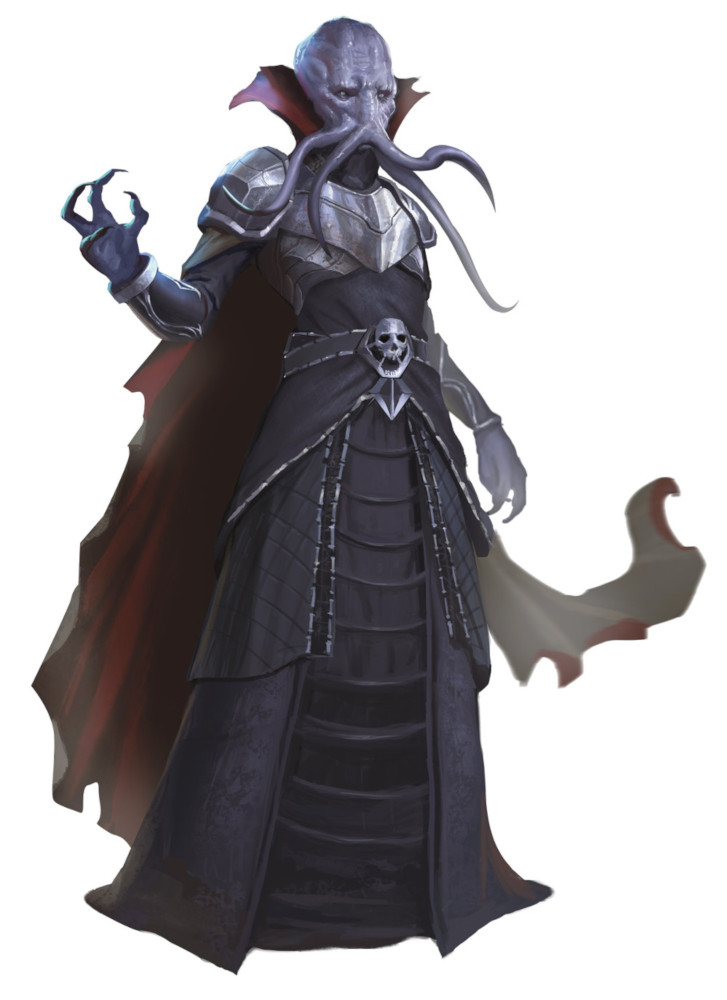
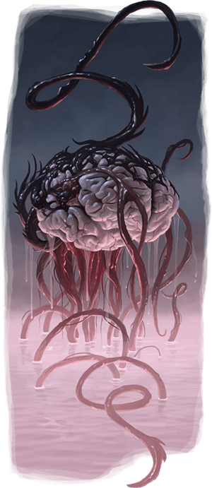
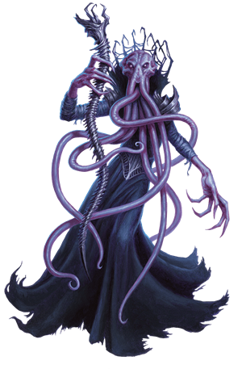
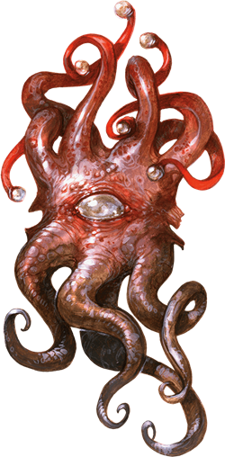
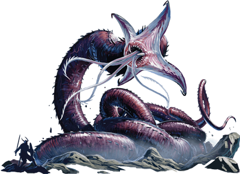

# Mind Flayers
Mind flayers, also called illithids, are the scourge of sentient creatures across countless worlds. Psionic tyrants, slavers, and interdimensional voyagers, they are insidious masterminds that harvest entire races for their own twisted ends. Four tentacles snake from their octopus-like heads, flexing in hungry anticipation when sentient creatures come near.

Jump to: [Mind Flayer](MindFlayers.md#mind-flayer) | [Arcanist](MindFlayers.md#mind-flayer-arcanist) | [Alhoon](MindFlayers.md#Alhoon) | [Infiltrator](MindFlayers.md#infiltrator) | [Illitilich](MindFlayers.md#illithilich) | [Elder Brain](MindFlayers.md#elder-brain) | [Ulitharid](MindFlayers.md#Ulitharid) | [Mindwitness](MindFlayers.md#Mindwitness) | [Neothelid](MindFlayers.md#neothelid)

In eons past, illithids controlled empires that spanned many worlds. They subjugated and consequently warped whole races of humanoid slaves, including the githyanki and githzerai, the grimlocks, and the kuo-toa. Conjoined by a collective consciousness, the illithids hatch plots as far-reaching and evil as their fathomless minds can conceive.

Since the fall of their empires, illithid collectives on the Material Plane have resided in the Underdark.

***Psionic Commanders.*** Mind flayers possess psionic powers that enable them to control the minds of creatures such as troglodytes, grimlocks, quaggoths, and ogres. Illithids prefer to communicate via telepathy and use their telepathy when issuing commands to their thralls.

When an illithid meets strong resistance, it avoids initial combat as it orders its thralls to attack. Like physical extensions of the illithid's thoughts, these thralls interpose themselves between the mind flayer and its foes, sacrificing their lives so that their master can escape.

***Hive Mind Colonies.*** Solitary mind flayers are likely rogues and outcasts. Most illithids belong to a colony of sibling mind flayers devoted to an elder brain — a massive brain-like being that resides in a briny pool near the center of a mind flayer community. From its pool, an elder brain telepathically dictates its desires to each individual mind flayer within 5 miles of it, for it is able to hold multiple mental conversations at once.

***Hunger of the Mind.*** Illithids subsist on the brains of humanoids. The brains provide enzymes, hormones, and psychic energy necessary for their survival. An illithid healthy from a brain-rich diet secretes a thin glaze of mucus that coats its mauve skin.

An illithid experiences euphoria as it devours the brain of a humanoid, along with its memories, personality, and innermost fears. Mind flayers will sometimes harvest a brain rather than devour it, using it as part of some alien experiment or transforming it into an intellect devourer.

***Quallith.*** On the rare occasion that mind flayers need to write something down, they do so in Qualith. This system of tactile writing (similar to braille) is read by an illithid's tentacles. Qualith is written in four-line stanzas and is so alien in construction that non-illithids must resort to magic to discern its meaning. Though Qualith can be used to keep records, illithids most often use it to mark portals or other surfaces with warnings or instructions.

---

## Mind Flayer
Individual mind flayers are rare, they prefer be a part of an Elder Brain hive.

### Environment
Astral, Ruins, Underdark, Urban, Summoned/Conjured

### Token

>### Mind Flayer
>*Medium aberration, lawful evil*
>___
>- **Armor Class** 15 (breastplate)
>- **Hit Points** 71 (13d8 + 13)
>- **Speed** 30 ft.
>___
>|**STR**|**DEX**|**CON**|**INT**|**WIS**|**CHA**|
>|:---:|:---:|:---:|:---:|:---:|:---:|
>|11 (+0)|12 (+1)|12 (+1)|19 (+4)|17 (+3)|17 (+3)|
>
>___
>- **Proficiency Bonus** +3
>- **Saving Throws** Int +7,Wis +6,Cha +6
>- **Damage Vulnerabilities** 
>- **Damage Resistances** 
>- **Damage Immunities** 
>- **Condition Immunities** 
>- **Skills** Arcana +7,Deception +6,Insight +6,Perception +6,Persuasion +6,Stealth +4
>- **Senses** darkvision 120 ft.,passive Perception 16
>- **Languages** Deep Speech,Undercommon,telepathy 120 ft.
>- **Challenge** 7
>___
>***Magic Resistance.*** The mind flayer has advantage on saving throws against spells and other magical effects.
>
>***Innate Spellcasting (Psionics).*** The mind flayer's innate spellcasting ability is Intelligence (spell save DC 15). It can innately cast the following spells, requiring no components:
>
>* *At will:* detect thoughts, levitate
>* *1/day each:* dominate monster, plane shift (self only)
>
>#### Actions
>***Tentacles.*** Melee Weapon Attack: +7 to hit, reach 5 ft., one creature. Hit: 15 (2d10 + 4) psychic damage. If the target is Medium or smaller, it is grappled (escape DC 15) and must succeed on a DC 15 Intelligence saving throw or be stunned until this grapple ends.
>
>***Extract Brain.*** Melee Weapon Attack: +7 to hit, reach 5 ft., one incapacitated humanoid grappled by the mind flayer. Hit: The target takes 55 (10d10) piercing damage. If this damage reduces the target to 0 hit points, the mind flayer kills the target by extracting and devouring its brain.
>
>***Mind Blast (Recharge 5–6).*** The mind flayer magically emits psychic energy in a 60-foot cone. Each creature in that area must succeed on a DC 15 Intelligence saving throw or take 22 (4d8 + 4) psychic damage and be stunned for 1 minute. A creature can repeat the saving throw at the end of each of its turns, ending the effect on itself on a success.
>

---

## Mind Flayer Arcanist
Sometimes, a mind flayer dabbles in the forbidden arcane, and becomes an arcanist.

### Environment
Astral, Ruins, Underdark, Urban, Summoned/Conjured

### Token

>### Mind Flayer Arcanist
>*Medium aberration, lawful evil*
>___
>- **Armor Class** 15 (breastplate)
>- **Hit Points** 71 (13d8 + 13)
>- **Speed** 30 ft.
>___
>|**STR**|**DEX**|**CON**|**INT**|**WIS**|**CHA**|
>|:---:|:---:|:---:|:---:|:---:|:---:|
>|11 (+0)|12 (+1)|12 (+1)|19 (+4)|17 (+3)|17 (+3)|
>
>___
>- **Proficiency Bonus** +3
>- **Saving Throws** Int +7,Wis +6,Cha +6
>- **Damage Vulnerabilities** 
>- **Damage Resistances** 
>- **Damage Immunities** 
>- **Condition Immunities** 
>- **Skills** Arcana +7,Deception +6,Insight +6,Perception +6,Persuasion +6,Stealth +4
>- **Senses** darkvision 120 ft.,passive Perception 16
>- **Languages** Deep Speech,Undercommon,telepathy 120 ft.
>- **Challenge** 8
>___
>***Magic Resistance.*** The mind flayer has advantage on saving throws against spells and other magical effects.
>
>#### Actions
>***Tentacles.*** Melee Weapon Attack: +7 to hit, reach 5 ft., one creature. Hit: 15 (2d10 + 4) psychic damage. If the target is Medium or smaller, it is grappled (escape DC 15) and must succeed on a DC 15 Intelligence saving throw or be stunned until this grapple ends.
>
>***Extract Brain.*** Melee Weapon Attack: +7 to hit, reach 5 ft., one incapacitated humanoid grappled by the mind flayer. Hit: The target takes 55 (10d10) piercing damage. If this damage reduces the target to 0 hit points, the mind flayer kills the target by extracting and devouring its brain.
>
>***Mind Blast (Recharge 5–6).*** The mind flayer magically emits psychic energy in a 60-foot cone. Each creature in that area must succeed on a DC 15 Intelligence saving throw or take 22 (4d8 + 4) psychic damage and be stunned for 1 minute. A creature can repeat the saving throw at the end of each of its turns, ending the effect on itself on a success.
>
>***Innate Spellcasting (Psionics).*** The mind flayer's innate spellcasting ability is Intelligence (spell save DC 15). It can innately cast the following spells, requiring no components:
>
>* *At will:* detect thoughts, levitate
>* *1/day each:* dominate monster, plane shift (self only)
>
>***Spellcasting.*** The mind flayer is a 10th-level spellcaster. Its spellcasting ability is Intelligence (save DC 15, +7 to hit with spell attacks). The mind flayer has the following wizard spells prepared:
>
>* *Cantrips (at will):* blade ward, dancing lights, mage hand, shocking grasp
>* *1st level (4 slots):* detect magic, disguise self, shield, sleep
>* *2nd level (3 slots):* blur, invisibility, ray of enfeeblement
>* *3rd level (3 slots):* clairvoyance, lightning bolt, sending
>* *4th level (3 slots):* confusion, hallucinatory terrain
>* *5th level (2 slots):* telekinesis, wall of force
>

---

## Mind Flayer Infiltrator
Though most mind flayers are averse to relying on their physical abilities, a small portion of mind flayers find unity between their psionic abilities and their predatory instincts. Illithids who practice these ways are known as infiltrators.

***Psionic Assassins.*** Infiltrators focus their psionic powers on enhancing their physical capabilities, making them exceptional spies, assassins, thieves, and scouts. These illithids learn to manifest their psychic energy in the form of soul blades, psionic blades of force extending from their arms and their tentacles. They use telekinetic abilities to protect themselves and enhance their agility. Some are even able to disguise or hide themselves by tricking the minds of nearby observers.

***Illithid Outcasts.*** Though mind flayer colonies often have a variety of reasons to utilize the talents of one of these infiltrators, they are also deeply distrustful of the infiltrators and their devious abilities. After all their skills could be used against the leaders of the colony as part of an uprising. For this reason, they are often killed after their usefulness has expired, and many who could be infiltrators hide their abilities to avoid this fate.

>### Mind Flayer Infiltrator
>*Medium aberration, lawful evil*
>___
>- **Armor Class** 17 (telekinetic defense)
>- **Hit Points** 91 (14d8 + 28)
>- **Speed** 40 ft.
>___
>|**STR**|**DEX**|**CON**|**INT**|**WIS**|**CHA**|
>|:---:|:---:|:---:|:---:|:---:|:---:|
>|13 (+1)|16 (+3)|14 (+2)|19 (+4)|17 (+3)|17 (+3)|
>
>___
>- **Proficiency Bonus** +4
>- **Saving Throws** Dex +7, Int +8, Wis +7, Cha +7
>- **Damage Vulnerabilities** 
>- **Damage Resistances** 
>- **Damage Immunities** 
>- **Condition Immunities** 
>- **Skills** Arcana +8, Deception +7, Insight +7, Perception + 11, Persuasion + 7, Stealth + 7
>- **Senses** darkvision 120 ft.,passive Perception 21
>- **Languages** Deep Speech,Undercommon,telepathy 120 ft.
>- **Challenge** 10
>___
>***Conniving.*** The mind flayer can take the Disengage or Hide action as a bonus action on each of its turns.
>
>***Evasion.*** If the mind flayer is subjected to an effect that allows it to make a Dexterity saving throw to take only half damage, the mind flayer instead takes no damage if it succeeds on the save, and only half damage if it fails.
>
>***Magic Resistance.*** The mind flayer has advantage on saving throws against spells and other magical effects.
>
>***Sneak Attack (1/Turn).*** The mind flayer deals an extra 10 (3d6) damage when it hits a target with a weapon attack or an attack using its soul blade and it has advantage on the attack roll, or when the target is within 5 feet of an ally of the mind flayer that isn't incapacitated and the mind flayer doesn't have disadvantage on the attack roll.
>
>***Telekinetic Defense.*** While the mind flayer is wearing no armor and wielding no shield, its AC includes its Intelligence modifier.
>
>#### Actions
>***Innate Spellcasting (Psionics).*** The mind flayer's innate spellcasting ability is Intelligence (spell save DC 16). It can innately cast the following spells, requiring no components:
>
>* *At will:* detect thoughts, disguise self, feather fall, glamour veil, levitate
>* *1/day each:* dimension door, dominate monster, plane shift (self only), telekinesis
>
>***Multiattack.*** The mind flayer makes three soul blade attacks. It can also use its Teleport before or after the attacks.
>
>***Soulblade.*** Melee Spell Attack: +8 to hit, reach 5 ft., one target. Hit: 14 (3d6 + 4) force damage.
>
>***Tentacles.*** Melee Weapon Attack: +8 to hit, reach 5 ft., one creature. Hit: 15 (2d10 + 4) psychic damage plus 7 (2d6) force damage. If the target is Medium or smaller, it is grappled (escape DC 15) and must succeed on a DC 16 Intelligence saving throw or be stunned until this grapple ends.
>
>***Extract Brain.*** Melee Weapon Attack: +8 to hit, reach 5 ft., one incapacitated humanoid grappled by the mind flayer. Hit: The target takes 55 (10d10) piercing damage plus 10 (3d6) force damage. This damage ignores resistances, and if this damage reduces the target to 0 hit points, the mind flayer kills the target by extracting and devouring its brain.
>
>***Mind Blast (Recharge 5–6).*** The mind flayer magically emits psychic energy in a 60-foot cone. Each creature in that area must succeed on a DC 16 Intelligence saving throw or take 25 (4d8 + 7) psychic damage and be stunned for 1 minute. A creature can repeat the saving throw at the end of each of its turns, ending the effect on itself on a success.
>
>***Teleport (Recharge 4-6).*** The mind flayer teleports to an unoccupied space that it can see within 60 feet of it. Any creatures the mind flayer has grappled are not teleported.
>

---

## Illithilich
The path to true lichdom is something only the most powerful mind flayer mages can pursue, since it requires the ability to craft a phylactery and cast the imprisonment spell.

>### Illithilich
>*Medium undead, any evil alignment*
>___
>- **Armor Class** 17 (natural armor)
>- **Hit Points** 135 (18d8 + 54)
>- **Speed** 30 ft.
>___
>|**STR**|**DEX**|**CON**|**INT**|**WIS**|**CHA**|
>|:---:|:---:|:---:|:---:|:---:|:---:|
>|11 (+0)|16 (+3)|16 (+3)|20 (+5)|14 (+2)|16 (+3)|
>
>___
>- **Proficiency Bonus** +7
>- **Saving Throws** Con +10,Int +12,Wis +9
>- **Damage Vulnerabilities** 
>- **Damage Resistances** cold,lightning,necrotic
>- **Damage Immunities** poison; bludgeoning,piercing,and slashing from nonmagical attacks
>- **Condition Immunities** charmed,exhaustion,frightened,paralyzed,poisoned
>- **Skills** Arcana +19,History +12,Insight +9,Perception +9
>- **Senses** truesight 120 ft.,telepathy 120 ft.,passive Perception 19
>- **Languages** Deep Speech, Undercommon, telepathy 120 ft.
>- **Challenge** 22
>___
>***Magic Resistance.*** The illithilich has advantage on saving throws against spells and other magical effects.
>
>***Undead Nature.*** A illithilich doesn’t require air, food, drink, or sleep.
>
>***Legendary Resistance (3/Day).*** If the illithilich fails a saving throw, it can choose to succeed instead.
>
>***Rejuvenation.*** If it has a phylactery, a destroyed illithilich gains a new body in 1d10 days, regaining all its hit points and becoming active again. The new body appears within 5 feet of the phylactery.
>
>***Turn Resistance.*** The illithilich has advantage on saving throws against any effect that turns undead.
>
>#### Actions
>***Tentacles.*** Melee Weapon Attack: +12 to hit, reach 5 ft., one creature. Hit: 21 (3d10 + 5) psychic damage. If the target is Large or smaller, it is grappled (escape DC 15) and must succeed on a DC 20 Intelligence saving throw or be stunned until this grapple ends.
>
>***Extract Brain.*** Melee Weapon Attack: +12 to hit, reach 5 ft., one incapacitated humanoid grappled by the lich. Hit: 55 (10d10) piercing damage. If this damage reduces the target to 0 hit points, the lich kills the target by extracting and devouring its brain.
>
>***Mind Blast (Recharge 5-6).*** The illithilich magically emits psychic energy in a 60-foot cone. Each creature in that area must succeed on a DC 18 Intelligence saving throw or take 27 (5d8 + 5) psychic damage and be stunned for 1 minute. A creature can repeat the saving throw at the end of each of its turns, ending the effect on itself on a success.
>
>***Paralyzing Touch.*** Melee Spell Attack: +12 to hit, reach 5 ft., one creature. Hit: 10 (3d6) cold damage. The target must succeed on a DC 18 Constitution saving throw or be paralyzed for 1 minute. The target can repeat the saving throw at the end of each of its turns, ending the effect on itself on a success.
>
>***Innate Spellcasting (Psionics).*** The illithilich's innate spellcasting ability is Intelligence (spell save DC 20). It can innately cast the following spells, requiring no components. 
>
>* *At will:* detect thoughts, levitate 
>* *1/day each:* dominate monster, plane shift (self only)
>
>***Spellcasting.*** The illithilich is an 18th-level spellcaster. Its spellcasting ability is Intelligence (spell save DC 20, +12 to hit with spell attacks). The lich has the following wizard spells prepared:
>
>* *Cantrips (at will):* mage hand, prestidigitation, ray of frost
>* *1st level (4 slots):* detect magic, magic missile, shield, thunderwave
>* *2nd level (3 slots):* detect thoughts, invisibility, Melf’s acid arrow, mirror image
>* *3rd level (3 slots):* animate dead, counterspell, dispel magic, fireball
>* *4th level (3 slots):* blight, dimension door
>* *5th level (3 slots):* cloudkill, scrying
>* *6th level (1 slot):* disintegrate, globe of invulnerability
>* *7th level (1 slot):* finger of death, plane shift
>* *8th level (1 slot):* dominate monster, power word stun
>* *9th level (1 slot):* power word kill
>
>#### Legendary Actions
>The illithilich can take 3 legendary actions, choosing from the options below. Only one legendary action option can be used at a time and only at the end of another creature's turn. The illithilich regains spent legendary actions at the start of its turn.
>
>***Extract Brain (Costs 2 Actions).*** The illithilich uses Extract Brain.
>
>***Mind Blast (Costs 3 Actions).*** The illithilich recharges its Mind Blast and uses it.
>
>***Cast Spell (Costs 1-3 Actions).*** The illithilich uses a spell slot to cast a 1st-, 2nd-, or 3rd-level spell that it has prepared. Doing so costs 1 legendary action per level of the spell.
>

### A illithilich's Lair
A illithilich often haunts the abode it favored in life, such as a lonely tower, a haunted ruin, or an academy of black magic. Alternatively, some liches construct secret tombs filled with powerful guardians and traps.Everything about a lich’s lair reflects its keen mind and wicked cunning, including the magic and mundane traps that secure it. Undead, constructs, and bound demons lurk in shadowy recesses, emerging to destroy those who dare to disturb the lich’s work.A lich encountered in its lair has a challenge rating of 22 (41,000 XP).

#### Lair Actions
On initiative count 20 (losing initiative ties), the lich can take a lair action to cause one of the following magical effects; the lich can’t use the same effect two rounds in a row:

* The illithilich rolls a d8 and regains a spell slot of that level or lower. If it has no spent spell slots of that level or lower, nothing happens.
* The illithilich targets one creature it can see within 30 feet of it. A crackling cord of negative energy tethers the illithilich to the target. Whenever the illithilich takes damage, the target must make a DC 18 Constitution saving throw. On a failed save, the illithilich takes half the damage (rounded down), and the target takes the remaining damage. This tether lasts until initiative count 20 on the next round or until the illithilich or the target is no longer in the lich’s illithilich.
* The illithilich calls forth the spirits of creatures that died in its illithilich. These apparitions materialize and attack one creature that the illithilich can see within 60 feet of it. The target must succeed on a DC 18 Constitution saving throw, taking 52 (15d6) necrotic damage on a failed save, or half as much damage on a success. The apparitions then disappear.

---

## Alhoon
Mind flayers that pursue arcane magic are exiled as deviants, and for them no everlasting communion with an elder brain is possible. The road to lichdom offers an alternative way to escape the permanency of death, but that path is long and fraught with barriers. Alhoons are mind flayers who have used a shortcut to attain a lich-like state.

Elder brains forbid mind flayers from pursuing magic power aside from psionics, but it isn't an interdiction they must often enforce. Illithids brook no masters but members of their own kind, so it isn't in their nature to bow to any god or otherworldly patron. However, wizardry remains a temptation. In the pages of a spellbook, an illithid sees a system to acquire authority. Through the writings of the wizard who penned it, the illithid perceives the workings of a highly intelligent mind. Most mind flayers who find a spellbook react with abhorrence or indifference, but for some, a spellbook is a gateway to a new way of thinking.

For a time, the study of such forbidden texts can be hidden from other illithids and even from an elder brain. Yet eventually, mind flayer arcanists determined to pursue wizardry must flee the colony for their own safety. Once they taste freedom from the colony, some prize their privacy, others seek to commune with similar minds, and still others seek to dominate a colony by elevating themselves to the position of leadership normally held by an elder brain. Regardless, all such arcanists face the same stark fact: when they die, they will not join the host of minds in the elder brain--deviant minds are never accepted as part of the collective. For them, death means oblivion.

Lichdom offers salvation and the prospect of being able to pursue knowledge indefinitely. Yet learning the secret of achieving lichdom requires an arcane spellcaster to be at the apex of power--a significant challenge for mind flayers, given the scarcity of available mentors and training.

Confronting this reality, a group of nine mind flayer arcanists used their arcane magic and psionics to weave a new truth. These nine called themselves the Alhoon, and those who follow in their footsteps are referred to by the same name.

***Collaborative Undeath.*** To become alhoons, mind flayer arcanists must cooperate in the creation of a *periapt of mind trapping*, a fist-sized container made of silver, emerald, and amethyst. The process requires at least three mind flayer arcanists and the sacrifice of an equal number of souls from living victims in a three-day-long ritual of spellcasting and psionic communion. Upon its completion, free-willed undeath is conferred on the mind flayers, turning them into alhoons.

Initially, an alhoon can be difficult to distinguish from a normal mind flayer. The most obvious difference is the lack of a mind flayer's ever-present mucus coating. Without that protection, an alhoon's skin becomes dry and cracked, and its eyes might appear shriveled and sunken. Both of these clues are easily missed by someone who hasn't seen a mind flayer. However, in short order, an alhoon's flesh withers away and its empty eye sockets gleam with cold pinpricks of light like those of other liches.

Unlike a true lich's phylactery, the *periapt of mind trapping* doesn't restore the alhoons to undeath if they are destroyed. Instead, a destroyed alhoon's mind is transferred to the periapt, where it remains in communion with any other trapped alhoon minds, as well as the souls of those sacrificed.

The undeath conferred by a *periapt of mind trapping* lasts only so long as the life of the living victim selected. Thus an alhoon who sacrificed a 200-year-old elf looks forward to a much longer existence than one that sacrificed a 35-year-old person. Alhoons can extend their existence by repeating the ritual with new victims, effectively resetting the clocks for themselves.

Destroying a *periapt of mind trapping* consigns those trapped within it to oblivion, and thus alhoons often work together to create elaborate protections for their periapt and their preferred ritual site. Sometimes a single alhoon is entrusted with the *periapt of mind trapping*, but this is a dangerous proposition. Anyone who holds the periapt gains advantage on attacks, saving throws, and checks against the alhoons associated with its creation, and those alhoons in turn suffer disadvantage on attacks, saving throws, and checks against the holder. In addition, the holder can telepathically communicate with any sacrificed soul trapped within, and alhoons within the periapt can speak telepathically with the holder. A creature carrying the periapt can't prevent communication from alhoons but can silence trapped souls.

>### Alhoon
>*Medium undead (Mind Flayer, Wizard), Typically Neutral Evil*
>___
>- **Armor Class** 15 (natural armor)
>- **Hit Points** 150 (20d8 + 60)
>- **Speed** 30 ft., fly 15 ft. (hover)
>___
>|**STR**|**DEX**|**CON**|**INT**|**WIS**|**CHA**|
>|:---:|:---:|:---:|:---:|:---:|:---:|
>|11 (+0)|12 (+1)|16 (+3)|19 (+4)|17 (+3)|17 (+3)|
>
>___
>- **Proficiency Bonus** +4
>- **Saving Throws** Con +7,Int +8,Wis +7,Cha +7
>- **Damage Vulnerabilities** 
>- **Damage Resistances** cold,lightning,necrotic
>- **Damage Immunities** poison
>- **Condition Immunities** charmed,exhaustion,frightened,paralyzed,poisoned
>- **Skills** Arcana +8,Deception +7,History +8,Insight +7,Perception +7,Stealth +5
>- **Senses** truesight 120 ft.,passive Perception 17
>- **Languages** Deep Speech,Undercommon,telepathy 120 ft.
>- **Challenge** 10
>___
>***Magic Resistance.*** The alhoon has advantage on saving throws against spells and other magical effects.
>
>***Turn Resistance.*** The alhoon has advantage on saving throws against any effect that turns Undead.
>
>#### Actions
>***Multiattack.*** The alhoon makes two Chilling Grasp or Arcane Bolt attacks.
>
>***Chilling Grasp.*** Melee Spell Attack: +8 to hit, reach 5 ft., one target. Hit: 14 (4d6) cold damage, and the alhoon regains 14 hit points.
>
>***Arcane Bolt.*** Ranged Spell Attack: +8 to hit, range 120 ft., one target. Hit: 28 (8d6) force damage.
>
>***Mind Blast (Recharge 5-6).*** The alhoon magically emits psychic energy in a 60-foot cone. Each creature in that area must succeed on a DC 16 Intelligence saving throw or take 22 (4d8 + 4) psychic damage and be stunned for 1 minute. A target can repeat the saving throw at the end of each of its turns, ending the effect on itself on a success.
>
>***Spellcasting.*** The alhoon casts one of the following spells, requiring no material components and using Intelligence as the spellcasting ability (spell save DC 16):
>
>* *At will:* dancing lights, detect magic, detect thoughts, disguise self, mage hand, prestidigitation
>* *1/day each:* dominate monster, globe of invulnerability, invisibility, modify memory, plane shift (self only), wall of force
>
>#### Reactions
>***Negate Spell (3/Day).*** The alhoon targets one creature it can see within 60 feet of it that is casting a spell. If the spell is 3rd level or lower, the spell fails, but any spell slots or charges are not wasted.
>

---

## Elder Brain
The ultimate expression of mind flayer domination, an elder brain sprawls within a vat of viscous brine, cared for by mind flayer minions as it touches the thoughts of creatures near and far. It scrawls upon the canvas of the creatures' minds, rewriting their thoughts and authoring their dreams.

An elder brain sustains itself by consuming the brains of other creatures. If its mind flayer servants don't bring meals directly to it, the elder brain reaches out with tendrils of thought, compelling creatures to come to it so that it can feed on them.

When a mind flayer perishes, the elder brain's servants feed its brain to their master, which then absorbs the knowledge and experience contained therein. Mind flayers conceive of this oneness with the elder brain as a sacred state akin to an afterlife.

***Hive Mind.*** Elder brains are so-called among non-illithids because they act as the central communication hub for an entire mind flayer colony, just as a brain does for a living body. Linked to the elder brain, the colony acts like a single organism, acting in concert as if each illithid were the digit of a hand.

An elder brain considers itself and its desires the most important things in the multiverse, and the mind flayers in its colony nothing more than extensions of its will. Each presides over its colony according to its own unique personality and storehouse of collected knowledge and experience. Some elder brains reign as tyrants, while others serve as sages, counselors, and repositories of information and lore for the mind flayers that protect and nourish them.

>### Elder Brain
>*Large aberration (Mind Flayer), Typically Lawful Evil*
>___
>- **Armor Class** 10
>- **Hit Points** 210 (20d10 + 100)
>- **Speed** 5 ft., swim 10 ft.
>___
>|**STR**|**DEX**|**CON**|**INT**|**WIS**|**CHA**|
>|:---:|:---:|:---:|:---:|:---:|:---:|
>|15 (+2)|10 (+0)|20 (+5)|21 (+5)|19 (+4)|24 (+7)|
>
>___
>- **Proficiency Bonus** +5
>- **Saving Throws** Int +10,Wis +9,Cha +12
>- **Damage Vulnerabilities** 
>- **Damage Resistances** 
>- **Damage Immunities** 
>- **Condition Immunities** 
>- **Skills** Arcana +10,Deception +12,Insight +14,Intimidation +12,Persuasion +12
>- **Senses** blindsight 120 ft.,passive Perception 14
>- **Languages** understands Common,Deep Speech,and Undercommon but can't speak,telepathy 5 miles
>- **Challenge** 14
>___
>***Creature Sense.*** The elder brain is aware of creatures within 5 miles of it that have an Intelligence score of 4 or higher. It knows the distance and direction to each creature, as well as each one's Intelligence score, but can't sense anything else about it. A creature protected by a mind blank spell, a nondetection spell, or similar magic can't be perceived in this manner.
>
>***Legendary Resistance (3/Day).*** If the elder brain fails a saving throw, it can choose to succeed instead.
>
>***Magic Resistance.*** The elder brain has advantage on saving throws against spells and other magical effects.
>
>***Telepathic Hub.*** The elder brain can use its telepathy to initiate and maintain telepathic conversations with up to ten creatures at a time. The elder brain can let those creatures telepathically hear each other while connected in this way.
>
>#### Actions
>***Tentacle.*** Melee Weapon Attack: +7 to hit, reach 30 ft., one target. Hit: 20 (4d8 + 2) bludgeoning damage. If the target is a Huge or smaller creature, it is grappled (escape DC 15) and takes 9 (1d8 + 5) psychic damage at the start of each of its turns until the grapple ends. The elder brain can have up to four targets grappled at a time.
>
>***Mind Blast (Recharge 5-6).*** Creatures of the elder brain's choice within 60 feet of it must succeed on a DC 18 Intelligence saving throw or take 32 (5d10 + 5) psychic damage and be stunned for 1 minute. A target can repeat the saving throw at the end of each of its turns, ending the effect on itself on a success.
>
>***Spellcasting (Psionics).*** The elder brain casts one of the following spells, requiring no spell components and using Intelligence as the spellcasting ability (spell save DC 18):
>
>* *At will:* detect thoughts, levitate
>* *3/day:* modify memory
>* *1/day each:* dominate monster, plane shift (self only)
>
>#### Bonus Actions
>***Psychic Link.*** The elder brain targets one incapacitated creature it senses with its Creature Sense trait and establishes a psychic link with the target. Until the link ends, the elder brain can perceive everything the target senses. The target becomes aware that something is linked to its mind once it is no longer incapacitated, and the elder brain can terminate the link at any time (no action required). The target can use an action on its turn to attempt to break the link, doing so with a successful DC 18 Charisma saving throw. On a successful save, the target takes 10 (3d6) psychic damage. The link also ends if the target and the elder brain are more than 5 miles apart. The elder brain can form psychic links with up to ten creatures at a time.
>
>***Sense Thoughts.*** The elder brain targets a creature with which it has a psychic link. The elder brain gains insight into the target's emotional state and foremost thoughts (including worries, loves, and hates).
>
>#### Legendary Actions
>The elder brain can take 3 legendary actions, choosing from the options below. It can take only one legendary action at a time and only at the end of another creature's turn. The elder brain regains spent legendary actions at the start of its turn.
>
>***Break Concentration.*** The elder brain targets one creature within 120 feet of it with which it has a psychic link. The elder brain breaks the creature's concentration on a spell it has cast. The creature also takes 2 (1d4) psychic damage per level of the spell.
>
>***Psychic Pulse.*** The elder brain targets one creature within 120 feet of it with which it has a psychic link. The target and enemies of the elder brain within 30 feet of target take 10 (3d6) psychic damage.
>
>***Sever Psychic Link.*** The elder brain targets one creature within 120 feet of it with which it has a psychic link. The elder brain ends the link, causing the creature to have disadvantage on all ability checks, attack rolls, and saving throws until the end of the creature's next turn.
>
>***Tentacle (Costs 2 Actions).*** The elder brain makes one Tentacle attack.
>

### A Elder Brain's Lair
The lair of an elder brain lies deep in the heart of a mind flayer colony. The brain dwells in a dimly glowing brine pool filled with brackish water infused with its vital fluids and psionic energy.An elder brain's ambitions are always tempered by its relative immobility. Although its telepathic senses can reach for miles, moving anywhere is always a dangerous proposition. If forced outside its brine pool, an elder brain swiftly expires, and transporting an elder brain in its pool through confining and tortuous subterranean tunnels frequently proves difficult or impossible.

#### Lair Actions
On initiative count 20 (losing initiative ties), an elder brain can take one of the following lair actions; the elder brain can't take the same lair action two rounds in a row:

* **Force Wall.** The elder brain casts wall of force.
* **Psionic Anchor.** The elder brain targets one creature it can sense within 120 feet of it and anchors it by sheer force of will. The target must make a DC 18 Charisma saving throw. On a failed save, its speed is reduced to 0, and it can't teleport. It can repeat the saving throw at the end of each of its turns, ending the effect on itself on a success.
* **Psychic Inspiration.** The elder brain targets one friendly creature it can sense within 120 feet of it. The target has a flash of inspiration and gains advantage on one attack roll, ability check, or saving throw it makes before the end of its next turn.

#### Regional Effects
The territory within 5 miles of an elder brain is altered by the creature's psionic presence, which creates one or more of the following effects:

* **Paranoia.** Creatures within 5 miles of an elder brain feel as if they are being followed, even when they're not.
* **Psychic Whispers.** Any creature with which the elder brain has formed a psychic link hears faint, incomprehensible whispers in the deepest recesses of its mind. This psychic detritus consists of the elder brain's stray thoughts commingled with those of other creatures to which it is linked.
* **Telepathic Eavesdropping.** The elder brain can overhear any telepathic conversation within 5 miles of it. The creature that initiated the telepathic conversation makes a DC 18 Wisdom saving throw when telepathic contact is first established. If the save is successful, the creature is aware that something is eavesdropping. The nature of the eavesdropper isn't revealed.
* If the elder brain dies, these effects immediately end.

---

## Ulitharid
Very rarely, when a tadpole from the brine pool of an elder brain is implanted into a creature, that creature transforms into an ulitharid: a larger and more potent mind flayer with six tentacles. Illithids innately recognize that an ulitharid's survival is more important than their own. An elder brain's reaction to the rise of an ulitharid varies. In most colonies, the ulitharid becomes an elder brain's most favored servant, invested with power and authority. In others, the elder brain perceives an ulitharid as a potential rival and manipulates or quashes the ulitharid's ambitions accordingly.

When an ulitharid finds sharing leadership with an elder brain insufferable, it breaks off from the colony, taking a group of mind flayers with it, and moves to another location to form a new colony. After the death of the ulitharid's body, a special process transforms its brain into a new elder brain for the colony.

This process doesn't work on the brain of an ulitharid that dies a natural death, as such brains are too decrepit to be used. Instead, each ulitharid carries a psionically enhanced staff; when the ulitharid is ready to give up its life, it attaches the staff to the back of its head, and the staff cracks open its skull, enabling its brain to be extracted. The brain and the staff are then planted in the ulitharid's corpse, causing it to dissolve into ichor. This psionically potent slime helps to fuel the transformation of the area into a brine pool for the embryonic elder brain.

>### Ulitharid
>*Large aberration (Mind Flayer), Typically Lawful Evil*
>___
>- **Armor Class** 15 (breastplate)
>- **Hit Points** 127 (17d10 + 34)
>- **Speed** 30 ft.
>___
>|**STR**|**DEX**|**CON**|**INT**|**WIS**|**CHA**|
>|:---:|:---:|:---:|:---:|:---:|:---:|
>|15 (+2)|12 (+1)|15 (+2)|21 (+5)|19 (+4)|21 (+5)|
>
>___
>- **Proficiency Bonus** +4
>- **Saving Throws** Int +9,Wis +8,Cha +9
>- **Damage Vulnerabilities** 
>- **Damage Resistances** 
>- **Damage Immunities** 
>- **Condition Immunities** 
>- **Skills** Arcana +9,Insight +8,Perception +8,Stealth +5
>- **Senses** darkvision 120 ft.,passive Perception 18
>- **Languages** Deep Speech,Undercommon,telepathy 2 miles
>- **Challenge** 9
>___
>***Creature Sense.*** The ulitharid is aware of the presence of creatures within 2 miles of it that have an Intelligence score of 4 or higher. It knows the distance and direction to each creature, as well as each creature's Intelligence score, but can't sense anything else about it. A creature protected by a mind blank spell, a nondetection spell, or similar magic can't be perceived in this manner.
>
>***Magic Resistance.*** The ulitharid has advantage on saving throws against spells and other magical effects.
>
>***Psionic Hub.*** If an elder brain establishes a psychic link with the ulitharid, the elder brain can form a psychic link with any other creature the ulitharid can detect using its Creature Sense. Any such link ends if the creature falls outside the telepathy ranges of both the ulitharid and the elder brain. The ulitharid can maintain its psychic link with the elder brain regardless of the distance between them, so long as they are both on the same plane of existence. If the ulitharid is more than 5 miles away from the elder brain, it can end the psychic link at any time (no action required).
>
>#### Actions
>***Tentacles.*** Melee Weapon Attack: +9 to hit, reach 10 ft., one creature. Hit: 27 (4d10 + 5) psychic damage. If the target is Large or smaller, it is grappled (escape DC 14) and must succeed on a DC 17 Intelligence saving throw or be stunned until this grapple ends.
>
>***Extract Brain.*** Melee Weapon Attack: +9 to hit, reach 5 ft., one incapacitated Humanoid grappled by the ulitharid. Hit: 55 (10d10) piercing damage. If this damage reduces the target to 0 hit points, the ulitharid kills the target by extracting and devouring its brain.
>
>***Mind Blast (Recharge 5-6).*** The ulitharid magically emits psychic energy in a 60-foot cone. Each creature in that area must succeed on a DC 17 Intelligence saving throw or take 31 (4d12 + 5) psychic damage and be stunned for 1 minute. A target can repeat the saving throw at the end of each of its turns, ending the effect on itself on a success.
>
>***Spellcasting (Psionics).*** The ulitharid casts one of the following spells, requiring no spell components and using Intelligence as the spellcasting ability (spell save DC 17):
>
>* *At will:* detect thoughts, levitate
>* *1/day each:* dominate monster, feeblemind, mass suggestion, plane shift (self only), project image, scrying, telekinesis
>

---

## Mindwitness
If a beholder is stunned and brought to the brine pool of an elder brain, the beholder can be converted into a mindwitness. This alters some of its eye rays and transforms four of its eyestalks into tentacles similar to a mind flayer's. The mindwitness is psychically imprinted with devotion to the elder brain and submission to illithid commands.

A mindwitness's primary function is to improve telepathic communication in a mind flayer colony. A creature in telepathic communication with a mindwitness can converse through it to as many as seven other creatures the mindwitness can see, rapidly disseminating commands and other information.

If separated from its illithid masters, a mindwitness seeks out other telepathic creatures to tell it what to do. Mindwitnesses have been known to ally with flumphs (see the Monster Manual) and planar beings such as demons, shifting their worldview and alignment to match those of their new masters.

>### Mindwitness
>*Large aberration, Typically Lawful Neutral*
>___
>- **Armor Class** 15 (natural armor)
>- **Hit Points** 75 (10d10 + 20)
>- **Speed** 0 ft., fly 20 ft. (hover)
>___
>|**STR**|**DEX**|**CON**|**INT**|**WIS**|**CHA**|
>|:---:|:---:|:---:|:---:|:---:|:---:|
>|10 (+0)|14 (+2)|14 (+2)|15 (+2)|15 (+2)|10 (+0)|
>
>___
>- **Proficiency Bonus** +3
>- **Saving Throws** Int +5,Wis +5
>- **Damage Vulnerabilities** 
>- **Damage Resistances** 
>- **Damage Immunities** 
>- **Condition Immunities** prone
>- **Skills** Perception +8
>- **Senses** darkvision 120 ft.,passive Perception 18
>- **Languages** Deep Speech,Undercommon,telepathy 600 ft.
>- **Challenge** 5
>___
>***Telepathic Hub.*** When the mindwitness receives a telepathic message, it can telepathically share that message with up to seven other creatures within 600 feet of it that it can see.
>
>#### Actions
>***Multiattack.*** The mindwitness makes one Bite attack and one Tentacles attack, or it uses Eye Ray three times.
>
>***Bite.*** Melee Weapon Attack: +5 to hit, reach 5 ft., one target. Hit: 16 (4d6 + 2) piercing damage.
>
>***Tentacles.*** Melee Weapon Attack: +5 to hit, reach 10 ft., one creature. Hit: 20 (4d8 + 2) psychic damage. If the target is Large or smaller, it is grappled (escape DC 13), and it must succeed on a DC 13 Intelligence saving throw or be restrained until this grapple ends.
>
>***Eye Ray.*** The mindwitness shoots one magical eye ray at random (roll a d6, and reroll if the ray has already been used this turn), choosing one target it can see within 120 feet of it:
>
>* **Aversion Ray.** The targeted creature must make a DC 13 Charisma saving throw. On a failed save, the target has disadvantage on attack rolls for 1 minute. The target can repeat the saving throw at the end of each of its turns, ending the effect on itself on a success.
>* **Fear Ray.** The targeted creature must succeed on a DC 13 Wisdom saving throw or be frightened for 1 minute. The target can repeat the saving throw at the end of each of its turns, ending the effect on itself on a success.
>* **Psychic Ray.** The target must succeed on a DC 13 Intelligence saving throw or take 27 (6d8) psychic damage.
>* **Slowing Ray.** The targeted creature must make a DC 13 Dexterity saving throw. On a failed save, the target's speed is halved for 1 minute. In addition, the creature can't take reactions, and it can take either an action or a bonus action on its turn but not both. The creature can repeat the saving throw at the end of each of its turns, ending the effect on itself on a success.
>* **Stunning Ray.** The targeted creature must succeed on a DC 13 Constitution saving throw or be stunned for 1 minute. The target can repeat the saving throw at the end of each of its turns, ending the effect on itself on a success.
>* **Telekinetic Ray.** If the target is a creature, it must make a DC 13 Strength saving throw. On a failed save, the mindwitness moves it up to 30 feet in any direction, and it is restrained by the ray's telekinetic grip until the start of the mindwitness's next turn or until the mindwitness is incapacitated.
>
>If the target is an object weighing 300 pounds or less that isn't being worn or carried, it is telekinetically moved up to 30 feet in any direction. The mindwitness can also exert fine control on objects with this ray, such as manipulating a simple tool or opening a door or a container.
>

---

## Neothelid
A slime-covered worm of immense size, a neothelid is the result of the mind flayer reproductive cycle gone horribly wrong. On rare occasions, an illithid colony collapses, typically after an external assault, and the elder brain is killed. When that happens, the colony's tadpoles are suddenly freed from their fate. They no longer serve as food, and in turn are no longer fed by their caretakers. Driven by hunger, they turn to devouring one another. Only one tadpole survives out of the thousands in the colony's pool, and it emerges as a neothelid.

***Abhorrent to Illithids.*** Among the strongest taboos in illithid society is the idea of allowing a mature tadpole to survive without implanting it into a donor brain. Under normal circumstances, any tadpole that grows larger than a few inches in length is killed by the elder brain to be food for it or for less mature tadpoles. Any tadpole that survives beyond that state is perceived as a threat to the colony, and the mind flayers organize hunting parties to exterminate the abomination. Lacking enough intelligence to be detected by an elder brain's power to sense thoughts, neothelids warrant such precautions.

***Savage Behemoth.*** As a feral thing, a neothelid knows nothing beyond the predatory existence it has lived so far and struggles to comprehend its new psionic abilities. Neothelids prowl subterranean passages in search of more brains to sate their constant hunger, growing ever more vicious. These creatures can spray tissue-dissolving enzymes from their tentacle ducts, reducing victims to a puddle of slime and leaving only the pulsing brain unharmed. They have no knowledge of their link to illithids, so they're just as likely to prey on mind flayers as on anything else.

>### Neothelid
>*Gargantuan aberration, chaotic evil*
>___
>- **Armor Class** 16 (natural armor)
>- **Hit Points** 325 (21d20 + 105)
>- **Speed** 30 ft.
>___
>|**STR**|**DEX**|**CON**|**INT**|**WIS**|**CHA**|
>|:---:|:---:|:---:|:---:|:---:|:---:|
>|27 (+8)|7 (-2)|21 (+5)|3 (-4)|16 (+3)|12 (+1)|
>
>___
>- **Proficiency Bonus** +0
>- **Saving Throws** Int +1,Wis +8,Cha +6
>- **Damage Vulnerabilities** 
>- **Damage Resistances** 
>- **Damage Immunities** 
>- **Condition Immunities** 
>- **Skills** 
>- **Senses** blindsight 120 ft.,passive Perception 13
>- **Languages** --
>- **Challenge** 13
>___
>***Creature Sense.*** The neothelid is aware of the presence of creatures within 1 mile of it that have an Intelligence score of 4 or higher. It knows the distance and direction to each creature, as well as each creature's Intelligence score, but can't sense anything else about it. A creature protected by a mind blank spell, a nondetection spell, or similar magic can't be perceived in this manner.
>
>***Magic Resistance.*** The neothelid has advantage on saving throws against spells and other magical effects.
>
>#### Actions
>***Tentacles.*** Melee Weapon Attack: +13 to hit, reach 15 ft., one target. Hit: 21 (3d8 + 8) bludgeoning damage plus 13 (3d8) psychic damage. If the target is a Large or smaller creature, it must succeed on a DC 18 Strength saving throw or be swallowed by the neothelid. A swallowed creature is blinded and restrained, it has total cover against attacks and other effects outside the neothelid, and it takes 35 (10d6) acid damage at the start of each of the neothelid's turns.
>
>If the neothelid takes 30 damage or more on a single turn from a creature inside it, the neothelid must succeed on a DC 18 Constitution saving throw at the end of that turn or regurgitate all swallowed creatures, which fall prone in a space within 10 feet of the neothelid. If the neothelid dies, a swallowed creature is no longer restrained by it and can escape from the corpse by using 20 feet of movement, exiting prone.
>
>***Acid Breath (Recharge 5-6).*** The neothelid exhales acid in a 60-foot cone. Each creature in that area must make a DC 18 Dexterity saving throw, taking 35 (10d6) acid damage on a failed save, or half as much damage on a successful one.
>
>***Innate Spellcasting (Psionics).*** The neothelid's innate spellcasting ability is Wisdom (spell save DC 16). It can innately cast the following spells, requiring no components:
> 
>* *At will:* levitate
>* *1/day each:* confusion, feeblemind, telekinesis
>
