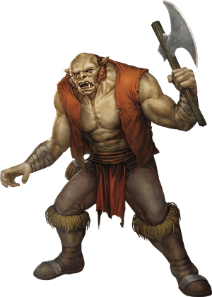

# Ogres
Ogres are as lazy of mind as they are strong of body. They live by raiding, scavenging, and killing for food and pleasure. The average adult specimen stands between 9 and 10 feet tall and weighs close to a thousand pounds.

> Jump to: [Ogre](Ogres.md#ogre) | [Ogre Battering Ram](Ogres.md#ogre-battering-ram) | [Ogre Bolt Launcher](Ogres.md#ogre-bolt-launcher) | [Ogre Chain Brute](Ogres.md#ogre-chain-brute) | [Ogre Howdah](Ogres.md#ogre-howdah) | [Half-Ogre](Ogres.md#half-ogre) | [Oni](Ogres.md#oni) | [Ogre Mage](Ogres.md#ogre-mage)

***Furious Tempers.*** Ogres are notorious for their quick tempers, which flare at the smallest perceived offense. Insults and name-calling can rouse an ogre's wrath in an instant — as can stealing from it, bumping, jabbing, or prodding it, laughing, making faces, or simply looking at it the wrong way. When its rage is incited, an ogre lashes out in a frustrated tantrum until it runs out of objects or creatures to smash.

![Ogres.md]

***Gruesome Gluttons.*** Ogres eat almost anything, but they especially enjoy the taste of dwarves, halflings, and elves. When they can, they combine dinner with pleasure, chasing scurrying victims around before eating them raw. If enough of its victim remains after the ogre has gorged itself, it might make a loincloth from its quarry's skin and a necklace from its leftover bones. This macabre crafting is the height of ogre culture.

***Greedy Collectors.*** An ogre's eyes glitter with avarice when it sees the possessions of others. Ogres carry rough sacks on their raids, which they fill with fabulous "treasure" taken from their victims. This might include a collection of battered helmets, a moldy wheel of cheese, a rough patch of animal fur fastened like a cloak, or a squealing, mud-spattered pig. Ogres also delight in the gleam of gold and silver, and they will fight one another over small handfuls of coins. Smarter creatures can earn an ogre's trust by offering it gold or a weapon forged for a creature of its size.

***Legendary Stupidity.*** Few ogres can count to ten, even with their fingers in front of them. Most speak only a rudimentary form of Giant and know a smattering of Common words. Ogres believe what they are told and are easy to fool or confuse, but they break things they don't understand. Silver-tongued tricksters who test their talents on ogres typically end up eating their eloquent words -- and then being eaten in turn.

***Opportunistic Wanderers.*** Ogres clothe themselves in animal pelts and uproot trees for use as tools and weapons. They create stone-tipped javelins for hunting. When they establish lairs, they settle near the rural edges of settled lands, taking advantage of poorly protected livestock, undefended larders, and unwary farmers.

An ogre sleeps in caves, animal dens, or under trees until it finds a cabin or isolated farmhouse, whereupon it kills the inhabitants and lairs there. Whenever it is bored or hungry, an ogre ventures out from its lair, attacking anything that crosses its path. Only after an ogre has depleted an area of food does it move on.

***Ogre Gangs.*** Ogres sometimes band together in small, nomadic groups, but they lack a true sense of tribalism. When bands of ogres meet, one might attempt to capture the members of the other group to increase its numbers. However, ogre bands are just as likely to trade members freely, especially if the welcoming band is temporarily flush with food and weapons.

Whenever possible, ogres gang up with other monsters to bully or prey on creatures weaker than themselves. They associate freely with goblinoids, orcs, and trolls, and practically worship giants. In the giants' complex social structure (known as the *ordning*), ogres rank beneath the lowest giants in status. As a result, an ogre will do nearly anything a giant asks.

***Ogre Priest.*** Ogres, when they stop to think about gods, generally find themselves aligned with the principles of Vaprak--when they even stop to consider principles at all. Some ogres, however, are born with some slightly better insight (or learn it from being thrust into a subservient role and told to learn--sometimes at the hands of a darker master), and learn to channel the divine power of Vaprak to ogrish benefit. It is said in some quarters that the Ogre Priests of Vaprak are divinely blessed to naturally immortal--that is, though they can still be killed, they do not age--because Vaprak needs them to wander the countryside, tending to the flock of ogres, lest they all kill themselves off... and leave Vaprak without a sizable number of worshippers.

***Ogre Warpriest.*** Some ogres prefer the much simpler canon of Gruumsh, the god of the Orcs: Kill as many as you can. Of those ogres who fall in with Gruumsh, some are elevated by the god to a clerical function, serving as a bastion of support and strength for the orcs around them--the better to kill as many as they can.

---

## Ogre
(No description given)

### Environment
(FIXME)

### Token

>### Ogre
>*Large giant, chaotic evil*
>___
>- **Armor Class** 11 (hide armor)
>- **Hit Points** 59 (7d10 + 21)
>- **Speed** 40 ft.
>___
>|**STR**|**DEX**|**CON**|**INT**|**WIS**|**CHA**|
>|:---:|:---:|:---:|:---:|:---:|:---:|
>|19 (+4)|8 (-1)|16 (+3)|5 (-3)|7 (-2)|7 (-2)|
>
>___
>- **Proficiency Bonus** +2
>- **Saving Throws** 
>- **Damage Vulnerabilities** 
>- **Damage Resistances** 
>- **Damage Immunities** 
>- **Condition Immunities** 
>- **Skills** 
>- **Senses** darkvision 60 ft.,passive Perception 8
>- **Languages** Common,Giant
>- **Challenge** 2
>___
>#### Actions
>***Greatclub.*** Melee Weapon Attack: +6 to hit, reach 5 ft., one target. Hit: 13 (2d8 + 4) bludgeoning damage.
>
>***Javelin.*** Melee or Ranged Weapon Attack: +6 to hit, reach 5 ft. or range 30/120 ft., one target. Hit: 11 (2d6 + 4) piercing damage.
>

---

## Ogre Battering Ram
An ogre battering ram carries an enormous club that's primarily used for bashing doors into kindling but also works well for smashing foes. These ogres are drilled in two simple tasks: rushing forward to shatter enemy fortifications and using their weapons to force an advancing enemy to halt.

### Environment
(FIXME)

### Token

>### Ogre Battering Ram
>*Large Giant, Typically Chaotic Evil*
>___
>- **Armor Class** 11 (hide armor)
>- **Hit Points** 76 (9d10 + 27)
>- **Speed** 40 ft.
>___
>|**STR**|**DEX**|**CON**|**INT**|**WIS**|**CHA**|
>|:---:|:---:|:---:|:---:|:---:|:---:|
>|19 (+4)|8 (-1)|16 (+3)|5 (-3)|7 (-2)|7 (-2)|
>
>___
>- **Proficiency Bonus** +2
>- **Saving Throws** 
>- **Damage Vulnerabilities** 
>- **Damage Resistances** 
>- **Damage Immunities** 
>- **Condition Immunities** 
>- **Skills** 
>- **Senses** darkvision 60 ft.,passive Perception 8
>- **Languages** Common,Giant
>- **Challenge** 4
>___
>***Siege Monster.*** The ogre deals double damage to objects and structures.
>
>#### Actions
>***Multiattack.*** The ogre makes two Bash attacks.
>
>***Bash.*** Melee Weapon Attack: +6 to hit, reach 5 ft., one target. Hit: 15 (2d10 + 4) bludgeoning damage, and the ogre can push the target 5 feet away if the target is a Huge or smaller creature.
>
>#### Reactions
>***Block the Path.*** When a creature enters a space within 5 feet of the ogre, the ogre makes a Bash attack against that creature. If the attack hits, the target's speed is reduced to 0 until the start of the ogre's next turn.
>

---

## Ogre Bolt Launcher
A bolt launcher carries a gigantic crossbow--a weapon so large it's essentially an ogre-held ballista. An ogre bolt launcher can load this immense weapon and loose its deadly missile as quickly as a dwarf handles a crossbow. The bolts are so large that few ogres can carry more than a half dozen at a time, but bolt launchers have been known to uproot small trees or tear beams out of buildings and launch those when their ammunition runs low.

### Environment
(FIXME)

### Token

>### Ogre Bolt Launcher
>*Large Giant, Typically Chaotic Evil*
>___
>- **Armor Class** 13 (hide armor)
>- **Hit Points** 59 (7d10 + 21)
>- **Speed** 40 ft.
>___
>|**STR**|**DEX**|**CON**|**INT**|**WIS**|**CHA**|
>|:---:|:---:|:---:|:---:|:---:|:---:|
>|19 (+4)|12 (+1)|16 (+3)|5 (-3)|7 (-2)|7 (-2)|
>
>___
>- **Proficiency Bonus** +2
>- **Saving Throws** 
>- **Damage Vulnerabilities** 
>- **Damage Resistances** 
>- **Damage Immunities** 
>- **Condition Immunities** 
>- **Skills** 
>- **Senses** darkvision 60 ft.,passive Perception 8
>- **Languages** Common,Giant
>- **Challenge** 2
>___
>#### Actions
>***Fist.*** Melee Weapon Attack: +6 to hit, reach 5 ft., one target. Hit: 9 (2d4 + 4) bludgeoning damage.
>
>***Bolt Launcher.*** Ranged Weapon Attack: +3 to hit, range 120/480 ft., one target. Hit: 17 (3d10 + 1) piercing damage.
>

---

## Ogre Chain Brute
An ogre chain brute wields a great spiked chain, swinging it with both hands in a wide circle to knock foes off their feet. Alternatively, the ogre can swing the chain in a crushing overhead smash.

### Environment
(FIXME)

### Token

>### Ogre Chain Brute
>*Large Giant, Typically Chaotic Evil*
>___
>- **Armor Class** 11 (hide armor)
>- **Hit Points** 59 (7d10 + 21)
>- **Speed** 40 ft.
>___
>|**STR**|**DEX**|**CON**|**INT**|**WIS**|**CHA**|
>|:---:|:---:|:---:|:---:|:---:|:---:|
>|19 (+4)|8 (-1)|16 (+3)|5 (-3)|7 (-2)|7 (-2)|
>
>___
>- **Proficiency Bonus** +2
>- **Saving Throws** 
>- **Damage Vulnerabilities** 
>- **Damage Resistances** 
>- **Damage Immunities** 
>- **Condition Immunities** 
>- **Skills** 
>- **Senses** darkvision 60 ft.,passive Perception 8
>- **Languages** Common,Giant
>- **Challenge** 3
>___
>#### Actions
>***Fist.*** Melee Weapon Attack: +6 to hit, reach ft., one target. Hit: 9 (2d4 + 4) bludgeoning damage.
>
>***Chain Smash (Recharge 6).*** Melee Weapon Attack: +6 to hit, reach 10 ft., one target. Hit: 13 (2d8 + 4) bludgeoning damage, and the target must succeed on a DC 14 Constitution saving throw or be stunned for 1 minute. The target repeats the saving throw if it takes damage and at the end of each of its turns, ending the effect on itself on a success.
>
>***Chain Sweep.*** The ogre swings its chain, and each creature within 10 feet of it must make a DC 14 Dexterity saving throw. On a failed saving throw, a creature takes 8 (1d8 + 4) bludgeoning damage and is knocked prone. On a successful save, the creature takes half as much damage and isn't knocked prone.
>

---

## Ogre Howdah
The most unusual of the specialized ogres, the howdah carries a palisaded wooden fort on its back. The fort serves as a fighting platform for up to four Small people. Ogre howdahs are most often seen bearing bow- and spear-wielding goblins into battle, or perhaps kobolds or deep gnomes (all three appear in the Monster Manual), but they might also transport other Small folk.

### Environment
(FIXME)

### Token

>### Ogre Howdah
>*Large Giant, Typically Chaotic Evil*
>___
>- **Armor Class** 15 (breastplate, shield)
>- **Hit Points** 59 (7d10 + 21)
>- **Speed** 40 ft.
>___
>|**STR**|**DEX**|**CON**|**INT**|**WIS**|**CHA**|
>|:---:|:---:|:---:|:---:|:---:|:---:|
>|19 (+4)|8 (-1)|16 (+3)|5 (-3)|7 (-2)|7 (-2)|
>
>___
>- **Proficiency Bonus** +2
>- **Saving Throws** 
>- **Damage Vulnerabilities** 
>- **Damage Resistances** 
>- **Damage Immunities** 
>- **Condition Immunities** 
>- **Skills** 
>- **Senses** darkvision 60 ft.,passive Perception 8
>- **Languages** Common,Giant
>- **Challenge** 2
>___
>***Howdah.*** The ogre carries a compact fort on its back. Up to four Small creatures can ride in the fort without squeezing. To make a melee attack against a target within 5 feet of the ogre, they must use spears or weapons with reach. Creatures in the fort have three-quarters cover against attacks and effects from outside it. If the ogre dies, creatures in the fort are placed in unoccupied spaces within 5 feet of the ogre.
>
>#### Actions
>***Fist.*** Melee Weapon Attack: +6 to hit, reach 5 ft., one target. Hit: 11 (2d6 + 4) bludgeoning damage.
>

---

## Half-Ogre
The offspring of an ogre and any of a human, a hobgoblin, a bugbear, or an orc is a half-ogre, also called an ogrillon when the non-ogre parent is an orc. An adult half-ogre stands 8 feet tall and weighs 450 pounds on average.

Although many half-ogres have lost the beastility and/or legendary stupidity of their ogrish parentage, many half-ogres, like other "halves", find they have no home among ogres nor among their other parents. Many end up finding a life as a thug, but some happy few end up finding their way to a [mercenary company](../Organizations/MercCompanies/index.md), wherein they can best apply their incredible strength in positive pursuits.

***Playable Race: Mass in Action.*** Many heroes of note have been [half-ogres](../Races/Half-Ogre.md)

### Environment
(FIXME)

### Token

>### Half-Ogre
>*Large giant, any chaotic alignment*
>___
>- **Armor Class** 12 (hide armor)
>- **Hit Points** 30 (4d10 + 8)
>- **Speed** 30 ft.
>___
>|**STR**|**DEX**|**CON**|**INT**|**WIS**|**CHA**|
>|:---:|:---:|:---:|:---:|:---:|:---:|
>|17 (+3)|10 (+0)|14 (+2)|7 (-2)|9 (-1)|10 (+0)|
>
>___
>- **Proficiency Bonus** +2
>- **Saving Throws** 
>- **Damage Vulnerabilities** 
>- **Damage Resistances** 
>- **Damage Immunities** 
>- **Condition Immunities** 
>- **Skills** 
>- **Senses** darkvision 60 ft.,passive Perception 9
>- **Languages** Common,Giant
>- **Challenge** 1
>___
>#### Actions
>***Battleaxe.*** Melee Weapon Attack: +5 to hit, reach 5 ft., one target. Hit: 12 (2d8 + 3) slashing damage, or 14 (2d10 + 3) slashing damage if used with two hands.
>
>***Javelin.*** Melee or Ranged Weapon Attack: +5 to hit, reach 5 ft. or range 30/120 ft., one target. Hit: 10 (2d6 + 3) piercing damage.
>

---

## Oni
In nursery rhymes, oni are fearsome bogeymen that haunt the nightmares of children and adults alike, yet they are very real and always hungry. They find human babies especially delicious. Oni look like demonic ogres with blue or green skin, dark hair, and a pair of short ivory horns protruding from their foreheads. Their eyes are dark with strikingly white pupils, and their teeth and claws are jet black.

***Night Haunters.*** By the light of day, an oni hides its true form with magic, gaining the trust of those it intends to betray when darkness descends. These creatures can change their size as well as their shape, appearing as humanoids as they pass through towns, pretending to be travelers, woodcutters, or frontier folk. In such a form, an oni takes stock of the selection of humanoids in a settlement and devises ways to abduct and devour some of them.

***Magical Ogres.*** Oni are sometimes called ogre mages because of their innate magical ability. Though they are only distantly related to true ogres, they share the ogres' habit of joining forces with other evil creatures. An oni serves a master if doing so proves lucrative or provides it with a luxurious, well-defended home. Oni covet magic, and they work for evil wizards and hags in exchange for useful magic items.

### Environment
(FIXME)

### Token

>### Oni
>*Large giant, lawful evil*
>___
>- **Armor Class** 16 (chain mail)
>- **Hit Points** 110 (13d10 + 39)
>- **Speed** 30 ft., fly 30 ft.
>___
>|**STR**|**DEX**|**CON**|**INT**|**WIS**|**CHA**|
>|:---:|:---:|:---:|:---:|:---:|:---:|
>|19 (+4)|11 (+0)|16 (+3)|14 (+2)|12 (+1)|15 (+2)|
>
>___
>- **Proficiency Bonus** +3
>- **Saving Throws** Dex +3,Con +6,Wis +4,Cha +5
>- **Damage Vulnerabilities** 
>- **Damage Resistances** 
>- **Damage Immunities** 
>- **Condition Immunities** 
>- **Skills** Arcana +5,Deception +8,Perception +4
>- **Senses** darkvision 60 ft.,passive Perception 14
>- **Languages** Common,Giant
>- **Challenge** 7
>___
>***Innate Spellcasting.*** The oni's innate spellcasting ability is Charisma (spell save DC 13). The oni can innately cast the following spells, requiring no material components:
>
>At will: darkness, invisibility
>
>1/day each: charm person, cone of cold, gaseous form, sleep
>
>***Magic Weapons.*** The oni's weapon attacks are magical.
>
>***Regeneration.*** The oni regains 10 hit points at the start of its turn if it has at least 1 hit point.
>
>#### Actions
>***Multiattack.*** The oni makes two attacks, either with its claws or its glaive.
>
>***Claw (Oni Form Only).*** Melee Weapon Attack: +7 to hit, reach 5 ft., one target. Hit: 8 (1d8 + 4) slashing damage.
>
>***Glaive.*** Melee Weapon Attack: +7 to hit, reach 10 ft., one target. Hit: 15 (2d10 + 4) slashing damage, or 9 (1d10 + 4) slashing damage in Small or Medium form.
>
>***Change Shape.*** The oni magically polymorphs into a Small or Medium humanoid, into a Large giant, or back into its true form. Other than its size, its statistics are the same in each form. The only equipment that is transformed is its glaive, which shrinks so that it can be wielded in humanoid form. If the oni dies, it reverts to its true form, and its glaive reverts to its normal size.
>

---

## Ogre Mage
Ogres are not known for their magical prowess. Few have any amount of respect for nature, though many ogres worship Vaprak, few rise to become clerics and the stupid and impatient ogres make for poor scholars. Therefore, most ogre spellcasters are sorcerers, but even among these sorcerers, it is rare that their talents are respected by their fellows and rarer still for the ogres in question to have any real understanding of the forces they wield in battle. Some few, however, are born with greater intelligence (or wisdom, or cunning, depending on how you look at it), and become incredibly dangerous creatures.

### Environment
(FIXME)

### Token

>### Ogre Mage
>*Large giant, chaotic evil*
>___
>- **Armor Class** 16 (chain mail)
>- **Hit Points** 119 (14d10 + 42)
>- **Speed** 40 ft.
>___
>|**STR**|**DEX**|**CON**|**INT**|**WIS**|**CHA**|
>|:---:|:---:|:---:|:---:|:---:|:---:|
>|17 (+3)|10 (+0)|16 (+3)|8 (-1)|12 (+1)|14 (+2)|
>
>___
>- **Proficiency Bonus** +3
>- **Saving Throws** Int +2
>- **Damage Vulnerabilities** 
>- **Damage Resistances** 
>- **Damage Immunities** 
>- **Condition Immunities** 
>- **Skills** 
>- **Senses** darkvision 60 ft.,passive Perception 11
>- **Languages** Common,Draconic,Giant
>- **Challenge** 6
>___
>***Spellcasting.*** The ogre mage is an 8th-level spellcaster. Its spellcasting ability is Charisma (spell save DC 13, +5 to hit with spell attacks). It knows the following sorcerer spells:
>
>Cantrips (at will): acid splash, dancing lights, firesweep, prestidigitation, radiant blade
>
>1st level (4 slots): fog cloud, jump, venomous ray
>
>2nd level (3 slots): gust of wind, shatter
>
>3rd level (3 slots): counterspell, lightning bolt
>
>4th level (2 slots): banishment, wall of fire
>
>***Sorcery Points.*** The ogre mage has 8 sorcery points. As a bonus action, it can spend a number of sorcery points to create a spell slot, as a sorcerer does. Alternatively, it can, as a bonus action, sacrifice a spell slot to restore spent sorcery points equal to or less than the level of the spell slot sacrificed. It can spend 1 or more sorcery points to gain one of the following benefits:
>
>* *Quickened Spell.* When the ogre mage casts a spell that has a casting time of 1 action, it can spend 2 sorcery points to change the spell's casting time to 1 bonus action.
>
>* *Twinned Spell.* When the ogre mage casts a spell that can target only one creature and doesn't have a range of Self, it can spend a number of sorcery points equal to the spell's level to target a second creature within range with the same spell. If the spell is a cantrip, the ogre spends 1 sorcery point to use this feature.
>
>#### Actions
>***Morningstar.*** Melee Weapon Attack: +6 to hit, reach 5 ft., one target. Hit: 13 (2d8 + 3) piercing damage.
>

