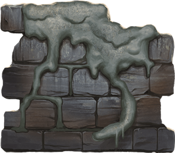
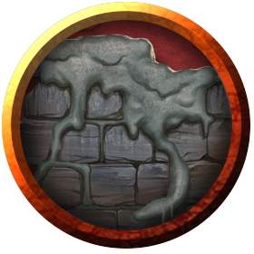
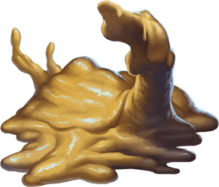
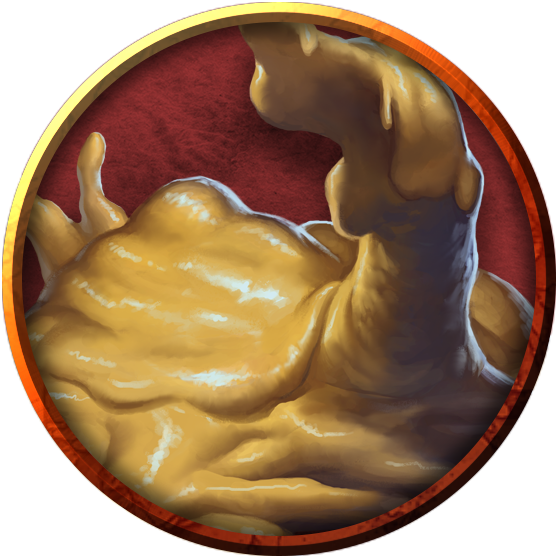
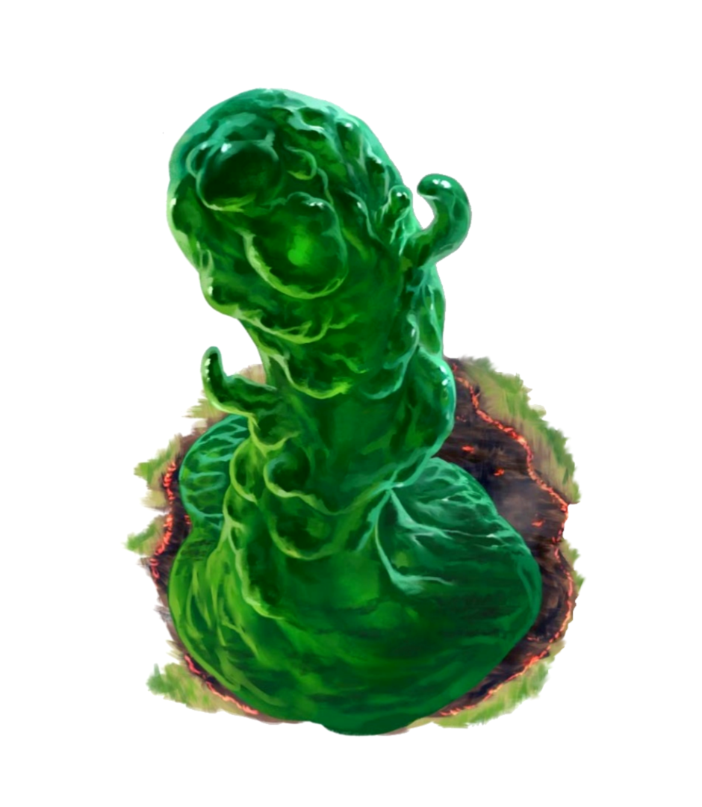

# Oozes
Oozes thrive in the dark, shunning areas of bright light and extreme temperatures. They flow through the damp underground, feeding on any creature or object that can be dissolved, slinking along the ground, dripping from walls and ceilings, spreading across the edges of underground pools, and squeezing through cracks. The first warning an adventurer receives of an ooze's presence is often the searing pain of its acidic touch.

> Jump to: [Gray Ooze](Oozes.md#gray-ooze) | [Ochre Jelly](Oozes.md#ochre-jelly) | [Psychic Gray Ooze](Oozes.md#psychic-gray-ooze) | [Molten Ooze](Oozes.md#molten-ooze) | [Winter Ooze](Oozes.md#winter-ooze) | [Arcane Ooze](Oozes.md#arcane-ooze)

Oozes are drawn to movement and warmth. Organic material nourishes them, and when prey is scarce they feed on grime, fungus, and offal. Veteran explorers know that an immaculately clean passageway is a likely sign that an ooze lairs nearby.

***Slow Death.*** An ooze kills its prey slowly. Some varieties are even large enough to engulf creatures to prevent escape. The only upside of this torturous death is that a victim's comrades can come to the rescue before it is too late.

Since not every ooze digests every type of substance, some have coins, metal gear, bones, and other debris suspended within their quivering bodies. A slain ooze can be a rich source of treasure for its killers.

***Unwitting Servants.*** Although an ooze lacks the intelligence to ally itself with other creatures, others that understand an ooze's need to feed might lure it into a location where it can be of use to them. Clever monsters keep oozes around to defend passageways or consume refuse. Likewise, an ooze can be enticed into a pit trap, where its captors feed it often enough to prevent it from coming after them. Crafty creatures place torches and flaming braziers in strategic areas to dissuade an ooze from leaving a particular tunnel or room.

***Spawn of Juiblex.*** According to the Demonomicon of Iggwilv and other sources, oozes are scattered fragments or offspring of the demon lord Juiblex. Whether this is true or not, the Faceless Lord is one of the few beings that can control oozes and imbue them with a modicum of intelligence. Most of the time, oozes have no sense of tactics or self-preservation. They are direct and predictable, attacking and eating without cunning. Under the control of Juiblex, they exhibit glimmers of sentience and malevolent intent.

***Ooze Nature.*** An ooze doesn't require sleep.

---

## Gray Ooze
A gray ooze is stone turned to liquid by chaos. When it moves, it slithers like a liquid snake, rising to strike.

### Environment
Hills, Mountains, Ruins, Underdark, Undersea, Urban

### Token

>### Gray Ooze
>*Medium ooze, unaligned*
>___
>- **Armor Class** 8
>- **Hit Points** 22 (3d8 + 9)
>- **Speed** 10 ft., climb 10 ft.
>___
>|**STR**|**DEX**|**CON**|**INT**|**WIS**|**CHA**|
>|:---:|:---:|:---:|:---:|:---:|:---:|
>|12 (+1)|6 (-2)|16 (+3)|1 (-5)|6 (-2)|2 (-4)|
>
>___
>- **Proficiency Bonus** +2
>- **Saving Throws** 
>- **Damage Vulnerabilities** 
>- **Damage Resistances** acid,cold,fire
>- **Damage Immunities** 
>- **Condition Immunities** blinded,charmed,deafened,exhaustion,frightened,prone
>- **Skills** Stealth +2
>- **Senses** blindsight 60 ft. (blind beyond this radius),passive Perception 8
>- **Languages** —
>- **Challenge** 1/2
>___
>***Amorphous.*** The ooze can move through a space as narrow as 1 inch wide without squeezing.
>
>***Corrode Metal.*** Any nonmagical weapon made of metal that hits the ooze corrodes. After dealing damage, the weapon takes a permanent and cumulative −1 penalty to damage rolls. If its penalty drops to −5, the weapon is destroyed. Nonmagical ammunition made of metal that hits the ooze is destroyed after dealing damage.
>
>The ooze can eat through 2-inch-thick, nonmagical metal in 1 round.
>
>***False Appearance.*** While the ooze remains motionless, it is indistinguishable from an oily pool or wet rock.
>
>#### Actions
>***Pseudopod.*** Melee Weapon Attack: +3 to hit, reach 5 ft., one target. Hit: 4 (1d6 + 1) bludgeoning damage plus 7 (2d6) acid damage, and if the target is wearing nonmagical metal armor, its armor is partly corroded and takes a permanent and cumulative −1 penalty to the AC it offers. The armor is destroyed if the penalty reduces its AC to 10.
>

---

## Huge Gray Ooze
Some gray oozes grow to sizes that truly put the fear of Jubilex into those that encounter them. These are often more aggressive varieties of ooze, fully willing to accept some pain in exchange for a rich meal.

### Environment
Hills, Mountains, Ruins, Underdark, Undersea, Urban

### Token

>### Huge Gray Ooze
>*Huge ooze, unaligned*
>___
>- **Armor Class** 8
>- **Hit Points** 152 (16d12 + 48)
>- **Speed** 10 ft., climb 10 ft.
>___
>|**STR**|**DEX**|**CON**|**INT**|**WIS**|**CHA**|
>|:---:|:---:|:---:|:---:|:---:|:---:|
>|18 (+4)|6 (-2)|16 (+3)|1 (-5)|6 (-2)|2 (-4)|
>
>___
>- **Proficiency Bonus** +3
>- **Saving Throws** 
>- **Damage Vulnerabilities** 
>- **Damage Resistances** 
>- **Damage Immunities** acid,cold,fire
>- **Condition Immunities** blinded,charmed,deafened,exhaustion,frightened,prone
>- **Skills** Stealth +2
>- **Senses** blindsight 60 ft. (blind beyond this radius),passive Perception 8
>- **Languages** —
>- **Challenge** 8
>___
>***Amorphous.*** The ooze can move through a space as narrow as 1 inch wide without squeezing.
>
>***Corrode Metal.*** Any nonmagical weapon made of metal that hits the ooze corrodes. After dealing damage, the weapon takes a permanent and cumulative −1 penalty to damage rolls. If its penalty drops to −5, the weapon is destroyed. Nonmagical ammunition made of metal that hits the ooze is destroyed after dealing damage.
>
>The ooze can eat through 2-inch-thick, nonmagical metal in 1 round.
>
>***False Appearance.*** While the ooze remains motionless, it is indistinguishable from an oily pool or wet rock.
>
>#### Actions
>***Multiattack.*** As an action, it can make two attack with its pseudopods.
>
>***Pseudopod.*** Melee Weapon Attack: +7 to hit, reach 5 ft., one target. Hit: 21 (6d6) acid damage, or 42 (12d6) acid damage while the ooze is enlarged. If the target is wearing nonmagical metal armor, its armor is partly corroded and takes a permanent and cumulative -1 penalty to the AC it offers. The armor is destroyed if the penalty reduces its AC to 10.
>
>***Enlarge (Recharges after a Short or Long Rest).*** For 1 minute, the ooze magically increases in size. While enlarged, the ooze is Gargantuan, doubles its damage dice with its pseudopod attack, and makes Strength checks and Strength saving throws with advantage.
>
>***Invisibility (Recharges after a Short or Long Rest).*** The ooze magically turns invisible for up to 1 hour until it attacks, it uses its Enlarge, or its concentration is broken (as if concentrating on a spell).
>

---

## Ochre Jelly
Ochre jellies are yellowish blobs that can slide under doors and through narrow cracks in pursuit of creatures to devour. They have enough bestial cunning to avoid large groups of enemies.

An ochre jelly follows at a safe distance as it pursues its meal. Its digestive enzymes dissolve flesh quickly but have no effect on other substances such as bone, wood, and metal.

### Environment
Forest, Ruins, Swamp, Underdark, Undersea, Urban

### Token

>### Ochre Jelly
>*Large ooze, unaligned*
>___
>- **Armor Class** 8
>- **Hit Points** 45 (6d10 + 12)
>- **Speed** 10 ft., climb 10 ft.
>___
>|**STR**|**DEX**|**CON**|**INT**|**WIS**|**CHA**|
>|:---:|:---:|:---:|:---:|:---:|:---:|
>|15 (+2)|6 (-2)|14 (+2)|2 (-4)|6 (-2)|1 (-5)|
>
>___
>- **Proficiency Bonus** +2
>- **Saving Throws** 
>- **Damage Vulnerabilities** 
>- **Damage Resistances** acid
>- **Damage Immunities** lightning,slashing
>- **Condition Immunities** blinded,charmed,deafened,exhaustion,frightened,prone
>- **Skills** 
>- **Senses** blindsight 60 ft. (blind beyond this radius),passive Perception 8
>- **Languages** —
>- **Challenge** 2
>___
>***Amorphous.*** The jelly can move through a space as narrow as 1 inch wide without squeezing.
>
>***Spider Climb.*** The jelly can climb difficult surfaces, including upside down on ceilings, without needing to make an ability check.
>
>#### Actions
>***Pseudopod.*** Melee Weapon Attack: +4 to hit, reach 5 ft., one target. Hit: 9 (2d6 + 2) bludgeoning damage plus 3 (1d6) acid damage.
>
>#### Reactions
>***Split.*** When a jelly that is Medium or larger is subjected to lightning or slashing damage, it splits into two new jellies if it has at least 10 hit points. Each new jelly has hit points equal to half the original jelly's, rounded down. New jellies are one size smaller than the original jelly.

---

## Psychic Gray Ooze
A gray ooze that lives a long time can evolve to become more intelligent and develop limited psionic ability. Such occurrences are more common in gray oozes that live near psionic creatures such as [mind flayers](MindFlayers.md), suggesting that the ooze can sense and mimic psionic ability.

### Environment
Ruins, Underdark, Undersea, Urban

### Token

>### Psychic Gray Ooze
>*Medium ooze, unaligned*
>___
>- **Armor Class** 8
>- **Hit Points** 22 (3d8 + 9)
>- **Speed** 10 ft., climb 10 ft.
>___
>|**STR**|**DEX**|**CON**|**INT**|**WIS**|**CHA**|
>|:---:|:---:|:---:|:---:|:---:|:---:|
>|12 (+1)|6 (-2)|16 (+3)|6 (-2)|6 (-2)|2 (-4)|
>
>___
>- **Proficiency Bonus** +2
>- **Saving Throws** 
>- **Damage Vulnerabilities** 
>- **Damage Resistances** acid,cold,fire
>- **Damage Immunities** 
>- **Condition Immunities** blinded,charmed,deafened,exhaustion,frightened,prone
>- **Skills** Stealth +2
>- **Senses** blindsight 60 ft. (blind beyond this radius),passive Perception 8
>- **Languages** —
>- **Challenge** 1/2
>___
>***Amorphous.*** The ooze can move through a space as narrow as 1 inch wide without squeezing.
>
>***Corrode Metal.*** Any nonmagical weapon made of metal that hits the ooze corrodes. After dealing damage, the weapon takes a permanent and cumulative −1 penalty to damage rolls. If its penalty drops to −5, the weapon is destroyed. Nonmagical ammunition made of metal that hits the ooze is destroyed after dealing damage.
>
>The ooze can eat through 2-inch-thick, nonmagical metal in 1 round.
>
>***False Appearance.*** While the ooze remains motionless, it is indistinguishable from an oily pool or wet rock.
>
>#### Actions
>***Pseudopod.*** Melee Weapon Attack: +3 to hit, reach 5 ft., one target. Hit: 4 (1d6 + 1) bludgeoning damage plus 7 (2d6) acid damage, and if the target is wearing nonmagical metal armor, its armor is partly corroded and takes a permanent and cumulative −1 penalty to the AC it offers. The armor is destroyed if the penalty reduces its AC to 10.
>
>***Psychic Crush (Recharge 5–6).*** The ooze targets one creature that it can sense within 60 feet of it. The target must make a DC 10 Intelligence saving throw, taking 10 (3d6) psychic damage on a failed save, or half as much damage on a successful one.
>

---

## Large Psychic Gray Ooze
A gray ooze that lives a long time can evolve to become more intelligent and develop limited psionic ability. Such occurrences are more common in gray oozes that live near psionic creatures such as [mind flayers](MindFlayers.md), suggesting that the ooze can sense and mimic psionic ability. Some are well-fed and grow to frightening sizes.

### Environment
Ruins, Underdark, Undersea, Urban

### Token

>### Large Psychic Gray Ooze
>*Large ooze, unaligned*
>___
>- **Armor Class** 8
>- **Hit Points** 68 (8d10 + 24)
>- **Speed** 10 ft., climb 10 ft.
>___
>|**STR**|**DEX**|**CON**|**INT**|**WIS**|**CHA**|
>|:---:|:---:|:---:|:---:|:---:|:---:|
>|15 (+2)|6 (-2)|16 (+3)|6 (-2)|6 (-2)|2 (-4)|
>
>___
>- **Proficiency Bonus** +3
>- **Saving Throws** 
>- **Damage Vulnerabilities** 
>- **Damage Resistances** acid,cold,fire
>- **Damage Immunities** 
>- **Condition Immunities** blinded,charmed,deafened,exhaustion,frightened,prone
>- **Skills** Stealth +2
>- **Senses** blindsight 60 ft. (blind beyond this radius),passive Perception 8
>- **Languages** —
>- **Challenge** 2
>___
>***Amorphous.*** The ooze can move through a space as narrow as 1 inch wide without squeezing.
>
>***Corrode Metal.*** Any nonmagical weapon made of metal that hits the ooze corrodes. After dealing damage, the weapon takes a permanent and cumulative −1 penalty to damage rolls. If its penalty drops to −5, the weapon is destroyed. Nonmagical ammunition made of metal that hits the ooze is destroyed after dealing damage.
>
>The ooze can eat through 2-inch-thick, nonmagical metal in 1 round.
>
>***False Appearance.*** While the ooze remains motionless, it is indistinguishable from an oily pool or wet rock.
>
>#### Actions
>***Multiattack.*** The ooze can use both its Pseudopod and its Psychic Crush attack as part of its Attack action.
>
>***Pseudopod.*** Melee Weapon Attack: +4 to hit, reach 5 ft., one target. Hit: 8 (2d6 + 2) bludgeoning damage plus 14 (4d6) acid damage, and if the target is wearing nonmagical metal armor, its armor is partly corroded and takes a permanent and cumulative −1 penalty to the AC it offers. The armor is destroyed if the penalty reduces its AC to 10.
>
>***Psychic Crush (Recharge 5–6).*** The ooze targets one creature that it can sense within 60 feet of it. The target must make a DC 14 Intelligence saving throw, taking 20 (6d6) psychic damage on a failed save, or half as much damage on a successful one.
>

---

## Molten Ooze
Oozes are simple-minded, amorphous creatures that live only to consume. Some oozes take on elemental traits, such as the heated kind known as a molten ooze. It is mottled with red and black and speckled with orange flecks, and is easily mistaken for lava itself. Its body is dense, viscous, and resilient against harm. These oozes are extremely dangerous for novice adventurers.

When a molten ooze moves, it rolls like a slow, fiery bubble, or flows like a slithering trickle of lava. Any organic material it moves over is dissolved, and any remains are seared to ash, which the ooze will also consume. It leaves stone and metal unharmed.

Molten oozes typically dwell within volcanoes or fiery caverns beneath the earth, although some lurk in alleys and abandoned buildings in the City of Brass, the efreeti capital in the Elemental Plane of Fire. Some efreeti even keep these oozes as pets, using them to dispose of waste and to clean surfaces in their palaces. In a pinch, the oozes can even serve as defenders against enemies, but anyone who keeps an ooze as a pet knows that the ooze doesn't distinguish friend from food, especially in the chaos of a frenzied battle.

### Environment
Extraplanar, Mountain, Volcano, Conjured/Summoned

### Token

>### Molten Ooze
>*Medium ooze, unaligned*
>___
>- **Armor Class** 6
>- **Hit Points** 110 (13d8 + 52)
>- **Speed** 20 ft., climb 20 ft.
>___
>|**STR**|**DEX**|**CON**|**INT**|**WIS**|**CHA**|
>|:---:|:---:|:---:|:---:|:---:|:---:|
>|14 (+2)|3 (-4)|19 (+4)|1 (-5)|6 (-2)|1 (-5)|
>
>___
>- **Proficiency Bonus** +2
>- **Saving Throws** 
>- **Damage Vulnerabilities** 
>- **Damage Resistances** 
>- **Damage Immunities** acid, fire, lightning, slashing
>- **Condition Immunities** blinded, charmed, deafened, exhaustion, frightened, prone
>- **Skills** 
>- **Senses** blindsight 60 ft. (blind beyond this radius),passive Perception 8
>- **Languages** --
>- **Challenge** 7
>___
>***Amorphous.*** The ooze can move through a space as narrow as l inch wide without squeezing.
>
>***False Appearance.*** While the ooze remains motionless, it is indistinguishable from a pool of lava or a molten rock.
>
***Molten Form.*** A creature that touches the ooze or hits it with a melee attack while within 5 feet of it takes 3 (1d6) acid damage plus 5 (1d10) fire damage. At the start of the ooze's turn, it also deals this damage to each creature that it is grappling.
>
>***Spider Climb.*** The molten ooze can climb difficult surfaces, including upside down on ceilings, without needing to make an ability check.
>
>#### Actions
>***Pseudopod.*** *Melee Weapon Attack:* +5 to hit, reach 5 ft., one target. Hit: 5 (1d6 + 2) bludgeoning damage plus 7
(2d6) acid damage and 9 (2d8) fire damage, and if the target is a creature, it is grappled (escape DC 14). While grappled in this way, the target is also restrained. Until this grapple ends, the ooze can't attack another target. If the target is a creature or a flammable object, it is also set ablaze. Until a creature takes an action to douse the fire, the creature takes 5 (1d10) fire damage at the end of each of its turns.
>

---

## Winter Ooze
Oozes are simple-minded, amorphous creatures that live only to consume. Some oozes take on elemental traits, such as the frozen kind known as a winter ooze. It is often a murky white or clear, speckled with off-white flecks, and is easily mistaken for a pool of cold water or a formation of ice. Its body is dense, viscous, and resilient against harm. These oozes are extremely dangerous for novice adventurers.

When a molten ooze moves, it rolls like a slow, icy ball, or flows like a slithering trickle of slush. Any organic material it moves over is dissolved, and any remains are frozen and shattered, which the ooze will also consume. It leaves stone and metal unharmed.

Frozen oozes typically dwell within glaciers or frozen caverns in arctic conditions, although some lurk in alleys and abandoned buildings in the City of Ice, the capital in the Elemental Plane of Ice. For some who keep the frozen oozes as pets, the oozes can even serve as defenders against enemies, but anyone who keeps an ooze as a pet knows that the ooze doesn't distinguish friend from food, especially in the chaos of a frenzied battle.

### Environment
Extraplanar, Mountain, Arctic, Conjured/Summoned

### Token

>### Winter Ooze
>*Medium ooze, unaligned*
>___
>- **Armor Class** 6
>- **Hit Points** 110 (13d8 + 52)
>- **Speed** 20 ft., climb 20 ft.
>___
>|**STR**|**DEX**|**CON**|**INT**|**WIS**|**CHA**|
>|:---:|:---:|:---:|:---:|:---:|:---:|
>|14 (+2)|3 (-4)|19 (+4)|1 (-5)|6 (-2)|1 (-5)|
>
>___
>- **Proficiency Bonus** +2
>- **Saving Throws** 
>- **Damage Vulnerabilities** 
>- **Damage Resistances** 
>- **Damage Immunities** acid, cold, lightning, slashing
>- **Condition Immunities** blinded, charmed, deafened, exhaustion, frightened, prone
>- **Skills** 
>- **Senses** blindsight 60 ft. (blind beyond this radius),passive Perception 8
>- **Languages** --
>- **Challenge** 7
>___
>***Amorphous.*** The ooze can move through a space as narrow as l inch wide without squeezing.
>
>***False Appearance.*** While the ooze remains motionless, it is indistinguishable from a cold pool of water or ice feature.
>
***Frozen Form.*** A creature that touches the ooze or hits it with a melee attack while within 5 feet of it takes 3 (1d6) acid damage plus 5 (1d10) cold damage. At the start of the ooze's turn, it also deals this damage to each creature that it is grappling.
>
>***Spider Climb.*** The winter ooze can climb difficult surfaces, including upside down on ceilings, without needing to make an ability check.
>
>#### Actions
>***Pseudopod.*** *Melee Weapon Attack:* +5 to hit, reach 5 ft., one target. Hit: 5 (1d6 + 2) bludgeoning damage plus 7
(2d6) acid damage and 9 (2d8) cold damage, and if the target is a creature, it is grappled (escape DC 14). While grappled in this way, the target is also restrained. Until this grapple ends, the ooze can't attack another target. If the target is a creature or a object, it takes 5 (1d10) cold damage at the end of each of its turns.
>

---

## Arcane Ooze
Created in ancient times, arcane oozes have long since outlived their original purpose and their long-forgotten creators. They are often mistaken for green slime, but almost from the first moment of interaction, opponents discover the stark difference: The bizarre creatures are not only immune to arcane magic, they have a strange affinity for it, draining arcane energy from nearby spellcasters.

>"The creature resembled a fluid mass of green protoplasm. Within its immense bulk, glowing veins throb and pulse with eldritch light." 

Some speculate that these oozes were created to combat a rival group of arcane spellcasters, but scant evidence backs any such conclusion. Others suggest arcane oozes arose as a natural response to some cataclysmic event caused by arcane magic. Adherents of these later theories claim that one day arcane oozes will drown out all arcane magic in the world.

Arcane oozes have a disturbingly high tendency to appear in the sewers of cities with high arcane concentration, and many large cities have dedicated teams of "sewer rats" (adventurers under contract) paid by mage schools to routinely explore the sewers to find and eliminate these arcane threats.

### Environment
Extraplanar, Ruins, Urban, Conjured/Summoned

### Token

>### Arcane Ooze
>*Large ooze, unaligned*
>___
>- **Armor Class** 6
>- **Hit Points** 147 (14d10 + 70)
>- **Speed** 20 ft., climb 20 ft.
>___
>|**STR**|**DEX**|**CON**|**INT**|**WIS**|**CHA**|
>|:---:|:---:|:---:|:---:|:---:|:---:|
>|19 (+4)|3 (-4)|20 (+5)|1 (-5)|6 (-2)|1 (-5)|
>
>___
>- **Proficiency Bonus** +3
>- **Saving Throws** 
>- **Damage Vulnerabilities** 
>- **Damage Resistances** 
>- **Damage Immunities** acid, lightning, slashing
>- **Condition Immunities** blinded, charmed, deafened, exhaustion, frightened, prone
>- **Skills** 
>- **Senses** blindsight 60 ft. (blind beyond this radius),passive Perception 8
>- **Languages** --
>- **Challenge** 5
>___
>***Arcane Absorption.*** Whenever the ooze is subjected to damage caused by magic, it takes no damage and instead regains a number of hit points equal to the damage dealt.
>
>***Amorphous.*** The ooze can move through a space as narrow as 1 inch wide without squeezing.
>
>***Dispelling Vulnerability.*** If the ooze is targeted by [dispel magic](../Magic/Spells/dispel-magic.md), it takes 1d10 force damage per spell slot level used to cast the spell.
>
>***Lightning Haste.*** Whenever the ooze is subjected to lightning damage, it takes no damage and instead is subjected to the [haste](../Magic/Spells/haste.md) spell, lasting for a number of turns equal to the spell slot used to create the lightning damage (cantrip, till the end of its next turn, 1st-level for a full turn beyond that, and so on).
>
>***Limited Magic Immunity.*** The ooze is immune to spells of 2nd level or lower unless it wishes to be affected. It has advantage on saving throws against all other spells and magical effects.
>
>***Silence Magic.*** Any spellcaster that the ooze hits loses the ability to cast any spell till the start of its next turn; furthermore, roll a d6. On a 1 to 5, the target is unaffected. On a 6, the target loses a single spell slot chosen from its lowest available at the time. A creature engulfed by the ooze can't cast any spells and must succeed on a DC 14 Wisdom saving throw at the start of each of the ooze's turns or lose a single spell slot chosen from its lowest available at the time.
>
>The ooze can eat through 2-inch-thick, magical or nonmagical wood or metal in 1 round.
>
>#### Actions
>***Multiattack.*** The ooze makes two attacks with its pseudopod attack.
>
>***Pseudopod.*** Melee Weapon Attack: +8 to hit, reach 5 ft., one target. Hit: 7 (1d6 + 4) bludgeoning damage plus 10 (3d6) acid damage.
>
>***Engulf.*** The ooze moves up to its speed. While doing so, it can enter Large or smaller creatures' spaces. Whenever the ooze enters a creature's space, the creature must make a DC 15 Dexterity saving throw. On a successful save, the creature can choose to be pushed 5 feet back or to the side of the ooze. A creature that chooses not to be pushed suffers the consequences of a failed saving throw. On a failed save, the ooze enters the creature's space, and the creature takes 10 (3d6) acid damage and is engulfed. The engulfed creature is restrained, and takes 21 (6d6) acid damage at the start of each of the ooze's turns. When the ooze moves, the engulfed creature moves with it. An engulfed creature can try to escape by taking an action to make a DC 15 Strength check. On a success, the creature escapes and enters a space of its choice within 5 feet of the ooze.
>
