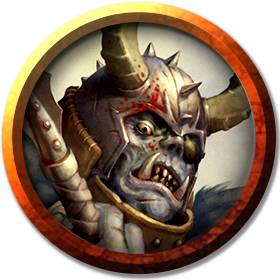
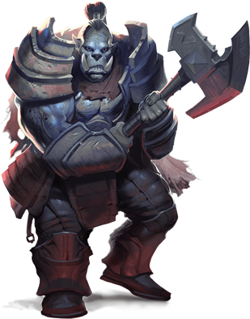

# Orcs
Orcs are burly raiders with prominent lower canines that resemble tusks.

> Jump to: [Orc](Orcs.md#orc) | [Orc Champion](Orcs.md#orc-champion) | [Orc Conqueror](Orcs.md#orc-conqueror) | [Orc War Chief](Orcs.md#orc-war-chief) | [Orc Eye of Gruumsh](Orcs.md#orc-eye-of-gruumsh) | [Orog](Orcs.md#orog) | [Orc Blade of Ilneval](Orcs.md#orc-blade-of-ilneval) | [Orc Claw of Luthic](Orcs.md#orc-claw-of-luthic) | [Orc Hand of Yurtrus](Orcs.md#orc-hand-of-yurtrus) | [Orc Nurtured One of Yurtrus](Orcs.md#orc-nurtured-one-of-yurtrus) | [Orc Red Fang of Shargaas](Orcs.md#orc-red-fang-of-shargaas) | [Tanarukk](Orcs.md#tanarukk)

***Gruumsh One-Eye.*** Orcs worship [Gruumsh](../Religions/Pantheon/Gruumsh.md), the mightiest of the orc deities and their creator. The orcs believe that in ancient days, the gods gathered to divide the world among their followers. When Gruumsh claimed the mountains, he learned they had been taken by the dwarves. He laid claim to the forests, but those had been settled by the elves. Each place that Gruumsh wanted had already been claimed. The other gods laughed at Gruumsh, but he responded with a furious bellow. Grasping his mighty spear, he laid waste to the mountains, set the forests aflame, and carved great furrows in the fields. Such was the role of the orcs, he proclaimed, to take and destroy all that the other races would deny them.

In the millennia since the Hordes came to Azgaarnoth, orcs have long been at the forefront of the battle lines, and the most reluctant to leave them. Although many orcish tribes have discovered great prosperity through peaceful coexistence, many orcs still feel Gruumsh's call deep in their bones, and those that cannot come to terms with that call either take up a life of violence in bandit gangs or join one of the omnipresent military units all across Azgaarnoth. More and more orcs, however, are finding that lives outside of battle are quite well-lived, and are embracing lifestyles outside of direct combat. In fact, many of these orcs are finding that driving a sword into a rival's guts is sometimes even exceeded by the feeling of driving a rival merchant into bankruptcy.

Stereotypically, orcs hold a particular hatred for elves. According to orcish legend, the god Larethian half-blinded Gruumsh with a well-placed arrow to the orc god's eye. Since then, the orcs have taken particular joy in slaughtering elves. Turning his injury into a baleful gift, Gruumsh grants divine might to any champion who willingly plucks out one of its eyes in his honor. In those places where orcs and elves interact on a regular basis, there is a thinly-veiled veneer of civilized behavior, but each is quick to suspect the other in times of stress or uncertainty.

***Tribes Like Plagues.*** In their past, orcs would gather in tribes that exert their dominance and satisfy their bloodlust by plundering villages, devouring or driving off roaming herds, and slaying any humanoids that stand against them. After savaging a settlement, orcs would pick it clean of wealth and items usable in their own lands. They would then set the remains of villages and camps ablaze, then retreat whence they came, their bloodlust satisfied.

In the more civilized lands, orcs tend to keep to this pattern, but adjusted for the "nonviolent" context in which they now live--they will satisfy their bloodlust by maneuvering a rival into submission, often by plundering a rival's congregation for converts or by driving off customers from a rival's shop by offering deeper discounts or better merchandise. When a rival is forced to surrender, they will pick the remnants clean of wealth and/or assets, usually leaving that rival entirely bereft and alone, before retreating to celebrate. Orcs often just as ruthless in peace as they are in war.

***Ranging Scavengers.*** Their lust for slaughter demands that orcs dwell always within striking distance of new targets. As such, they seldom settle permanently, instead converting ruins, cavern complexes, and defeated foes' villages into fortified camps and strongholds. Orcs build only for defense, making no innovation or improvement to their lairs beyond mounting the severed body parts of their victims on spiked stockade walls or pikes jutting up from moats and trenches.

When an existing territory is depleted of food, an orc tribe divides into roving bands that scout for choice hunting grounds. When each party returns, it brings back trophies and news of targets ripe for attack, the richest of which is chosen. The tribe then sets out en masse to carve a bloody path to its new territory.

On rare occasions, a tribe's leader finds, chooses to occupy, and manages to hold onto a particularly defensible lair for decades. The orcs of such a tribe must range far across the countryside to sate their appetites.

***Leadership and Might.*** Strength and power are the greatest of orcish virtues, and orcs embrace all manner of mighty creatures in their tribes, flaunting such vivid or grotesque titles as Many-Arrows, Screaming Eye, and Elf Ripper. Occasionally, a powerful war chief unites scattered orc tribes into a single rampaging horde, which runs roughshod over other orc tribes and humanoid settlements from a position of overwhelming strength. They will also proudly welcome ogres, trolls, half-orcs, and orogs into their ranks.

***Orc Progeny with Non-Orcs.*** The offspring of an orc and a non-orc humanoid of similar stature is either an orc or a half-orc. When an orc produces young with an ogre, the child is a half-ogre of intimidating strength and brutish features called an ogrillon.

***Orcish Variation.*** To the common folk of the world, an orc is an orc. They know that any one of these savages can tear an ordinary person to pieces, so no further distinction is necessary. Orcs know better. Different groups of orcs exist within a tribe, the actions of each dictated by the deity they pay homage to. To complement the various kinds of warriors that spill forth to ravage the countryside, each tribe has members that remain deep inside the lair, seldom if ever seeing what lies outside the darkness of their den.

In addition, orcs have special relationships with two creatures that are sometimes found in their company: the [aurochs](Cattle.md#aurochs), a great bull that serves as a mount for warriors that revere Bahgtru, and the [tanarukk](#tanarukk), a demon-orc crossbreed that is so depraved and destructive that even orcs seek to kill it.

Lastly, orcish bodies and bodily construction has turned out to be as wildly flexible as elvish, and orcs have learned how to adapt to many environments that would otherwise have seemed hostile to orcish life.

***Playable Race: Ruthless Competence.*** Orcs are as widely seen among the Hordish lands as elves or dwarves are among the humans, and many orcs have had [storied careers](../Races/Orc.md) just as rich and glorious as their elvish or dwarvish (or human or dragonborn) counterparts.

---

## Orc
(No description given)

### Environment
Coastal, Desert, Forest, Grassland, Hill, Mountain, Swamp, Underdark, Urban

### Token

>### Orc
>*Medium humanoid (orc), any alignment (typically chaotic)*
>___
>- **Armor Class** 13 (hide armor)
>- **Hit Points** 15 (2d8 + 6)
>- **Speed** 30 ft.
>___
>|**STR**|**DEX**|**CON**|**INT**|**WIS**|**CHA**|
>|:---:|:---:|:---:|:---:|:---:|:---:|
>|16 (+3)|12 (+1)|16 (+3)|7 (-2)|11 (+0)|10 (+0)|
>
>___
>- **Proficiency Bonus** +2
>- **Saving Throws** 
>- **Damage Vulnerabilities** 
>- **Damage Resistances** 
>- **Damage Immunities** 
>- **Condition Immunities** 
>- **Skills** Intimidation +2
>- **Senses** darkvision 60 ft.,passive Perception 10
>- **Languages** Common,Orc
>- **Challenge** 1/2
>___
>#### Actions
>***Greataxe.*** Melee Weapon Attack: +5 to hit, reach 5 ft., one target. Hit: 9 (1d12 + 3) slashing damage.
>
>***Javelin.*** Melee or Ranged Weapon Attack: +5 to hit, reach 5 ft. or range 30/120 ft., one target. Hit: 6 (1d6 + 3) piercing damage.
>
>#### Bonus Actions
>***Aggressive.*** As a bonus action, the orc can move up to its speed toward a hostile creature that it can see.
>

---

## Orc Champion
Orcish champions are those orcs prone to combat, but lack the ability (or the desire) to lead the tribe. In the early days of the Hordes, these were often the challengers to the warchief for leadership, but in the past millennia, these have often become the chieftain's or warchief's principal partners and/or enforcers. In fact, many have evolved into a role as representative of the tribe, often participating in ritualistic trials-by-combat or physical contests on behalf of the tribe against other tribes.

### Environment
Coastal, Desert, Forest, Grassland, Hill, Mountain, Swamp, Underdark, Urban

### Token

>### Orc Champion
>*Medium humanoid (orc), any alignment (typically chaotic)*
>___
>- **Armor Class** 16 (ring mail, shield)
>- **Hit Points** 85 (10d8 + 40)
>- **Speed** 30 ft.
>___
>|**STR**|**DEX**|**CON**|**INT**|**WIS**|**CHA**|
>|:---:|:---:|:---:|:---:|:---:|:---:|
>|18 (+4)|12 (+1)|18 (+4)|7 (-2)|11 (+0)|10 (+0)|
>
>___
>- **Proficiency Bonus** +0
>- **Saving Throws** Str +6,Con +6
>- **Damage Vulnerabilities** 
>- **Damage Resistances** 
>- **Damage Immunities** 
>- **Condition Immunities** 
>- **Skills** Intimidation +2
>- **Senses** darkvision 60 ft.,passive Perception 10
>- **Languages** Common,Orc
>- **Challenge** 3
>___
>***Gruumsh's Fury.*** The orc deals an extra 4 (1d8) damage when it hits with a weapon attack (included).
>
>#### Actions
>***Multiattack.*** The orc makes two weapon attacks.
>
>***Battleaxe.*** Melee Weapon Attack: +6 to hit, reach 5 ft., one target. Hit: 13 (2d8 + 4) slashing damage.
>
>***Spear.*** Melee or Ranged Weapon Attack: +6 to hit, reach 5 ft. or range 20/60 ft., one target. Hit: 12 (1d6 + 4 plus 1d8) piercing damage.
>
>#### Reactions
>***Furious Advance.*** The orc imposes disadvantage on one opportunity attack when it moves toward a hostile creature it can see. To do so, the orc must see the attacker and be carrying a shield.
>
>#### Bonus Actions
>***Aggressive.*** As a bonus action, the orc can move up to its speed toward a hostile creature that it can see.
>

---

## Orc Conqueror
The orcish conqueror is often a militant orc that refuses to abandon the orcish traditions of battle and combat. However, many of them find less opportunities to do so in the more "civilized" lands, and have migrated further south, towards Chidia, Tragekia, Ulm, and even Dradehalia, in pursuit of greater and greater glory in war. Many of these become mercenary captains, indulging their love of battle and combat on behalf of mercenary employers--but more than one conqueror has walked away from a contract that lacked enough "action" to suit.

### Environment
Coastal, Desert, Forest, Grassland, Hill, Mountain, Swamp, Underdark, Urban

### Token

>### Orc Conqueror
>*Medium humanoid (orc), any alignment (typically chaotic)*
>___
>- **Armor Class** 17 (splint mail)
>- **Hit Points** 127 (15d8 + 60)
>- **Speed** 30 ft.
>___
>|**STR**|**DEX**|**CON**|**INT**|**WIS**|**CHA**|
>|:---:|:---:|:---:|:---:|:---:|:---:|
>|19 (+4)|12 (+1)|19 (+4)|12 (+1)|12 (+1)|16 (+3)|
>
>___
>- **Proficiency Bonus** +0
>- **Saving Throws** Str +7,Con +7,Int +4,Wis +4
>- **Damage Vulnerabilities** 
>- **Damage Resistances** 
>- **Damage Immunities** 
>- **Condition Immunities** 
>- **Skills** Intimidation +6,Perception +4,Survival +4
>- **Senses** darkvision 60 ft.,passive Perception 14
>- **Languages** Common,Orc
>- **Challenge** 7
>___
>***Gruumsh's Fury.*** The orc deals an extra 4 (1d8) damage when it hits with a weapon attack (included).
>
>#### Actions
>***Multiattack.*** The orc makes three weapon attacks.
>
>***Greataxe.*** *Melee Weapon Attack:* +7 to hit, reach 5 ft., one target. Hit: 15 (1d12 + 4 plus 1d8) slashing damage.
>
>***Spear.*** *Melee Weapon Attack:* +7 to hit, reach 5 ft. , one target. Hit: 12 (1d6 + 4 plus 1d8) piercing damage. *Ranged Weapon Attack:* +7 to hit, range 20/60 ft., one target. Hit: 12 (1d6 + 4 plus 1d8) piercing damage.
>
>#### Reactions
>***Furious Defense.*** The orc imposes disadvantage on one melee weapon attack by an opponent it can see. If the attack hits anyway, the orc can make one melee weapon attack against that opponent.
>
>#### Bonus Actions
>***Aggressive.*** As a bonus action, the orc can move up to its speed toward a hostile creature that it can see.
>

---

## Orc War Chief
In their original Hordish nature, the war chief of an orc tribe was its strongest and most cunning member; as the orcs have matured as a race, their war chiefs have similarly evolved. While in the past the reign of a war chief lasts only as long as it commands the fear and respect of other tribe members, whose bloodlust must be regularly satisfied lest the chief appear weak, modern orcish tribes often rally around a leader whose intellect and mindset can lead them to greater glory, even if that isn't always through battle.

***Scions of Slaughter.*** Gruumsh bestows special blessings upon war chiefs who prove themselves in battle time and again, imbuing them with slivers of his savagery. A war chief so blessed finds that his weapons cut deeper into his enemies, allowing him to inflict more carnage.

### Environment
Coastal, Desert, Forest, Grassland, Hill, Mountain, Swamp, Underdark, Urban

### Token

>### Orc War Chief
>*Medium humanoid (orc), any alignment (typically chaotic)*
>___
>- **Armor Class** 16 (chain mail)
>- **Hit Points** 93 (11d8 + 44)
>- **Speed** 30 ft.
>___
>|**STR**|**DEX**|**CON**|**INT**|**WIS**|**CHA**|
>|:---:|:---:|:---:|:---:|:---:|:---:|
>|18 (+4)|12 (+1)|18 (+4)|11 (+0)|11 (+0)|16 (+3)|
>
>___
>- **Proficiency Bonus** +2
>- **Saving Throws** Str +6,Con +6,Wis +2
>- **Damage Vulnerabilities** 
>- **Damage Resistances** 
>- **Damage Immunities** 
>- **Condition Immunities** 
>- **Skills** Intimidation +5
>- **Senses** darkvision 60 ft.,passive Perception 10
>- **Languages** Common,Orc
>- **Challenge** 4
>___
>***Gruumsh's Fury.*** The orc deals an extra 4 (1d8) damage when it hits with a weapon attack (included in the attacks).
>
>#### Actions
>***Multiattack.*** The orc makes two attacks with its greataxe or its spear.
>
>***Greataxe.*** Melee Weapon Attack: +6 to hit, reach 5 ft., one target. Hit: 15 (1d12 + 4 plus 1d8) slashing damage.
>
>***Spear.*** Melee or Ranged Weapon Attack: +6 to hit, reach 5 ft. or range 20/60 ft., one target. Hit: 12 (1d6 + 4 plus 1d8) piercing damage, or 13 (2d8 + 4) piercing damage if used with two hands to make a melee attack.
>
>***Battle Cry (1/Day).*** Each creature of the war chief's choice that is within 30 feet of it, can hear it, and not already affected by Battle Cry gain advantage on attack rolls until the start of the war chief's next turn. The war chief can then make one attack as a bonus action.
>
>#### Bonus Actions
>***Aggressive.*** As a bonus action, the orc can move up to its speed toward a hostile creature that it can see.
>

---

## Orc Eye of Gruumsh
When an orc slays an elf in Gruumsh's name and offers the corpse of its foe as a sacrifice to the god of slaughter, an aspect of the god might appear. This aspect demands an additional sacrifice: one of the orc's eyes, symbolizing the loss Gruumsh suffered at the hands of his greatest enemy, Corellon Larethian.

If the orc plucks out one of its eyes, Gruumsh might grant the orc spellcasting ability and special favor, along with the right to call itself an Eye of Gruumsh. When not using their auguries to advise their war chiefs, these devotees of the god of slaughter hurl themselves into battle, their weapons stained with blood.

### Environment
Coastal, Desert, Forest, Grassland, Hill, Mountain, Swamp, Underdark, Urban

### Token

>### Orc Eye of Gruumsh
>*Medium humanoid (orc), any alignment (typically chaotic)*
>___
>- **Armor Class** 16 (ring mail, shield)
>- **Hit Points** 45 (6d8 + 18)
>- **Speed** 30 ft.
>___
>|**STR**|**DEX**|**CON**|**INT**|**WIS**|**CHA**|
>|:---:|:---:|:---:|:---:|:---:|:---:|
>|16 (+3)|12 (+1)|16 (+3)|9 (-1)|13 (+1)|12 (+1)|
>
>___
>- **Proficiency Bonus** +2
>- **Saving Throws** 
>- **Damage Vulnerabilities** 
>- **Damage Resistances** 
>- **Damage Immunities** 
>- **Condition Immunities** 
>- **Skills** Intimidation +3,Religion +1
>- **Senses** darkvision 60 ft.,passive Perception 11
>- **Languages** Common,Orc
>- **Challenge** 2
>___
>***Gruumsh's Fury.*** The orc deals an extra 4 (1d8) damage when it hits with a weapon attack (included in the attack).
>
>***Spellcasting.*** The orc is a 3rd-level spellcaster. Its spellcasting ability is Wisdom (spell save DC 11, +3 to hit with spell attacks). The orc has the following cleric spells prepared:
>
>Cantrips (at-will): guidance, resistance, thaumaturgy
>
>1st level (4 slots): bless, command
>
>2nd level (2 slots): augury, spiritual weapon (spear)
>
>#### Actions
>***Spear.*** Melee or Ranged Weapon Attack: +5 to hit, reach 5 ft. or range 20/60 ft., one target. Hit: 11 (1d6 + 3 plus 1d8) piercing damage, or 12 (2d8 + 3) piercing damage if used with two hands to make a melee attack.
>
>#### Bonus Actions
>***Aggressive.*** As a bonus action, the orc can move up to its speed toward a hostile creature that it can see.
>

---

## Orog
Orogs are orcs blessed with a surprisingly keen intellect that ordinary orcs believe is a gift from the orc goddess Luthic. Like Luthic, orogs prefer to live underground, although the scarcity of food often brings them to the surface to hunt. Orcs respect an orog's strength and cunning, and a lone orog might command an orc war band.

***Stronger and Smarter.*** An orog uses its strength to bully other orcs and its intelligence to surprise enemies on the battlefield. Many an overconfident elf, human, or dwarf commander has watched a "simple" orc warlord execute a clever maneuver to outflank and destroy an opposing force, not realizing the orc is an orog.

When encountered in great numbers, orogs form their own detachments within much larger orc hordes, and they are always at the forefront of any attack, relying on their superior strength and tactical insight to overcome anything that stands in their way.

Few orc tribes actively seek out orogs to bolster their ranks. The orogs' superiority makes them ideal leaders, and thus deadly rivals to orc war chiefs, who must be wary of orog treachery.

***Detached Killers.*** Wanting nothing more than to hack their enemies to pieces, orogs are a terrifying presence on the battlefield. They form no attachments, even to their parents and siblings, and have no concept of love or dedication. They worship the orc pantheon of gods — Gruumsh and Luthic foremost — because they believe that the gods have strength beyond reason, and physical might is all they respect.

***Servants of Darkness.*** Mistrusted by orcs, some orogs form independent mercenary war bands that sell themselves to the highest bidder. As long as they are rewarded, orog mercenaries gladly serve as elite warriors and shock troops for evil wizards, depraved giants, and other villains.

### Environment
Coastal, Desert, Forest, Grassland, Hill, Mountain, Swamp, Underdark, Urban

### Token

>### Orog
>*Medium humanoid (orc), any alignment (typically chaotic)*
>___
>- **Armor Class** 18 (plate)
>- **Hit Points** 42 (5d8 + 20)
>- **Speed** 30 ft.
>___
>|**STR**|**DEX**|**CON**|**INT**|**WIS**|**CHA**|
>|:---:|:---:|:---:|:---:|:---:|:---:|
>|18 (+4)|12 (+1)|18 (+4)|12 (+1)|11 (+0)|12 (+1)|
>
>___
>- **Proficiency Bonus** +2
>- **Saving Throws** 
>- **Damage Vulnerabilities** 
>- **Damage Resistances** 
>- **Damage Immunities** 
>- **Condition Immunities** 
>- **Skills** Intimidation +5,Survival +2
>- **Senses** darkvision 60 ft.,passive Perception 10
>- **Languages** Common,Orc
>- **Challenge** 2
>___
>#### Actions
>***Multiattack.*** The orog makes two greataxe attacks.
>
>***Greataxe.*** Melee Weapon Attack: +6 to hit, reach 5 ft., one target. Hit: 10 (1d12 + 4) slashing damage.
>
>***Javelin.*** Melee or Ranged Weapon Attack: +6 to hit, reach 5 ft. or range 30/120 ft., one target. Hit: 7 (1d6 + 4) piercing damage.
>
>#### Bonus Actions
>***Aggressive.*** As a bonus action, the orc can move up to its speed toward a hostile creature that it can see.
>

---

## Orc Blade of Ilneval
Ilneval is Gruumsh's battle captain, a devious strategist who directs Gruumsh's soldiers with boldness. Among orcs, warriors that venerate Ilneval emulate their deity. Such orcs learn to command their fellows in ways that are unpredictable but help to ensure victory.

The wisest among these leaders gain Ilneval's favor and rise to become known as blades, tactical experts who advise their chief in matters of war. Blades lead from the front, wading into combat fearlessly while barking orders at lesser soldiers. A blade knows how to use orcish ferocity to best advantage, and helps the ordinary warriors to work together against their adversaries.

### Environment
Coastal, Desert, Forest, Grassland, Hill, Mountain, Swamp, Underdark, Urban

### Token

>### Orc Blade of Ilneval
>*Medium humanoid (orc), any alignment (typically chaotic)*
>___
>- **Armor Class** 18 (chain mail, shield)
>- **Hit Points** 60 (8d8 + 24)
>- **Speed** 30 ft.
>___
>|**STR**|**DEX**|**CON**|**INT**|**WIS**|**CHA**|
>|:---:|:---:|:---:|:---:|:---:|:---:|
>|17 (+3)|11 (+0)|17 (+3)|10 (+0)|12 (+1)|14 (+2)|
>
>___
>- **Proficiency Bonus** +2
>- **Saving Throws** Wis +3
>- **Damage Vulnerabilities** 
>- **Damage Resistances** 
>- **Damage Immunities** 
>- **Condition Immunities** 
>- **Skills** Perception +3,Insight +3,Intimidation +4
>- **Senses** darkvision 60 ft.,passive Perception 13
>- **Languages** Common,Orc
>- **Challenge** 4
>___
>***Foe Smiter of Ilneval.*** The orc deals an extra die of damage when it hits with a longsword attack (included in the attack).
>
>#### Actions
>***Multiattack.*** The orc makes two melee attacks with its longsword or two ranged attacks with its javelins. If Ilneval's Command is available to use, the orc can use it after these attacks.
>
>***Longsword.*** Melee Weapon Attack: +5 to hit, reach 5 ft., one target. Hit: 12 (2d8 + 3) slashing damage, or 14 (2d10 + 3) slashing damage when used with two hands.
>
>***Javelin.*** Melee or Ranged Weapon Attack: +5 to hit, reach 5 ft. or range 30/120 ft., one target. Hit: 6 (1d6 + 3) piercing damage.
>
>***Ilneval's Command (Recharge 4-6).*** Up to three allied orcs within 120 feet of this orc that can hear it can use their reactions to each make one weapon attack.
>
>#### Bonus Actions
>***Aggressive.*** As a bonus action, the orc can move up to its speed toward a hostile creature that it can see.
>

---

## Orc Claw of Luthic
Luthic is Gruumsh's wife and the paragon of maternity to all orcs. She is the Cave Mother, a fierce dweller in the darkness who raises new broods of orcs to be vicious and strong. Her symbol is the cave bear, and orc females raise such bears alongside orc whelps. Females particularly attracted to Luthic grow long nails and lacquer them, learning to use these claws as weapons much as Luthic uses her own.

Orc females devoted to Luthic are in charge of fortifying and maintaining an orc stronghold. They help to guarantee the survival of the tribe, and most are skilled in the healing arts. The most powerful among Luthic's disciples are the claws of Luthic, which can use the Cave Mother's magic to heal, protect, and curse.

### Environment
Coastal, Desert, Forest, Grassland, Hill, Mountain, Swamp, Underdark, Urban

### Token

>### Orc Claw of Luthic
>*Medium humanoid (orc), any alignment (typically chaotic)*
>___
>- **Armor Class** 14 (hide armor)
>- **Hit Points** 45 (6d8 + 18)
>- **Speed** 30 ft.
>___
>|**STR**|**DEX**|**CON**|**INT**|**WIS**|**CHA**|
>|:---:|:---:|:---:|:---:|:---:|:---:|
>|14 (+2)|15 (+2)|16 (+3)|10 (+0)|15 (+2)|11 (+0)|
>
>___
>- **Proficiency Bonus** +2
>- **Saving Throws** 
>- **Damage Vulnerabilities** 
>- **Damage Resistances** 
>- **Damage Immunities** 
>- **Condition Immunities** 
>- **Skills** Intimidation +2,Medicine +4,Survival +4
>- **Senses** darkvision 60 ft.,passive Perception 12
>- **Languages** Common,Orc
>- **Challenge** 2
>___
>***Spellcasting.*** The orc is a 5th-level spellcaster. Its spellcasting ability is Wisdom (spell save DC 12, +4 to hit with spell attacks). The orc has the following cleric spells prepared:
>
>* *Cantrips (at will):* guidance, mending, resistance, thaumaturgy
>* *1st level (4 slots):* bane, cure wounds, guiding bolt
>* *2nd level (3 slots):* augury, warding bond
>* *3rd level (2 slots):* bestow curse, create food and water
>
>#### Actions
>***Multiattack.*** The orc makes two claw attacks, or four claw attacks if it has fewer than half of its hit points remaining.
>
>***Claw.*** Melee Weapon Attack: +4 to hit, reach 5 ft., one target. Hit: 6 (1d8 + 2) slashing damage.
>
>#### Bonus Actions
>***Aggressive.*** As a bonus action, the orc can move up to its speed toward a hostile creature that it can see.
>

---

## Orc Hand of Yurtrus
Yurtrus is the orc god of death and disease. He is a horrifying abomination covered in rot and infection, except for his perfect, smooth white hands.

Orc priests that oversee the line between life and death are known by the others in the tribe as hands of Yurtrus. They dwell on the fringes of an orc lair, usually communing with other orcs through the auspices of those who follow Luthic. The hands of Yurtrus wear pale gloves made of the bleached skin of other humanoids (preferably elves), symbolizing their connection with Yurtrus, and are sometimes called "white hands" as a result.

Every orc knows that the hands of Yurtrus are the tribe's gateway to the ancestors. Orcs who die having served the tribe well go on to rituals meant to send them to Gruumsh's realm.

As befits followers of a god who doesn't speak, hands of Yurtrus remove their tongues to emulate their deity, for a reason similar to why an eye of Gruumsh puts out one of its eyes.

### Environment
Coastal, Desert, Forest, Grassland, Hill, Mountain, Swamp, Underdark, Urban

### Token

>### Orc Hand of Yurtrus
>*Medium humanoid (orc), any alignment (typically chaotic)*
>___
>- **Armor Class** 12 (hide armor)
>- **Hit Points** 30 (4d8 + 12)
>- **Speed** 30 ft.
>___
>|**STR**|**DEX**|**CON**|**INT**|**WIS**|**CHA**|
>|:---:|:---:|:---:|:---:|:---:|:---:|
>|12 (+1)|11 (+0)|16 (+3)|11 (+0)|14 (+2)|9 (-1)|
>
>___
>- **Proficiency Bonus** +2
>- **Saving Throws** 
>- **Damage Vulnerabilities** 
>- **Damage Resistances** 
>- **Damage Immunities** 
>- **Condition Immunities** 
>- **Skills** Arcana +2,Intimidation +1,Medicine +4,Religion +2
>- **Senses** darkvision 60 ft.,passive Perception 12
>- **Languages** understands Common and Orc but can't speak
>- **Challenge** 2
>___
>***Spellcasting.*** The orc is a 4th-level spellcaster. Its spellcasting ability is Wisdom (spell save DC 12, +4 to hit with spell attacks). It requires no verbal components to cast its spells. The orc has the following cleric spells prepared:
>
>Cantrips (at-will): guidance, mending, resistance, thaumaturgy
>
>1st level (4 slots): bane, detect magic, inflict wounds, protection from evil and good
>
>2nd level (3 slots): blindness/deafness, silence
>
>#### Actions
>***Touch of the White Hand.*** Melee Weapon Attack: +3 to hit, reach 5 ft., one target. Hit: 9 (2d8) necrotic damage.
>
>#### Bonus Actions
>***Aggressive.*** As a bonus action, the orc can move up to its speed toward a hostile creature that it can see.
>

---

## Orc Nurtured One of Yurtrus
When plague strikes a tribe, the hands of Yurtrus isolate the sick. The priests then minister to those who can be saved but not healed. The hands cultivate the sickness of these nurtured ones, turning them into instruments of defense and weapons of war. When orcs go to battle, a band of nurtured ones might charge in first -- to give themselves up while softening up the enemy by spreading Yurtrus's vile blessing in its ranks.

### Environment
Coastal, Desert, Forest, Grassland, Hill, Mountain, Swamp, Underdark, Urban

### Token

>### Orc Nurtured One of Yurtrus
>*Medium humanoid (orc), any alignment (typically chaotic)*
>___
>- **Armor Class** 9
>- **Hit Points** 30 (4d8 + 12)
>- **Speed** 30 ft.
>___
>|**STR**|**DEX**|**CON**|**INT**|**WIS**|**CHA**|
>|:---:|:---:|:---:|:---:|:---:|:---:|
>|15 (+2)|8 (-1)|16 (+3)|7 (-2)|11 (+0)|7 (-2)|
>
>___
>- **Proficiency Bonus** +2
>- **Saving Throws** 
>- **Damage Vulnerabilities** 
>- **Damage Resistances** 
>- **Damage Immunities** 
>- **Condition Immunities** 
>- **Skills** 
>- **Senses** darkvision 60 ft.,passive Perception 10
>- **Languages** Common,Orc
>- **Challenge** 1/2
>___
>***Corrupted Carrier.*** When the orc is reduced to 0 hit points, it explodes, and any creature within 10 feet of it must make a DC 13 Constitution saving throw. On a failed save, the creature takes 14 (4d6) poison damage and becomes poisoned. On a success, the creature takes half as much damage and isn't poisoned. A creature poisoned by this effect can repeat the save at the end of each of its turn, ending the effect on itself on a success. While poisoned by this effect, a creature can't regain hit points.
>
>***Nurtured One of Yurtrus.*** The orc has advantage on saving throws against poison and disease.
>
>#### Actions
>***Claws.*** Melee Weapon Attack: +4 to hit, reach 5 ft., one target. Hit: 4 (1d4 + 2) slashing damage plus 2 (1d4) necrotic damage.
>
>***Corrupted Vengeance.*** The orc reduces itself to 0 hit points, triggering its Corrupted Carrier trait.
>
>#### Bonus Actions
>***Aggressive.*** As a bonus action, the orc can move up to its speed toward a hostile creature that it can see.
>

---

## Orc Red Fang of Shargaas
Shargaas is the orc deity of deep darkness and sneakiness, a murderous god who hates anything that lives that isn't an orc. Orcs consider Shargaas to be a divinity suited to pariahs and weaklings, all of them unfit for true roles in tribal life. These outsiders live in the most remote, deepest parts of the tribe's domain.

The elite among Shargaas's followers are the assassins and thieves that follow the cult of the Red Fang. They perform assassinations, stealthy raids, and other covert operations on the tribe's behalf. They rely on a mix of intense training and magic granted to them by Shargaas.

Most Red Fang enclaves keep and nurture giant bats, creatures that are sacred to Shargaas. Red Fangs ride these bats into battle or on secret raids and assassination missions into enemy territory.

### Environment
Coastal, Desert, Forest, Grassland, Hill, Mountain, Swamp, Underdark, Urban

### Token

>### Orc Red Fang of Shargaas
>*Medium humanoid (orc), any alignment (typically chaotic)*
>___
>- **Armor Class** 15 (studded leather)
>- **Hit Points** 52 (8d8 + 16)
>- **Speed** 30 ft.
>___
>|**STR**|**DEX**|**CON**|**INT**|**WIS**|**CHA**|
>|:---:|:---:|:---:|:---:|:---:|:---:|
>|11 (+0)|16 (+3)|15 (+2)|9 (-1)|11 (+0)|9 (-1)|
>
>___
>- **Proficiency Bonus** +2
>- **Saving Throws** 
>- **Damage Vulnerabilities** 
>- **Damage Resistances** 
>- **Damage Immunities** 
>- **Condition Immunities** 
>- **Skills** Intimidation +1,Perception +2,Stealth +5
>- **Senses** darkvision 60 ft.,passive Perception 12
>- **Languages** Common,Orc
>- **Challenge** 3
>___
>***Hand of Shargaas.*** The orc deals an 2 extra dice of damage when it hits a target with a weapon attack (included in its attacks).
>
>***Shargaas's Sight.*** Magical darkness doesn't impede the orc's darkvision.
>
>***Slayer.*** In the first round of a combat, the orc has advantage on attack rolls against any creature that hasn't taken a turn yet. If the orc hits a creature that round who was surprised, the hit is automatically a critical hit.
>
>#### Actions
>***Multiattack.*** The orc makes two scimitar or dart attacks.
>
>***Scimitar.*** Melee Weapon Attack: +5 to hit, reach 5 ft., one target. Hit: 13 (3d6 + 3) slashing damage.
>
>***Dart.*** Ranged Weapon Attack: +5 to hit, range 20/60 ft., one target. Hit: 10 (3d4 + 3) piercing damage.
>
>***Veil of Shargaas (Recharges after a Short or Long Rest).*** The orc casts darkness without any components. Wisdom is its spellcasting ability.
>
>#### Bonus Actions
>***Cunning Action.*** On each of its turns, the orc can use a bonus action to take the Dash, Disengage, or Hide action.
>

---

## Tanarukk
When demonic corruption taints a tribe's leadership, orcs might turn to abyssal magic to make tanarukks. Evil humans who control orcs also use such power to bolster their followers' strength.

The demon lord Baphomet gladly shares the secret of creating tanarukks with those who entreat him for power. The process corrupts an unborn orc of the tribe, transforming it at birth into a creature much more savage than an orc.

Although tanarukks are fearsome fighters, they are a threat to their allies off the battlefield. Within the tribe's lair, a tanarukk is destructive and volatile, and best kept imprisoned. Sooner or later, a free tanarukk rampages through the tribe, attempting to take over by force. Most such coups fail, but at great cost to the tribe. If a tanarukk does seize the leadership of a tribe, reckless war is the course it inevitably chooses.

If a tanarukk manages to breed, its blood taints numerous subsequent generations, so its female descendants randomly produce tanarukks. Rather than risk raising a natural-born tanarukk, most tribes slay such abominations.

### Environment
Coastal, Desert, Forest, Grassland, Hill, Mountain, Swamp, Underdark, Urban

### Token

>### Tanarukk
>*Medium fiend (demon/orc), chaotic evil*
>___
>- **Armor Class** 14 (natural armor)
>- **Hit Points** 95 (10d8 + 50)
>- **Speed** 30 ft.
>___
>|**STR**|**DEX**|**CON**|**INT**|**WIS**|**CHA**|
>|:---:|:---:|:---:|:---:|:---:|:---:|
>|18 (+4)|13 (+1)|20 (+5)|9 (-1)|9 (-1)|9 (-1)|
>
>___
>- **Proficiency Bonus** +3
>- **Saving Throws** 
>- **Damage Vulnerabilities** 
>- **Damage Resistances** fire,poison
>- **Damage Immunities** 
>- **Condition Immunities** 
>- **Skills** Intimidation +2,Perception +2
>- **Senses** darkvision 60 ft.,passive Perception 12
>- **Languages** Abyssal,Common,Orc
>- **Challenge** 5
>___
>***Magic Resistance.*** The tanarukk has advantage on saving throws against spells and other magical effects.
>
>#### Actions
>***Multiattack.*** The tanarukk makes two attacks: one with its bite and one with its greatsword.
>
>***Bite.*** Melee Weapon Attack: +7 to hit, reach 5 ft., one target. Hit: 8 (1d8 + 4) piercing damage.
>
>***Greatsword.*** Melee Weapon Attack: +7 to hit, reach 5 ft., one target. Hit: 11 (2d6 + 4) slashing damage.
>
>***Unbridled Fury.*** In response to being hit by a melee attack, the tanarukk can make one melee weapon attack with advantage against the attacker.
>
>#### Bonus Actions
>***Aggressive.*** As a bonus action, the tanarukk can move up to its speed toward a hostile creature that it can see.
>

