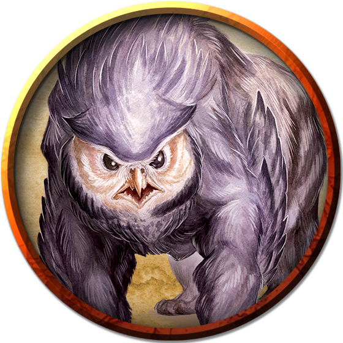

## Owlbear
An owlbear's screech echoes through dark valleys and benighted forests, piercing the quiet night to announce the death of its prey. Feathers cover the thick, shaggy coat of its bearlike body, and the limpid pupils of its great round eyes stare furiously from its owlish head.

***Deadly Ferocity.*** The owlbear's reputation for ferocity, aggression, stubbornness, and sheer ill temper makes it one of the most feared predators of the wild. There is little, if anything, that a hungry owlbear fears. Even monsters that outmatch an owlbear in size and strength avoid tangling with it, for this creature cares nothing about a foe's superior strength as it attacks without provocation.

***Consummate Predators.*** An owlbear emerges from its den around sunset and hunts into the darkest hours of the night, hooting or screeching to declare its territory, to search for a mate, or to flush prey into its hunting grounds. These are typically forests familiar to the owlbear, and dense enough to limit its quarry's escape routes.

An owlbear makes its den in a cave or ruin littered with the bones of its prey. It drags partially devoured kills back to its den, storing portions of the carcass among the surrounding rocks, bushes, and trees. The scent of blood and rotting flesh hangs heavy near an owlbear's lair, attracting scavengers and thus luring more prey.

Owlbears hunt alone or in mated pairs. If quarry is plentiful, a family of owlbears might remain together for longer than is required to rear offspring. Otherwise, they part ways as soon as the young are ready to hunt.

***Savage Companions.*** Although they are more intelligent than most animals, owlbears are difficult to tame. However, with enough time, food, and luck, an intelligent creature can train an owlbear to recognize it as a master, making it an unflinching guard or a fast and hardy mount. People of remote frontier settlements have even succeeded at racing owlbears, but spectators bet as often on which owlbear will attack its handler as they do on which will reach the finish line first.

Elven communities encourage owlbears to den beneath their treetop villages, using the beasts as a natural defense during the night. Hobgoblins favor owlbears as war beasts, and hill giants and frost giants sometimes keep owlbears as pets. A starved owlbear might show up in a gladiatorial arena, ruthlessly eviscerating and devouring its foes before a bloodthirsty audience.

***Owlbear Origins.*** Scholars have long debated the origins of the owlbear. The most common theory is that a demented wizard created the first specimen by crossing a giant owl with a bear. However, venerable elves claim to have known these creatures for thousands of years, and some fey insist that owlbears have always existed in the Feywild.

### Environment
(FIXME)

### Token

>### Owlbear
>*Large monstrosity, Unaligned*
>___
>- **Armor Class** 13 (natural armor)
>- **Hit Points** 59 (7d10 + 21)
>- **Speed** 40 ft.
>___
>|**STR**|**DEX**|**CON**|**INT**|**WIS**|**CHA**|
>|:---:|:---:|:---:|:---:|:---:|:---:|
>|20 (+5)|12 (+1)|17 (+3)|3 (-4)|12 (+1)|7 (-2)|
>
>___
>- **Proficiency Bonus** +2
>- **Saving Throws** 
>- **Damage Vulnerabilities** 
>- **Damage Resistances** 
>- **Damage Immunities** 
>- **Condition Immunities** 
>- **Skills** Perception +3
>- **Senses** Darkvision 60 ft.,Passive Perception 13
>- **Languages** --
>- **Challenge** 3
>___
>***Keen Sight and Smell.*** The owlbear has advantage on Wisdom (Perception) checks that rely on sight or smell.
>
>#### Actions
>***Multiattack.*** The owlbear makes two attacks: one with its beak and one with its claws.
>
>***Beak.*** Melee Weapon Attack: +7 to hit, reach 5 ft., one creature. Hit: 10 (1d10 + 5) piercing damage.
>
>***Claws.*** Melee Weapon Attack: +7 to hit, reach 5 ft., one target. Hit: 14 (2d8 + 5) slashing damage.
>
