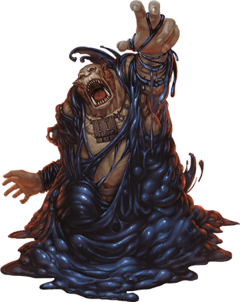

# Puddings
A relative of the ooze and the jelly, the pudding is an amorphous blob of semi-sentient "stuff" that typically lies in wait to ambush unsuspecting prey. They thrive in areas where few care to travel, only enough that they can be snared and subsumed without drawing too much attention. Puddings are drawn to movement and warmth. Organic material nourishes them, and when prey is scarce they feed on grime, fungus, and offal. Veteran explorers know that an immaculately clean space, free of any organic material, is a likely sign that a pudding lairs nearby.

> Jump to: [Black Pudding](Puddings.md#black-pudding) | [White Pudding](Puddings.md#white-pudding)

***Slow Death.*** An ooze kills its prey slowly. Some varieties are even large enough to engulf creatures to prevent escape. The only upside of this torturous death is that a victim's comrades can come to the rescue before it is too late.

Flesh, wood, metal, and bone dissolve when the pudding ebbs over them. Stone remains behind, wiped clean.

***Unwitting Servants.*** Although a pudding lacks the intelligence to ally itself with other creatures, others that understand an ooze's need to feed might lure it into a location where it can be of use to them. Clever monsters keep puddings around to defend passageways or consume refuse. Likewise, a pudding can be enticed into a pit trap, where its captors feed it often enough to prevent it from coming after them. Crafty creatures place torches and flaming braziers in strategic areas to dissuade a pudding from leaving a particular tunnel or room.

***Spawn of Juiblex.*** According to the Demonomicon of Iggwilv and other sources, puddings, like oozes, are scattered fragments or offspring of the demon lord Juiblex. Whether this is true or not, the Faceless Lord is one of the few beings that can control puddings and imbue them with a modicum of intelligence. Most of the time, puddings have no sense of tactics or self-preservation. They are direct and predictable, attacking and eating without cunning. Under the control of Juiblex, they exhibit glimmers of sentience and malevolent intent.

***Ooze Nature.*** A pudding doesn't require sleep.

---

## Black Pudding
A black pudding resembles a heaving mound of sticky black sludge. In dim passageways, the pudding appears to be little more than a blot of shadow. They flow through the damp underground, feeding on any creature or object that can be dissolved, slinking along the ground, dripping from walls and ceilings, spreading across the edges of underground pools, and squeezing through cracks. The first warning an adventurer receives of an ooze's presence is often the searing pain of its acidic touch.

### Environment
Mountains, Ruins, Underdark, Undersea, Urban

### Token

>### Black Pudding
>*Large ooze, unaligned*
>___
>- **Armor Class** 7
>- **Hit Points** 85 (10d10 + 30)
>- **Speed** 20 ft., climb 20 ft.
>___
>|**STR**|**DEX**|**CON**|**INT**|**WIS**|**CHA**|
>|:---:|:---:|:---:|:---:|:---:|:---:|
>|16 (+3)|5 (-3)|16 (+3)|1 (-5)|6 (-2)|1 (-5)|
>
>___
>- **Proficiency Bonus** +2
>- **Saving Throws** 
>- **Damage Vulnerabilities** 
>- **Damage Resistances** 
>- **Damage Immunities** acid,cold,lightning,slashing
>- **Condition Immunities** blinded,charmed,deafened,exhaustion,frightened,prone
>- **Skills** 
>- **Senses** blindsight 60 ft. (blind beyond this radius),passive Perception 8
>- **Languages** —
>- **Challenge** 4
>___
>***Amorphous.*** The pudding can move through a space as narrow as 1 inch wide without squeezing.
>
>***Corrosive Form.*** A creature that touches the pudding or hits it with a melee attack while within 5 feet of it takes 4 (1d8) acid damage. Any nonmagical weapon made of metal or wood that hits the pudding corrodes. After dealing damage, the weapon takes a permanent and cumulative −1 penalty to damage rolls. If its penalty drops to −5, the weapon is destroyed. Nonmagical ammunition made of metal or wood that hits the pudding is destroyed after dealing damage.
>
>The pudding can eat through 2-inch-thick, nonmagical wood or metal in 1 round.
>
>***Spider Climb.*** The pudding can climb difficult surfaces, including upside down on ceilings, without needing to make an ability check.
>
>#### Actions
>***Pseudopod.*** Melee Weapon Attack: +5 to hit, reach 5 ft., one target. Hit: 6 (1d6 + 3) bludgeoning damage plus 18 (4d8) acid damage. In addition, nonmagical armor worn by the target is partly dissolved and takes a permanent and cumulative −1 penalty to the AC it offers. The armor is destroyed if the penalty reduces its AC to 10.
>
>#### Reactions
>***Split.*** When a pudding that is Medium or larger is subjected to lightning or slashing damage, it splits into two new puddings if it has at least 10 hit points. Each new pudding has hit points equal to half the original pudding's, rounded down. New puddings are one size smaller than the original pudding.
>

---

## White Pudding
The white pudding is an offshoot of the black pudding, hiding in snow and ice until it can spring its trap against the unwary.

Flesh, wood, metal, and bone dissolve when the pudding ebbs over them. Stone remains behind, wiped clean.

### Environment
Arctic, Mountains

### Token

>### White Pudding
>*Large ooze, unaligned*
>___
>- **Armor Class** 12 (natural armour)
>- **Hit Points** 142 (15d10 + 60)
>- **Speed** 20 ft., climb 20 ft.
>___
>|**STR**|**DEX**|**CON**|**INT**|**WIS**|**CHA**|
>|:---:|:---:|:---:|:---:|:---:|:---:|
>|18 (+4)|8 (-1)|18 (+4)|1 (-5)|6 (-2)|1 (-5)|
>
>___
>- **Proficiency Bonus** +2
>- **Saving Throws** 
>- **Damage Vulnerabilities** 
>- **Damage Resistances** 
>- **Damage Immunities** acid,cold,lightning,slashing
>- **Condition Immunities** blinded,charmed,deafened,exhaustion,frightened,prone
>- **Skills** 
>- **Senses** blindsight 60 ft. (blind beyond this radius),passive Perception 8
>- **Languages** —
>- **Challenge** 6
>___
>***Amorphous.*** The pudding can move through a space as narrow as 1 inch wide without squeezing.
>
>***Cold.*** A creature that touches the pudding or hits it with a melee attack takes 4 (1d8) cold damage
>
>***Corrosive Form.*** The pudding can eat through 2-inch-thick, nonmagical wood or metal in 1 round. A creature that touches the pudding or hits it with a melee attack while within 5 feet of it takes 4 (1d8) acid damage. Any nonmagical weapon made of metal or wood that hits the pudding corrodes. After dealing damage, the weapon takes a permanent and cumulative −1 penalty to damage rolls. If its penalty drops to −5, the weapon is destroyed. Nonmagical ammunition made of metal or wood that hits the pudding is destroyed after dealing damage.
>
>***Spider Climb.*** The pudding can climb difficult surfaces, including upside down on ceilings, without needing to make an ability check.
>
>#### Actions
>***Pseudopod.*** Melee Weapon Attack: +7 to hit, reach 5 ft., one target. Hit: 9 (1d10 + 4) bludgeoning damage plus 18 (4d8) acid damage. In addition, nonmagical armor worn by the target is partly dissolved and takes a permanent and cumulative −1 penalty to the AC it offers. The armor is destroyed if the penalty reduces its AC to 10.
>
>#### Reactions
>***Split.*** When a pudding that is Medium or larger is subjected to lightning or slashing damage, it splits into two new puddings if it has at least 10 hit points. Each new pudding has hit points equal to half the original pudding's, rounded down. New puddings are one size smaller than the original pudding.
>
