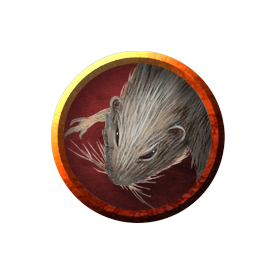
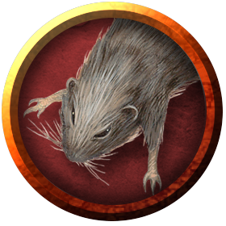

# Rats
The everpresent vermin, in all their twisted glory.

> Jump to: [Rat](Rat.md#rat) | [Swarm of Rats](Rat.md#swarm-of-rats) | [Giant Rat](Rat.md#giant-rat) | [Withered Rat](Rat.md#withered-rat)

***Vectors of Disease.*** Some rats (giant or otherwise) carry vile diseases that they spread with their bites. A diseased rat's challenge rating does not change; a diseased giant rat has a challenge rating of 1/8 (25 XP) both have the following action instead of the normal Bite attack. (Note that the statistics for the Bite do not change other than to add the check for disease.)

> ***Bite.*** Melee Weapon Attack: +4 to hit, reach 5 ft., one target. Hit: 4 (1d4 + 2) piercing damage. If the target is a creature, it must succeed on a DC 10 Constitution saving throw or contract a disease. Until the disease is cured, the target can't regain hit points except by magical means, and the target's hit point maximum decreases by 3 (1d6) every 24 hours. If the target's hit point maximum drops to 0 as a result of this disease, the target dies.

---

## Rat
(No description given)

### Environment
(FIXME)

### Token

>### Rat
>*Tiny beast, unaligned*
>___
>- **Armor Class** 10
>- **Hit Points** 1 (1d4 − 1)
>- **Speed** 20 ft.
>___
>|**STR**|**DEX**|**CON**|**INT**|**WIS**|**CHA**|
>|:---:|:---:|:---:|:---:|:---:|:---:|
>|2 (-4)|11 (+0)|9 (-1)|2 (-4)|10 (+0)|4 (-3)|
>
>___
>- **Proficiency Bonus** +2
>- **Saving Throws** 
>- **Damage Vulnerabilities** 
>- **Damage Resistances** 
>- **Damage Immunities** 
>- **Condition Immunities** 
>- **Skills** 
>- **Senses** darkvision 30 ft.,passive Perception 10
>- **Languages** —
>- **Challenge** 0
>___
>***Keen Smell.*** The rat has advantage on Wisdom (Perception) checks that rely on smell.
>
>#### Actions
>***Bite.*** Melee Weapon Attack: +0 to hit, reach 5 ft., one target. Hit: 1 piercing damage.
>

---

## Swarm of Rats
The swarm of rats presented here aren't ordinary or benign assemblies of little creatures. They form as a result of some sinister or unwholesome influence. A vampire can summon swarms of bats and rats from the darkest corners of the night; even druids can't charm these swarms, and their aggressiveness is borderline unnatural.

### Environment
(FIXME)

### Token

>### Swarm of Rats
>*Medium swarm, unaligned*
>___
>- **Armor Class** 10
>- **Hit Points** 24 (7d8 − 7)
>- **Speed** 30 ft.
>___
>|**STR**|**DEX**|**CON**|**INT**|**WIS**|**CHA**|
>|:---:|:---:|:---:|:---:|:---:|:---:|
>|9 (-1)|11 (+0)|9 (-1)|2 (-4)|10 (+0)|3 (-4)|
>
>___
>- **Proficiency Bonus** +2
>- **Saving Throws** 
>- **Damage Vulnerabilities** 
>- **Damage Resistances** bludgeoning,piercing,slashing
>- **Damage Immunities** 
>- **Condition Immunities** charmed,frightened,grappled,paralyzed,petrified,prone,restrained,stunned
>- **Skills** 
>- **Senses** darkvision 30 ft.,passive Perception 10
>- **Languages** —
>- **Challenge** 1/4
>___
>***Keen Smell.*** The swarm has advantage on Wisdom (Perception) checks that rely on smell.
>
>***Swarm.*** The swarm can occupy another creature's space and vice versa, and the swarm can move through any opening large enough for a Tiny rat. The swarm can't regain hit points or gain temporary hit points.
>
>#### Actions
>***Bites.*** Melee Weapon Attack: +2 to hit, reach 0 ft., one target in the swarm's space. Hit: 7 (2d6) piercing damage, or 3 (1d6) piercing damage if the swarm has half of its hit points or fewer.
>

---

## Giant Rat
If any player at any point during an encounter with a giant rat makes a joke about this being a "rodent of unusual size", the entire party engages in the rest of combat at disadvantage on all die rolls. Rats are *very* sensitive about their weight.

### Environment
(FIXME)

### Token

>### Giant Rat
>*Small beast, unaligned*
>___
>- **Armor Class** 12
>- **Hit Points** 7 (2d6)
>- **Speed** 30 ft.
>___
>|**STR**|**DEX**|**CON**|**INT**|**WIS**|**CHA**|
>|:---:|:---:|:---:|:---:|:---:|:---:|
>|7 (-2)|15 (+2)|11 (+0)|2 (-4)|10 (+0)|4 (-3)|
>
>___
>- **Proficiency Bonus** +2
>- **Saving Throws** 
>- **Damage Vulnerabilities** 
>- **Damage Resistances** 
>- **Damage Immunities** 
>- **Condition Immunities** 
>- **Skills** 
>- **Senses** darkvision 60 ft.,passive Perception 10
>- **Languages** —
>- **Challenge** 1/8
>___
>***Keen Smell.*** The rat has advantage on Wisdom (Perception) checks that rely on smell.
>
>***Pack Tactics.*** The rat has advantage on an attack roll against a creature if at least one of the rat's allies is within 5 feet of the creature and the ally isn't incapacitated.
>
>#### Actions
>***Bite.*** Melee Weapon Attack: +4 to hit, reach 5 ft., one target. Hit: 4 (1d4 + 2) piercing damage.
>

---

## Withered Rat
This rat was unfortunate enough to be converted to undead and set to obey its master's commands.

### Environment
(FIXME)

### Token

>### Withered Rat
>*Tiny undead, shares master's alignment*
>___
>- **Armor Class** 15 (natural armor)
>- **Hit Points** 9 (2d4 + 4)
>- **Speed** 25 ft.
>___
>|**STR**|**DEX**|**CON**|**INT**|**WIS**|**CHA**|
>|:---:|:---:|:---:|:---:|:---:|:---:|
>|2 (-4)|17 (+3)|15 (+2)|6 (-2)|12 (+1)|6 (-2)|
>
>___
>- **Proficiency Bonus** +2
>- **Saving Throws** 
>- **Damage Vulnerabilities** 
>- **Damage Resistances** bludgeoning, piercing, and slashing from nonmagical attacks that aren't silvered
>- **Damage Immunities** necrotic,poison
>- **Condition Immunities** poisoned
>- **Skills** Perception +3,Stealth +5
>- **Senses** darkvision 120 ft.,passive Perception 11
>- **Languages** Understands the languages of its master but can't speak
>- **Challenge** 1/2
>___
>***Keen Smell.*** The rat has advantage on Wisdom (Perception) checks that rely on sight.
>
>***Shadowmeld.*** If the rat is in dim light or darkness, it can take the Hide action as a bonus action. Additionally, If an attack misses the rat, the rat can use its reaction to move up to half of its movement speed without provoking attacks of opportunity.
>
>#### Actions
>***Bite.*** Melee Weapon Attack: +5 to hit, reach 5 ft., one creature. Hit: 10 (2d6 + 3) piercing damage, plus 7 (2d6) necrotic damage. If the target is a creature, it must succeed on a DC 13 Constitution saving throw or contract a disease. Until the disease is cured, the target can't regain hit points except by magical means.
>
>***Rotten Stench (1/Day).*** A cloud of noxious gas escapes from the rat's pores. Each creature within 10 feet of the rat must succeed on a DC 13 Constitution saving throw or be poisoned until the end of the creature's next turn.
>
