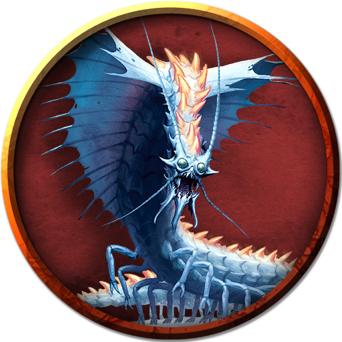

# Remorhazes
From beneath the snow and ice bursts a remorhaz in a cloud of steam, its body pulsing with internal fire. Winglike fins flare from the back of the creature's head, and its wide mouth brims with jagged teeth.

> Jump to: [Remorhaz](Remorhazes.md#remorhaz) | [Young Remorhaz](Remorhazes.md#young-remorhaz)

---

## Remorhaz
***Arctic Predators.*** Remorhazes live in arctic climes, preying on elk, polar bears, and other creatures sharing their territory. They can't tolerate warm weather, having adapted to the cold by generating a furnace-like heat within their bodies. When hunting, a remorhaz burrows deep below the snow and ice and lies in wait for the faint vibrations created by a creature moving above it. While hidden under the ice and snow, it can lower its body temperature so that it doesn't melt its cover.

### Environment
(FIXME)

### Token

>### Remorhaz
>*Huge monstrosity, unaligned*
>___
>- **Armor Class** 17 (natural armor)
>- **Hit Points** 195 (17d12 + 85)
>- **Speed** 30 ft., burrow 20 ft.
>___
>|**STR**|**DEX**|**CON**|**INT**|**WIS**|**CHA**|
>|:---:|:---:|:---:|:---:|:---:|:---:|
>|24 (+7)|13 (+1)|21 (+5)|4 (-3)|10 (+0)|5 (-3)|
>
>___
>- **Proficiency Bonus** +4
>- **Saving Throws** 
>- **Damage Vulnerabilities** 
>- **Damage Resistances** 
>- **Damage Immunities** cold,fire
>- **Condition Immunities** 
>- **Skills** 
>- **Senses** darkvision 60 ft.,tremorsense 60 ft.,passive Perception 10
>- **Languages** --
>- **Challenge** 11
>___
>***Heated Body.*** A creature that touches the remorhaz or hits it with a melee attack while within 5 feet of it takes 10 (3d6) fire damage.
>
>#### Actions
>***Bite.*** Melee Weapon Attack: +11 to hit, reach 10 ft., one target. Hit: 40 (6d10 + 7) piercing damage plus 10 (3d6) fire damage. If the target is a creature, it is grappled (escape DC 17). Until this grapple ends, the target is restrained, and the remorhaz can't bite another target.
>
>***Swallow.*** The remorhaz makes one bite attack against a Medium or smaller creature it is grappling. If the attack hits, that creature takes the bite's damage and is swallowed, and the grapple ends. While swallowed, the creature is blinded and restrained, it has total cover against attacks and other effects outside the remorhaz, and it takes 21 (6d6) acid damage at the start of each of the remorhaz's turns.
>
>If the remorhaz takes 30 damage or more on a single turn from a creature inside it, the remorhaz must succeed on a DC 15 Constitution saving throw at the end of that turn or regurgitate all swallowed creatures, which fall prone in a space within 10 feet of the remorhaz. If the remorhaz dies, a swallowed creature is no longer restrained by it and can escape from the corpse using 15 feet of movement, exiting prone.
>

---

## Young Remorhaz
***Young Ones.*** Frost giant hunters scour the icy wastes for remorhaz nests and eggs. The giants prize young remorhazes, which can be trained from hatching to obey commands and guard the giants' icy citadels. Unlike fully grown specimens, young remorhazes gnaw on their victims instead of swallowing them whole.

### Environment
(FIXME)

### Token

>### Young Remorhaz
>*Large monstrosity, unaligned*
>___
>- **Armor Class** 14 (natural armor)
>- **Hit Points** 93 (11d10 + 33)
>- **Speed** 30 ft., burrow 20 ft.
>___
>|**STR**|**DEX**|**CON**|**INT**|**WIS**|**CHA**|
>|:---:|:---:|:---:|:---:|:---:|:---:|
>|18 (+4)|13 (+1)|17 (+3)|3 (-4)|10 (+0)|4 (-3)|
>
>___
>- **Proficiency Bonus** +3
>- **Saving Throws** 
>- **Damage Vulnerabilities** 
>- **Damage Resistances** 
>- **Damage Immunities** cold,fire
>- **Condition Immunities** 
>- **Skills** 
>- **Senses** darkvision 60 ft.,tremorsense 60 ft.,passive Perception 10
>- **Languages** --
>- **Challenge** 5
>___
>***Heated Body.*** A creature that touches the remorhaz or hits it with a melee attack while within 5 feet of it takes 7 (2d6) fire damage.
>
>#### Actions
>***Bite.*** Melee Weapon Attack: +6 to hit, reach 5 ft., one target. Hit: 20 (3d10 + 4) piercing damage plus 7 (2d6) fire damage.
>

