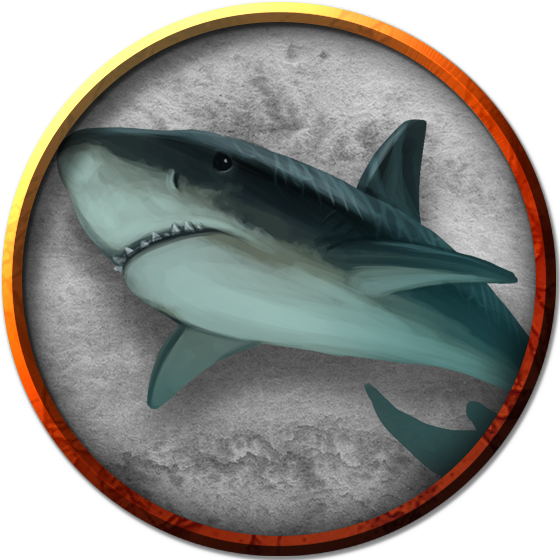

# Sharks
Sharks are some of the most vicious predators of the sea, with normal sharks sometimes displaying a disheartening willingness to attack creatures larger than them (or not native to the sea). They are often the companions, familiars, or mounts for [Sahuagin](Sahuagin.md) tribes, particularly the larger varieties.

> Jump to: [Giant Shark](Sharks.md#giant-shark) [Hunter Shark](Sharks.md#hunter-shark) | [Reef Shark](Sharks.md#reef-shark)

---

## Giant Shark
A giant shark is 30 feet long and normally found in deep oceans. Utterly fearless, it preys on anything that crosses its path, including whales and ships.

### Environment
Underwater

### Token

>### Giant Shark
>*Huge beast, unaligned*
>___
>- **Armor Class** 13 (natural armor)
>- **Hit Points** 126 (11d12 + 55)
>- **Speed** 0 ft., swim 50 ft.
>___
>|**STR**|**DEX**|**CON**|**INT**|**WIS**|**CHA**|
>|:---:|:---:|:---:|:---:|:---:|:---:|
>|23 (+6)|11 (+0)|21 (+5)|1 (-5)|10 (+0)|5 (-3)|
>
>___
>- **Proficiency Bonus** +3
>- **Saving Throws** 
>- **Damage Vulnerabilities** 
>- **Damage Resistances** 
>- **Damage Immunities** 
>- **Condition Immunities** 
>- **Skills** Perception +3
>- **Senses** blindsight 60 ft.,passive Perception 13
>- **Languages** —
>- **Challenge** 5
>___
>***Blood Frenzy.*** The shark has advantage on melee attack rolls against any creature that doesn't have all its hit points.
>
>***Water Breathing.*** The shark can breathe only underwater.
>
>#### Actions
>***Bite.*** Melee Weapon Attack: +9 to hit, reach 5 ft., one target. Hit: 22 (3d10 + 6) piercing damage.
>

---

## Hunter Shark
Smaller than a giant shark but larger and fiercer than a reef shark, a hunter shark haunts deep waters. It usually hunts alone, but multiple hunter sharks might feed in the same area. A fully grown hunter shark is 15 to 20 feet long.

### Environment
Coastal, Underwater

### Token

>### Hunter Shark
>*Large beast, unaligned*
>___
>- **Armor Class** 12 (natural armor)
>- **Hit Points** 45 (6d10 + 12)
>- **Speed** 0 ft., swim 40 ft.
>___
>|**STR**|**DEX**|**CON**|**INT**|**WIS**|**CHA**|
>|:---:|:---:|:---:|:---:|:---:|:---:|
>|18 (+4)|13 (+1)|15 (+2)|1 (-5)|10 (+0)|4 (-3)|
>
>___
>- **Proficiency Bonus** +2
>- **Saving Throws** 
>- **Damage Vulnerabilities** 
>- **Damage Resistances** 
>- **Damage Immunities** 
>- **Condition Immunities** 
>- **Skills** Perception +2
>- **Senses** blindsight 30 ft.,passive Perception 12
>- **Languages** --
>- **Challenge** 2
>___
>***Blood Frenzy.*** The shark has advantage on melee attack rolls against any creature that doesn't have all its hit points.
>
>***Water Breathing.*** The shark can breathe only underwater.
>
>#### Actions
>***Bite.*** Melee Weapon Attack: +6 to hit, reach 5 ft., one target. Hit: 13 (2d8 + 4) piercing damage.
>

---

## Reef Shark
Smaller than giant sharks and hunter sharks, reef sharks inhabit shallow waters and coral reefs, gathering in small packs to hunt. A full-grown specimen measures 6 to 10 feet long.

### Environment
Coastal, Underwater

### Token

>### Reef Shark
>*Medium beast, unaligned*
>___
>- **Armor Class** 12 (natural armor)
>- **Hit Points** 22 (4d8 + 4)
>- **Speed** 0 ft., swim 40 ft.
>___
>|**STR**|**DEX**|**CON**|**INT**|**WIS**|**CHA**|
>|:---:|:---:|:---:|:---:|:---:|:---:|
>|14 (+2)|13 (+1)|13 (+1)|1 (-5)|10 (+0)|4 (-3)|
>
>___
>- **Proficiency Bonus** +2
>- **Saving Throws** 
>- **Damage Vulnerabilities** 
>- **Damage Resistances** 
>- **Damage Immunities** 
>- **Condition Immunities** 
>- **Skills** Perception +2
>- **Senses** blindsight 30 ft.,passive Perception 12
>- **Languages** --
>- **Challenge** 1/2
>___
>***Pack Tactics.*** The shark has advantage on an attack roll against a creature if at least one of the shark's allies is within 5 feet of the creature and the ally isn't incapacitated.
>
>***Water Breathing.*** The shark can breathe only underwater.
>
>#### Actions
>***Bite.*** Melee Weapon Attack: +4 to hit, reach 5 ft., one target. Hit: 6 (1d8 + 2) piercing damage.
>

