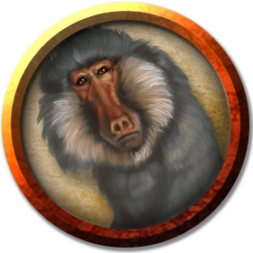

# Simians
The simian family of creatures are those that are vaguely humanoid yet still bestial: monkeys, baboons, apes, and so on.

> Jump to: [Ape](Simians.md#ape) [Baboon](Simians.md#baboon) | [Giant Ape](Simians.md#giant-ape) | [Girallon](Simians.md#girallon)

---

## Ape

### Environment
(FIXME)

### Token

>### Ape
>*Medium beast, unaligned*
>___
>- **Armor Class** 12
>- **Hit Points** 19 (3d8 + 6)
>- **Speed** 30 ft., climb 30 ft.
>___
>|**STR**|**DEX**|**CON**|**INT**|**WIS**|**CHA**|
>|:---:|:---:|:---:|:---:|:---:|:---:|
>|16 (+3)|14 (+2)|14 (+2)|6 (-2)|12 (+1)|7 (-2)|
>
>___
>- **Proficiency Bonus** +0
>- **Saving Throws** 
>- **Damage Vulnerabilities** 
>- **Damage Resistances** 
>- **Damage Immunities** 
>- **Condition Immunities** 
>- **Skills** Athletics +5,Perception +3
>- **Senses** passive Perception 13
>- **Languages** —
>- **Challenge** 1/2
>___
>#### Actions
>***Multiattack.*** The ape makes two fist attacks.
>
>***Fist.*** Melee Weapon Attack: +5 to hit, reach 5 ft., one target. Hit: 6 (1d6 + 3) bludgeoning damage.
>
>***Rock.*** Ranged Weapon Attack: +5 to hit, range 25/50 ft., one target. Hit: 6 (1d6 + 3) bludgeoning damage.
>

---

## Baboon
(No description given)

### Environment
(FIXME)

### Token

>### Baboon
>*Small beast, unaligned*
>___
>- **Armor Class** 12
>- **Hit Points** 3 (1d6)
>- **Speed** 30 ft., climb 30 ft.
>___
>|**STR**|**DEX**|**CON**|**INT**|**WIS**|**CHA**|
>|:---:|:---:|:---:|:---:|:---:|:---:|
>|8 (-1)|14 (+2)|11 (+0)|4 (-3)|12 (+1)|6 (-2)|
>
>___
>- **Proficiency Bonus** +2
>- **Saving Throws** 
>- **Damage Vulnerabilities** 
>- **Damage Resistances** 
>- **Damage Immunities** 
>- **Condition Immunities** 
>- **Skills** 
>- **Senses** passive Perception 11
>- **Languages** —
>- **Challenge** 0
>___
>***Pack Tactics.*** The baboon has advantage on an attack roll against a creature if at least one of the baboon's allies is within 5 feet of the creature and the ally isn't incapacitated.
>
>#### Actions
>***Bite.*** Melee Weapon Attack: +1 to hit, reach 5 ft., one target. Hit: 1 (1d4 − 1) piercing damage.
>

---

## Giant Ape
(No description given)

### Environment
(FIXME)

### Token

>### Giant Ape
>*Huge beast, unaligned*
>___
>- **Armor Class** 12
>- **Hit Points** 157 (15d12 + 60)
>- **Speed** 40 ft., climb 40 ft.
>___
>|**STR**|**DEX**|**CON**|**INT**|**WIS**|**CHA**|
>|:---:|:---:|:---:|:---:|:---:|:---:|
>|23 (+6)|14 (+2)|18 (+4)|7 (-2)|12 (+1)|7 (-2)|
>
>___
>- **Proficiency Bonus** +3
>- **Saving Throws** 
>- **Damage Vulnerabilities** 
>- **Damage Resistances** 
>- **Damage Immunities** 
>- **Condition Immunities** 
>- **Skills** Athletics +9,Perception +4
>- **Senses** passive Perception 14
>- **Languages** —
>- **Challenge** 7
>___
>#### Actions
>***Multiattack.*** The ape makes two fist attacks.
>
>***Fist.*** Melee Weapon Attack: +9 to hit, reach 10 ft., one target. Hit: 22 (3d10 + 6) bludgeoning damage.
>
>***Rock.*** Ranged Weapon Attack: +9 to hit, range 50/100 ft., one target. Hit: 30 (7d6 + 6) bludgeoning damage.
>

---

## Girallon
A girallon looks like an oversized, four-armed ape with gray skin and white fur. Its fangs and claws set it apart from a normal ape, revealing it to be a monstrous predator.

***Forest Hunters.*** Girallons are most common in temperate or warm forest environments abundant with life. They share the ape's adeptness at climbing, although these half-ton creatures shy away from scaling trees that can't support their bulk. Instead, they stalk the forest floor, lurk in narrow ravines or shallow caves, or hide in ruined sites while waiting for prey to come near. A girallon is surprisingly stealthy, considering its size and its lack of camouflage.

Girallons form loose bands of several individuals and their offspring, usually led by a dominant adult that also tends to be the oldest member of the group. When on the hunt away from their lair, girallons use roars and body language to communicate with one another over distance. Each individual typically hunts alone and widely separated from the others to ensure that everyone gets adequate fodder. The leader might organize members to work together to make a big kill, however. If they succeed, everyone in the group shares the spoils, with the best parts going to those caring for their young.

Girallons' strange appearance and attraction to ruins lead sages to believe they were created through magic to serve as guardians for some lost empire. When that empire fell ages ago, girallons turned feral and spread out across the world.

***Wall Climbers.*** The ruins of humanoid habitations, especially those found in deep forests and jungles, seem to attract girallons. They move effortlessly along stairs and balconies, as well as on the sloped rooftops and buttresses of such formations. To a girallon, a city's buildings are just another sort of forest -- and better yet, one whose uppermost "branches" can easily support the creatures. In such a setting, the girallons take full advantage of their skill in climbing. The creatures can easily scale walls and battlements, and they perch on tower tops and other high vantages to keep an eye on the surrounding area.

***Magical Origin.*** The social habits of wild girallons are unusual for apes, as is their instinctive attraction to humanoid structures. These facts, together with the girallon's appearance, lead sages to believe that girallons were created through magic to serve as guardians for some lost empire. When that empire fell ages ago, girallons turned feral and spread out across the world.

In the time since then, numerous creatures have tried to tame, subjugate, or cooperate with the monsters. For instance, yuan-ti enslave girallons, turning them into border sentinels for their serpent kingdoms. Because girallons are known to be peaceful among their own kind, some humanoids have learned how to approach a group's leader, offering food and other gifts in hopes of establishing an alliance with the creatures.

Girallons that are well treated might be willing to serve as guards, though they lack the intelligence to take on tasks more complicated than attacking strangers that enter their domain. If one is taken young and properly trained, a girallon could end up in a seemingly unlikely place, such as guarding the entrance to a city's thieves' guild. Those who would keep a girallon as a pet must always be wary, because the creature could revert to its predatory nature at any time.

### Environment
(FIXME)

### Token

>### Girallon
>*Large monstrosity, Unaligned*
>___
>- **Armor Class** 13
>- **Hit Points** 59 (7d10 + 21)
>- **Speed** 40 ft., climb 40 ft.
>___
>|**STR**|**DEX**|**CON**|**INT**|**WIS**|**CHA**|
>|:---:|:---:|:---:|:---:|:---:|:---:|
>|18 (+4)|16 (+3)|16 (+3)|5 (-3)|12 (+1)|7 (-2)|
>
>___
>- **Proficiency Bonus** +2
>- **Saving Throws** 
>- **Damage Vulnerabilities** 
>- **Damage Resistances** 
>- **Damage Immunities** 
>- **Condition Immunities** 
>- **Skills** Perception +5,Stealth +5
>- **Senses** darkvision 60 ft.,passive Perception 15
>- **Languages** --
>- **Challenge** 4
>___
>#### Actions
>***Multiattack.*** The girallon makes one Bite attack and four Claw attacks.
>
>***Bite.*** Melee Weapon Attack: +6 to hit, reach 5 ft., one creature. Hit: 7 (1d6 + 4) piercing damage.
>
>***Claw.*** Melee Weapon Attack: +6 to hit, reach 10 ft., one target. Hit: 7 (1d6 + 4) slashing damage.
>
>#### Bonus Actions
>***Aggressive.*** The girallon moves up to its speed toward a hostile creature that it can see.
>

