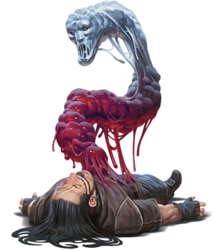

## Slithering Tracker
The quest for revenge sometimes leads one to undergo a ritual whereby they transform into a body of semiliquid sentience known as a slithering tracker. Innocuous and insidious at the same time, a tracker flows into places where a normal creature can't go and brings its own brand of watery death down upon its quarry.

***Vengeance at Any Cost.*** The ritual for creating a slithering tracker is known to hags, liches, and priests who worship gods of vengeance. It can only be performed on a willing creature that hungers for revenge. The ritual sucks all the moisture from the person's body, killing it. Yet the mind lives on in the puddle of liquid that issues forth from the remains, and so too does the subject's insatiable need for retribution.

***Stealthy Assassins.*** A slithering tracker tastes the ground it courses over, seeking any trace of its prey. To kill, a slithering tracker rises up and enshrouds a creature, attempting to drown the prey while also draining it of blood. A slithering tracker that has killed in this fashion becomes much easier to locate for a time, since its liquid form becomes tinged with blood and its body leaves a visible trail of the stuff behind it.

***Descent into Madness.*** Achieving revenge against its target doesn't end a slithering tracker's existence, nor its hunger for blood. Some slithering trackers remain aware of their purpose and extend their quest for vengeance to others, such as anyone who supported or befriended the original target. Most of the time, though, a tracker's mind can't cope with being trapped in liquid form, unable to communicate, and driven by the desire for blood: after a tracker fulfills its duty, insanity takes over the creature, and it attacks indiscriminately until it is destroyed.

### Environment
Extraplanar, Conjured/Summoned

### Token

>### Slithering Tracker
>*Medium ooze, Typically Chaotic Evil*
>___
>- **Armor Class** 14
>- **Hit Points** 39 (6d8 + 12)
>- **Speed** 30 ft., climb 30 ft., swim 30 ft.
>___
>|**STR**|**DEX**|**CON**|**INT**|**WIS**|**CHA**|
>|:---:|:---:|:---:|:---:|:---:|:---:|
>|16 (+3)|19 (+4)|15 (+2)|10 (+0)|14 (+2)|11 (+0)|
>
>___
>- **Proficiency Bonus** +2
>- **Saving Throws** 
>- **Damage Vulnerabilities** cold,fire
>- **Damage Resistances** bludgeoning,piercing,and slashing from nonmagical attacks
>- **Damage Immunities** 
>- **Condition Immunities** blinded,deafened,exhaustion,grappled,paralyzed,petrified,prone,restrained,unconscious
>- **Skills** Stealth +8,Survival +6
>- **Senses** blindsight 120 ft.,passive Perception 12
>- **Languages** understands languages it knew in its previous form but can't speak
>- **Challenge** 3
>___
>***False Appearance.*** If the slithering tracker is motionless at the start of combat, it has advantage on its initiative roll. Moreover, if a creature hasn't observed the slithering tracker move or act, that creature must succeed on a DC 18 Intelligence (Investigation) check to discern that the slithering tracker isn't a puddle.
>
>***Liquid Form.*** The slithering tracker can enter an enemy's space and stop there. It can also move through a space as narrow as 1 inch wide without squeezing.
>
>***Spider Climb.*** The slithering tracker can climb difficult surfaces, including upside down on ceilings, without needing to make an ability check.
>
>#### Actions
>***Slam.*** Melee Weapon Attack: +5 to hit, reach 5 ft., one target. Hit: 8 (1d10 + 3) bludgeoning damage.
>
>***Life Leech.*** One Large or smaller creature that the slithering tracker can see within 5 feet of it must succeed on a DC 13 Dexterity saving throw or be grappled (escape DC 13). Until this grapple ends, the target is restrained and unable to breathe unless it can breathe water. In addition, the grappled target takes 16 (3d10) necrotic damage at the start of each of its turns. The slithering tracker can grapple only one target at a time.
>
>While grappling the target, the slithering tracker takes only half any damage dealt to it (rounded down), and the target takes the other half.
>
>#### Bonus Actions
>***Watery Stealth.*** If underwater, the slithering tracker takes the Hide action, and it makes the Dexterity (Stealth) check with advantage.
>
