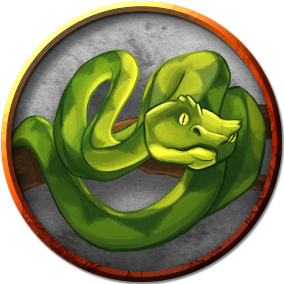
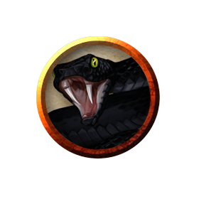

# Snakes
Armless (usually) and legless reptiles, snakes are common to many parts of Azgaarnoth, and not particularly threatening, with the exception of a few species. They are often found around farms throughout Azgaarnoth, as they are excellent defenses against rodents, and some Hordes villages have festivals in honor of the common garden snake. They are often considered a good-luck charm.

> Jump to: [Constrictor Snake](Snakes.md#constrictor-snake) | [Flying Snake](Snakes.md#flying-snake) | [Giant Constrictor Snake](Snakes.md#giant-constrictor-snake) | [Giant Poisonous Snake](Snakes.md#giant-poisonous-snake) | [Nightstriker Serpent](Snakes.md#nightstriker-serpent) | [Poisonous Snake](Snakes.md#poisonous-snake) | [Swarm Of Poisonous Snakes](Snakes.md#swarm-of-poisonous-snakes)

---

## Constrictor Snake
Anacondas and pythons can grow up to six or seven feet in length, and are commonly found in the jungles, swamps, and marshlands of [Yithi](../Nations/Yithi.md) and [Zhi](../Nations/Zhi.md), as well as [Tragekia](../Nations/Tragekia.md).

### Environment
(FIXME)

### Token

>### Constrictor Snake
>*Large beast, unaligned*
>___
>- **Armor Class** 12
>- **Hit Points** 13 (2d10 + 2)
>- **Speed** 30 ft., swim 30 ft.
>___
>|**STR**|**DEX**|**CON**|**INT**|**WIS**|**CHA**|
>|:---:|:---:|:---:|:---:|:---:|:---:|
>|15 (+2)|14 (+2)|12 (+1)|1 (-5)|10 (+0)|3 (-4)|
>
>___
>- **Proficiency Bonus** +2
>- **Saving Throws** 
>- **Damage Vulnerabilities** 
>- **Damage Resistances** 
>- **Damage Immunities** 
>- **Condition Immunities** 
>- **Skills** 
>- **Senses** blindsight 10 ft.,passive Perception 10
>- **Languages** —
>- **Challenge** 1/4
>___
>#### Actions
>***Bite.*** Melee Weapon Attack: +4 to hit, reach 5 ft., one creature. Hit: 5 (1d6 + 2) piercing damage.
>
>***Constrict.*** Melee Weapon Attack: +4 to hit, reach 5 ft., one creature. Hit: 6 (1d8 + 2) bludgeoning damage, and the target is grappled (escape DC 14). Until this grapple ends, the creature is restrained, and the snake can't constrict another target.
>

---

## Flying Snake
A flying snake is a brightly colored, winged serpent found in remote jungles. Some tribes and clans, particularly among the Hordes, domesticate flying snakes to serve as messengers that deliver scrolls wrapped in their coils.

### Environment
(FIXME)

### Token

>### Flying Snake
>*Tiny beast, unaligned*
>___
>- **Armor Class** 14
>- **Hit Points** 5 (2d4)
>- **Speed** 30 ft., fly 60 ft., swim 30 ft.
>___
>|**STR**|**DEX**|**CON**|**INT**|**WIS**|**CHA**|
>|:---:|:---:|:---:|:---:|:---:|:---:|
>|4 (-3)|18 (+4)|11 (+0)|2 (-4)|12 (+1)|5 (-3)|
>
>___
>- **Proficiency Bonus** +2
>- **Saving Throws** 
>- **Damage Vulnerabilities** 
>- **Damage Resistances** 
>- **Damage Immunities** 
>- **Condition Immunities** 
>- **Skills** 
>- **Senses** blindsight 10 ft.,passive Perception 11
>- **Languages** —
>- **Challenge** 1/8
>___
>***Flyby.*** The snake doesn't provoke opportunity attacks when it flies out of an enemy's reach.
>
>#### Actions
>***Bite.*** Melee Weapon Attack: +6 to hit, reach 5 ft., one target. Hit: 1 piercing damage plus 7 (3d4) poison damage.
>

---

## Giant Constrictor Snake
As if the normal-sized anaconda or python weren't bad enough, some wizards went and doubled their size, and discovered to their horror that the breed was able to successfully replicate. Giant constrictor snakes are usually found in the most remote jungle and marshland areas, but reports of such snakes in the trees in Northern Bedia keep even the most fearless Bedian settler up late at night.

### Environment
(FIXME)

### Token

>### Giant Constrictor Snake
>*Huge beast, unaligned*
>___
>- **Armor Class** 12
>- **Hit Points** 60 (8d12 + 8)
>- **Speed** 30 ft., swim 30 ft.
>___
>|**STR**|**DEX**|**CON**|**INT**|**WIS**|**CHA**|
>|:---:|:---:|:---:|:---:|:---:|:---:|
>|19 (+4)|14 (+2)|12 (+1)|1 (-5)|10 (+0)|3 (-4)|
>
>___
>- **Proficiency Bonus** +2
>- **Saving Throws** 
>- **Damage Vulnerabilities** 
>- **Damage Resistances** 
>- **Damage Immunities** 
>- **Condition Immunities** 
>- **Skills** Perception +2
>- **Senses** blindsight 10 ft.,passive Perception 12
>- **Languages** —
>- **Challenge** 2
>___
>#### Actions
>***Bite.*** Melee Weapon Attack: +6 to hit, reach 10 ft., one creature. Hit: 11 (2d6 + 4) piercing damage.
>
>***Constrict.*** Melee Weapon Attack: +6 to hit, reach 5 ft., one creature. Hit: 13 (2d8 + 4) bludgeoning damage, and the target is grappled (escape DC 16). Until this grapple ends, the creature is restrained, and the snake can't constrict another target.
>

---

## Giant Poisonous Snake
Truly the stuff of nightmares, the giant poisonous snake often runs six to seven feet in length, and its poison can kill a mortal in seconds.

### Environment
(FIXME)

### Token

>### Giant Poisonous Snake
>*Medium beast, unaligned*
>___
>- **Armor Class** 14
>- **Hit Points** 11 (2d8 + 2)
>- **Speed** 30 ft., swim 30 ft.
>___
>|**STR**|**DEX**|**CON**|**INT**|**WIS**|**CHA**|
>|:---:|:---:|:---:|:---:|:---:|:---:|
>|10 (+0)|18 (+4)|13 (+1)|2 (-4)|10 (+0)|3 (-4)|
>
>___
>- **Proficiency Bonus** +2
>- **Saving Throws** 
>- **Damage Vulnerabilities** 
>- **Damage Resistances** 
>- **Damage Immunities** 
>- **Condition Immunities** 
>- **Skills** Perception +2
>- **Senses** blindsight 10 ft.,passive Perception 12
>- **Languages** —
>- **Challenge** 1/4
>___
>#### Actions
>***Bite.*** Melee Weapon Attack: +6 to hit, reach 10 ft., one target. Hit: 6 (1d4 + 4) piercing damage, and the target must make a DC 11 Constitution saving throw, taking 10 (3d6) poison damage on a failed save, or half as much damage on a successful one.
>

---

## Nightstriker Serpent
Nightstriker serpents are nocturnal ambush predators with scales as dark as the night sky and hearts just as dark. A nightstriker serpent's venom is considerably more potent than that of an ordinary snake, but by far the most terrifying thing about them is the fact that they seem to meld with ambient darkness, such that they are almost never seen by their victims until it is too late.

A nightstriker serpent's body is composed partly of shadow, so it is immune to poison and has some measure of resistance to several forms of destructive energy and conventional weapons.

### Environment
(FIXME)

### Token

>### Nightstriker Serpent
>*Large monstrosity, neutral evil*
>___
>- **Armor Class** 14
>- **Hit Points** 32 (5d10 + 5)
>- **Speed** 30 ft.
>___
>|**STR**|**DEX**|**CON**|**INT**|**WIS**|**CHA**|
>|:---:|:---:|:---:|:---:|:---:|:---:|
>|14 (+2)|18 (+4)|13 (+1)|10 (+0)|12 (+1)|10 (+0)|
>
>___
>- **Proficiency Bonus** +3
>- **Saving Throws** 
>- **Damage Vulnerabilities** 
>- **Damage Resistances** cold,fire,necrotic; bludgeoning,piercing,and slashing from nonmagical attacks
>- **Damage Immunities** poison
>- **Condition Immunities** poisoned
>- **Skills** Perception +4,Stealth +10
>- **Senses** blindsight 10 ft.,darkvision 60 ft.,passive Perception 14
>- **Languages** Common
>- **Challenge** 5
>___
>***Shadow Stealth.*** While in dim light or darkness, the snake can take the Hide action as a bonus action.
>
>#### Actions
>***Bite.*** Melee Weapon Attack: +7 to hit, reach 10 ft., one target. Hit: 6 (1d4 + 4) piercing damage, and the target must make a DC 13 Constitution saving throw, taking 17 (5d6) poison damage on a failed save, or half as much damage on a successful one.
>

---

## Poisonous Snake
(No description given)

### Environment
(FIXME)

### Token

>### Poisonous Snake
>*Tiny beast, unaligned*
>___
>- **Armor Class** 13
>- **Hit Points** 2 (1d4)
>- **Speed** 30 ft., swim 30 ft.
>___
>|**STR**|**DEX**|**CON**|**INT**|**WIS**|**CHA**|
>|:---:|:---:|:---:|:---:|:---:|:---:|
>|2 (-4)|16 (+3)|11 (+0)|1 (-5)|10 (+0)|3 (-4)|
>
>___
>- **Proficiency Bonus** +2
>- **Saving Throws** 
>- **Damage Vulnerabilities** 
>- **Damage Resistances** 
>- **Damage Immunities** 
>- **Condition Immunities** 
>- **Skills** 
>- **Senses** blindsight 10 ft.,passive Perception 10
>- **Languages** —
>- **Challenge** 1/8
>___
>#### Actions
>***Bite.*** Melee Weapon Attack: +5 to hit, reach 5 ft., one target. Hit: 1 piercing damage, and the target must make a DC 10 Constitution saving throw, taking 5 (2d4) poison damage on a failed save, or half as much damage on a successful one.
>

---

## Swarm Of Poisonous Snakes
(No description given)

### Environment
(FIXME)

### Token

>### Swarm Of Poisonous Snakes
>*Medium swarm, unaligned*
>___
>- **Armor Class** 14
>- **Hit Points** 36 (8d8)
>- **Speed** 30 ft., swim 30 ft.
>___
>|**STR**|**DEX**|**CON**|**INT**|**WIS**|**CHA**|
>|:---:|:---:|:---:|:---:|:---:|:---:|
>|8 (-1)|18 (+4)|11 (+0)|1 (-5)|10 (+0)|3 (-4)|
>
>___
>- **Proficiency Bonus** +2
>- **Saving Throws** 
>- **Damage Vulnerabilities** 
>- **Damage Resistances** bludgeoning,piercing,slashing
>- **Damage Immunities** 
>- **Condition Immunities** charmed,frightened,grappled,paralyzed,petrified,prone,restrained,stunned
>- **Skills** 
>- **Senses** blindsight 10 ft.,passive Perception 10
>- **Languages** —
>- **Challenge** 2
>___
>***Swarm.*** The swarm can occupy another creature's space and vice versa, and the swarm can move through any opening large enough for a Tiny snake. The swarm can't regain hit points or gain temporary hit points.
>
>#### Actions
>***Bites.*** Melee Weapon Attack: +6 to hit, reach 0 ft., one creature in the swarm's space. Hit: 7 (2d6) piercing damage, or 3 (1d6) piercing damage if the swarm has half of its hit points or fewer. The target must make a DC 10 Constitution saving throw, taking 14 (4d6) poison damage on a failed save, or half as much damage on a successful one.
>

