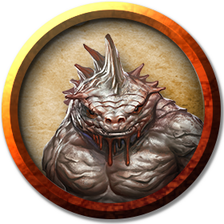

## Troglodyte
Violent and ever-hungry, troglodytes squat in the shallow depths of the Underdark in a constant state of war against their neighbors and one another. They mark the borders of their territories with cracked bones and skulls, or with pictographs painted in blood or dung.

Perhaps the most loathsome of all humanoids, troglodytes eat anything they can stomach. They dwell in filth. The walls of their cavern homes are smeared with grime, oily secretions, and the debris of their foul feasting.

***Single-Minded Brutes.*** Troglodytes are devoted almost entirely to procuring food. They rarely plan more than a few days into the future, instead relying on constant raids and hunting to survive. They take sadistic pleasure in hunting intelligent creatures weaker than themselves and show no mercy toward those they capture and drag back to their lairs to be devoured. The largest and toughest troglodytes lead the hunt and become the leaders of their tribes. However, if a leader shows any weakness or hesitation, other troglodytes attack and eat it in a frenzy.

Troglodytes make little and build less, scavenging their possessions from their prey. They understand the value of metal weapons and armor, and fight among one another for the right to have such items. A troglodyte tribe might be torn apart by battles over a single longsword.

***Devotees of Laogzed.*** Some troglodytes venerate Laogzed, a demonic, monstrously fat toad-lizard that slumbers in the Abyss. Laogzed offers the troglodytes nothing in return except aspiration, for it is the dream of his troglodyte worshipers to become as well-fed and wearily content as he seems to be.

### Environment
Underdark

### Token

>### Troglodyte
>*Medium humanoid (troglodyte), chaotic evil*
>___
>- **Armor Class** 11 (natural armor)
>- **Hit Points** 13 (2d8 + 4)
>- **Speed** 30 ft.
>___
>|**STR**|**DEX**|**CON**|**INT**|**WIS**|**CHA**|
>|:---:|:---:|:---:|:---:|:---:|:---:|
>|14 (+2)|10 (+0)|14 (+2)|6 (-2)|10 (+0)|6 (-2)|
>
>___
>- **Proficiency Bonus** +2
>- **Saving Throws** 
>- **Damage Vulnerabilities** 
>- **Damage Resistances** 
>- **Damage Immunities** 
>- **Condition Immunities** 
>- **Skills** Stealth +2
>- **Senses** darkvision 60 ft.,passive Perception 10
>- **Languages** Troglodyte
>- **Challenge** 1/4
>___
>***Chameleon Skin.*** The troglodyte has advantage on Dexterity (Stealth) checks made to hide.
>
>***Stench.*** Any creature other than a troglodyte that starts its turn within 5 feet of the troglodyte must succeed on a DC 12 Constitution saving throw or be poisoned until the start of the creature's next turn. On a successful saving throw, the creature is immune to the stench of all troglodytes for 1 hour.
>
>***Sunlight Sensitivity.*** While in sunlight, the troglodyte has disadvantage on attack rolls, as well as on Wisdom (Perception) checks that rely on sight.
>
>#### Actions
>***Multiattack.*** The troglodyte makes three attacks: one with its bite and two with its claws.
>
>***Bite.*** Melee Weapon Attack: +4 to hit, reach 5 ft., one target. Hit: 4 (1d4 + 2) piercing damage.
>
>***Claw.*** Melee Weapon Attack: +4 to hit, reach 5 ft., one target. Hit: 4 (1d4 + 2) slashing damage.
>
