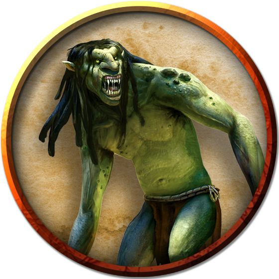
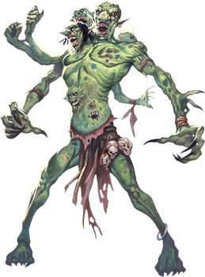
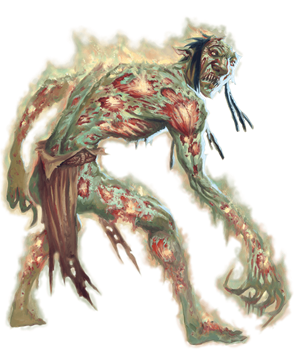
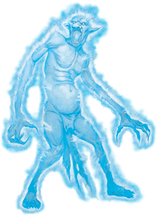
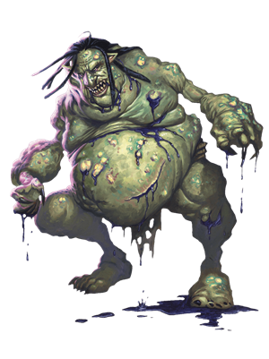

# Trolls
Trolls that are nearly obliterated but survive and regenerate from mere scraps of flesh can display bizarre features. Radically transformed trolls like the rot trolls, spirit trolls, and venom trolls that follow are especially likely to arise when trolls regenerate in the presence of magical emanations, planar energy, disease, or death on a vast scale, or if their bodies were damaged by elemental forces. These unusual forms can also be produced and shaped by the ritual magic of evil spellcasters or by trolls' own practices, as is the case for dire trolls.

> Jump to: [Troll](Trolls.md#troll) | [Cave Troll](Trolls.md#cave-troll) | [Dire Troll](Trolls.md#dire-troll) | [Forest Troll](Trolls.md#forest-troll) | [Mountain Troll](Trolls.md#mountain-troll) | [River Troll](Trolls.md#river-troll) | [Rot Troll](Trolls.md#rot-troll) | [Spirit Troll](Trolls.md#spirit-troll) | [Stone Troll](Trolls.md#stone-troll) | [Venom Troll](Trolls.md#venom-troll) | [Troll Shaman](Trolls.md#troll-shaman)

***Vaprak the Destroyer.*** Although trolls are rarely devout and seldom ponder spiritual questions, some fear and venerate the entity known as Vaprak the Destroyer. Vaprak's true nature is something of a mystery, but Vaprak is always portrayed as a horrid, misshapen, greenish creature strongly resembling a troll. Vaprak is given to fits of mindless destruction and uncontrollably fears the plots and ambitions of other deities.Vaprak's troll worshipers believe this god devours the souls of those who have been cooked or digested (slain by fire or acid). Otherwise, the god spits the soul back into the world to regenerate a new body.

---

## Troll
Born with horrific appetites, trolls eat anything they can catch and devour. They have no society to speak of, but they do serve as mercenaries, particularly to the Hordish nations, but also to various third parties (particularly hags). As payment, trolls demand food and treasure. Trolls are difficult to control, however, doing as they please even when working with more powerful creatures.

***Regeneration.*** Smashing a troll's bones and slashing through its rubbery hide only makes it angry. A troll's wounds close quickly. If the monster loses an arm, a leg, or even its head, those dismembered parts can sometimes act with a life of their own. A troll can even reattach severed body parts, untroubled by its momentary disability. Only acid and fire can arrest the regenerative properties of a troll's flesh. The trolls, enraged, will attack individuals making acid and fire attacks against them above all other prey.

***Troll Freaks.*** Their regenerative capabilities make trolls especially susceptible to mutation. Although uncommon, such transformations can result from what the troll has done or what has been done to it. A decapitated troll might grow two heads from the stump of its neck, while a troll that eats a fey creature might gain one or more of that creature's traits.

### Environment
Arctic, Forest, Hill, Mountain, Ruins, Swamp, Underdark

### Token

>### Troll
>*Large giant, chaotic evil*
>___
>- **Armor Class** 15 (natural armor)
>- **Hit Points** 84 (8d10 + 40)
>- **Speed** 30 ft.
>___
>|**STR**|**DEX**|**CON**|**INT**|**WIS**|**CHA**|
>|:---:|:---:|:---:|:---:|:---:|:---:|
>|18 (+4)|13 (+1)|20 (+5)|7 (-2)|9 (-1)|7 (-2)|
>
>___
>- **Proficiency Bonus** +3
>- **Saving Throws** 
>- **Damage Vulnerabilities** 
>- **Damage Resistances** 
>- **Damage Immunities** 
>- **Condition Immunities** 
>- **Skills** Perception +2
>- **Senses** darkvision 60 ft.,passive Perception 12
>- **Languages** Giant
>- **Challenge** 5
>___
>***Keen Smell.*** The troll has advantage on Wisdom (Perception) checks that rely on smell.
>
>***Regeneration.*** The troll regains 10 hit points at the start of its turn. If the troll takes acid or fire damage, this trait doesn't function at the start of the troll's next turn. The troll dies only if it starts its turn with 0 hit points and doesn't regenerate.
>
>#### Actions
>***Multiattack.*** The troll makes three attacks: one with its bite and two with its claws.
>
>***Bite.*** Melee Weapon Attack: +7 to hit, reach 5 ft., one target. Hit: 7 (1d6 + 4) piercing damage.
>
>***Claw.*** Melee Weapon Attack: +7 to hit, reach 5 ft., one target. Hit: 11 (2d6 + 4) slashing damage.
>

---

## Cave Troll
Ages ago a branch of trolls moved into the Underdark. Subterranean existence turned their bodies pale but also incredibly bulky and strong. Over time their intelligence degraded some but made them no less ravenous or cruel, while the strange energies of the Underdark weakened their regeneration but removed the vulnerabilities to acid or fire. Sadly (or, perhaps not so sadly), the Underdark energies also made them significantly vulnerable to direct sunlight.

Cave trolls can be found in small groups prowling the deep caverns of the Underdark (or sometimes closer to the surface, if they get lost and accidentally find exits into the open air), but more often they are found as guards in Underdark fortresses.

### Environment
Mountain, Underdark

### Token

>### Cave Troll
>*Large giant, chaotic evil*
>___
>- **Armor Class** 15 (natural armor)
>- **Hit Points** 230 (20d10 + 120)
>- **Speed** 30 ft.
>___
>|**STR**|**DEX**|**CON**|**INT**|**WIS**|**CHA**|
>|:---:|:---:|:---:|:---:|:---:|:---:|
>|22 (+6)|10 (+0)|22 (+6)|4 (-3)|7 (-2)|7 (-2)|
>
>___
>- **Proficiency Bonus** +4
>- **Saving Throws** St +10,Con +10
>- **Damage Vulnerabilities** 
>- **Damage Resistances** cold
>- **Damage Immunities** 
>- **Condition Immunities** 
>- **Skills** Perception +2
>- **Senses** darkvision 90 ft.,passive Perception 12
>- **Languages** understands Undercommon (can't speak intelligibly)
>- **Challenge** 12
>___
>***Keen Smell.*** The troll has advantage on Wisdom (Perception) checks that rely on smell.
>
>***Regeneration.*** The troll regains 15 hit points at the start of its turn if it has at least 1 hit point.
>
>***Sunlight Curse.*** While in direct sunlight, the troll has disadvantage on all checks, including saving throws and attack rolls. At the start of its turn, it must make a DC 15 Constitution saving throw or be permanently petrified at the end of its turn. If the troll is subjected to artificial sunlight, it still has disadvantage and must make the Constitution save, but failure only inflicts 22 (4d10) radiant damage upon the troll rather than petrification.
>
>#### Actions
>***Multiattack.*** The troll makes three attacks: one stomp and two with its claws.
>
>***Claws.*** Melee Weapon Attack: +10 to hit, reach 5 ft., one target. Hit: 15 (2d8 + 6) slashing damage.
>
>***Stomp.*** Melee Weapon Attack: +10 to hit, reach 5 ft., one target. Hit: 16 (3d6 + 6) bludgeoning damage. If the target is a creature of a size smaller than the troll, it must succeed on a DC 18 Strength saving throw or be knocked prone.
>

---

## Dire Troll
Trolls kill and eat almost anything--including, in rare cases, other trolls. This cannibalism has the effect of causing a troll to grow to an unusually large size. The resulting dire trolls crave more and more troll flesh to fuel their continued growth.

Dire trolls also increase their size by grafting flesh onto themselves. When a slab of quivering troll flesh is bound against a fresh wound on a dire troll, the dire troll's regenerative capacity incorporates the new mass into the troll's own musculature. Even more horrifying are the multiple arms, eyes, claws, and organs that dire trolls tear from their victims and graft onto themselves in this manner.

### Environment
Arctic, Forest, Hill, Mountain, Ruins, Swamp, Underdark

### Token

>### Dire Troll
>*Huge Giant, Typically Chaotic Evil*
>___
>- **Armor Class** 15 (natural armor)
>- **Hit Points** 172 (15d12 + 75)
>- **Speed** 40 ft.
>___
>|**STR**|**DEX**|**CON**|**INT**|**WIS**|**CHA**|
>|:---:|:---:|:---:|:---:|:---:|:---:|
>|22 (+6)|15 (+2)|21 (+5)|9 (-1)|11 (+0)|5 (-3)|
>
>___
>- **Proficiency Bonus** +5
>- **Saving Throws** Wis +5,Cha +2
>- **Damage Vulnerabilities** 
>- **Damage Resistances** bludgeoning,piercing,and slashing from nonmagical attacks
>- **Damage Immunities** 
>- **Condition Immunities** frightened,poisoned
>- **Skills** Perception +10
>- **Senses** darkvision 60 ft.,passive Perception 20
>- **Languages** Giant
>- **Challenge** 13
>___
>***Regeneration.*** The troll regains 10 hit points at the start of its turn. If the troll takes acid or fire damage, it regains only 5 hit points at the start of its next turn. The troll dies only if it is hit by an attack that deals 10 or more acid or fire damage while the troll has 0 hit points.
>
>#### Actions
>***Multiattack.*** The troll makes one Bite attack and four Claw attacks.
>
>***Bite.*** Melee Weapon Attack: +11 to hit, reach 10 ft., one target. Hit: 10 (1d8 + 6) piercing damage plus 5 (1d10) poison damage.
>
>***Claw.*** Melee Weapon Attack: +11 to hit, reach 10 ft., one target. Hit: 16 (3d6 + 6) slashing damage.
>
>***Whirlwind of Claws (Recharge 5-6).*** Each creature within 10 feet of the troll must make a DC 19 Dexterity saving throw, taking 44 (8d10) slashing damage on a failed save, or half as much damage on a successful one.
>

---

## Forest Troll
It is not known who (or what) ages ago crossed a troll with a treant, but the result was the forest troll, a creature with all the troll's "finer" characteristics and almost none of the treant's, save the treant's weakness to fire and its resemblance to forests. The slender body of a forest troll is triple the height of a human male, and covered in bark-like natural armor. Forest trolls lack some of the inherent cruelty and evil tendencies of their troll cousins (perhaps another benefit of the treant's ancestry), but they still have ferocious appetites and are violently territorial.

Forest trolls typically don't associate with other creatures, and stay close to their forest dens, where they feast on intruders who cannot quickly come up with an incentive for the troll to behave otherwise.

### Environment
Forest

### Token

>### Forest Troll
>*Huge giant, chaotic neutral*
>___
>- **Armor Class** 16 (natural armor)
>- **Hit Points** 195 (17d12 + 85)
>- **Speed** 30 ft.
>___
>|**STR**|**DEX**|**CON**|**INT**|**WIS**|**CHA**|
>|:---:|:---:|:---:|:---:|:---:|:---:|
>|20 (+5)|9 (-1)|21 (+5)|8 (-1)|12 (+1)|8 (-1)|
>
>___
>- **Proficiency Bonus** +0
>- **Saving Throws** 
>- **Damage Vulnerabilities** fire
>- **Damage Resistances** bludgeoning,piercing
>- **Damage Immunities** 
>- **Condition Immunities** 
>- **Skills** 
>- **Senses** darkvision 60 ft.,passive Perception 11
>- **Languages** Druidic,Sylvan
>- **Challenge** 10
>___
>***Keen Smell.*** The troll has advantage on Wisdom (Perception) checks that rely on smell.
>
>***Regeneration.*** The troll regains 15 hit points at the start of its turn. If the troll takes fire damage, this trait doesn't function at the start of the troll's next turn. The troll dies only if it starts its turn with 0 hit points and doesn't regenerate.
>
>***False Appearance.*** While the troll remains motionless, it is indistinguishable from a normal tree.
>
>***Forest Camouflage.*** The troll has advantage on Dexterity (Stealth) checks to hide in wooded terrain.
>
>#### Actions
>***Multiattack.*** The troll makes three attacks: one with its bite and two with its claws.
>
>***Bite.*** Melee Weapon Attack: +9 to hit, reach 5 ft., one target. Hit: 12 (2d6 + 5) piercing damage.
>
>***Claws.*** Melee Weapon Attack: +9 to hit, reach 10 ft., one target. Hit: 15 (3d6 + 5) slashing damage.
>

---

## Mountain Troll
Legends tell of a troll that stands 20 feet tall, vaguely giant-like in appearance, and lacking the traditional troll stupidity. These trolls keep to themselves in the mountain ranges in which they live, and legends suggest they are not as numerous, slower to reproduce, and only venture out when their appetite drives them to.

Legends also tell that when Yithi met one, their battle was punctuated by exchanges of wit and humor, until the two found themselves reluctant to actually hurt the other. That friendship, it is said, led to a secret pact between a village of mountain trolls and the Principality of Yithi, swearing friendship and mutual self-defense when necessary. Whether such stories are true, just the thought of dozens or more of these creatures on the battlefield is enough to make even the most bloodthirsty general think twice.

### Environment
Mountain

>### Mountain Troll
>*Huge giant, neutral*
>___
>- **Armor Class** 16 (natural armor)
>- **Hit Points** 283 (21d12 + 147)
>- **Speed** 40 ft.
>___
>|**STR**|**DEX**|**CON**|**INT**|**WIS**|**CHA**|
>|:---:|:---:|:---:|:---:|:---:|:---:|
>|24 (+7)|12 (+1)|24 (+7)|10 (+0)|13 (+1)|11 (+0)|
>
>___
>- **Proficiency Bonus** +5
>- **Saving Throws** Str +12,Int +5,Wis +6,Cha +5
>- **Damage Vulnerabilities** 
>- **Damage Resistances** cold
>- **Damage Immunities** 
>- **Condition Immunities** 
>- **Skills** Perception +6
>- **Senses** darkvision 60 ft.,passive Perception 16
>- **Languages** Giant
>- **Challenge** 15
>___
>***Keen Smell.*** The troll has advantage on Wisdom (Perception) checks that rely on smell.
>
>***Regeneration.*** The troll regains 20 hit points at the start of its turn.
>
>***Mountain Camouflage.*** The troll has advantage on Dexterity (Stealth) checks to hide in rocky terrain.
>
>#### Actions
>***Multiattack.*** The troll makes three attacks: one stomp and two with its claws.
>
>***Claws.*** Melee Weapon Attack: +12 to hit, reach 10 ft., one target. Hit: 20 (3d8 + 7) slashing damage.
>
>***Stomp.*** Melee Weapon Attack: +12 to hit, reach 5 ft., one target. Hit: 21 (4d6 + 7) bludgeoning damage. If the target is a creature of a size smaller than the troll, it must succeed on a DC 20 Strength saving throw or be knocked prone.
>
>**Rock.** Ranged Weapon Attack: +12 to hit, range 60/240 ft., one target. Hit: 33 (4d12 + 7) bludgeoning damage.
>

---

## River Troll
A river troll is a distinct and infamous breed of troll that lives almost exclusively within dirty rivers, marshes and other foul waters, hence their name. They have fish-like fins on their heads and back. A river troll somewhat resembles the bottom of the river, if that riverbed is particularly coated in sediment, slime, rotting vegetation, fish carcasses, and various other smelly detritus whose precise nature and origin are too horrible to contemplate. In all probability the river troll's stink is even worse than that of the riverbed, since one can add the troll's personal miasma to the ill-omened m�lange of odours emitted from the mucky smears on its skin. They often antagonize lizardfolk and any humanoid that gets too close to their river. River trolls are infamous for their rather disgusting ability of puking acidic bile on their enemies.

### Environment
Forest, Grassland, Swamp

### Token

>### River Troll
>*Large giant, chaotic evil*
>___
>- **Armor Class** 15 (natural armor)
>- **Hit Points** 84 (8d10 + 40)
>- **Speed** 30 ft., swim 30 ft.
>___
>|**STR**|**DEX**|**CON**|**INT**|**WIS**|**CHA**|
>|:---:|:---:|:---:|:---:|:---:|:---:|
>|18 (+4)|13 (+1)|20 (+5)|7 (-2)|10 (+0)|7 (-2)|
>
>___
>- **Proficiency Bonus** Proficiency Bonus
>- **Saving Throws** 
>- **Damage Vulnerabilities** 
>- **Damage Resistances** poison
>- **Damage Immunities** 
>- **Condition Immunities** poisoned
>- **Skills** Perception +3,Stealth +4
>- **Senses** darkvision 60 ft.,passive Perception 13
>- **Languages** Giant
>- **Challenge** 6
>___
>***Hold Breath.*** The troll can hold its breath for 15 minutes.
>
>***Keen Smell.*** The troll has advantage on Wisdom (Perception) checks that rely on smell.
>
>***Regeneration.*** The troll regains 10 hit points at the start of its turn. If the troll takes acid or fire damage, this trait doesn't function at the start of the troll's next turn. The troll dies only if it starts its turn with 0 hit points and doesn't regenerate.
>
>***Stench.*** Any creature other than a troll that starts its turn within 5 feet of the troll must succeed on a DC 13 Constitution saving throw or be poisoned until the start of the next turn. On a successful saving throw, the creature is immune to the stench for 1 hour.
>
>#### Actions
>***Multiattack.*** The troll makes two melee weapon attacks: one with its bite and one with its greatclub or two greatclub attacks.
>
>***Bite.*** Melee Weapon Attack: +8 to hit, reach 5 ft., one target. Hit: 7 (1d6 + 4) piercing damage.
>
>***Greatclub.*** Melee Weapon Attack: +8 to hit, reach 5 ft., one target. Hit: 13 (2d8 + 4) bludgeoning damage.
>
>***Troll Vomit (Recharge 5-6).*** The troll spews vomit in a 15-foot cone. Each creature in that area must make a DC 16 Dexterity saving throw, taking 21 (6d6) acid damage on a failed save, or half as much damage on a successful one.
>

---

## Rot Troll
A troll infused with waves of necrotic energy as it regenerates can develop a symbiotic relationship with that deathly power. The troll's body withers, and the flesh falls away from the body as quickly as it forms. Eventually a rot troll becomes unable to regenerate, though the troll still heals normally. The creature courses with necrotic energy; simply standing near a rot troll exposes other creatures to lethal emanations.

### Environment
Arctic, Forest, Hill, Mountain, Ruins, Swamp, Underdark

### Token

>### Rot Troll
>*Large Giant, Typically Chaotic Evil*
>___
>- **Armor Class** 16 (natural armor)
>- **Hit Points** 138 (12d10 + 72)
>- **Speed** 30 ft.
>___
>|**STR**|**DEX**|**CON**|**INT**|**WIS**|**CHA**|
>|:---:|:---:|:---:|:---:|:---:|:---:|
>|18 (+4)|13 (+1)|22 (+6)|5 (-3)|8 (-1)|4 (-3)|
>
>___
>- **Proficiency Bonus** +4
>- **Saving Throws** 
>- **Damage Vulnerabilities** 
>- **Damage Resistances** 
>- **Damage Immunities** necrotic
>- **Condition Immunities** 
>- **Skills** Perception +3
>- **Senses** darkvision 60 ft.,passive Perception 13
>- **Languages** Giant
>- **Challenge** 9
>___
>***Rancid Degeneration.*** At the end of each of the troll's turns, each creature within 5 feet of it takes 11 (2d10) necrotic damage, unless the troll has taken acid or fire damage since the end of its last turn.
>
>#### Actions
>***Multiattack.*** The troll makes one Bite attack and two Claw attacks.
>
>***Bite.*** Melee Weapon Attack: +8 to hit, reach 5 ft., one target. Hit: 9 (1d10 + 4) piercing damage plus 16 (3d10) necrotic damage.
>
>***Claw.*** Melee Weapon Attack: +8 to hit, reach 5 ft., one target. Hit: 11 (2d6 + 4) slashing damage plus 7 (2d6) necrotic damage.
>

---

## Spirit Troll
A troll blasted with psychic energy can take a nonphysical form upon regenerating. The troll's psyche survives, but the body is as insubstantial as shadow. The troll might be unaware of the transition--the creature still moves and attacks with teeth and claws as ever--but now the troll strikes at victims' minds.

### Environment
Ruins, Swamp, Underdark

### Token

>### Spirit Troll
>*Large Giant, Typically Chaotic Evil*
>___
>- **Armor Class** 17 (natural armor)
>- **Hit Points** 130 (20d10 + 20)
>- **Speed** 30 ft.
>___
>|**STR**|**DEX**|**CON**|**INT**|**WIS**|**CHA**|
>|:---:|:---:|:---:|:---:|:---:|:---:|
>|1 (-5)|17 (+3)|13 (+1)|8 (-1)|9 (-1)|16 (+3)|
>
>___
>- **Proficiency Bonus** +4
>- **Saving Throws** 
>- **Damage Vulnerabilities** 
>- **Damage Resistances** acid,cold,fire; bludgeoning,piercing,and slashing from nonmagical attacks
>- **Damage Immunities** 
>- **Condition Immunities** exhaustion,grappled,paralyzed,petrified,prone,restrained,unconscious
>- **Skills** Perception +3
>- **Senses** darkvision 60 ft.,passive Perception 13
>- **Languages** Giant
>- **Challenge** 11
>___
>***Incorporeal Movement.*** The troll can move through other creatures and objects as if they were difficult terrain. It takes 5 (1d10) force damage if it ends its turn inside an object.
>
>***Regeneration.*** The troll regains 10 hit points at the start of its turn. If the troll takes psychic or force damage, this trait doesn't function at the start of the troll's next turn. The troll dies only if it starts its turn with 0 hit points and doesn't regenerate.
>
>#### Actions
>***Multiattack.*** The troll makes one Bite attack and two Claw attacks.
>
>***Bite.*** Melee Weapon Attack: +7 to hit, reach 5 ft., one creature. Hit: 19 (3d10 + 3) psychic damage, and the target must succeed on a DC 15 Wisdom saving throw or be stunned for 1 minute. The stunned target can repeat the saving throw at the end of each of its turns, ending the effect on itself on a success.
>
>***Claw.*** Melee Weapon Attack: +7 to hit, reach 5 ft., one creature. Hit: 19 (3d10 + 3) psychic damage.
>

---

## Stone Troll
The stone trolls are smaller and bulkier than the normal troll, but no less fierce. They tend to dwell near the outskirts of civilization, where they have learned passable Common and often wear some measure of clothing. They prey on travelers and their animals, before they are either slain or drafted into military service.

Scholars have noted that, over the centuries, stone trolls appear to be benefiting from their exposure to civilization, and many are now looking to join it, rather than eat it. Acceptance of a stone troll within civilized borders is not widespread, but several Yithi cities have small troll populations within them, and the trolls there are well-behaved and (if the stories are to be believed) productive members of society.

### Environment
Forest, Hill, Ruins, Urban, Underdark

### Token

>### Stone Troll
>*Large giant, typically chaotic evil*
>___
>- **Armor Class** 15 (natural armor)
>- **Hit Points** 115 (11d10 + 55)
>- **Speed** 30 ft.
>___
>|**STR**|**DEX**|**CON**|**INT**|**WIS**|**CHA**|
>|:---:|:---:|:---:|:---:|:---:|:---:|
>|20 (+5)|10 (+0)|20 (+5)|10 (+0)|7 (-2)|8 (-1)|
>
>___
>- **Proficiency Bonus** +0
>- **Saving Throws** 
>- **Damage Vulnerabilities** radiant
>- **Damage Resistances** 
>- **Damage Immunities** 
>- **Condition Immunities** 
>- **Skills** 
>- **Senses** darkvision 60 ft.,passive Perception 8
>- **Languages** Giant,Common
>- **Challenge** 6
>___
>***Keen Smell.*** The troll has advantage on Wisdom (Perception) checks that rely on smell.
>
>***Regeneration.*** The troll regains 10 hit points at the start of its turn if it has at least 1 hit point. If the troll takes fire or radiant damage, this trait doesn't function at the start of the troll's next turn.
>
>#### Actions
>***Multiattack.*** The troll makes three attacks: one stomp and two with its greatclub.
>
>***Greatclub.*** Melee Weapon Attack: +8 to hit, reach 5 ft., one target. Hit: 14 (2d8 + 5) bludgeoning damage.
>
>***Stomp.*** Melee Weapon Attack: +8 to hit, reach 5 ft., one target. Hit: 12 (2d6 + 5) bludgeoning damage. If the target is a creature of a size smaller than the troll, it must succeed on a DC 16 Strength saving throw or be knocked prone.
>

---

## Venom Troll
A troll that survives massive doses of poison might transform into a venom troll. Lingering poison infuses the troll's blood and tissue, and poison leaks from the pores to coat the troll's fangs and claws. These creatures are especially dangerous in close combat because poison drips off their flesh and sprays out from every wound they receive.

### Environment
Hill, Mountain, Ruins, Swamp, Underdark

### Token

>### Venom Troll
>*Large Giant, Typically Chaotic Evil*
>___
>- **Armor Class** 15 (natural armor)
>- **Hit Points** 94 (9d10 + 45)
>- **Speed** 30 ft.
>___
>|**STR**|**DEX**|**CON**|**INT**|**WIS**|**CHA**|
>|:---:|:---:|:---:|:---:|:---:|:---:|
>|18 (+4)|13 (+1)|20 (+5)|7 (-2)|9 (-1)|7 (-2)|
>
>___
>- **Proficiency Bonus** +3
>- **Saving Throws** 
>- **Damage Vulnerabilities** 
>- **Damage Resistances** 
>- **Damage Immunities** poison
>- **Condition Immunities** poisoned
>- **Skills** Perception +5
>- **Senses** darkvision 60 ft.,passive Perception 15
>- **Languages** Giant
>- **Challenge** 7
>___
>***Poison Splash.*** When the troll takes damage of any type but psychic, each creature within 5 feet of the troll takes 9 (2d8) poison damage.
>
>***Regeneration.*** The troll regains 10 hit points at the start of its turn. If the troll takes acid or fire damage, this trait doesn't function at the start of the troll's next turn. The troll dies only if it starts its turn with 0 hit points and doesn't regenerate.
>
>#### Actions
>***Multiattack.*** The troll makes one Bite attack and two Claw attacks.
>
>***Bite.*** Melee Weapon Attack: +7 to hit, reach 5 ft., one creature. Hit: 7 (1d6 + 4) piercing damage plus 4 (1d8) poison damage, and the target is poisoned until the start of the troll's next turn.
>
>***Claw.*** Melee Weapon Attack: +7 to hit, reach 5 ft., one target. Hit: 11 (2d6 + 4) slashing damage plus 4 (1d8) poison damage.
>
>***Venom Spray (Recharge 6).*** The troll slices itself with a claw, releasing a spray of poison in a 15-foot cube. The troll takes 7 (2d6) slashing damage, which can't be reduced in any way. Each creature in the area must make a DC 16 Constitution saving throw. On a failed save, a creature takes 18 (4d8) poison damage and is poisoned for 1 minute. On a successful save, the creature takes half as much damage and isn't poisoned. A poisoned creature can repeat the saving throw at the end of each of its turns, ending the effect on itself on a success.
>

---

## Troll Shaman
Troll shamans are trolls that support its brethren with spells to control the battlefield and tip the conflict in their favor. These trolls can also instill the fury and constitution of Vaprak temporarily in its allies, enabling them to fight with unnatural ferocity and regain hit points. Few trolls can calm their appetite enough to hear the call of Vaprak, which is fortunate for almost every other race on Azgaarnoth.

### Environment
Arctic, Forest, Hill, Mountain, Ruins, Swamp, Underdark

### Token

>### Troll Shaman
>*Large giant, chaotic evil*
>___
>- **Armor Class** 15 (natural armor)
>- **Hit Points** 135 (14d10 + 56)
>- **Speed** 30 ft.
>___
>|**STR**|**DEX**|**CON**|**INT**|**WIS**|**CHA**|
>|:---:|:---:|:---:|:---:|:---:|:---:|
>|16 (+3)|13 (+1)|18 (+4)|7 (-2)|14 (+2)|7 (-2)|
>
>___
>- **Proficiency Bonus** +3
>- **Saving Throws** 
>- **Damage Vulnerabilities** 
>- **Damage Resistances** 
>- **Damage Immunities** 
>- **Condition Immunities** 
>- **Skills** Perception +5
>- **Senses** Darkvision 60 ft.,Passive Perception 15
>- **Languages** Giant
>- **Challenge** 7
>___
>***Keen Smell.*** The troll has advantage on Wisdom (Perception) checks that rely on smell.
>
>***Ravenous Presence.*** When an allied troll within 30 feet of this troll hits a creature with a bite attack, it is a critical hit, provided that this troll isn't incapacitated.
>
>***Regeneration.*** The troll regains 10 hit points at the start of its turn. If the troll takes acid or fire damage, this trait doesn't function at the start of the troll's next turn. The troll dies only if it starts its turn with 0 hit points and doesn't regenerate.
>
>#### Actions
>***Multiattack.*** The troll makes three attacks: one with its bite and two with its claws.
>
>***Bite.*** Melee Weapon Attack: +6 to hit, reach 5 ft., one target. Hit: 6 (1d6 + 3) piercing damage.
>
>***Claw.*** Melee Weapon Attack: +6 to hit, reach 10 ft., one target. Hit: 10 (2d6 + 3) slashing damage.
>
>***Vaprak's Fury (Recharges after a Short or Long Rest).*** The troll targets up to three allied trolls it can see within 30 feet of it. Each target gains advantage on melee attack rolls until the end of its next turn. In addition, each target regains 10 hit points unless they took acid or fire damage during its last turn.
>
>***Spellcasting.*** The troll is a 8th-level spellcaster. Its spellcasting ability is Wisdom (spell save DC 13, +5 to hit with spell attacks). It has the following druid spells prepared:
>* Cantrips (at will): druidcraft, poison spray, thorn whip
>* 1st level (4 slots): earth tremor, entangle, fog cloud
>* 2nd level (3 slots): hold person, spike growth
>* 3rd level (3 slots): erupting earth, stinking cloud
>* 4th level (2 slots): ice storm, stoneskin
>
