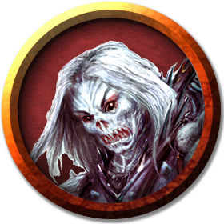

# Wights
The word "wight" meant "person" in days of yore, but the name now refers to evil undead who were once mortals driven by dark desire and great vanity. When death stills such a creature's heart and snuffs its living breath, its spirit cries out to the demon lord Orcus or some vile god of the underworld for a reprieve: undeath in return for eternal war on the living. If a dark power answers the call, the spirit is granted undeath so that it can pursue its own malevolent agenda.

> Jump to: [Wight](Wights.md#wight) | [Greater Wight]() | [Wight King](Wights.md#wight-king)

Wights possess the memories and drives of their formerly living selves. They will heed the call of whatever dark entity transformed them into undead, swearing oaths to appease their new lord while retaining their autonomy. Never tiring, a wight can pursue its goals relentlessly and without distraction.

***Life Eaters.*** Neither dead nor alive, a wight exists in a transitional state between one world and the next. The bright spark it possessed in life is gone, and in its place is a yearning to consume that spark in all living things. When a wight attacks, this life essence glows like white-hot embers to its dark eyes, and the wight's cold touch can drain the spark through flesh, clothing, and armor.

***Shadow of the Grave.*** Wights flee from the world by day, away from the light of the sun, which they hate. They retreat to barrow mounds, crypts, and tombs where they dwell. Their lairs are silent, desolate places, surrounded by dead plants, noticeably blackened, and avoided by bird and beast.

Humanoids slain by a wight can rise as zombies under its control. Motivated by hunger for living souls and driven by the same desire for power that awakened them in undeath, some wights serve as shock troops for evil leaders, including wraiths. As soldiers, they are able to plan but seldom do so, relying on their hunger for destruction to overwhelm any creature that stands before them.

***Undead Nature.*** A wight doesn't require air, food, drink, or sleep.

---

## Wight
The individual wight is a formidable undead creature for the unwary, and a staple of undead armies, typically leading squads of skeletons and/or zombies.

### Environment
Arctic, Coastal, Desert, Forest, Grassland, Hill, Mountain, Swamp, Underdark, Underwater, Urban

### Token

>### Wight
>*Medium undead, neutral evil*
>___
>- **Armor Class** 14 (studded leather)
>- **Hit Points** 45 (6d8 + 18)
>- **Speed** 30 ft.
>___
>|**STR**|**DEX**|**CON**|**INT**|**WIS**|**CHA**|
>|:---:|:---:|:---:|:---:|:---:|:---:|
>|15 (+2)|14 (+2)|16 (+3)|10 (+0)|13 (+1)|15 (+2)|
>
>___
>- **Proficiency Bonus** +2
>- **Saving Throws** 
>- **Damage Vulnerabilities** 
>- **Damage Resistances** necrotic; bludgeoning,piercing,and slashing from nonmagical attacks that aren't silvered
>- **Damage Immunities** poison
>- **Condition Immunities** exhaustion,poisoned
>- **Skills** Perception +3,Stealth +4
>- **Senses** darkvision 60 ft.,passive Perception 13
>- **Languages** the languages it knew in life
>- **Challenge** 3
>___
>***Sunlight Sensitivity.*** While in sunlight, the wight has disadvantage on attack rolls, as well as on Wisdom (Perception) checks that rely on sight.
>
>#### Actions
>***Multiattack.*** The wight makes two longsword attacks or two longbow attacks. It can use its Life Drain in place of one longsword attack.
>
>***Life Drain.*** Melee Weapon Attack: +4 to hit, reach 5 ft., one creature. Hit: 5 (1d6 + 2) necrotic damage. The target must succeed on a DC 13 Constitution saving throw or its hit point maximum is reduced by an amount equal to the damage taken. This reduction lasts until the target finishes a long rest. The target dies if this effect reduces its hit point maximum to 0.
>
>A humanoid slain by this attack rises 24 hours later as a zombie under the wight's control, unless the humanoid is restored to life or its body is destroyed. The wight can have no more than twelve zombies under its control at one time.
>
>***Longsword.*** Melee Weapon Attack: +4 to hit, reach 5 ft., one target. Hit: 6 (1d8 + 2) slashing damage, or 7 (1d10 + 2) slashing damage if used with two hands.
>
>***Longbow.*** Ranged Weapon Attack: +4 to hit, range 150/600 ft., one target. Hit: 6 (1d8 + 2) piercing damage.
>

---

## Greater Wight
The greater wight ....

### Environment
Arctic, Coastal, Desert, Forest, Grassland, Hill, Mountain, Swamp, Underdark, Underwater, Urban

### Token

>### Greater Wight
>*Medium undead, neutral evil*
>___
>- **Armor Class** 15 (studded leather)
>- **Hit Points** 85 (10d8 + 40)
>- **Speed** 30 ft.
>___
>|**STR**|**DEX**|**CON**|**INT**|**WIS**|**CHA**|
>|:---:|:---:|:---:|:---:|:---:|:---:|
>|17 (+3)|16 (+3)|18 (+4)|12 (+1)|15 (+2)|17 (+3)|
>
>___
>- **Proficiency Bonus** +3
>- **Saving Throws** 
>- **Damage Vulnerabilities** 
>- **Damage Resistances** necrotic; bludgeoning,piercing,and slashing from nonmagical attacks that aren't silvered
>- **Damage Immunities** poison
>- **Condition Immunities** exhaustion,poisoned
>- **Skills** Athletics +6, Insight +5, Perception +5, Stealth +6
>- **Senses** darkvision 60 ft.,passive Perception 15
>- **Languages** the languages it knew in life
>- **Challenge** 5
>___
>***Brave.*** The wight has advantage on saving throws against being frightened.
>
>***Brute.*** A melee weapon deals one extra die of its damage when the wight hits with it (included in the attack).
>
>***Keen Sight.*** The wight has advantage on Wisdom (Perception) checks that rely on sight.
>
>***Sunlight Sensitivity.*** While in sunlight, the wight has disadvantage on attack rolls, as well as on Wisdom (Perception) checks that rely on sight.
>
>#### Actions
>***Multiattack.*** The wight makes three longsword attacks or three longbow attacks. It can use its Life Drain in place of one longsword attack.
>
>***Leadership (Recharges after a Short or Long Rest).*** For 1 minute, the wight can utter a special command or warning whenever a nonhostile creature that it can see within 30 feet of it makes an attack roll or a saving throw. The creature can add a d4 to its roll provided it can hear and understand the wight. A creature can benefit from only one Leadership die at a time. The effect ends if the wight is incapacitated.
>
>***Life Drain.*** Melee Weapon Attack: +6 to hit, reach 5 ft., one target. Hit: 10 (2d6 + 3) necrotic damage. The target must succeed on a DC 15 Constitution saving throw or its hit point maximum is reduced by an amount equal to the damage taken. This reduction lasts until the target finishes a long rest. The target dies if this effect reduces its hit point maximum to 0.
>
>A humanoid slain by this attack rises 24 hours later as a zombie under the wight's control, unless the humanoid is restored to life or its body is destroyed. The wight can have no more than twelve zombies under its control at one time.
>
>***Longsword.*** Melee Weapon Attack: +6 to hit, reach 5 ft., one target. Hit: 7 (1d8 + 3) slashing damage, or 8 (1d10 + 3) slashing damage if used with two hands.
>
>***Longbow.*** Ranged Weapon Attack: +6 to hit, range 150/600 ft., one target. Hit: 7 (1d8 + 3) piercing damage.
>
>#### Reactions
>***Parry.*** The wight adds 3 to its AC against one melee attack that would hit it. To do so, the wight must see the attacker and be wielding a melee weapon.
>

---

## Wight King
Wight kings, also known as skeleton lords are incredibly powerful undead warriors, almost as hard to destroy as vampires. Suffused with dark magic, a wight king's weapons shimmer with baleful energy. The merest touch of their spear tip or blade can drain the life from their foes, or slice through flesh and bone with an ease that is frightening to behold. Clad in ancient armour, their flesh all but withered away, there is little for an adversary to slash or stab. Even to stand before one of these skeletal warriors of antiquity takes a great effort of will. For these reasons, a vampire, a lich or a death knight will often charge a wight king with carrying forth the undead general's personal banner. Such a duty is often integral to the army's stability, and these indomitable undead warriors are able to hold aloft the army standard whilst tirelessly striking down one foe after another.

Over the millennnia, many a barrow of an ancient warrior-king has been violated by dark spirits or necromantic magic. The corpses of these once-mighty warriors are given unlife and part of their souls ripped back from eternity to provide an echo of their former minds. The only way to undo this foul sacrilege is to destroy the animated form and release the soul fragment back to eternity. Until this is accomplished, the wight king walks the earth as a powerful and destructive undead warrior.

Wight kings possess the memories and drives of their formerly living selves but polluted to evil and twisted by anguished jealousy against all who still live and breathe. Victims drained of life by the touch of a wight king rise again as normal wights under the wight king's command. Any zombies created by these wights come under the control of the wight king. In this way a wight king can gather himself a considerable army of undead.

### Environment
Arctic, Coastal, Desert, Forest, Grassland, Hill, Mountain, Swamp, Underdark, Underwater, Urban

### Token

>### Wight King
>*Medium undead, neutral evil*
>___
>- **Armor Class** 18 (breastplate (16), shield (+2))
>- **Hit Points** 127 (15d8 + 60)
>- **Speed** 30 ft.
>___
>|**STR**|**DEX**|**CON**|**INT**|**WIS**|**CHA**|
>|:---:|:---:|:---:|:---:|:---:|:---:|
>|18 (+4)|15 (+2)|18 (+4)|13 (+1)|13 (+1)|16 (+3)|
>
>___
>- **Proficiency Bonus** +4
>- **Saving Throws** Str +8,Wis +5
>- **Damage Vulnerabilities** 
>- **Damage Resistances** necrotic; bludgeoning,piercing,and slashing from nonmagical attacks
>- **Damage Immunities** poison
>- **Condition Immunities** charmed,exhaustion,frightened,poisoned
>- **Skills** Athletics +8,Intimidation +7,Perception +5,Stealth +5
>- **Senses** darkvision 60 ft.,passive Perception 15
>- **Languages** the languages it knew in life
>- **Challenge** 9
>___
>***Brute.*** A melee weapon deals one extra die of its damage when the wight hits with it (included in the attack).
>
>***Killing Blow (1/Day).*** When the wight hits with a melee attack, it can choose to double the damage dealt.
>
>***Marshal Undead.*** Unless the wight is incapacitated, it and undead creatures of its choice within 60 feet of it have advantage on saving throws against features that turn undead.
>
>***Sunlight Sensitivity.*** While in sunlight, the wight has disadvantage on attack rolls, as well as on Wisdom (Perception) checks that rely on sight.
>
>***Unusual Nature.*** The wight doesn't require air, food, drink, or sleep.
>
>#### Actions
>***Multiattack.*** The wight makes three melee attacks (two longsword attacks and uses Life Drain), or it makes two longbow attacks.
>
>***Longsword.*** Melee Weapon Attack: +8 to hit, reach 5 ft., one target. Hit: 13 (2d8 + 4) slashing damage, or 15 (2d10 + 4) slashing damage if used with two hands plus 7 (2d6) necrotic damage and the target must succeed on a DC 15 Wisdom saving throw or be frightened until the end of its next turn.
>
>***Longbow.*** Ranged Weapon Attack: +6 to hit, range 150/600 ft., one target. Hit: 6 (1d8  + 4) piercing damage.
>
>***Life Drain.*** Melee Weapon Attack: +8 to hit, reach 5 ft., one creature. Hit: 11 (2d6 + 4) necrotic damage. The target must succeed on a DC 15 Constitution saving throw or its hit point maximum is reduced by an amount equal to the damage taken. This reduction lasts until the target finishes a long rest. The target dies if this effect reduces its hit point maximum to 0.
>
>***Leadership (Recharges after a Short or Long Rest).*** For 1 minute, the wight can utter a special command or warning whenever a nonhostile creature that it can see within 30 feet of it makes an attack roll or a saving throw. The creature can add a d4 to its roll provided it can hear and understand the wight. A creature can benefit from only one Leadership die at a time. This effect ends if the wight is incapacitated.
>
>#### Reactions
>***Parry.*** The wight adds 4 to its AC against one melee attack that would hit it. To do so, the wight must see the attacker and be wielding a melee weapon.
>
