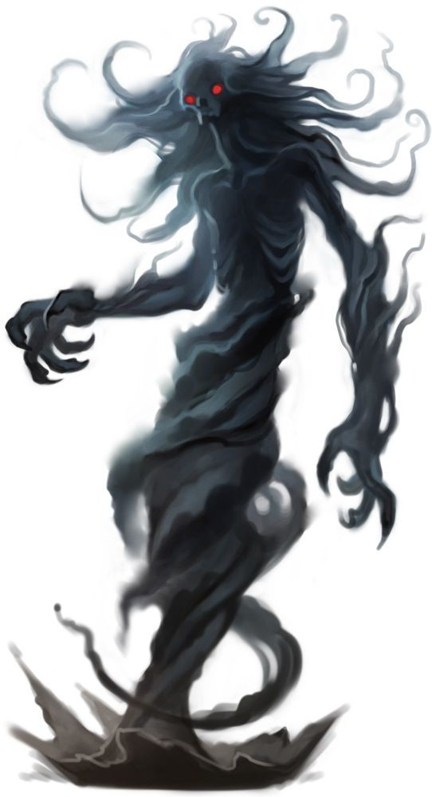

# Wraiths
A wraith is malice incarnate, concentrated into an incorporeal form that seeks to quench all life. The creature is suffused with negative energy, and its mere passage through the world leaves nearby plants blackened and withered. Animals flee from its presence. Even small fires can be extinguished by the sucking oblivion of the wraith's horrifying existence.

> Jump to: [Wraith](Wraiths.md#wraith) | [Dread Wraith]() | [Demizen Wraith](Wraiths.md#demizen-wraith) | [Sword Wraith Warrior](Wraiths.md#sword-wraith-warrior) | [Sword Wraith Commander](Wraiths.md#sword-wraith-commander) | [Void Wraith](Wraiths.md#void-wraith)

***Vile Oblivion.*** When a mortal humanoid lives a debased life or enters into a fiendish pact, it consigns its soul to eternal damnation in the Lower Planes. However, sometimes the soul becomes so suffused with negative energy that it collapses in on itself and ceases to exist the instant before it can shuffle off to some horrible afterlife. When this occurs, the spirit becomes a soulless wraith — a malevolent void trapped on the plane where it died. Almost nothing of the wraith's former existence is preserved; in this new form, it exists only to annihilate other life.

***Bereft of Body.*** A wraith can move through solid creatures and objects as easily as a mortal creature moves through fog.

A wraith might retain a few memories of its mortal life as shadowy echoes. However, even the strongest events and emotions become little more than faint impressions, fleeting as half-remembered dreams. A wraith might pause to stare at something that fascinated it in life, or it might curb its wrath in acknowledgment of a past friendship. Such moments come rarely, however, because most wraiths despise what they were as a reminder of what they have become.

***Undead Commanders.*** A wraith can make an undead servant from the spirit of a humanoid creature that has recently suffered a violent death. Such a fragment of woe becomes a specter, spiteful of all that lives.

Wraiths sometimes rule the legions of the dead, plotting the doom of living creatures. When they emerge from their tombs to do battle, life and hope shrivel before them. Even if a wraith's armies are forced to retreat, the lands its forces occupied are so blasted and withered that those who live there often starve and die.

***Undead Nature.*** A wraith doesn't require air, food, drink, or sleep.

---

## Wraith

The individual wraith is a frightening apparition, to be feared if faced without proper preparation.

### Environment
Arctic, Coastal, Desert, Forest, Grassland, Hill, Mountain, Swamp, Underdark, Underwater, Urban

### Token

>### Wraith
>*Medium undead, Neutral Evil*
>___
>- **Armor Class** 13
>- **Hit Points** 67 (9d8 + 27)
>- **Speed** 0 ft., fly 60 ft. (hover)
>___
>|**STR**|**DEX**|**CON**|**INT**|**WIS**|**CHA**|
>|:---:|:---:|:---:|:---:|:---:|:---:|
>|6 (-2)|16 (+3)|16 (+3)|12 (+1)|14 (+2)|15 (+2)|
>
>___
>- **Proficiency Bonus** +3
>- **Saving Throws** 
>- **Damage Vulnerabilities** 
>- **Damage Resistances** Acid,Cold,Fire,Lightning,Thunder; Bludgeoning,Piercing,and Slashing from Nonmagical Attacks that aren't Silvered
>- **Damage Immunities** Necrotic,Poison
>- **Condition Immunities** Charmed,Exhaustion,Grappled,Paralyzed,Petrified,Poisoned,Prone,Restrained
>- **Skills** 
>- **Senses** Darkvision 60 ft.,Passive Perception 12
>- **Languages** The languages it knew in life
>- **Challenge** 5
>___
>***Incorporeal Movement.*** The wraith can move through other creatures and objects as if they were difficult terrain. It takes 5 (1d10) force damage if it ends its turn inside an object.
>
>***Sunlight Sensitivity.*** While in sunlight, the wraith has disadvantage on attack rolls, as well as on Wisdom (Perception) checks that rely on sight.
>
>#### Actions
>***Life Drain.*** Melee Weapon Attack: +6 to hit, reach 5 ft., one creature. Hit: 21 (4d8 + 3) necrotic damage. The target must succeed on a DC 14 Constitution saving throw or its hit point maximum is reduced by an amount equal to the damage taken. This reduction lasts until the target finishes a long rest. The target dies if this effect reduces its hit point maximum to 0.
>
>***Create Specter.*** The wraith targets a humanoid within 10 feet of it that has been dead for no longer than 1 minute and died violently. The target's spirit rises as a [specter](Specter.md) in the space of its corpse or in the nearest unoccupied space. The [specter](Specter.md) is under the wraith's control. The wraith can have no more than seven [specter](Specter.md) under its control at one time.
>

---

## Dread Wraith
A dread wraith is the dead soul of a once-mighty but particularly wicked ruler. After descending into the Lower Planes, it is saturated with negative energy by a fiend lord and sent back to the Material Plane. There it exists in a quasi-corporeal state with shadowy substance only sufficient to manipulate objects. Most wear dark robes over a breastplate and carry a rapier ensorcelled by their pollution until compelled to let them fall to the ground to escape physical restraint.

Dread wraiths are unleashed to continue their bloody conquests in the name of a fiend lord or an incredibly powerful necromancer. Shadows of their former memories and personality remain to them, though driven now by a restless malevolence.

***Lord of the Dead.*** A dread wraith can create and attract armies of undead. Any undead within 1 mile can sense the presence of the dread wraith, and undead of CR 3 or lower are drawn toward the dread wraith and compelled to obey it.

### Environment
Arctic, Coastal, Desert, Forest, Grassland, Hill, Mountain, Swamp, Underdark, Underwater, Urban

### Token

>### Dread Wraith
>*Medium undead, neutral evil*
>___
>- **Armor Class** 16 (breastplate)
>- **Hit Points** 112 (15d8 + 45 )
>- **Speed** 30 ft., fly 60 ft. (hover)
>___
>|**STR**|**DEX**|**CON**|**INT**|**WIS**|**CHA**|
>|:---:|:---:|:---:|:---:|:---:|:---:|
>|8 (-1)|17 (+3)|17 (+3)|14 (+2)|15 (+2)|16 (+3)|
>
>___
>- **Proficiency Bonus** +5
>- **Saving Throws** 
>- **Damage Vulnerabilities** 
>- **Damage Resistances** acid,cold,fire,lightning,thunder; bludgeoning,piercing,and slashing from nonmagical attacks that aren't silvered
>- **Damage Immunities** necrotic,poison
>- **Condition Immunities** charmed,exhaustion,paralyzed,petrified,poisoned,prone
>- **Skills** 
>- **Senses** darkvision 60 ft.,truesight 20 ft.,passive Perception 12
>- **Languages** the languages it knew in life
>- **Challenge** 8
>___
>***Unusual Nature.*** The wraith doesn't require air, food, drink, or sleep.
>
>***Incorporeal Movement.*** The wraith can move through other creatures and objects as if they were difficult terrain when it is not carrying or wearing any items. The wraith cannot end its turn instead a creature or object.
>
>***Incorporeal Substance.*** The wraith can immediately ignore effects that cause it to be grappled or restrained, but any items carried or worn are dropped.
>
>***Sunlight Sensitivity.*** While in sunlight, the wraith has disadvantage on attack rolls, as well as on Wisdom (Perception) checks that rely on sight.
>
>#### Actions
>***Multiattack.*** The wraith uses Life Drain and makes one rapier attack if it is carrying the weapon.
>
>***Life Drain.*** Melee Weapon Attack: +7 to hit, reach 5 ft., one target. Hit: 21 (4d8 + 3) necrotic damage. The target must succeed on a DC 15 Constitution saving throw or its hit point maximum is reduced by an amount equal to the damage taken. This reduction lasts until the target finishes a long rest. The target dies if this effect reduces its hit point maximum to 0.
>
>***Rapier.*** Melee (Magical) Weapon Attack: +7 to hit, reach 5 ft., one target. Hit: 7 (1d8  + 3) piercing damage  plus 7 (2d6) poison damage. The tar get must succeed on a DC 15 Constitution saving throw or be poisoned for 1 hour.
>
>#### Legendary Actions
>The dread wraith can take 3 legendary actions, choosing from the options below. Only one legendary action option can be used at a time and only at the end of another creature's turn. The dread wraith regains spent legendary actions at the start of its turn.
>
>***Breath of Death.*** One living being within 10 feet of the dread wraith must make a DC 15 Constitution saving throw or take 9 (2d8) necrotic damage and have its hit point maximum reduced (as Life Drain). The dread wraith regains a number of hit points equal to the damage caused. A creature cannot be targeted by this effect more than once per round.
>
>***Create Undead.*** A humanoid within 15 feet of the dread wraith that has been dead for no longer than 1 hour immediately rises as an undead creature under the wraith's control. If the target was killed by Life Drain or Breath of Death, it rises as a normal wraith. If killed by any other manner, it rises as a wight.
>
>***Cause Fear (Costs 2 Actions).***  Every living being within 2 0 feet of the dread wraith must make a DC 15 Wisdom saving throw or become frightened for 1 minute . While frightened, creatures must take the Dash action and move away from the dread wraith by the safest available route, unless there is nowhere to move. A creature can repeat the saving throw at the end of each of its t urns, ending the effect on itself on a success. If a creature's saving throw succeeds in ending the effect, the creature is immune to the dread wraith's Cause Fear for the next 24 hours.
>

---

## Demizen Wraith
Demizen wraiths, which look precisely like their non-demizen cousins, are powerful undead that take on the traits and actions of others to bolster their abilities. They feed off the necrotic energies of other undead around them, and in doing so gain the abilities of those upon which they feed, making them truly frightening creatures to face--sometimes worse than even mummies, liches, or vampires.

The creation of a demizen wraith is a deep mystery to mortals, though some necromancers have bragged of the knowledge.

### Environment
Arctic, Coastal, Desert, Forest, Grassland, Hill, Mountain, Swamp, Underdark, Underwater, Urban

### Token
(FIXME)

>### Demizen Wraith
>*Medium undead, neutral evil*
>___
>- **Armor Class** 14
>- **Hit Points** 110 (13d8 + 52)
>- **Speed** 0 ft., fly 60 ft. (hover)
>___
>|**STR**|**DEX**|**CON**|**INT**|**WIS**|**CHA**|
>|:---:|:---:|:---:|:---:|:---:|:---:|
>|9 (-1)|19 (+4)|19 (+4)|15 (+2)|17 (+3)|20 (+5)|
>___
>- **Proficiency Bonus** +4
>- **Saving Throws** 
>- **Damage Vulnerabilities** 
>- **Damage Resistances** acid, cold, fire, lightning, thunder; bludgeoning, piercing, and slashing from nonmagical attacks that aren't silvered
>- **Damage Immunities** necrotic, poison
>- **Condition Immunities** charmed,exhaustion,grappled,paralyzed,petrified,poisoned,prone,restrained
>- **Skills** 
>- **Senses** darkvision 60 ft., passive Perception 13
>- **Languages** the languages it knew in life
>- **Challenge** 10
>___
>***Detect Life.*** The wraith can magically sense the presence of living creatures up to 5 miles away that aren't undead or constructs. The wraith knows the general direction they're in but not their exact locations.
>
>***Ethereal Sight.*** The wraith can see 60 feet into the Ethereal Plane when it is on the Material Plane, and vice versa.
>
>***Incorporeal Movement.*** The wraith can move through other creatures and objects as if they were difficult terrain. It takes 5 (1d10) force damage if it ends its turn inside an object.
>
>***Sunlight Sensitivity.*** While in sunlight, the wraith has disadvantage on attack rolls, as well as on Wisdom (Perception) checks that rely on sight.
>
>***Undead Fortitude.*** If damage reduces the wraith to 0 hit points, it must make a Constitution saving throw with a DC of 5 + the damage taken, unless the damage is radiant damage or from a critical hit. On a success, the wraith drops to 1 hit point instead.
>
>#### Actions
>***Multiattack.*** The wraith can make two Life Drain or two Strength Drain attacks or one of each.
>
>***Life Drain.*** Melee Weapon Attack: +8 to hit, reach 5 ft., one creature. Hit: 22 (4d8 + 4) necrotic damage. The target must succeed on a DC 16 Constitution saving throw or its hit point maximum is reduced by an amount equal to the damage taken. This reduction lasts until the target finishes a long rest. The target dies if this effect reduces its hit point maximum to 0.
>
>***Strength Drain.*** Melee Weapon Attack: +8 to hit, reach 5 ft., one creature. Hit: 11 (2d6 + 4) necrotic damage, and the target's Strength score is reduced by 1d4. The target dies if this reduces its Strength to 0. Otherwise, the reduction lasts until the target finishes a short or long rest.
>
>***Possession (Recharge 6).*** One humanoid that the wraith can see within 5 feet of it must succeed on a DC 16 Charisma saving throw or be possessed by the wraith; the wraith then disappears, and the target is incapacitated and loses control of its body. The wraith now controls the body but doesn't deprive the target of awareness. The wraith can't be targeted by any attack, spell, or other effect, except ones that turn undead, and it retains its alignment, Intelligence, Wisdom, Charisma, and immunity to being charmed. It otherwise uses the possessed target's statistics, but doesn't gain access to the target's knowledge, class features, or proficiencies.
>The possession lasts until the body drops to 0 hit points, the wraith ends it as a bonus action, or the wraith is turned or forced out by an effect like the dispel evil and good spell. When the possession ends, the wraith reappears in an unoccupied space within 5 feet of the body. The target is immune to this wraith's Possession for 24 hours after succeeding on the saving throw or after the possession ends.
>
>***Create Specter.*** The wraith targets a humanoid within 10 feet of it that has been dead for no longer than 1 minute and died violently. The target's spirit rises as a [Specter](./Specter.md) in the space of its corpse or in the nearest unoccupied space. The specter is under the wraith's control. The wraith can have no more than seven specters under its control at one time.
>
>***Wail (1/Day).*** The wraith releases a mournful wail, provided that the wraith isn't in sunlight. This wail has no effect on constructs or undead. All other creatures within 30 feet of the wraith that can hear the wraith must make a DC 16 Constitution saving throw. On failure, a creature drops to 0 hit points. On a success, a creature takes 10 (3d6) psychic damage.
>
>***Replicate.*** As an action, the wraith can take on 1 trait or 1 action from an undead creature with 0 hit points within 5 feet of it. The wraith can have a maximum of Charisma modifier traits and Charisma modifier actions replicated in this way. All DCs gained from traits or actions are Charisma based. Innate Spellcasting and Spellcasting can not be replicated.
>
>#### Bonus Actions
>***Shadow Stealth.*** While in dim light or darkness, the wraith takes the Hide action.
>

---

## Sword Wraith Warrior
Sword wraith warriors are most often found on ancient battlefields where soldiers were hemmed in and slaughtered without quarter.

### Environment
Arctic, Coastal, Desert, Forest, Grassland, Hill, Mountain, Swamp, Underdark, Underwater, Urban

### Token
(FIXME)

>### Sword Wraith Warrior
>*Medium undead, Typically Lawful Evil*
>___
>- **Armor Class** 16 (chain shirt, shield)
>- **Hit Points** 45 (6d8 + 18)
>- **Speed** 30 ft.
>___
>|**STR**|**DEX**|**CON**|**INT**|**WIS**|**CHA**|
>|:---:|:---:|:---:|:---:|:---:|:---:|
>|18 (+4)|12 (+1)|17 (+3)|6 (-2)|9 (-1)|10 (+0)|
>
>___
>- **Proficiency Bonus** +2
>- **Saving Throws** 
>- **Damage Vulnerabilities** 
>- **Damage Resistances** necrotic; bludgeoning,piercing,and slashing from nonmagical attacks
>- **Damage Immunities** poison
>- **Condition Immunities** exhaustion,frightened,poisoned,unconscious
>- **Skills** 
>- **Senses** darkvision 60 ft.,passive Perception 9
>- **Languages** the languages it knew in life
>- **Challenge** 3
>___
>***Incorporeal Movement.*** The wraith can move through other creatures and objects as if they were difficult terrain. It takes 5 (1d10) force damage if it ends its turn inside an object.
>
>***Sunlight Sensitivity.*** While in sunlight, the wraith has disadvantage on attack rolls, as well as on Wisdom (Perception) checks that rely on sight.
>
>#### Actions
>***Battleaxe.*** Melee Weapon Attack: +6 to hit, reach 5 ft., one target. Hit: 8 (1d8 + 4) slashing damage, or 9 (1d10 + 4) slashing damage if used with two hands.
>
>***Longbow.*** Ranged Weapon Attack: +3 to hit, range 150/600 ft., one target. Hit: 5 (1d8 + 1) piercing damage.
>
>***Life Drain.*** Melee Weapon Attack: +6 to hit, reach 5 ft., one creature. Hit: 21 (4d8 + 3) necrotic damage. The target must succeed on a DC 14 Constitution saving throw or its hit point maximum is reduced by an amount equal to the damage taken. This reduction lasts until the target finishes a long rest. The target dies if this effect reduces its hit point maximum to 0.
>
>***Create Specter.*** The wraith targets a humanoid within 10 feet of it that has been dead for no longer than 1 minute and died violently. The target's spirit rises as a [specter](Specter.md) in the space of its corpse or in the nearest unoccupied space. The [specter](Specter.md) is under the wraith's control. The wraith can have no more than seven [specter](Specter.md) under its control at one time.
>
>#### Bonus Actions
>***Martial Fury.*** The warrior makes one Battleaxe or Longbow attack, and attack rolls against it have advantage until the start of its next turn.
>

---

## Sword Wraith Commander
Sword wraith commanders haunt battlefields, attacking anyone who questions their valor but looking kindly on those who sing their praises.

### Environment
Arctic, Coastal, Desert, Forest, Grassland, Hill, Mountain, Swamp, Underdark, Underwater, Urban

### Token
(FIXME)

>### Sword Wraith Commander
>*Medium undead, Typically Lawful Evil*
>___
>- **Armor Class** 18 (breastplate, shield)
>- **Hit Points** 127 (15d8 + 60)
>- **Speed** 30 ft.
>___
>|**STR**|**DEX**|**CON**|**INT**|**WIS**|**CHA**|
>|:---:|:---:|:---:|:---:|:---:|:---:|
>|18 (+4)|14 (+2)|18 (+4)|11 (+0)|12 (+1)|14 (+2)|
>
>___
>- **Proficiency Bonus** +3
>- **Saving Throws** 
>- **Damage Vulnerabilities** 
>- **Damage Resistances** necrotic; bludgeoning,piercing,and slashing from nonmagical attacks
>- **Damage Immunities** poison
>- **Condition Immunities** exhaustion,frightened,poisoned,unconscious
>- **Skills** Perception +4
>- **Senses** darkvision 60 ft.,passive Perception 14
>- **Languages** the languages it knew in life
>- **Challenge** 8
>___
>***Incorporeal Movement.*** The wraith can move through other creatures and objects as if they were difficult terrain. It takes 5 (1d10) force damage if it ends its turn inside an object.
>
>***Turning Defiance.*** The commander and any other sword wraiths within 30 feet of it have advantage on saving throws against effects that turn Undead.
>
>#### Actions
>***Multiattack.*** The commander makes two Longsword or Longbow attacks.
>
>***Longsword.*** Melee Weapon Attack: +7 to hit, reach 5 ft., one target. Hit: 8 (1d8 + 4) slashing damage, or 9 (1d10 + 4) slashing damage if used with two hands.
>
>***Longbow.*** Ranged Weapon Attack: +5 to hit, range 150/600 ft., one target. Hit: 6 (1d8 + 2) piercing damage.
>
>***Call to Honor (1/Day).*** If the commander has taken damage during this combat, it gives itself advantage on attack rolls until the end of its next turn, and 1d4 + 1 sword wraith warriors appear in unoccupied spaces within 30 feet of it. The warriors last until they drop to 0 hit points, and they take their turns immediately after the commander's turn on the same initiative count.
>
>***Life Drain.*** Melee Weapon Attack: +7 to hit, reach 5 ft., one creature. Hit: 22 (4d8 + 4) necrotic damage. The target must succeed on a DC 16 Constitution saving throw or its hit point maximum is reduced by an amount equal to the damage taken. This reduction lasts until the target finishes a long rest. The target dies if this effect reduces its hit point maximum to 0.
>
>***Create Specter.*** The wraith targets a humanoid within 10 feet of it that has been dead for no longer than 1 minute and died violently. The target's spirit rises as a [Sword Wraith Warrior](Wraiths.md#sword-wraith-warrior) in the space of its corpse or in the nearest unoccupied space. The [Sword Wraith Warrior](Wraiths.md#sword-wraith-warrior) is under the wraith's control.
>
>#### Bonus Actions
>***Martial Fury.*** The commander makes one Longsword or Longbow attack, which deals an extra 9 (2d8) necrotic damage on a hit, and attack rolls against it have advantage until the start of its next turn.
>

---

## Void Wraith
The void wraiths are the embodiment of the unfeeling hunger that the Void can have, concentrated into an incorporeal form that seeks to take all souls to the Void. They are suffused with its energy, and its mere passage through any world leaves nearby plants blackened and withered. Animals flee from its presence. Even small fires can be extinguished by the sucking oblivion of its horrifying and unorthodox existence.

***Bereft of Body.*** A void wraith can move through solid creatures and objects as easily as if they were fog.

***Call of the Abyss.*** The soul of any creature slain by a void wraith is instantly transported to the Void, and in 24 hours they will become a void wraith themselves.

### Environment
(FIXME)

### Token
(FIXME)

>### Void Wraith
>*Medium undead, neutral evil*
>___
>- **Armor Class** 20 (natural armor)
>- **Hit Points** 127 (15d8 + 60)
>- **Speed** 0 ft., fly 70 ft. (hover)
>___
>|**STR**|**DEX**|**CON**|**INT**|**WIS**|**CHA**|
>|:---:|:---:|:---:|:---:|:---:|:---:|
>|15 (+2)|19 (+4)|18 (+4)|6 (-2)|9 (-1)|20 (+5)|
>
>___
>- **Proficiency Bonus** +5
>- **Saving Throws** Cha +10
>- **Damage Vulnerabilities** radiant
>- **Damage Resistances** cold, fire; bludgeoning, piercing and slashing from nonmagical attacks
>- **Damage Immunities** acid, necrotic, psychic
>- **Condition Immunities** charmed, exhaustion, frightened, grappled, paralyzed, petrified, poisoned, prone, restrained
>- **Skills** Intimidation +10, Perception +4
>- **Senses** blindsight 30 ft., darkvision 60 ft., passive Perception 14
>- **Languages** --
>- **Challenge** 15
>___
>***Twisted Visage.*** When a creature sees a void wraith for the first time in its life, it must succeed in a DC 13 Constitution saving throw or become frightened for 5 minutes.
>
>***Incorporeal Movement.*** The void wraith can move through other creatures and objects as if they were difficult terrain. It takes 2 (1d4) force damage if it ends its turn inside an object, any creature the void wraith moves through in this way must make a DC 18 Wisdom saving throw, taking 14 (4d6) necrotic damage on a failed save, or half as much damage on a successful one.
>
>***Innate Spellcasting.*** The void wraith's innate spellcasting ability is Charisma (spell save DC 18, +10 to hit with spell attacks). The void wraith can innately cast the following spells, requiring no material components:
>
>* *At will:* eldritch blast, spare the dying, thaumaturgy, vicious mockery
>* *3/day each:* bane, chromatic orb, heat metal, spiritual weapon, thunderwave
>
>***Turn Resistance.*** The void wraith has advantage on saving throws against any effect that turns undead.
>
>#### Actions
>***Multiattack.*** The void wraith makes three melee attacks or casts two spells and a cantrip.
>
>***Paralyzing Touch.*** Melee Spell Attack: +10 to hit, reach 5 ft., one creature. Hit: 25 (6d6 + 4) necrotic damage. The target must succeed on a DC 18 Constitution saving throw or be paralyzed for 1 minute. The target can repeat the saving throw at the beginning of each of its turns, ending the effect on itself on a success.
>
>#### Legendary Actions
>The void wraith can take 3 legendary actions, choosing from the options below. Only one legendary action option can be used at a time and only at the end of another creature's turn. The void wraith regains spent legendary actions at the start of its turn.
>
>***Cantrip.*** The void wraith casts one spell it can cast at will.
>
>***True Soul Claim (Costs 2 Actions).*** The void wraith reaches out to the soul of one creature whose Hit Points have dropped to 0 within 10 feet of it. On their third failure, their soul will consume their body as the power of the Void enters them, turning them into a void wraith that will fight by its side.
>
>***Swarming Technique (Costs 2 Actions).*** The void wraith lets out an ethereal call that can be heard up to 300 feet away. Other void wraiths who hear it will respond, and other creatures must succeed on a Constitution saving throw or become stunned for 1 minute.
