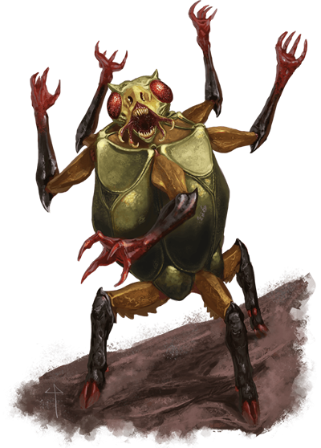
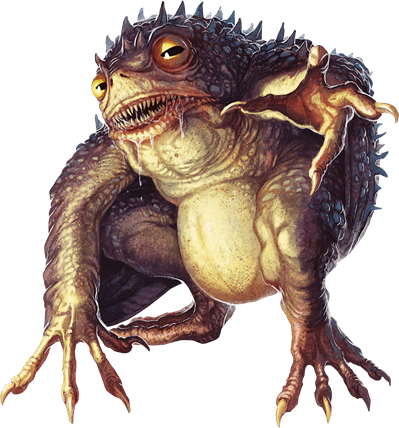

# Yugoloths
Yugoloths are fickle fiends that inhabit the planes of Acheron, Gehenna, Hades, and Carceri. They act as mercenaries and are notorious for their shifting loyalties. They are the embodiments of avarice. Before serving under anyone's banner, a yugoloth asks the only question on its mind: What's in it for me?

> Jump to: [Arcanaloth](#arcanaloth) | [Canoloth](#canoloth) | [Dhergoloth](#dhergoloth) | [Hydroloth](#hydroloth) | [Merrenoloth]() | [Mezzoloth](#mezzoloth) | [Nycaloth](#nycaloth) | [Oinoloth](#oinoloth) | [Ultroloth](#ultroloth) | [Yagnoloth](#yagnoloth)

***Spawn of Gehenna.*** The first yugoloths were created by a sisterhood of night hags on Gehenna. It is widely believed that Asmodeus, Lord of the Nine Hells, commissioned the work, in the hope of creating an army of fiends that were not bound to the Nine Hells. In the course of making this new army, the hags crafted four magic tomes and recorded the true names of every yugoloth they created, save one, the General of Gehenna. These tomes were called the Books of Keeping. Since knowing a fiend's true name grants power over it, the hags used the books to ensure the yugoloths' loyalty. They also used the books to capture the true names of other fiends that crossed them. It is rumored that the Books of Keeping contain the true names of a few demon lords and archdevils as well.

Petty jealousies and endless bickering caused the sisterhood to dissolve, and in the ensuing power grab, the Books of Keeping were lost or stolen. No longer indentured to anyone, the yugoloths gained independence, and they now offer their services to the highest bidder.

***Fiendish Mercenaries.*** Summoned yugoloths demand much for their time and loyalty. Whatever promises a yugoloth makes are quickly broken when a better opportunity presents itself. Unlike demons, yugoloths can be reasoned with, but unlike devils, they are rarely true to their word.

Yugoloths can be found anywhere, but the high cost of maintaining a yugoloth army's loyalty typically exceeds what any warlord on the Material Plane can pay.

Being self-serving creatures, yugoloths quarrel among themselves constantly. A yugoloth army is more organized than a ravening horde of demons, but far less orderly and regimented than a legion of devils. Without a powerful leader to keep them in line, yugoloths fight simply to indulge their violent predilections, and only as long as it benefits them to do so.

***Back to Gehenna.*** When a yugoloth dies, it dissolves into a pool of ichor and reforms at full strength on the Bleak Eternity of Gehenna. Only on its native plane can a yugoloth be destroyed permanently. A yugoloth knows this and acts accordingly. When summoned to other planes, a yugoloth fights without concern for its own well-being. On Gehenna, it is more apt to retreat or plead for mercy if its demise seems imminent.

When a yugoloth is permanently destroyed, its name vanishes from every Book of Keeping. If a yugoloth is re-created by way of an unholy ritual requiring the expenditure of souls, its name reappears in the books.

***The Books of Keeping.*** When all four copies of the Books of Keeping disappeared, Asmodeus and the night hags lost control of their yugoloth creations. Each Book of Keeping still exists, drifting from plane to plane, where the brave and the foolish occasionally stumble upon them. A yugoloth summoned using its true name, as inscribed in the Books of Keeping, is forced to serve its summoner obediently. The yugoloth hates being controlled in this manner and isn't shy about making its displeasure known. Like a petulant child, it will follow its instructions to the letter while looking for opportunities to misinterpret them.

***The General of Gehenna.*** Somewhere in the brimstone wastes of Gehenna, there roams an ultroloth so strong that none contests his power: the General of Gehenna. Many yugoloths search for this great general in the hope of serving with him. They believe that service with the General of Gehenna grants power and prestige among lower planar entities.

Whatever the case, no fiend finds the General unless the General desires it. His personal name is unknown, and even the Books of Keeping contain no mention of this powerful, thoroughly evil entity.

---

## Arcanaloth
Arcanaloths are sly, jackal-headed beings with humanoid bodies, but they can employ magic to take any humanoid form. They do so to gain the trust of creatures with whom they negotiate, replacing jackal snarls with winsome smiles.

Regardless of its chosen form, an arcanaloth appears well groomed, clothing itself in fine robes. Highly intelligent spellcasters who hunger for knowledge and power, arcanaloths command units of lesser yugoloths and maintain the contracts, records, and accounts of their kind.

Arcanaloths speak and write all languages, making them cunning diplomats and negotiators. An arcanaloth properly paid can broker treaties or alliances with subtlety and finesse, just as an arcanaloth who changes sides can easily turn the best-laid peace talks into all-out war. What the fiend demands in exchange for its time and talent is information, as well as powerful magic items that it can trade for even more information.

>### Arcanaloth
>*Medium fiend (yugoloth), neutral evil*
>___
>- **Armor Class** 17 (natural armor)
>- **Hit Points** 104 (16d8 + 32)
>- **Speed** 30 ft., fly 30 ft.
>___
>|**STR**|**DEX**|**CON**|**INT**|**WIS**|**CHA**|
>|:---:|:---:|:---:|:---:|:---:|:---:|
>|17 (+3)|12 (+1)|14 (+2)|20 (+5)|16 (+3)|17 (+3)|
>
>___
>- **Proficiency Bonus** +4
>- **Saving Throws** Dex +5,Int +9,Wis +7,Cha +7
>- **Damage Vulnerabilities** 
>- **Damage Resistances** cold,fire,lightning; bludgeoning,piercing,and slashing from nonmagical attacks
>- **Damage Immunities** acid,poison
>- **Condition Immunities** charmed,poisoned
>- **Skills** Arcana +13,Deception +9,Insight +9,Perception +7
>- **Senses** truesight 120 ft.,passive Perception 17
>- **Languages** all,telepathy 120 ft.
>- **Challenge** 12
>___
>***Innate Spellcasting.*** The arcanaloth's innate spellcasting ability is Charisma (spell save DC 15). The arcanaloth can innately cast the following spells, requiring no material components:
>
>* At will: alter self, darkness, heat metal, invisibility (self only), magic missile
>
>***Magic Resistance.*** The arcanaloth has advantage on saving throws against spells and other magical effects.
>
>***Magic Weapons.*** The arcanaloth's weapon attacks are magical.
>
>***Summon Yugoloth (1/Day).*** The yugoloth chooses what to summon and attempts a magical summoning. An arcanaloth has a 40 percent chance of summoning one arcanaloth. A summoned yugoloth appears in an unoccupied space within 60 feet of its summoner, does as it pleases (unless its summoner is an ultroloth, in which case it acts as an ally of its summoner), and can't summon other yugoloths. The summoned yugoloth remains for 1 minute, until it or its summoner dies, or until its summoner takes a bonus action to dismiss it.
>
>#### Actions
>***Claws.*** Melee Weapon Attack: +7 to hit, reach 5 ft., one target. Hit: 8 (2d4 + 3) slashing damage. The target must make a DC 14 Constitution saving throw, taking 10 (3d6) poison damage on a failed save, or half as much damage on a successful one.
>
>***Teleport.*** The arcanaloth magically teleports, along with any equipment it is wearing or carrying, up to 60 feet to an unoccupied space it can see.
>
>***Spellcasting.*** The arcanaloth is a 16th-level spellcaster. Its spellcasting ability is Intelligence (spell save DC 17, +9 to hit with spell attacks). The arcanaloth has the following wizard spells prepared:
>* Cantrips (at will): fire bolt, mage hand, minor illusion, prestidigitation
>* 1st level (4 slots): detect magic, identify, shield, Tenser's floating disk
>* 2nd level (3 slots): detect thoughts, mirror image, phantasmal force, suggestion
>* 3rd level (3 slots): counterspell, fear, fireball
>* 4th level (3 slots): banishment, dimension door
>* 5th level (2 slots): contact other plane, hold monster
>* 6th level (1 slot): chain lightning
>* 7th level (1 slot): finger of death
>* 8th level (1 slot): mind blank
>

---

## Canoloth
A type of yugoloth, canoloths are fiendish trackers and guardians employed by evil powers. They prefer to enter into contracts to guard valuable treasures and important locations. They always do exactly as asked--never any more, never any less.

With senses sharp enough to pinpoint the locations of nearby invisible creatures, canoloths respond unfailingly to any threat to their charges. Furthermore, they emit a magical distortion field that prevents creatures close to them from teleporting.

Canoloths confront intruders with swift and terrible force, projecting long, spiny tongues to grab their foes and drag them close. What happens next depends on the contract. Unless instructed to kill, a canoloth merely holds on to its prisoner, but if given the order to do so, it tears its prey limb from limb.

>### Canoloth
>*Medium fiend (Yugoloth), Typically Neutral Evil*
>___
>- **Armor Class** 16 (natural armor)
>- **Hit Points** 120 (16d8 + 48)
>- **Speed** 50 ft.
>___
>|**STR**|**DEX**|**CON**|**INT**|**WIS**|**CHA**|
>|:---:|:---:|:---:|:---:|:---:|:---:|
>|18 (+4)|10 (+0)|17 (+3)|5 (-3)|17 (+3)|12 (+1)|
>
>___
>- **Proficiency Bonus** +3
>- **Saving Throws** 
>- **Damage Vulnerabilities** 
>- **Damage Resistances** cold,fire,lightning; bludgeoning,piercing,and slashing from nonmagical attacks
>- **Damage Immunities** acid,poison
>- **Condition Immunities** poisoned
>- **Skills** Investigation +3,Perception +9
>- **Senses** truesight 120 ft.,passive Perception 19,Senses. The canoloth can't be surprised unless it's incapacitated.
>- **Languages** Abyssal,Infernal,telepathy 60 ft.
>- **Challenge** 8
>___
>***Dimensional Lock.*** Other creatures can't teleport to or from a space within 60 feet of the canoloth. Any attempt to do so is wasted.
>
>***Magic Resistance.*** The canoloth has advantage on saving throws against spells and other magical effects.
>
>#### Actions
>***Multiattack.*** The canoloth makes one Bite or Tongue attack and one Claw attack.
>
>***Bite.*** Melee Weapon Attack: +7 to hit, reach 5 ft., one target. Hit: 7 (1d6 + 4) piercing damage plus 18 (4d8) force damage.
>
>***Claw.*** Melee Weapon Attack: +7 to hit, reach 5 ft., one target. Hit: 7 (1d6 + 4) slashing damage plus 9 (2d8) force damage.
>
>***Tongue.*** Melee Weapon Attack: +7 to hit, reach 30 ft., one target. Hit: 10 (1d12 + 4) piercing damage plus 7 (2d6) acid damage. If the target is Medium or smaller, it is grappled (escape DC 15), pulled up to 30 feet toward the canoloth, and restrained until the grapple ends. The canoloth can grapple one target at a time with its tongue.
>

---

## Dhergoloth
A kind of yugoloth, dhergoloths rush into battle like whirlwinds of destruction, lashing out with the five sets of claws that extend from their squat, barrel-shaped bodies. They take contracts to put down uprisings, clear out rabble, and eliminate scouts and skirmishers, and they revel in the butchery they create, their gleeful laughter rising above their victims' screams.

Since dhergoloths are little more than brutes, employers must use caution when instructing them. They can handle simple orders that don't take a lot of time to resolve. When given anything complex to do, however, they either forget what they're told or don't listen in the first place, and then bungle the task that was set for them.

>### Dhergoloth
>*Medium fiend (Yugoloth), Typically Neutral Evil*
>___
>- **Armor Class** 15 (natural armor)
>- **Hit Points** 119 (14d8 +56)
>- **Speed** 30 ft.
>___
>|**STR**|**DEX**|**CON**|**INT**|**WIS**|**CHA**|
>|:---:|:---:|:---:|:---:|:---:|:---:|
>|17 (+3)|10 (+0)|19 (+4)|7 (-2)|10 (+0)|9 (-1)|
>
>___
>- **Proficiency Bonus** +3
>- **Saving Throws** Str +6
>- **Damage Vulnerabilities** 
>- **Damage Resistances** cold,fire,lightning; bludgeoning,piercing,and slashing from nonmagical attacks
>- **Damage Immunities** acid,poison
>- **Condition Immunities** poisoned
>- **Skills** 
>- **Senses** blindsight 60 ft.,darkvision 60 ft.,passive Perception 10
>- **Languages** Abyssal,Infernal,telepathy 60 ft.
>- **Challenge** 7
>___
>***Magic Resistance.*** The dhergoloth has advantage on saving throws against spells and other magical effects.
>
>#### Actions
>***Multiattack.*** The dhergoloth makes two Claw attacks.
>
>***Claw.*** Melee Weapon Attack: +6 to hit, reach 5 ft., one target. Hit: 12 (2d8 + 3) force damage.
>
>***Flailing Claws (Recharge 5�6).*** The dhergoloth moves up to its speed in a straight line and targets each creature within 5 feet of it during its movement. Each target must succeed on a DC 14 Dexterity saving throw or take 22 (3d12 + 3) force damage.
>
>***Spellcasting.*** The dhergoloth casts one of the following spells, requiring no material components and using Charisma as the spellcasting ability (spell save DC 10):
>
>At will: darkness, fear
>
>***Teleport.*** The dhergoloth teleports, along with any equipment it is wearing or carrying, up to 60 feet to an unoccupied space it can see.
>

---

## Hydroloth
Like the thought-stealing waters of the River Styx they inhabit, hydroloths filch the memories of creatures they attack, stealing away thoughts for delivery to whatever master they happen to serve. Hydroloths also savor finding lost things, especially those that have been swallowed up in the deeps.

For amphibious assaults or underwater conflicts, hydroloths have no equal among yugoloths. They sometimes hire themselves out to attack and scuttle ships and raid coastal settlements.

>### Hydroloth
>*Medium fiend (Yugoloth), Typically Neutral Evil*
>___
>- **Armor Class** 15
>- **Hit Points** 135 (18d8 + 54)
>- **Speed** 20 ft., swim 40 ft.
>___
>|**STR**|**DEX**|**CON**|**INT**|**WIS**|**CHA**|
>|:---:|:---:|:---:|:---:|:---:|:---:|
>|12 (+1)|21 (+5)|16 (+3)|19 (+4)|10 (+0)|14 (+2)|
>
>___
>- **Proficiency Bonus** +4
>- **Saving Throws** 
>- **Damage Vulnerabilities** fire
>- **Damage Resistances** cold,lightning; bludgeoning,piercing,and slashing from nonmagical attacks
>- **Damage Immunities** acid,poison
>- **Condition Immunities** poisoned
>- **Skills** Insight +4,Perception +4
>- **Senses** blindsight 60 ft.,darkvision 60 ft.,passive Perception 14
>- **Languages** Abyssal,Infernal,telepathy 60 ft.
>- **Challenge** 9
>___
>***Amphibious.*** The hydroloth can breathe air and water.
>
>***Magic Resistance.*** The hydroloth has advantage on saving throws against spells and other magical effects.
>
>***Secure Memory.*** The hydroloth is immune to the waters of the River Styx, as well as any effect that would steal or modify its memories or detect or read its thoughts.
>
>***Watery Advantage.*** While submerged in liquid, the hydroloth has advantage on attack rolls.
>
>#### Actions
>***Multiattack.*** The hydroloth makes two Bite or Claw attacks. It can replace one attack with a use of Spellcasting.
>
>***Bite.*** Melee Weapon Attack: +9 to hit, reach 5 ft., one target. Hit: 16 (2d10 + 5) force damage plus 9 (2d8) psychic damage.
>
>***Claw.*** Melee Weapon Attack: +9 to hit, reach 5 ft., one target. Hit: 14 (2d8 + 5) force damage plus 9 (2d8) psychic damage.
>
>***Spellcasting.*** The hydroloth casts one of the following spells, requiring no material components and using Intelligence as the spellcasting ability (spell save DC 16):
>* At will: darkness, detect magic, dispel magic, invisibility (self only)
>* 3/day each: control water, crown of madness, fear, suggestion
>
>***Steal Memory (1/Day).*** The hydroloth targets one creature it can see within 60 feet of it. The target takes 14 (4d6) psychic damage, and it must make a DC 16 Intelligence saving throw. On a successful save, the target becomes immune to this hydroloth's Steal Memory for 24 hours. On a failed save, the target loses all proficiencies; it can't cast spells; it can't understand language; and if its Intelligence and Charisma scores are higher than 5, they become 5. Each time the target finishes a long rest, it can repeat the saving throw, ending the effect on itself on a success. A greater restoration or remove curse spell cast on the target ends this effect early.
>
>***Teleport.*** The hydroloth teleports, along with any equipment it is wearing or carrying, up to 60 feet to an unoccupied space it can see.
>

---

## Merrenoloth
The grim captains of the ferries on the River Styx, merrenoloths can navigate safely through the worst storms and always stay on course. Wielding fiery oars, merrenoloths strike fear into anyone who forcefully boards their vessels.

>### Merrenoloth
>*Medium fiend (Yugoloth), Typically Neutral Evil*
>___
>- **Armor Class** 13
>- **Hit Points** 40 (9d8)
>- **Speed** 30 ft., swim 40 ft.
>___
>|**STR**|**DEX**|**CON**|**INT**|**WIS**|**CHA**|
>|:---:|:---:|:---:|:---:|:---:|:---:|
>|8 (-1)|17 (+3)|10 (+0)|17 (+3)|14 (+2)|11 (+0)|
>
>___
>- **Proficiency Bonus** +2
>- **Saving Throws** Dex +5,Int +5
>- **Damage Vulnerabilities** 
>- **Damage Resistances** cold,fire,lightning; bludgeoning,piercing,and slashing from nonmagical attacks
>- **Damage Immunities** acid,poison
>- **Condition Immunities** poisoned
>- **Skills** History +5,Nature +5,Perception +4,Survival +4
>- **Senses** blindsight 60 ft.,darkvision 60 ft.,passive Perception 14
>- **Languages** Abyssal,Infernal,telepathy 60 ft.
>- **Challenge** 3
>___
>***Magic Resistance.*** The merrenoloth has advantage on saving throws against spells and other magical effects.
>
>#### Actions
>***Multiattack.*** The merrenoloth makes one Oar attack and uses Fear Gaze.
>
>***Oar.*** Melee Weapon Attack: +5 to hit, reach 5 ft., one target. Hit: 8 (2d4 + 3) fire damage.
>
>***Fear Gaze.*** The merrenoloth targets one creature it can see within 60 feet of it. The target must succeed on a DC 13 Wisdom saving throw or become frightened of the merrenoloth for 1 minute. The frightened target can repeat the saving throw at the end of each of its turns, ending the effect on itself on a success.
>
>***Spellcasting.*** The merrenoloth casts one of the following spells, requiring no material components and using Intelligence as the spellcasting ability (spell save DC 13):
>* At will: charm person, darkness, detect magic, dispel magic, gust of wind
>* 3/day: control water
>
>#### Bonus Actions
>***Teleport.*** The merrenoloth teleports, along with any equipment it is wearing or carrying, up to 60 feet to an unoccupied space it can see.
>

### A Merrenoloth's Lair
The merrenoloth's lair is its vessel, and its lair effects extend in a radius centered on whatever location the vessel currently occupies.

#### Lair Actions
On initiative count 20 (losing initiative ties) while captaining a vessel, the merrenoloth can take one of the following lair actions; it can't take the same lair action two rounds in a row:

* **Gale.** The air within 60 feet of the vessel is filled with wind. Until initiative count 20 on the next round, that area is difficult terrain, and when a Medium or smaller creature flies into that area or starts its turn flying there, it must succeed on a DC 13 Strength saving throw or be knocked prone.

* **Propel.** A strong wind propels the vessel, increasing its speed by 30 feet until initiative count 20 on the next round.

* **Repair.** The vessel regains 22 (4d10) hit points.

#### Regional Effects
A merrenoloth imbues its vessel with magic that creates one or more of the following effects:

* **Unerring.** The vessel always stays on course to the destination the merrenoloth names.

* **Unsinkable.** The vessel doesn't sink even if its hull is breached.

If the merrenoloth dies, these effects fade over the course of 1d6 hours.

---

## Mezzoloth
The bulk of the yugoloth population is made up of mezzoloths, which are human-sized insect creatures covered in dense chitinous plates. Mezzoloths serve as foot soldiers in yugoloth armies, their wide-set eyes glowing red as the mezzoloths bear down on their foes.

Violence and reward are the fundamental drives of a mezzoloth, and powerful beings that promise one or the other can easily attract them into service. Although it has lethal claws on its four arms, a mezzoloth typically wields a trident in two of them. If surrounded by enemies, a mezzoloth exhales toxic fumes that can choke and kill whole groups of creatures.

>### Mezzoloth
>*Medium fiend (yugoloth), neutral evil*
>___
>- **Armor Class** 18 (natural armor)
>- **Hit Points** 75 (10d8 + 30)
>- **Speed** 40 ft.
>___
>|**STR**|**DEX**|**CON**|**INT**|**WIS**|**CHA**|
>|:---:|:---:|:---:|:---:|:---:|:---:|
>|18 (+4)|11 (+0)|16 (+3)|7 (-2)|10 (+0)|11 (+0)|
>
>___
>- **Proficiency Bonus** +3
>- **Saving Throws** 
>- **Damage Vulnerabilities** 
>- **Damage Resistances** cold,fire,lightning; bludgeoning,piercing,and slashing from nonmagical attacks
>- **Damage Immunities** acid,poison
>- **Condition Immunities** poisoned
>- **Skills** Perception +3
>- **Senses** blindsight 60 ft.,darkvision 60 ft.,passive Perception 13
>- **Languages** Abyssal,Infernal,telepathy 60 ft.
>- **Challenge** 5
>___
>***Magic Resistance.*** The mezzoloth has advantage on saving throws against spells and other magical effects.
>
>***Magic Weapons.*** The mezzoloth's weapon attacks are magical.
>
>***Summon Yugoloth (1/Day).*** The yugoloth chooses what to summon and attempts a magical summoning. A mezzoloth has a 30 percent chance of summoning one mezzoloth. A summoned yugoloth appears in an unoccupied space within 60 feet of its summoner, does as it pleases (unless its summoner is an ultroloth, in which case it acts as an ally of its summoner), and can't summon other yugoloths. The summoned yugoloth remains for 1 minute, until it or its summoner dies, or until its summoner takes a bonus action to dismiss it.
>
>#### Actions
>***Multiattack.*** The mezzoloth makes two attacks: one with its claws and one with its trident.
>
>***Claws.*** Melee Weapon Attack: +7 to hit, reach 5 ft., one target. Hit: 9 (2d4 + 4) slashing damage.
>
>***Trident.*** Melee or Ranged Weapon Attack: +7 to hit, reach 5 ft. or range 20/60 ft., one target. Hit: 7 (1d6 + 4) piercing damage, or 8 (1d8 + 4) piercing damage when held with two claws and used to make a melee attack.
>
>***Teleport.*** The mezzoloth magically teleports, along with any equipment it is wearing or carrying, up to 60 feet to an unoccupied space it can see.
>
>***Innate Spellcasting.*** The mezzoloth's innate spellcasting ability is Charisma (spell save DC 11). The mezzoloth can innately cast the following spells, requiring no material components:
>* 2/day each: darkness, dispel magic
>* 1/day: cloudkill
>

---

## Nycaloth
The elite airborne shock troops of the yugoloths, nycaloths look like muscular gargoyles. Powerful bat wings bear them swiftly aloft in battle, and the razor-sharp claws of their hands and feet cut through flesh and bone with ease. A nightmarish foe, a nycaloth strikes hard and fast without warning, then teleports away. It uses its innate magic to turn invisible or create illusory doubles of itself, further confounding its enemies.

Nycaloths are the most loyal of the yugoloths. When they find an evil master that treats them well, they are unlikely to break their agreement unless the reward for doing so is extreme.

>### Nycaloth
>*Large fiend (yugoloth), neutral evil*
>___
>- **Armor Class** 18 (natural armor)
>- **Hit Points** 123 (13d10 + 52)
>- **Speed** 40 ft., fly 60 ft.
>___
>|**STR**|**DEX**|**CON**|**INT**|**WIS**|**CHA**|
>|:---:|:---:|:---:|:---:|:---:|:---:|
>|20 (+5)|11 (+0)|19 (+4)|12 (+1)|10 (+0)|15 (+2)|
>
>___
>- **Proficiency Bonus** +4
>- **Saving Throws** 
>- **Damage Vulnerabilities** 
>- **Damage Resistances** cold,fire,lightning; bludgeoning,piercing,and slashing from nonmagical attacks
>- **Damage Immunities** acid,poison
>- **Condition Immunities** poisoned
>- **Skills** Intimidation +6,Perception +4,Stealth +4
>- **Senses** blindsight 60 ft.,darkvision 60 ft.,passive Perception 14
>- **Languages** Abyssal,Infernal,telepathy 60 ft.
>- **Challenge** 9
>___
>***Magic Resistance.*** The nycaloth has advantage on saving throws against spells and other magical effects.
>
>***Magic Weapons.*** The nycaloth's weapon attacks are magical.
>
>#### Actions
>***Multiattack.*** The nycaloth makes two melee attacks, or it makes one melee attack and teleports before or after the attack.
>
>***Claw.*** Melee Weapon Attack: +9 to hit, reach 5 ft., one target. Hit: 12 (2d6 + 5) slashing damage. If the target is a creature, it must succeed on a DC 16 Constitution saving throw or take 5 (2d4) slashing damage at the start of each of its turns due to a fiendish wound. Each time the nycaloth hits the wounded target with this attack, the damage dealt by the wound increases by 5 (2d4). Any creature can take an action to stanch the wound with a successful DC 13 Wisdom (Medicine) check. The wound also closes if the target receives magical healing.
>
>***Greataxe.*** Melee Weapon Attack: +9 to hit, reach 5 ft., one target. Hit: 18 (2d12 + 5) slashing damage.
>
>***Teleport.*** The nycaloth magically teleports, along with any equipment it is wearing or carrying, up to 60 feet to an unoccupied space it can see.
>
>***Innate Spellcasting.*** The nycaloth's innate spellcasting ability is Charisma. The nycaloth can innately cast the following spells, requiring no material components:
>* At will: darkness, detect magic, dispel magic, invisibility (self only), mirror image
>
>***Summon Yugoloth (1/Day).*** The yugoloth chooses what to summon and attempts a magical summoning. A nycaloth has a 50 percent chance of summoning 1d4 mezzoloths or one nycaloth. A summoned yugoloth appears in an unoccupied space within 60 feet of its summoner, does as it pleases (unless its summoner is an ultroloth, in which case it acts as an ally of its summoner), and can't summon other yugoloths. The summoned yugoloth remains for 1 minute, until it or its summoner dies, or until its summoner takes a bonus action to dismiss it.
>

---

## Oinoloth
Grim specters of death, oinoloths bring pestilence wherever they go. When armies recognize their awful forms, their mere appearance causes soldiers to break ranks and flee, lest they succumb to one of the awful plagues that oinoloths let loose.

Oinoloths solve thorny problems by killing everyone involved. They are typically hired as a last resort when a siege has gone on too long or an army has proven too strong to overcome. Once summoned, oinoloths stalk the killing field, poisoning the ground and sickening creatures they encounter. Sometimes they might be hired to lift the very plagues they spread, but the price for such work is high, and the effort turns the creatures they save into debilitated wrecks.

>### Oinoloth
>*Medium fiend (Yugoloth), Typically Neutral Evil*
>___
>- **Armor Class** 17 (natural armor)
>- **Hit Points** 119 (14d8 + 56)
>- **Speed** 40 ft.
>___
>|**STR**|**DEX**|**CON**|**INT**|**WIS**|**CHA**|
>|:---:|:---:|:---:|:---:|:---:|:---:|
>|19 (+4)|17 (+3)|18 (+4)|17 (+3)|16 (+3)|19 (+4)|
>
>___
>- **Proficiency Bonus** +4
>- **Saving Throws** Con +8,Wis +7
>- **Damage Vulnerabilities** 
>- **Damage Resistances** cold,fire,lightning; bludgeoning,piercing,and slashing from nonmagical attacks
>- **Damage Immunities** acid,poison
>- **Condition Immunities** poisoned
>- **Skills** Deception +8,Intimidation +8,Perception +7
>- **Senses** blindsight 60 ft.,darkvision 60 ft.,passive Perception 17
>- **Languages** Abyssal,Infernal,telepathy 60 ft.
>- **Challenge** 12
>___
>***Magic Resistance.*** The oinoloth has advantage on saving throws against spells and other magical effects.
>
>#### Actions
>***Multiattack.*** The oinoloth makes two Claw attacks, and it uses Spellcasting or Teleport.
>
>***Claw.*** Melee Weapon Attack: +8 to hit, reach 5 ft., one target. Hit: 14 (3d6 + 4) slashing damage plus 22 (4d10) necrotic damage.
>
>***Corrupted Healing (Recharge 6).*** The oinoloth touches one willing creature within 5 feet of it. The target regains all its hit points. In addition, the oinoloth can end one disease on the target or remove one of the following conditions from it: blinded, deafened, paralyzed, or poisoned. The target then gains 1 level of exhaustion, and its hit point maximum is reduced by 7 (2d6). This reduction can be removed only by a wish spell or by casting greater restoration on the target three times within the same hour. The target dies if its hit point maximum is reduced to 0.
>
>***Spellcasting.*** The oinoloth casts one of the following spells, requiring no material components and using Charisma as the spellcasting ability (spell save DC 16):
>
>* *At will:* darkness, detect magic, dispel magic, hold monster, invisibility (self only)
>* *1/day each:* feeblemind, globe of invulnerability
>
>***Teleport.*** The oinoloth teleports, along with any equipment it is wearing or carrying, up to 60 feet to an unoccupied space it can see.
>
>#### Bonus Actions
>***Bringer of Plagues (Recharge 5-6).*** The oinoloth blights the area in a 30-foot-radius sphere centered on itself. The blight lasts for 24 hours. While the area is blighted, all normal plants there wither and die.
>
>Furthermore, when a creature moves into the blighted area or starts its turn there, that creature must make a DC 16 Constitution saving throw. On a failed save, the creature takes 14 (4d6) poison damage and is poisoned. On a successful save, the creature is immune to the oinoloth's Bringer of Plagues for the next 24 hours.
>
>The poisoned creature can't regain hit points. After every 24 hours that elapse, the poisoned creature can repeat the saving throw. On a failed save, the creature's hit point maximum is reduced by 5 (1d10). This reduction lasts until the poison ends, and the target dies if its hit point maximum is reduced to 0. The poison ends after the creature successfully saves against it three times.
>

---

## Ultroloth
Ultroloths command the yugoloth armies of the Blood War. An ultroloth looks like a slender gray-skinned humanoid with an elongated head. Its face bears no features except for two ovoid eyes. These eyes can become sparkling pools of light that can transfix other creatures and leave them reeling and helpless.

Frequently at one another's throats, ultroloths continually scheme to enhance their own power. When not employed to fight in the Blood War, ultroloths lead yugoloth forces throughout the planes, acting as crime bosses or commanders of evil mercenary companies.

With a reputation for cruelty, ultroloths command their minions to fight while the ultroloths stay removed from combat themselves. Lesser yugoloths know their place when facing an ultroloth and respond to its summons without demand for payment.

>### Ultroloth
>*Medium fiend (yugoloth), neutral evil*
>___
>- **Armor Class** 19 (natural armor)
>- **Hit Points** 153 (18d8 + 72)
>- **Speed** 30 ft., fly 60 ft.
>___
>|**STR**|**DEX**|**CON**|**INT**|**WIS**|**CHA**|
>|:---:|:---:|:---:|:---:|:---:|:---:|
>|16 (+3)|16 (+3)|18 (+4)|18 (+4)|15 (+2)|19 (+4)|
>
>___
>- **Proficiency Bonus** +5
>- **Saving Throws** 
>- **Damage Vulnerabilities** 
>- **Damage Resistances** cold,fire,lightning; bludgeoning,piercing,and slashing from nonmagical attacks
>- **Damage Immunities** acid,poison
>- **Condition Immunities** charmed,frightened,poisoned
>- **Skills** Intimidation +9,Perception +7,Stealth +8
>- **Senses** truesight 120 ft.,passive Perception 17
>- **Languages** Abyssal,Infernal,telepathy 120 ft.
>- **Challenge** 13
>___
>***Magic Resistance.*** The ultroloth has advantage on saving throws against spells and other magical effects.
>
>***Magic Weapons.*** The ultroloth's weapon attacks are magical.
>
>#### Actions
>***Multiattack.*** The ultroloth can use its Hypnotic Gaze and makes three melee attacks.
>
>***Longsword.*** Melee Weapon Attack: +8 to hit, reach 5 ft., one target. Hit: 7 (1d8 + 3) slashing damage, or 8 (1d10 + 3) slashing damage if used with two hands.
>
>***Hypnotic Gaze.*** The ultroloth's eyes sparkle with opalescent light as it targets one creature it can see within 30 feet of it. If the target can see the ultroloth, the target must succeed on a DC 17 Wisdom saving throw against this magic or be charmed until the end of the ultroloth's next turn. The charmed target is stunned. If the target's saving throw is successful, the target is immune to the ultroloth's gaze for the next 24 hours.
>
>***Teleport.*** The ultroloth magically teleports, along with any equipment it is wearing or carrying, up to 60 feet to an unoccupied space it can see.
>
>***Innate Spellcasting.*** The ultroloth's innate spellcasting ability is Charisma (spell save DC 17). The ultroloth can innately cast the following spells, requiring no material components:
>
>* *At will:* alter self, clairvoyance, darkness, detect magic, detect thoughts, dispel magic, invisibility (self only), suggestion
>* *3/day each:* dimension door, fear, wall of fire
>* *1/day each:* fire storm, mass suggestion
>
>***Summon Yugoloth (1/Day).*** The yugoloth chooses what to summon and attempts a magical summoning. An ultroloth has a 50 percent chance of summoning 1d6 mezzoloths, 1d4 nycaloths, or one ultroloth. A summoned yugoloth appears in an unoccupied space within 60 feet of its summoner, does as it pleases (unless its summoner is an ultroloth, in which case it acts as an ally of its summoner), and can't summon other yugoloths. The summoned yugoloth remains for 1 minute, until it or its summoner dies, or until its summoner takes a bonus action to dismiss it.
>

---

## Yagnoloth
Anyone who would contract yugoloths for a task usually ends up dealing with a yagnoloth. Cunning negotiators, these strange Fiends handle the writing of contracts for their fellow yugoloths. Once a yagnoloth is hired, it communicates its employer's desires to the yugoloths it commands.

Although they are entrusted with leading lesser yugoloths, yagnoloths ultimately take their orders from arcanaloths and ultroloths. Aside from their superiors, yagnoloths have full authority over and expect obedience from the yugoloths under their command. Yagnoloths follow the dictates of the contracts they negotiate but always include a loophole to escape their obligations if the situation warrants.

A yagnoloth has one arm of human size and one giant-sized arm. During negotiations, the yagnoloth uses its human-sized arm to draft and sign contracts. When a show of force is necessary or when combat is joined, it attacks with its brutally powerful giant arm.

>### Yagnoloth
>*Large fiend (Yugoloth), Typically Neutral Evil*
>___
>- **Armor Class** 17 (natural armor)
>- **Hit Points** 147 (14d10 + 70)
>- **Speed** 40 ft.
>___
>|**STR**|**DEX**|**CON**|**INT**|**WIS**|**CHA**|
>|:---:|:---:|:---:|:---:|:---:|:---:|
>|19 (+4)|14 (+2)|21 (+5)|16 (+3)|15 (+2)|18 (+4)|
>
>___
>- **Proficiency Bonus** +4
>- **Saving Throws** Dex +6,Int +7,Wis +6,Cha +8
>- **Damage Vulnerabilities** 
>- **Damage Resistances** cold,fire,lightning; bludgeoning,piercing,and slashing from nonmagical attacks
>- **Damage Immunities** acid,poison
>- **Condition Immunities** poisoned
>- **Skills** Deception +8,Insight +6,Perception +6,Persuasion +8
>- **Senses** blindsight 60 ft.,darkvision 60 ft.,passive Perception 16
>- **Languages** Abyssal,Infernal,telepathy 60 ft.
>- **Challenge** 11
>___
>***Magic Resistance.*** The yagnoloth has advantage on saving throws against spells and other magical effects.
>
>#### Actions
>***Multiattack.*** The yagnoloth makes one Electrified Touch attack and one Massive Arm attack, or it makes one Massive Arm attack and uses Battlefield Cunning, if available, or Teleport.
>
>***Electrified Touch.*** Melee Weapon Attack: +8 to hit, reach 5 ft., one target. Hit: 27 (6d8) lightning damage.
>
>***Massive Arm.*** Melee Weapon Attack: +8 to hit, reach 15 ft., one target. Hit: 23 (3d12 + 4) force damage. If the target is a creature, it must succeed on a DC 16 Constitution saving throw or become stunned until the end of the yagnoloth's next turn.
>
>***Battlefield Cunning (Recharge 4-6).*** Up to two allied yugoloths within 60 feet of the yagnoloth that can hear it can use their reactions to make one melee attack each.
>
>***Life Leech.*** The yagnoloth touches one incapacitated creature within 15 feet of it. The target takes 36 (7d8 + 4) necrotic damage, and the yagnoloth gains temporary hit points equal to half the damage dealt. The target must succeed on a DC 16 Constitution saving throw, or its hit point maximum is reduced by an amount equal to half the necrotic damage taken. This reduction lasts until the target finishes a long rest, and the target dies if its hit point maximum is reduced to 0.
>
>***Spellcasting.*** The yagnoloth casts one of the following spells, requiring no material components and using Charisma as the spellcasting ability (spell save DC 16):
>
>* *At will:* darkness, detect magic, dispel magic, invisibility (self only), suggestion
>* *3/day:* lightning bolt
>
>***Teleport.*** The yagnoloth teleports, along with any equipment it is wearing or carrying, up to 60 feet to an unoccupied space it can see.
>
