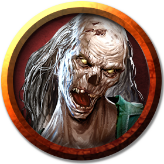

# Zombies
A zombie retains no vestiges of its former self, its mind devoid of thought and imagination. A zombie left without orders simply stands in place and rots unless something comes along that it can kill. The magic animating a zombie imbues it with evil, so left without purpose, it attacks any living creature it encounters.

> Jump to: [Zombie](Zombies.md#zombie) | [Psychic Zombie](Zombies.md) | [Zombie Knight](Zombies.md#zombie-knight)

***Hideous Forms.*** Zombies appear as they did in life, showing the wounds that killed them. However, the magic that creates these vile creatures often takes time to run its course. Dead warriors might rise from a battlefield, eviscerated and bloated after days in the sun. The muddy cadaver of a peasant could claw its way from the ground, riddled with maggots and worms. A zombie might wash ashore or rise from a marsh, swollen and reeking after weeks in the water.

***Mindless Soldiers.*** Zombies take the most direct route to any foe, unable to comprehend obstacles, tactics, or dangerous terrain. A zombie might stumble into a fast-flowing river to reach foes on a far shore, clawing at the surface as it is battered against rocks and destroyed. To reach a foe below it, a zombie might step out of an open window. Zombies stumble through roaring infernos, into pools of acid, and across fields littered with caltrops without hesitation.

***Undead Nature.*** A zombie doesn't require air, food, drink, or sleep.

---

## Zombie
The typical zombie.

### Environment
Arctic, Astral, Coastal, Desert, Forest, Grassland, Hill, Mountain, Swamp, Underdark, Underwater, Urban,  Summoned/Conjured

### Token

>### Zombie
>*Medium undead, neutral evil*
>___
>- **Armor Class** 8
>- **Hit Points** 22 (3d8 + 9)
>- **Speed** 20 ft.
>___
>|**STR**|**DEX**|**CON**|**INT**|**WIS**|**CHA**|
>|:---:|:---:|:---:|:---:|:---:|:---:|
>|13 (+1)|6 (-2)|16 (+3)|3 (-4)|6 (-2)|5 (-3)|
>
>___
>- **Proficiency Bonus** +2
>- **Saving Throws** Wis +0
>- **Damage Vulnerabilities** 
>- **Damage Resistances** 
>- **Damage Immunities** poison
>- **Condition Immunities** poisoned
>- **Skills** 
>- **Senses** darkvision 60 ft.,passive Perception 8
>- **Languages** understands the languages it knew in life but can't speak
>- **Challenge** 1/4
>___
>***Undead Fortitude.*** If damage reduces the zombie to 0 hit points, it must make a Constitution saving throw with a DC of 5 + the damage taken, unless the damage is radiant or from a critical hit. On a success, the zombie drops to 1 hit point instead.
>
>#### Actions
>***Slam.*** Melee Weapon Attack: +3 to hit, reach 5 ft., one target. Hit: 4 (1d6 + 1) bludgeoning damage.
>

---

## Psychic Zombie
In contrast with its slower, more-mindless cousin, the psychic zombie is a zombie that has been suffused with an evil psychic malevolence, making it a startlingly effective hunter. They are typically indistinguishable from the average zombie until they display a keener sense of intelligence or an ability that the average zombie would lack. They typically run in packs together, although some psychic zombies will gather other zombies around them and direct the pack.

### Environment
Arctic, Astral, Coastal, Desert, Forest, Grassland, Hill, Mountain, Swamp, Underdark, Underwater, Urban,  Summoned/Conjured

### Token

>### Psychic Zombie
>*Medium undead, chaotic evil*
>___
>- **Armor Class** 10 (13 with *mage armor*)
>- **Hit Points** 39 (6d8 + 12)
>- **Speed** 20 ft.
>___
>|**STR**|**DEX**|**CON**|**INT**|**WIS**|**CHA**|
>|:---:|:---:|:---:|:---:|:---:|:---:|
>|14 (+2)|10 (+0)|15 (+2)|16 (+3)|14 (+2)|15 (+2)|
>
>___
>- **Proficiency Bonus** +3
>- **Saving Throws** Con +5
>- **Damage Vulnerabilities** 
>- **Damage Resistances** 
>- **Damage Immunities** poison, psychic
>- **Condition Immunities** poisoned
>- **Skills** Arcana +6, Intimidation +5, Perception +5
>- **Senses** darkvision 60 ft., passive Perception 15
>- **Languages** understands the languages it knew in life but can't speak, telepathy 30 ft.
>- **Challenge** 6
>___
>***Undead Fortitude.*** If damage reduces the zombie to 0 hit points, it must make a Constitution saving throw with a DC of 5 + the damage taken, unless the damage is from a critical hit. On a success, the zombie drops to 1 hit point instead.
>
>***Pack Tactics.*** The zombie has advantage on attack rolls against a creature if at least one of the zombie's allies is within 5 feet of the creature and the ally isn't incapacitated.
>
>***Keen Hearing and Smell.*** The zombie has advantage on Wisdom (Perception) checks that rely on hearing or smell. In addition, if a creature is below its hit point maximum, and its blood has been shed in the past 5 hours, the zombie can track the creature and has a bonus to any ability check it makes to find the creature (+1 within 10 miles, +2 within 5 miles, +3 within 2 miles, and +4 within 1 mile).
>
>***Blood Frenzy.*** The zombie has advantage on melee attack rolls against any creature that doesn't have all its hit points.
>
>***Innate Spellcasting (Psionics).*** The zombie's innate spellcasting ability is Intelligence (spell save DC 13). The zombie can innately cast the following spells, requiring no material components:
>
>* *At will:* [dancing lights](../Magic/Spells/dancing-lights.md)
>* *3/day each:* [darkness](../Magic/Spells/darkness.md), [detect thoughts](../Magic/Spells/detect-thoughts.md), [levitate](../Magic/Spells/levitate.md)
>* *1/day each:* [antilife shell](../Magic/Spells/antilife-shell.md), [mage armor](../Magic/Spells/mage-armor.md)
>
>#### Actions
>***Bite.*** Melee Weapon Attack: +4 to hit, reach 5 ft., one target. Hit: 4 (1d4 + 2) piercing damage. If the target is a human, it must succeed on a DC 16 Constitution saving throw or contract the zombie virus and gain a level of exhaustion. Every hour the infected creature must succeed on a DC 17 Constitution saving throw or take 11 (2d10) necrotic damage and gain one level of exhaustion. After 6 failed saves, the creature dies and rises as a zombie.
>
>***Slam.*** Melee Weapon Attack: +4 to hit, reach 5 ft., one target. Hit: 5 (1d6 + 2) bludgeoning damage.
>
>#### Reactions
>***Feeding Frenzy.*** When a creature is reduced to 0 hit points, the zombie can move up to 20 feet directly towards it and make a Bite attack against it.

---

## Zombie Knight
A reanimated knight, taken from their grave to serve a new master, as devoted in death as they were while alive. Zombie knights are more aware than ordinary zombies and may experience dim memories from their past lives, especially relating to battles they fought in. A zombie knight is often found leading a pack of lesser undead in a twisted parody of the soldiers they once commanded, though as strategy is almost lost to them, they fight unfeelingly and unrelentingly until destroyed.

### Environment
Arctic, Astral, Coastal, Desert, Forest, Grassland, Hill, Mountain, Swamp, Underdark, Underwater, Urban, Summoned/Conjured

### Token

>### Zombie Knight
>*Medium undead, neutral evil*
>___
>- **Armor Class** 18 (chain mail, shield)
>- **Hit Points** 60 (8d8 + 24)
>- **Speed** 30 ft.
>___
>|**STR**|**DEX**|**CON**|**INT**|**WIS**|**CHA**|
>|:---:|:---:|:---:|:---:|:---:|:---:|
>|18 (+4)|10 (+0)|16 (+3)|4 (-3)|8 (-1)|6 (-2)|
>
>___
>- **Proficiency Bonus** +2
>- **Saving Throws** Str +6, Con +5
>- **Damage Vulnerabilities** 
>- **Damage Resistances** necrotic
>- **Damage Immunities** poison
>- **Condition Immunities** poisoned
>- **Skills** 
>- **Senses** ddarkvision 60 ft., passive Perception 9
>- **Languages** understands the languages it knew in life but can't speak
>- **Challenge** 3
>___
>***Undead Fortitude.*** If damage reduces the zombie to 0 hit points, it must make a Constitution saving throw with a DC of 5 + the damage taken, unless the damage is radiant or from a critical hit. On a success, the zombie drops to 1 hit point instead.
>
>***Undying Might (Recharges after a Short or Long Rest).*** If the zombie dies, it reanimates at the start of its next turn with half of its maximum hit points.
>
>#### Actions
>***Multiattack.*** The zombie makes two melee attacks, either two Longsword attacks or one Longsword and one Shield Bash attack.
>
>***Longsword.*** Melee Weapon Attack: +6 to hit, reach 5 ft., one target. Hit: 8 (1d8 + 4) slashing damage or 9 (1d10 + 4) slashing damage if used with two hands.
>
>***Shield Bash.*** Melee Weapon Attack: +6 to hit, reach 5 ft., one creature. Hit: 6 (1d4 + 4) bludgeoning damage. If the target is a Medium or smaller creature, it must succeed on a DC 14 Strength saving throw or be knocked prone.
>
>#### Bonus Actions
>***Raise Shield.*** The zombie raises its shield, granting it a +2 bonus to its AC and Dexterity saving throws, and reducing any damage it takes by 1d10 + 3 until the start of its next turn. If the zombie is hit by a melee attack and does not reduce the damage to 0, it loses the benefits of its shield until the start of its next turn.
>
>#### Reactions
>***Parry.*** The zombie adds 2 to its AC against one melee attack that would hit it. To do so, the zombie must see the attacker and be wielding a melee weapon.
>
